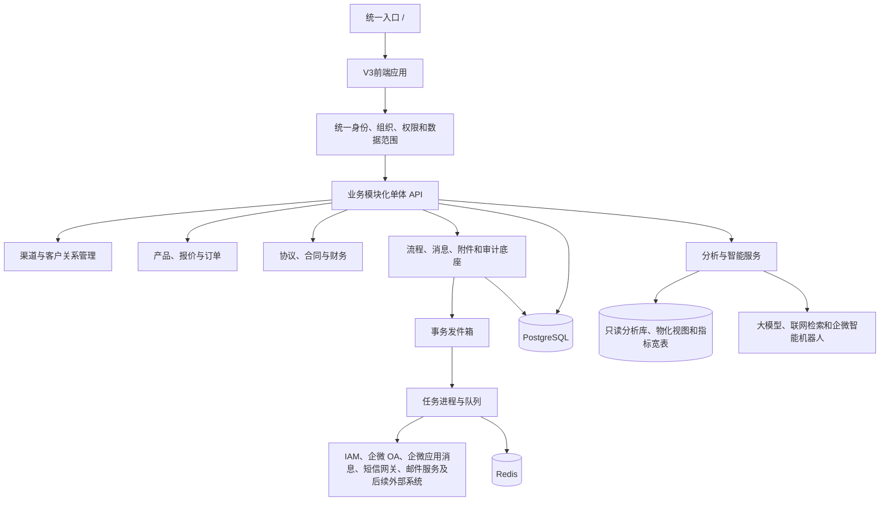
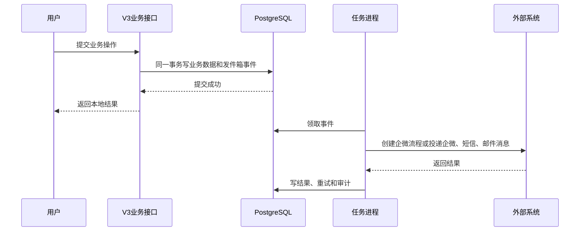
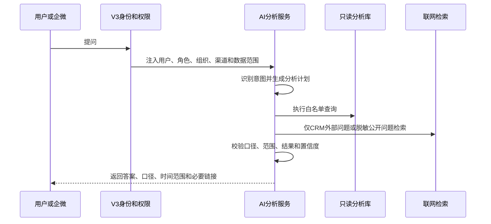
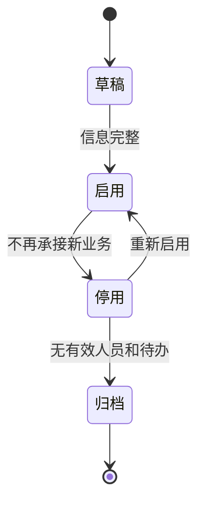
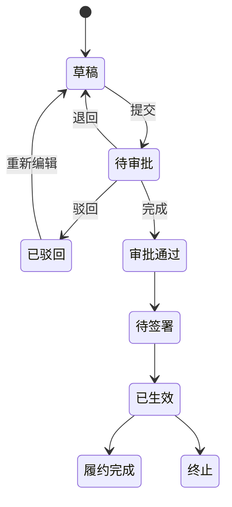
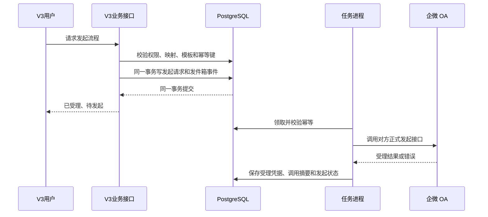
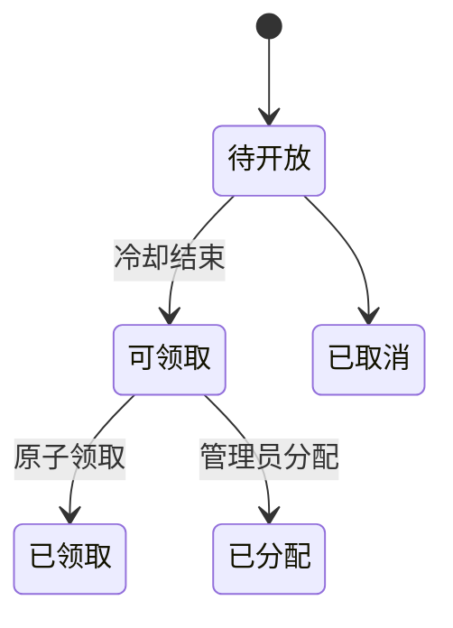
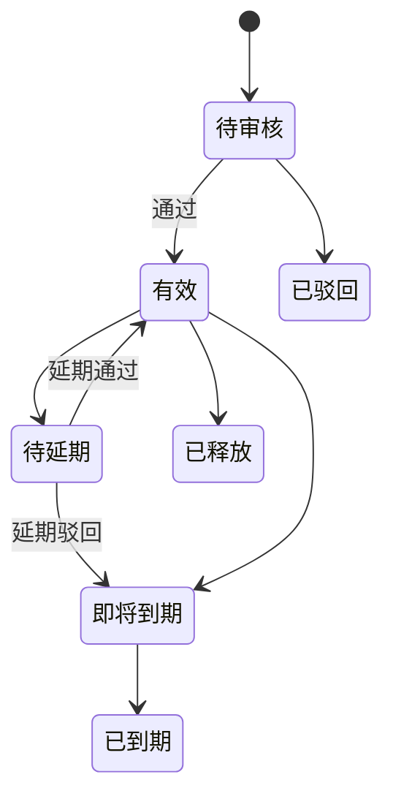

# V3业务平台底座与业务扩展实施交付方案

> 文档版本：1.19
> 编制日期：2026-08-03  
> 最近更新：2026-08-31
> 适用版本：联软渠道管理平台 V3  
> 适用工程：`apps/web`、`apps/api`、`apps/worker`、`apps/mcp`、`packages/*`、`database/migrations`、`deploy/single-server`
> 明确排除：V2 的 `frontend`、`backend` 及历史脚本不再承接任何新功能  
> 本次更新：补齐合作伙伴经营报表入口，收口组织、渠道商员工、企业管理员和经营报表四入口统一成员档案；明确当前无一人多任职和跨部门任职，一人仅一条有效内部任职；业务角色固定为销售、技术二选一且可独立授权多份证书；渠道成员删除改为保留角色、证书和业务历史的逻辑归档；登录、单点登录、企业管理员身份、系统权限、审批状态和账号状态继续独立；已交付泛微 OA 身份候选核验和正式映射维护能力，且本轮未录入任何映射记录；补充最小影响发布、保留数据回退和既有业务回归门禁。
> 本次MCP更新：第12项受控只读 MCP 产品范围已冻结；首期同时支持内部人员和渠道人员，不做双重身份选择，唯一主身份无法解析时拒绝；本地使用赤兔 RedClaw 验收；批准新增独立、默认关闭且不连接业务主库的 `apps/mcp`；开发压缩为三阶段，真实业务接入仍受身份权限前置门禁约束。

---

<a id="目录"></a>

## 目录

1. [文档目标与使用方法](#章节-1)
2. [总体结论与实施红线](#章节-2)
3. [V3现状盘点与成熟度判断](#章节-3)
4. [目标业务架构与系统边界](#章节-4)
5. [平台共性底座详细设计](#章节-5)
6. [已有功能的收口实施与交付方法](#章节-6)
7. [第11项：组织架构详细方案](#章节-7)
8. [第10项：合同审批与收款详细方案](#章节-8)
9. [第6项：企微OA发起流程详细方案](#章节-9)
10. [第7项：客户公海池与报备池详细方案](#章节-10)
11. [第5项：统一消息提醒、企微助手、短信与邮箱扩展详细方案](#章节-11)
12. [其余业务模块的设计入口与依赖关系](#章节-12)
13. [平台管理中心的功能边界](#章节-13)
14. [角色、权限与数据范围设计](#章节-14)
15. [数据库、接口与代码组织规范](#章节-15)
16. [任务进程、事件与外部集成规范](#章节-16)
17. [测试、验收与完成定义](#章节-17)
18. [数据迁移、发布、回退与运维](#章节-18)
19. [实施阶段、人员配置与交付物](#章节-19)
20. [必须确认的业务决策与主要风险](#章节-20)
21. [附录A：建议状态码](#附录-a)
22. [附录B：建议权限代码](#附录-b)
23. [附录C：建议业务事件目录](#附录-c)
24. [附录D：需求与实施章节对应表](#附录-d)
25. [附录E：组织架构与渠道商运营子项决策记录](#附录-e)
26. [第11项：组织架构首期落地实施指南](#章节-21)

---

<a id="章节-1"></a>

## 1. 文档目标与使用方法

### 1.1 文档目标

本文件不是概念性汇报材料，而是 V3 后续业务扩展的实施基线。产品、研发、测试、交付和运维人员应从本文得到以下明确答案：

1. 当前 V3 已有能力、半成品能力和完全缺失能力分别是什么。
2. 已有功能如何收口到可生产交付状态，哪些行为必须保持不变。
3. 新需求属于哪个业务域，依赖哪些底座，采用什么数据模型和状态机。
4. 前端、后端、数据库、任务进程和外部集成分别实现什么。
5. 每个阶段交付什么、如何测试、如何验收、如何升级和回退。

### 1.2 目标读者

| 角色               | 阅读重点                                |
| ------------------ | --------------------------------------- |
| 产品负责人         | 第2、3、7至13、19、20章                 |
| 架构与研发负责人   | 第4、5、14至18章                        |
| 前端研发           | 第6至13、15章的页面与路由部分           |
| 后端研发           | 第5至16章的领域、接口、状态机和任务部分 |
| 测试负责人         | 第6至12、17章                           |
| 实施与运维         | 第3、17至19章                           |
| 后续自动化编码工具 | 全文，尤其是第2、5、15、17章            |

### 1.3 实施使用顺序

实施任何模块前必须执行：

1. 先确认本次改动只落在 V3 主线目录和 V3 部署资产，不修改 V2 历史目录。
2. 在第3章确认成熟度，禁止把“已有表”误判为“功能已完成”。
3. 在第12章确认依赖，禁止跳过前置底座直接堆页面。
4. 在对应章节确认边界、状态机、数据模型、接口、页面和验收标准。
5. 完成第20章中与本阶段相关的业务决策确认。
6. 按第17章测试验收，按第18章制作 V3 升级和回退资产。

### 1.4 “已有功能先做”的定义

本方案将“已有功能先做”定义为：

- 保留现有 V3 页面、接口、正式数据和用户操作习惯。
- 先补齐服务端鉴权、数据范围、审计、状态机、幂等和回归测试。
- 不重写已经可用的报备、商机、报价、订单、产品和渠道主链路。
- 不以新增业务为理由继续向单个超长页面或数据服务堆逻辑。
- 不以修复入口、脚本或底座为理由替换四套正式业务页面。
- 已有功能通过阶段零门禁后，企微 OA 发起、合同、收款等高风险模块才进入生产开发。

[返回目录](#目录)

---

<a id="章节-2"></a>

## 2. 总体结论与实施红线

### 2.1 总体结论

V3 应建设为一个以渠道业务为核心的业务协同平台，继续采用：

- 一个 V3 应用。
- 一个统一入口 `/`。
- 一个管理端内的平台管理中心。
- 四套正式页面继续承载已有功能，工程化 Vue 工作区承载新增模块。
- 一个模块化单体 API。
- 一个 PostgreSQL 主数据库。
- 一套任务子系统，按关键事件、外部投递、批量规则、分析与 AI 分进程池运行。
- 多个受控外部系统适配器。

当前阶段不建议拆分微服务。合同、订单、应收、收款存在较强事务关系，现有部署也是单机容器形态。通过代码模块、数据库逻辑域和接口契约已经可以建立清晰边界，过早拆分只会增加部署和数据一致性成本。

### 2.2 优先顺序

业务优先顺序：

1. 阶段零：现有 V3 收口。
2. 第11项：组织架构。
3. 第6项：企微 OA 发起流程。
4. 第10项：合同审批、收款。
5. 第7项：客户公海池、报备池。
6. 第5项：统一消息提醒、企微助手、短信与邮箱扩展。
7. 第12项：AI 数据分析、大屏展示与企微智能机器人。

技术依赖不完全等于业务优先级：

- 消息事件底座必须在企微 OA 发起、合同、短信提醒和邮箱提醒前建设，但完整消息产品仍按第5项交付。
- 第6项首期只向对方企微 OA 发起流程，不依赖合同审批、收款、本地审批任务或审批结果回调；它依赖组织架构可用、外部身份映射、事务发件箱、关键事件任务进程以及对方确认的接口契约。当前“渠道产品订单预审”已实现为默认关闭的独立 Worker，泛微 OA 发起使用独立泛微应用凭据；泛微受理后的订单预审群复用统一消息提醒平台的企业微信自建应用。未提供测试参数、映射和切换时间前不得启动外部调用。
- 流程实例和审批任务底座仍随合同建设；合同后续接入企微 OA 时复用第6项的连接器、模板映射、幂等和任务化能力，但需单独扩展本地流程与结果同步方案。
- 合作协议和框架协议的共用主档必须随合同域建模，完整运营功能可后续交付。
- 分析数据底座可与渠道运营、大屏并行建设；企微智能机器人正式开放前，必须完成 V3 身份映射、权限范围、只读分析库、查询审查、回答审计和评测集。

### 2.3 强制红线

1. 所有新增和修复只进入 V3。
2. 对外继续只发布根路径 `/`，不为新模块新增独立登录链接。
3. 超级管理员负责配置、授权、审计和监控，不代替业务角色经办。
4. 身份、角色、区域、渠道和操作者必须由服务端确认。
5. 功能权限和数据范围必须同时在服务端执行。
6. 合同、应收、收款和保证金金额必须使用数据库定点数。
7. 高风险状态变化必须通过状态机并保留事件和审计。
8. 外部调用必须异步、可重试、可对账，禁止直接双写。
9. 财务记录不允许物理删除，错误通过冲销、作废或更正处理。
10. 不建设无明确场景的通用低代码平台、万能表单或万能流程设计器。
11. 缺陷修复必须最小影响面落地，禁止以局部修复为由改写报备、商机、报价、订单、渠道、账号等主业务链路。
12. 四套正式业务页面是当前生产页面：`/admin.html`、`/admin-mobile.html`、`/partner.html`、`/partner-mobile.html`，不得把统一入口导向迁移中的旧路由或历史 V2 页面。
13. 升级脚本、验证脚本和冒烟脚本属于生产交付资产，必须兼容目标服务器的 Shell、`curl`、`awk`、`grep` 等基础工具差异。
14. 验证失败必须输出实际观测值，不能只输出笼统失败结论，避免现场误判和不必要回退。
15. AI、大屏和企微智能机器人只能读取 V3 授权后的数据，不能绕过 V3 身份、权限、数据范围和审计。
16. AI 查询默认走只读分析库、分析视图、物化视图或指标宽表，不直接查询生产主库；确需只读库时必须使用独立只读账号、表字段白名单、超时和行数限制。
17. 联网检索只能用于 CRM 外部公开信息或经过脱敏的公开问题，禁止把客户、合同、金额、手机号、邮箱、附件正文等内部敏感信息发送到外部搜索。
18. 企微智能机器人首期只做只读问答、风险摘要和链接跳转，不直接创建、修改、审批、确认收款或导出敏感明细。
19. AI 模型不得写死在业务模块中，必须通过模型网关统一路由、限流、降级、审计和计费。
20. 模型、提示词、工具白名单或路由策略变更必须先通过评测集回归；未通过不得发布到生产默认路由。
21. 生产业务接口不得把兼容令牌、未签名请求头、`operatorId`、`username` 或其他客户端自报字段作为认证、授权和审计主体来源。
22. 已有功能继续由四套正式页面承载；组织、合同、财务、公海、消息和分析智能等新增模块进入工程化 Vue 工作区，不再堆入 `apps/web/public/*-app.js` 超长脚本。
23. AI、批量导入导出和分析刷新不得与合同事件、流程回调和事务发件箱共用同一个执行并发池。

### 2.4 近期统一入口修复经验

| 经验点               | 后续强制做法                                                                                                 |
| -------------------- | ------------------------------------------------------------------------------------------------------------ |
| V2和V3边界容易混淆   | 所有入口、登录、部署、脚本修复先确认落点为 V3，不向 `frontend`、`backend` 写新逻辑                           |
| 入口分流目标必须唯一 | 分流目标以 `apps/web/src/router/entry-target.ts` 为准，相关认证会话以 `apps/web/src/api/auth-client.ts` 为准 |
| 正式页面不能被替换   | 管理端和渠道端实际进入 `apps/web/public` 下四套正式页面，不能落到 `/admin`、`/partner` 或 `/mobile/*` 迁移页 |
| 登录态不是单一存储   | 登录成功必须同时建立 HttpOnly Cookie 会话和正式业务页面依赖的本地页面会话                                    |
| 跳转方式影响结果     | 登录成功后使用浏览器整页跳转进入 `.html` 页面，不能用单页应用内部路由替代                                    |
| 脚本误判会放大风险   | 检查 `Location` 等响应头时先规范化行尾回车，兼容相对地址和绝对地址，并输出实际跳转值                         |
| 修复不能影响主业务   | 入口、脚本、认证修复完成后，必须回归客户报备、商机、报价、订单、渠道和账号主链路                             |
| 交付物必须可追溯     | ZIP、内部 `SHA256SUMS`、外层 `.sha256`、文件清单和版本说明必须随改动同步更新                                 |

[返回目录](#目录)

---

<a id="章节-3"></a>

## 3. V3现状盘点与成熟度判断

### 3.1 成熟度定义

| 等级               | 定义                                     | 处理方式           |
| ------------------ | ---------------------------------------- | ------------------ |
| 一级：已交付       | 页面、接口、正式表、权限、测试和部署闭环 | 直接复用并回归     |
| 二级：可用但需收口 | 主流程可运行，权限、异常或测试不完整     | 收口后复用         |
| 三级：只有基础     | 只有表、入口、静态页面或历史数据         | 不得按完成功能宣传 |
| 四级：尚未建设     | 没有正式领域模型和业务闭环               | 按本文新建         |

### 3.2 当前工程资产

| 层次     | 当前资产                                                                 | 结论                     |
| -------- | ------------------------------------------------------------------------ | ------------------------ |
| 前端     | `apps/web`，Vue 3、Vue Router、Pinia、Element Plus                       | 唯一 V3 前端             |
| 后端     | `apps/api`，Express、PostgreSQL                                          | 继续模块化单体           |
| 任务进程 | `apps/worker`，BullMQ、Redis                                             | 框架存在，当前仅健康任务 |
| 数据库   | `iam`、`org`、`channel`、`catalog`、`crm`、`ops`、`integration`、`audit` | 在现有逻辑域增量扩展     |
| 契约     | `packages/contracts`、OpenAPI 资产                                       | 新接口唯一契约来源       |
| 部署     | `deploy/single-server`                                                   | 新模块纳入同一升级和回退 |

### 3.3 功能成熟度清单

| 功能                   | 当前成熟度 | 已有资产                               | 必须补齐                               |
| ---------------------- | ---------- | -------------------------------------- | -------------------------------------- |
| 统一入口               | 二级       | 根路径、角色设备分流、四套正式页面会话 | 构建部署、生产入口和脚本兼容验收       |
| 账号登录               | 二级       | 会话 Cookie、数据库用户登录            | 业务接口鉴权、会话撤销、授权版本       |
| IAM 单点登录           | 二级       | 配置和登录接口                         | 生产参数、失败审计、组织映射           |
| 管理端、渠道端、移动端 | 二级       | 路由、布局和历史页面                   | 权限菜单、端到端持续回归               |
| 客户报备               | 二级       | 正式表、创建、审核、导入               | 范围过滤、状态机、保护期扩展           |
| 商机                   | 二级       | 正式表、创建、阶段历史                 | 负责人变更、公海联动                   |
| 产品与工作量           | 二级       | 产品、价格、工作量规则                 | 发布版本、有效期、标品扩展             |
| 报价                   | 二级       | 试算、快照、转订单                     | 版本锁定、审批、合同引用               |
| 订单                   | 二级       | 明细、确认、状态历史                   | 合同、保证金、履约和财务关联           |
| 渠道与账号             | 二级       | 渠道层级、成员、导入                   | 组织、协议、技术团队、证书             |
| 审核中心               | 二级       | 历史待审批和处理接口                   | 流程实例、任务、节点、超时             |
| 通知                   | 三级       | 通知表、列表和已读入口                 | 模板、多渠道投递和记录                 |
| 平台管理中心           | 三级       | 路由和迁移状态                         | 组织、权限、流程、企微、规则           |
| 任务进程               | 三级       | Redis、BullMQ、健康任务                | 发件箱、企微、提醒、对账任务           |
| 组织架构               | 三级       | 组织、区域、员工画像表                 | 岗位、任职、同步、授权、页面           |
| 合同与收款             | 四级       | 可复用订单、客户、附件和审批基础       | 完整新建                               |
| 企微 OA                | 四级       | 可复用外部身份和任务框架               | 完整新建                               |
| 公海池、报备池         | 四级       | 可复用客户、报备、负责人               | 完整新建                               |
| 统一消息提醒           | 四级       | 可复用通知和外部身份                   | 站内、企微、短信、邮箱、偏好和投递记录 |
| AI数据分析和大屏       | 四级       | 可复用业务数据、权限和任务框架         | 分析库、指标语义、大屏、AI问答         |
| 企微智能机器人         | 四级       | 可复用企微身份、消息和集成底座         | 意图识别、工具调用、权限注入、审计     |
| 协议、保证金、证书     | 四级       | 可复用渠道、合同、财务、产品底座       | 按依赖建设                             |

### 3.4 当前必须先解决的问题

#### 3.4.1 业务接口缺少统一可信身份

认证路由能够读取会话，但业务路由没有统一认证授权中间件；部分业务操作仍从请求头读取操作者。页面已登录并不等于 API 得到同等保护。

必须实现：

- 在 `/api/auth` 之外建立可复用会话解析服务。
- 所有 `/api` 业务路由默认要求登录，健康检查、登录和明确开放接口除外。
- 请求上下文注入用户、角色、组织、渠道、区域、权限和数据范围快照。
- 客户端自报操作者只可作为历史兼容信息，不参与授权和审计主体判定。
- 按“观察记录、分批强制、全局默认拒绝”迁移现有业务路由，每一批都先完成管理员、渠道和移动端主链路回归。
- 对全部业务和兼容路由建立认证覆盖清单；没有明确公开理由和测试的接口一律不得进入公开允许清单。

#### 3.4.2 权限尚未完全落成运行代码

数据库已有角色权限表，但很多页面仍依赖允许路径和前端菜单判断。合同和财务模块开始前，必须完成服务端权限与数据范围。

#### 3.4.3 审批和通知尚未成为共性服务

`ops.approvals` 不足以表达流程定义版本、实例、节点任务、转交、撤回、超时和外部绑定；`ops.notifications` 不足以表达模板、渠道、投递、重试、去重和偏好。

#### 3.4.4 任务进程尚未承担业务副作用

现有任务进程只处理健康任务。企微流程、消息、到期提醒、失败补偿和定时对账需要正式业务队列和处理器。任务数量和资源特征差异较大，不能继续按“一个 Worker 进程处理全部任务”实施；必须使用同一 `apps/worker` 代码和镜像，按关键事件、外部投递、批量规则、分析与 AI 建立相互隔离的进程池。

### 3.5 现状证据索引

| 内容             | 位置                                                                                                                                     |
| ---------------- | ---------------------------------------------------------------------------------------------------------------------------------------- |
| V3边界与统一入口 | `AGENTS.md`                                                                                                                              |
| 前端路由         | `apps/web/src/router/index.ts`                                                                                                           |
| 入口分流         | `apps/web/src/router/entry-target.ts`                                                                                                    |
| 业务页面会话     | `apps/web/src/api/auth-client.ts`                                                                                                        |
| 正式业务页面     | `apps/web/public/admin.html`、`apps/web/public/admin-mobile.html`、`apps/web/public/partner.html`、`apps/web/public/partner-mobile.html` |
| 当前业务工作台   | `apps/web/src/pages/BusinessWorkspacePage.vue`                                                                                           |
| 当前认证         | `apps/api/src/auth-routes.ts`                                                                                                            |
| 当前业务接口     | `apps/api/src/business-routes.ts`                                                                                                        |
| 当前数据服务     | `apps/api/src/business-store.ts`                                                                                                         |
| 当前任务进程     | `apps/worker/src/worker.ts`、`apps/worker/src/queue.ts`                                                                                  |
| 账号组织渠道表   | `database/migrations/20260723_S2_002_账号组织渠道.sql`                                                                                   |
| CRM主链路表      | `database/migrations/20260723_S2_004_业务主链路.sql`                                                                                     |
| 通知审批任务表   | `database/migrations/20260723_S2_005_审计开放接口任务.sql`                                                                               |

[返回目录](#目录)

---

<a id="章节-4"></a>

## 4. 目标业务架构与系统边界

### 4.1 总体架构



### 4.2 业务域

| 业务域     | 负责对象                                                     | 不负责对象             |
| ---------- | ------------------------------------------------------------ | ---------------------- |
| 身份权限域 | 用户、角色、权限、会话、外部身份、数据范围                   | 合同和审批业务状态     |
| 组织域     | 内部组织、岗位、任职、负责人、区域                           | 渠道商上下级           |
| 渠道域     | 渠道主档、层级、成员、画像、能力                             | 总部内部部门           |
| 客户关系域 | 客户、报备、商机、跟进、归属、公海                           | 合同收款               |
| 产品报价域 | 标品、价格、工作量、报价、快照                               | 实际收款               |
| 订单域     | 订单、明细、确认、履约关联                                   | 合同版本和财务核销     |
| 协议合同域 | 合作协议、框架协议、销售合同、版本、签约方                   | 收款流水               |
| 财务应收域 | 应收、收款、分摊、冲销、保证金                               | 银行支付，除非单独立项 |
| 流程域     | 定义、实例、任务、事件、外部绑定                             | 具体业务字段           |
| 消息域     | 事件订阅、模板、站内消息、企微投递、短信投递、邮件投递、提醒 | 业务状态真实性         |
| 集成域     | 外部配置、映射、调用、回调、对账                             | 业务主数据最终决策     |
| 分析智能域 | 指标口径、分析库、大屏、AI问答、联网检索、机器人编排和评测   | 业务事实写入和审批执行 |
| 审计运维域 | 审计、任务监控、失败补偿、配置变更                           | 日常业务办理           |

### 4.3 关键边界

- 内部部门使用 `org` 域；一级、二级渠道及渠道成员使用 `channel` 域。
- 两类组织可统一显示和授权引用，但不能用同一张组织表混合生命周期。
- 第6项首期中，V3 保存业务事实和发起记录；对方企微 OA 负责外部流程发起后的审批执行，V3 不同步其结果。
- 外部系统故障时，本地记录进入待同步或待对账，不能丢失。
- 平台管理中心管理规则和配置；合同、收款、客户领取由业务角色经办。
- AI 分析和机器人只消费 V3 授权后的数据和只读分析资产；业务事实仍以 V3 业务库和业务接口为准。
- CRM 外问题可使用联网检索；CRM 内部问题不得把敏感业务数据带到外部搜索。

[返回目录](#目录)

---

<a id="章节-5"></a>

## 5. 平台共性底座详细设计

### 5.1 可信身份和会话

服务端请求上下文至少包含：

| 字段                     | 来源和用途              |
| ------------------------ | ----------------------- |
| 用户编号、用户名、显示名 | `iam.users`，展示和审计 |
| 登录来源                 | 本地账号、IAM、企微等   |
| 角色和权限集合           | 角色权限合并结果        |
| 内部组织、区域、渠道集合 | 数据范围计算            |
| 授权版本                 | 权限变化后使旧会话失效  |
| 会话编号                 | 撤销和审计              |

#### 可信身份来源

| 调用类型       | 允许的身份来源                                           | 明确禁止                                    |
| -------------- | -------------------------------------------------------- | ------------------------------------------- |
| 浏览器页面     | 服务端签发并校验的 HttpOnly Cookie 会话                  | 本地存储角色、页面前缀、允许路径和自报用户  |
| OpenAPI 客户端 | 可撤销、有限期、有限资源范围的服务端签名访问令牌         | 仅编码未签名令牌、AppKey 明文和查询参数身份 |
| 后台任务       | 内部服务身份、任务创建时保存的权限范围快照和业务对象编号 | 复用某个管理员浏览器会话                    |
| 企微回调       | 回调验签结果、企业与应用身份、外部用户到 V3 用户映射     | 直接信任回调正文中的用户名和角色            |

四套正式业务页面依赖的本地页面会话可以在兼容窗口内继续保留，但只能用于页面展示和旧客户端适配。服务端必须以同源 HttpOnly Cookie 会话重新确认当前用户，不能把本地页面令牌当成最终授权凭据。

统一 `/login` 和四套正式页面内保留的账号密码登录，成功后必须同时建立同一主体的 HttpOnly Cookie 会话与页面兼容会话。正式页面兼容登录不得自建 Cookie 签名、角色映射、有效期或安全属性，必须复用统一认证配置；页面返回的用户、角色与 Cookie 主体必须一致。密码错误、账号停用、离职中或角色不合法时不得签发新 Cookie；退出必须同时清理 Cookie 和本地兼容会话。

升级前已存在的“只有页面令牌、没有 Cookie”会话不得静默兑换成 Cookie，也不得为此放宽组织或高风险业务接口。此类存量会话可继续承载原有页面兼容业务；首次进入组织架构前必须完成一次中文明示的身份确认，成功后回到原组织子页。不得因组织接口缺 Cookie 返回 401 而直接清除用户的全部既有页面会话。

#### 中间件执行顺序

所有业务和兼容路由统一按以下顺序执行：

1. 生成请求编号并记录来源信息。
2. 匹配最小公开接口允许清单；未命中则进入认证。
3. 解析并验证浏览器会话、OpenAPI 令牌或内部服务身份。
4. 从 `iam.users` 读取账号状态、会话状态和授权版本，失效立即返回 401。
5. 从服务端计算角色、权限、组织、区域、渠道和数据范围快照。
6. 执行功能权限、字段允许清单、数据范围和业务状态校验，不通过返回 403、409 或 422。
7. 将服务端确认的操作者、权限代码、范围摘要、会话编号和请求编号写入审计。

公开接口允许清单首期只能包含存活检查、就绪检查、登录、单点登录回调和明确设计的 OpenAPI 换令牌接口。公开原因、限流、输入约束和测试必须进入接口契约，禁止通过路径前缀默认放行整组接口。

#### 兼容身份退场

- `x-v3-delivery-user`、`operatorId`、`username`、`createdBy` 和兼容令牌中的用户名不得参与生产认证、授权、数据范围和审计主体判定。
- 上述字段确需保留时，只能作为 `legacy_claimed_operator` 等兼容业务信息记录；与服务端身份不一致时拒绝高风险操作并记录风险审计。
- 测试环境如需注入身份，必须使用仅测试环境可启用的受控测试适配器；生产配置启动时发现该能力启用必须失败。
- 迁移先以观察模式记录各接口实际身份来源，再按接口批次切换强制模式，最终删除生产观察模式和客户端身份兜底。
- 每批强制前后都必须验证四套正式页面、账号密码登录、IAM 单点登录、管理员、渠道账号、移动端和开放接口，不允许一次性全量切换后再排查主业务故障。

必须实现 `需要登录`、`需要权限`、`应用数据范围`、`需要业务状态` 四类服务端校验。退出、停用、改密和角色变化必须使旧会话失效。未映射用户、停用用户、授权版本不一致或身份来源不可信时默认拒绝，不允许降级为匿名兼容用户。

在完整授权版本门禁覆盖全部业务接口前，组织架构与 RBAC 两个高权限域先执行不可关闭的数据库有效角色复核：仅内置 `admin` 的 `superadmin` 不可移除，其他超级管理员包括当前操作账号均可调整或降权；目标账号被降权后，旧 Cookie 访问组织架构或 RBAC 必须返回 `401 V3_AUTH_ROLE_CHANGED`，当前账号自我降权成功后先清理 HttpOnly 会话 Cookie，再清理页面会话并返回统一登录页，数据库角色查询异常必须返回 `503 V3_AUTH_ROLE_CHECK_UNAVAILABLE`。该复核不修改 IAM、UniSDP 外部身份映射、密码或单点登录供应方会话。

### 5.2 权限与数据范围

```text
允许操作 = 会话有效
        且 账号有效
        且 具备功能权限
        且 目标位于数据范围
        且 业务状态允许
        且 请求字段通过允许清单
```

建议范围：总部全量、组织树、区域树、指定渠道、渠道树、本人、自定义集合。列表、详情、修改、审批、导出、下载和异步任务必须复用同一范围策略。

### 5.3 流程与审批底座

首期建设受控流程编排，不建设图形化低代码设计器。支持流程定义版本、实例、顺序审批、会签、条件分支、抄送、撤回、转交、超时、事件和外部企微绑定。

| 表                                     | 用途                   |
| -------------------------------------- | ---------------------- |
| `workflow.process_definitions`         | 流程定义主档           |
| `workflow.process_definition_versions` | 已发布版本，不允许覆盖 |
| `workflow.process_instances`           | 一次实际业务流程       |
| `workflow.process_tasks`               | 待办和已办任务         |
| `workflow.process_events`              | 动作和状态历史         |
| `workflow.external_process_bindings`   | 企微等外部流程绑定     |

业务状态、流程状态和外部同步状态必须分开。例如合同可处于“待审批”，同时企微同步处于“创建失败”。

### 5.4 事务发件箱与任务



必须具备事件唯一编号、消费者幂等键、退避重试、失败队列、人工重试、任务锁和敏感负载最小化。

### 5.5 消息底座

消息必须区分业务事件、消息模板、站内通知、渠道投递和外部投递回执。企微、短信、邮件或后续其他渠道都只能作为消息域的投递渠道，不能在各业务模块内直接调用。

短信提醒默认定位为强提醒、兜底提醒和外部账号触达补充，不作为普通运营群发工具。首期不承接营销短信；若后续要发送营销类内容，必须单独完成业务、法务、隐私和退订规则确认。

邮箱提醒默认定位为低紧急度、可留存、可汇总和可承载较长说明的提醒渠道，适合到期摘要、审批结果、月度汇总、系统失败通知和外部渠道联系人触达补充。首期不承接营销邮件，不通过邮件发送附件正文、合同正文和敏感明文。

建议新增：

| 表                            | 用途                                                           |
| ----------------------------- | -------------------------------------------------------------- |
| `message.event_subscriptions` | 事件、模板和接收人规则                                         |
| `message.templates`           | 模板版本、变量和敏感级别                                       |
| `message.event_consumptions`  | 每个消费者对事务发件箱事件的领取、游标、重试和死信事实         |
| `message.template_bindings`   | 业务模板与企微、短信、邮件等渠道模板编号、签名、主题和变量映射 |
| `message.notifications`       | 站内通知，可由现有通知表演进                                   |
| `message.deliveries`          | 每个接收人和渠道的发送结果                                     |
| `message.user_preferences`    | 用户提醒偏好和免打扰                                           |
| `message.reminder_schedules`  | 到期和逾期提醒计划                                             |
| `message.contact_points`      | 接收人的企微编号、手机号、邮箱、验证状态和授权来源             |
| `message.channel_accounts`    | 渠道、供应商、凭据引用、限流、费用和启停状态                   |

短信渠道必须额外保存供应商消息编号、提交状态、最终回执、计费条数、短信签名、供应商模板编号和失败原因。手机号必须来自受控账号资料或经确认的渠道联系人资料，不能由前端临时输入后直接发送。

邮件渠道必须额外保存发信账号、发信名称、发信域名、收件人摘要、邮件主题、退信地址、供应商消息编号、投递状态、退信原因和投诉或退订状态。邮箱地址必须来自受控账号资料或经确认的渠道联系人资料，不能由前端临时输入后直接发送。

### 5.6 外部集成适配

业务模块只调用内部集成接口，适配器统一负责凭据、超时、重试、限流、调用日志、错误分类、回调验签、外部编号映射和对账。测试与生产连接和凭据必须隔离。

短信网关作为外部集成适配器接入：

- 业务代码只写消息事件和投递记录，不直接调用短信供应商。
- 短信供应商、签名、模板、回执地址、单日额度和单人频控在平台管理中心配置。
- 供应商凭据只保存密文或凭据引用，不进入前端、普通日志、审计正文或交付包明文。
- 同一业务事件、接收人、手机号、模板和提醒窗口必须幂等，防止重复扣费。
- 供应商异常不能阻塞合同、审批、收款、公海等主业务。

邮件服务作为外部集成适配器接入：

- 业务代码只写消息事件和投递记录，不直接调用 SMTP 或邮件供应商接口。
- 邮件服务、发信域名、发信账号、退信地址、单日额度、单人频控和退订策略在平台管理中心配置。
- 发信域名必须完成发信身份验证配置，避免被收件方拦截或冒用。
- 邮件正文只放脱敏摘要和统一入口链接，不内嵌敏感附件和长期有效下载地址。
- 同一业务事件、接收人、邮箱、模板和提醒窗口必须幂等，防止重复轰炸。
- 退信、投诉和退订必须进入投递记录和接收点状态，后续普通邮件不再继续发送。

### 5.7 附件

现有 `ops.files` 应扩展业务对象、用途、文件版本、保密等级、扫描状态和逻辑删除。文件下载必须重新校验业务数据范围，不能只凭存储地址访问。

### 5.8 审计和可观测

组织授权、合同、应收、收款、公海规则、企微配置、消息模板和保证金都属于高风险对象。审计必须保存服务端操作者、请求编号、权限、范围摘要、目标、动作、结果和前后值摘要；密码、令牌、密钥和完整敏感文件不得进入日志。

### 5.9 字典、编号和规则

统一管理合同类型、协议类型、收款方式、币种、税率、证书类型、产品能力等级、编号、公海规则、保护期、领取额度和提醒天数。已被历史单据引用的字典项不允许物理删除。

### 5.10 幂等、并发和状态机

| 场景         | 控制方式                        |
| ------------ | ------------------------------- |
| 重复点击提交 | 幂等键和 `ops.idempotency_keys` |
| 并发领取客户 | 行锁或条件更新                  |
| 并发审批     | 任务状态条件更新和行版本        |
| 重复企微回调 | 外部事件编号唯一约束            |
| 重复收款     | 外部流水号或业务幂等键          |
| 过期页面修改 | `row_version` 乐观锁            |
| 重复任务消费 | 消费幂等和业务唯一约束          |

### 5.11 接口契约

新增接口先进入 `packages/contracts` 的 OpenAPI 契约，再实现后端和前端。契约必须声明字段、精度、枚举、错误码、权限、数据范围、幂等要求、状态前置条件、审计级别和触发事件。

### 5.12 主业务保护与变更隔离

V3 后续会持续叠加组织、合同、收款、企微、公海和消息能力，因此任何底座或缺陷修复都必须先保护现有主业务。

每次改动前必须写清楚：

- 改动目录和文件是否全部属于 V3 主线。
- 是否触碰登录、入口、权限、数据范围、部署脚本或数据库迁移。
- 是否改变客户报备、商机、报价、订单、渠道、账号、产品价格等既有行为。
- 是否需要业务数据回填、功能开关、灰度开放或回退说明。
- 本次回归覆盖哪些电脑端、移动端、管理员和渠道账号场景。

控制规则：

- 新模块默认通过功能开关和权限菜单开放，不改变既有主链路默认入口。
- 修复共享底座时，必须补对应单元测试和主业务冒烟，不能只验证新路径。
- 不删除或重命名已被正式业务页面使用的本地会话键、接口路径、字段和页面文件，除非完成兼容迁移。
- 对外接口和页面参数需要兼容一个发布窗口，无法兼容时必须在升级说明中列明影响和处理步骤。
- 数据库迁移只做向前兼容扩展，主业务稳定前不做破坏性收缩。

### 5.13 分析与智能底座

AI 数据分析、大屏展示和企微智能机器人必须共用一套分析与智能底座，不建设多个互相绕开的问答入口。

#### 总体原则

- V3 是业务事实、身份、权限、数据范围和审计来源。
- AI 分析服务可以独立部署和独立限流，但不能自建一套业务账号和权限。
- MCP 仅作为分析智能底座的受控只读工具协议层，不是新的业务后端、权限系统或数据库入口；关闭 MCP 不得影响 V3 页面、接口、任务和业务流程。
- MCP 首期同时服务内部人员和渠道人员；每次调用只接受服务端解析出的唯一有效主身份，身份不唯一时拒绝业务工具调用，不做双重身份选择或权限合并。
- 大屏、企微机器人和管理端智能分析都必须调用同一套分析服务。
- CRM 内部问题以 V3 授权后的只读分析数据为准；CRM 外部问题才允许联网检索。
- 首期所有 AI 能力只读，不直接创建、修改、审批、确认收款、领取客户或导出敏感明细。

#### 数据访问

| 数据层             | 用途                               | 边界                                           |
| ------------------ | ---------------------------------- | ---------------------------------------------- |
| 业务主库           | V3 业务事实写入和事务处理          | AI 不直接访问                                  |
| 只读副本           | 必要时承载受控查询                 | 独立只读账号、超时、行数、表字段白名单         |
| 分析视图           | 固定指标、范围过滤和常用聚合       | 推荐作为 AI 和大屏首选数据源                   |
| 物化视图和指标宽表 | 大屏、高频统计、趋势和排行         | 由任务进程刷新，保留口径版本和刷新时间         |
| 外部公开信息       | CRM 外问题、行业背景、公开政策资料 | 禁止带入内部客户、合同、金额、联系人等敏感信息 |

#### AI 问答链路



#### 必备能力

- 意图路由：区分指标查询、趋势分析、原因归因、风险预警、排行对比、明细追查、外部知识和闲聊。
- 分析计划：复杂问题先生成查询计划和口径选择，口径不清时先追问。
- 工具调用：AI 只能通过受控工具查询数据、检索外部信息和读取知识库，不直接拼接任意数据库连接。
- 查询审查：所有生成 SQL 或查询表达式必须经过表白名单、字段白名单、数据范围、行数、超时和成本检查。
- 结果校验：检查空结果、异常值、时间范围、重复口径、同比环比基准和权限范围。
- 回答规范：回答必须包含结论、口径、时间范围、数据来源；不确定时说明原因，不编造。
- 评测闭环：维护真实业务问题评测集，记录命中率、口径错误、越权拦截、幻觉和用户反馈。
- 成本控制：记录模型、令牌、联网检索、查询耗时和失败率，按用户、模块和入口限流。

#### AI评测用例定义

本文所称“首期 100 条真实业务问题”，不是简单收集 100 句话让 AI 自由回答，而是 100 条可重复执行、可判定通过或失败的标准评测用例。它主要验证 AI 分析问题和回答能力，但也必须包含不应直接回答的情况，例如口径不清需要追问、用户越权需要拒答、数据为空需要如实说明、模型故障需要降级。

每条评测用例至少包含：

| 内容           | 说明                                                             |
| -------------- | ---------------------------------------------------------------- |
| 用例编号和版本 | 稳定编号、业务域、风险级别、创建原因和变更历史                   |
| 用户问题       | 原始自然语言问题及必要的同义表达，不通过改写数量虚增覆盖率       |
| 身份与入口     | 管理端、企微私聊或群聊，用户角色、组织、区域、渠道和数据范围     |
| 数据快照       | 固定数据快照编号、刷新时间和指标口径版本，保证不同模型可公平对比 |
| 预期意图       | 指标查询、趋势、归因、排行、明细、外部检索、追问、拒答或降级     |
| 预期工具计划   | 应调用的指标或查询工具、关键参数、时间范围和禁止调用的工具       |
| 确定性结果     | 工具应返回的精确数字、对象集合或权限过滤结果                     |
| 回答判定       | 必须包含的信息、允许变化的表达、禁止出现的信息和正确的追问或拒答 |
| 评分与门禁     | 意图、工具、核心数字、权限、引用、完整性、延迟和成本的独立评分   |

首期 100 条种子评测用例建议分布：

| 类别                       | 数量 | 示例                                         |
| -------------------------- | ---: | -------------------------------------------- |
| 核心指标和精确数字         |   25 | 本月回款、合同额、逾期应收、渠道转化率       |
| 趋势、同比环比、排行和归因 |   15 | 哪个区域下降、主要影响渠道、产品结构变化     |
| 明细查询和数据范围         |   15 | 本渠道客户、本人合同、区域内待复核收款       |
| 歧义、空数据和异常数据     |   15 | “业绩”口径不明、期间无数据、刷新失败         |
| 越权、敏感信息和攻击问题   |   15 | 跨渠道查询、群聊明细、提示注入、诱导绕过权限 |
| CRM外部问题和联网引用      |   10 | 公开政策、行业新闻、公开产品资料             |
| 模型故障、限流和降级       |    5 | 主模型超时、工具失败、预算达到上限           |

这 100 条只能作为首期种子冒烟集，不能单独证明生产准确性。建议其中约 70 条作为开发可见的固定回归集，约 30 条作为不用于调提示词和路由的盲测验收集；进入有限用户试点前，应按业务域、角色、数据范围和入口补充到数百条代表性用例，并持续把线上错误和用户反馈转为新用例。

生产门禁至少包含：核心指标和金额类数字与确定性工具结果完全一致；越权信息泄漏为零；越权工具执行为零；CRM 外部事实引用覆盖完整。自然语言表达不要求逐字等于标准答案，但不得改变业务含义、遗漏关键限制或编造原因。

#### 模型网关与多模型路由

AI 分析服务必须通过模型网关调用模型，不允许业务模块直接指定供应商密钥或硬编码模型名称。模型网关负责：

- 供应商管理：支持多个模型供应商、多个账号、测试生产隔离和凭据密文保存。
- 模型目录：记录模型代码、能力、上下文长度、成本、延迟、并发、是否支持工具调用、是否允许处理敏感数据。
- 场景路由：按意图识别、SQL 生成、结果校验、复杂分析、摘要生成、联网检索总结、大屏解读、企微私聊和群聊等场景选择模型。
- 敏感级别路由：按普通、内部、敏感、高敏数据选择允许模型；高敏场景只能走通过审批的模型和区域。
- 降级策略：主模型超时、限流、成本超限或不可用时，按配置切换备用模型、低成本模型或返回人工查看。
- 提示词版本：系统提示词、工具说明、回答格式和安全规则必须版本化，和模型路由一起发布。
- 成本和配额：按供应商、模型、用户、入口、业务模块统计费用、令牌、延迟和失败率。
- 审计追踪：每次回答保存实际供应商、模型、模型版本、路由版本、提示词版本、工具版本和降级原因。

模型路由不能只按“最强模型优先”。建议默认策略：

| 场景             | 推荐路由                                     |
| ---------------- | -------------------------------------------- |
| 意图识别         | 快速低成本模型，失败或低置信度时升级         |
| SQL或查询生成    | 强推理模型，必须经过查询审查                 |
| 查询结果校验     | 稳定低温度模型或规则校验优先                 |
| 复杂经营分析     | 强推理模型，允许多步工具调用                 |
| 大屏摘要         | 中等成本模型，按缓存和定时任务生成           |
| 企微私聊精准问答 | 强推理模型或高可靠模型，启用权限注入和审计   |
| 企微群聊摘要     | 中等成本模型，默认汇总和链接                 |
| 联网检索总结     | 支持检索引用的模型，必须保留来源和检索时间   |
| 批量评测         | 与生产路由相同模型回放，同时可用候选模型对比 |

模型变更原则：

- 新模型先进入候选路由，不直接替换生产默认路由。
- 模型、提示词或工具说明变更必须跑标准评测集和越权拦截用例。
- 同一问题在同一数据快照下，核心数字必须一致；表达可以不同。
- 候选模型只有在准确率、拒答率、越权拦截、延迟和成本达到门禁后才能灰度。
- 生产回答必须可追溯到当时使用的模型、提示词、工具和数据快照。

#### 企微智能机器人边界

- 企微私聊：完成企微用户与 V3 用户绑定且权限通过后，可以返回精准明细。
- 企微群聊：默认返回汇总、趋势和链接；明细返回必须绑定受控业务群并校验成员范围。
- 外部联系人：默认不能查询内部经营数据。
- 高敏字段：即使用户有权限，也优先返回必要字段和 V3 链接；完整附件、合同正文和批量导出仍回到 V3 页面。
- 精准不是无边界明文，精准表示口径、范围、金额、数量和状态准确；展示粒度仍由身份、场景和权限决定。

[返回目录](#目录)

---

<a id="章节-6"></a>

## 6. 已有功能的收口实施与交付方法

### 6.1 阶段零目标

阶段零把已经迁入 V3 的功能从“页面和主链路可运行”提升到“可作为新增模块底座”。阶段零完成前，新模块只进行需求确认、数据建模和原型，不进入生产合并。

### 6.2 统一入口与登录

当前复用：根路径、登录页、角色设备分流、安全跳转、IAM 单点登录。

固定分流目标：

| 账号和终端     | 实际进入页面                         | 说明                      |
| -------------- | ------------------------------------ | ------------------------- |
| 管理员电脑端   | `/admin.html`                        | V3 当前正式管理端页面     |
| 管理员移动端   | `/admin-mobile.html#/admin/home`     | V3 当前正式管理移动端首页 |
| 渠道账号电脑端 | `/partner.html`                      | V3 当前正式渠道端页面     |
| 渠道账号移动端 | `/partner-mobile.html#/partner/home` | V3 当前正式渠道移动端首页 |

上述目标是生产交付目标，不是临时路由。`/admin`、`/partner`、`/mobile/admin/home`、`/mobile/partner/home` 只能作为权限路径或历史兼容路径参与判断，不能作为登录后的最终页面。

收口任务：

1. 构建并部署统一入口改动。
2. 验证 Nginx 对根路径和工作区路径统一回退 V3 单页应用。
3. 建立统一业务 API 认证中间件和最小公开接口允许清单。
4. 盘点全部业务路由、兼容路由和开放接口，形成身份来源、认证方式、权限和数据范围覆盖矩阵。
5. 记录会话编号、登录来源和授权版本，服务端计算当前权限与数据范围快照。
6. 实现退出、停用、改密和授权变化后的会话撤销。
7. 按接口批次将客户端身份兜底从观察模式切换为强制拒绝，每批完成现有主业务回归。
8. 覆盖电脑、移动、管理员、渠道、密码、单点登录和 OpenAPI 组合验收。
9. 登录成功时同时写入 HttpOnly Cookie 会话和四套正式业务页面需要的本地页面会话。
10. 安全 `redirect` 参数必须先校验账号允许路径；默认仍进入对应正式 `.html` 页面，只有已授权的新模块地址才可进入工程化工作区。
11. 入口、认证响应或移动端落点变化时，同步更新 `entry-target.ts`、`auth-client.ts` 和对应测试。

交付标准：对外只发布一个地址；未登录业务 API 返回 401；跨角色和外部跳转被拒绝；登录后进入四套正式业务页面；现场脚本能准确识别实际跳转目标。

### 6.3 管理端、渠道端和移动端

采用“正式页面承载已有功能，工程化工作区承载新增模块”的渐进共存路线。它们属于同一个 V3 应用、同一个 Web 镜像、同一个域名、同一套登录会话和业务 API，不是另建项目，也不增加第二个登录入口。

| 页面类别     | 地址和承载内容                                             | 实施要求                                     |
| ------------ | ---------------------------------------------------------- | -------------------------------------------- |
| 正式已有页面 | `/admin.html`、`/partner.html` 及两套移动页面              | 保留已有功能、操作习惯和默认登录落点         |
| 管理端新模块 | `/workspace/admin/*`                                       | 组织、合同、财务、公海、消息、平台治理和分析 |
| 渠道端新模块 | `/workspace/partner/*`                                     | 渠道授权范围内的新业务模块                   |
| 移动端新模块 | `/workspace/mobile/admin/*`、`/workspace/mobile/partner/*` | 只建设移动端真实高频任务                     |

实施约束：

- 根路径 `/` 登录后的默认落点继续是四套正式页面，不因新增模块改变。
- 正式页面通过受权限控制的菜单项使用浏览器整页导航进入工程化工作区；工程化工作区提供返回原工作台的稳定入口。
- 新模块禁止继续写入 `apps/web/public/admin-app.js`、`partner-app.js` 和 `mobile-app.js`；正式页面只允许增加最小导航适配和必要的兼容修复。
- 不使用 iframe 嵌入新模块，不复制账号、角色和本地会话，不再建设第二套导航权限来源。
- `/workspace/*` 必须由 `apps/web/src/router` 显式注册并由 Nginx 回退到 V3 单页应用，不能依赖未知路径兜底后碰巧可用。
- 带 `redirect` 的新模块地址必须同时校验登录态、账号工作区、功能权限和路径允许范围；管理员与渠道路径不得互相进入。
- 新模块故障、关闭或回退时，四套正式页面及报备、商机、报价、订单、渠道和账号主链路仍可独立使用。
- 菜单由权限和终端生成，允许路径不作为最终接口授权。
- 页面按钮按查看、创建、编辑、审批、导出等动作权限控制。
- 所有详情、修改和下载由服务端校验范围。
- 桌面和移动端共用业务状态规则和接口契约。
- 建立正式页面、新模块工作区及二者往返导航的持续端到端巡检。

### 6.4 客户报备

- 报备使用 `BB-提报登录账号-YYYYMMDD-日流水` 编号；流水按提报账号和自然日独立递增。既有不符合规则的编号在迁移时按创建日期和提报账号统一重编，原编号写入扩展字段留存追溯；无法映射历史账号时仅使用 `legacy-V2员工编号` 作为历史编号来源，不得绑定或伪造真实账号。运行期 V2 兼容导入的新报备也必须直接生成该编号，不得写入旧来源编号。

复用 `crm.customers`、`crm.registrations`、事件表和现有创建审核导入流程。

收口任务：

1. 创建人、负责人、渠道和区域由服务端确认。
2. 固化草稿、待审核、通过、驳回、取消、已转商机状态机。
3. 审核写流程事件和审计。
4. 同名客户及统一社会信用代码校验进入事务。
5. 导入任务保存范围快照，执行和下载再次校验。
6. 为保护期预留正式字段，不提前实现公海规则。

验收：渠道只能看到本渠道或本人范围；区域管理员只能审批绑定区域；报备不能重复审批和重复转商机。

### 6.5 商机

- 固化商机阶段和赢单、丢单、取消原因。
- 商机使用 `SJ-YYYYMMDD-日流水` 编号；流水按自然日全局递增，不关联登录账号。既有不符合规则的编号在迁移时按创建日期统一重编，原编号写入扩展字段留存追溯；运行期 V2 兼容导入的新商机也必须直接生成该编号，不得写入旧来源编号。
- 负责人变化写历史。
- 商机详情、跟进和报价统一执行范围。
- 报备转商机保持客户、渠道、负责人和区域一致。
- 为公海规则提供最后有效跟进和下一步计划时间。

### 6.6 产品、价格、工作量和报价

1. 产品和价格增加发布版本及有效期。
2. 报价计算只在服务端执行。
3. 保存产品、价格、折扣、工作量和规则快照。
4. 报价提交后锁定版本，修改需要新版本或退回。
5. 超折扣触发审批。
6. 缺失工作量映射进入明确补录清单。
7. 报价使用 `BJ-提报登录账号-YYYYMMDD-日流水` 编号；流水按提报账号和自然日独立递增。既有不符合规则的编号在迁移时按创建日期和提报账号统一重编，原编号写入扩展字段留存追溯；缺少提报账号时迁移必须明确失败，不得伪造账号。

验收：改价不影响历史报价；相同输入试算一致；无权限不能改价；报价只能转订单一次。

### 6.7 订单

- 订单来源于有效报价，手工订单是否允许需业务确认。
- 订单在区管确认前使用 `LS-提报登录账号-YYYYMMDD-日流水` 前置编号；仅上线后发生区管确认或区管调价的订单，在该动作发生时保留前置编号并生成正式编号，历史订单不重编。
- 正式编号格式为 `协议编号-smb-区管邮箱前缀-地市区号-合同编号`。协议编号由渠道商主档维护且全局唯一；地市区号优先按渠道商所属城市生成，城市未匹配时使用渠道商主档维护值，允许 2 至 4 位数字，正式编号中两位左补零至 3 位，三位和四位保持不变；区管邮箱为空或无有效前缀时使用区管账号并返回邮箱缺失提示。
- 合同编号按区管账号、自然年全局递增，从 `01` 开始，不回收；超过两位时自然扩展。确认人、协议编号和电话区号均从服务端已登录身份与渠道主档读取并固化快照，客户端不得自行传入。
- 金额和明细从报价快照生成。
- 二级分销商报价转订单后必须先进入一级分销商确认；一级确认后进入区管确认或调价；区管确认或调价后进入超管确认；非二级订单跳过一级确认，直接进入区管确认。
- 一级确认、区管确认、超管确认、驳回、取消和完成通过状态机。
- 渠道商发现模块或价格填写错误时，可在订单进入履约、发货、完成、取消或已替换前提交回退修改申请；申请必须填写原因，金额与模块明细同时提交时必须一致。申请由超级管理员审核，提交后暂停原订单待办；驳回恢复原订单状态和审批节点；批准保留原订单及其 OA、企微事实为历史版本，生成版本号递增的新报价和新订单，新订单重新进入一级渠道商、区管、超管审批链并按现有状态机重新触发 OA 和企微拉群，不要求人工确认旧 OA 已撤回或作废。
- 渠道产品订单预审采用状态机自动投递：普通订单在区管确认后进入 `pending_superadmin_confirm` 时投递；调价订单在区管调价时只进入超管确认，待超级管理员在服务端确认后进入 `confirmed` 才投递。调价动作本身不得发起 OA，泛微发起人始终为订单所属区域的区管。任务只记录预审、附件、外部调用和建群事实，失败不回写订单状态；同订单只允许一条记录，超时或结果不确定转人工确认而不自动重发。
- 为合同、保证金和履约建立正式关联，不长期堆入扩展字段。
- 默认支持一个订单关联多个合同并可设置主合同，最终由业务确认。

### 6.8 渠道与账号

- 渠道上下级变化保留生效和结束时间，禁止成环。
- 渠道员工禁用、移除和删除语义分开，历史用户不物理删除。
- 渠道管理员只能管理本渠道员工和允许角色。
- 内部账号与渠道账号使用不同任职关系。
- 每个渠道商当前维护一个全局唯一的协议编号和地市区号兜底值；协议编号未维护或城市未匹配且未维护有效区号时，系统必须阻止该渠道的订单区管确认与区管调价。
- 协议、技术团队和证书使用正式关联表。

### 6.9 审核、通知、导入导出、审计和开放接口

| 功能     | 阶段零要求                                       |
| -------- | ------------------------------------------------ |
| 审核中心 | 接入可信操作者、权限、范围和事件，不做万能设计器 |
| 通知     | 只返回当前接收人消息，为消息域演进准备           |
| 导入导出 | 任务化、文件权限、范围快照、失败明细和审计       |
| 审计     | 记录服务端操作者、权限代码和范围摘要             |
| OpenAPI  | 管理接口限超管；业务资源执行绑定用户范围         |

### 6.10 阶段零交付清单

| 交付物 | 内容                                                                   |
| ------ | ---------------------------------------------------------------------- |
| 代码   | 统一身份、权限、数据范围、状态机、审计、幂等、工作区路由和任务分池基础 |
| 数据库 | 必要增量迁移，不破坏正式数据                                           |
| 契约   | 核心接口补认证、错误码和权限声明                                       |
| 测试   | 身份伪造拒绝、允许拒绝、主链路、工作区往返、移动端、并发和重复提交     |
| 部署   | V3镜像、工作区回退、任务进程池、升级、检查和回退脚本                   |
| 文档   | 路由认证覆盖矩阵、前端承载决策、权限矩阵、状态机、测试记录和生产清单   |

### 6.11 阶段零主业务保护清单

阶段零每个修复包都必须确认以下主业务未被破坏：

| 保护对象 | 必查内容                                               |
| -------- | ------------------------------------------------------ |
| 登录入口 | 账号密码、IAM、退出、会话恢复和四套正式页面跳转        |
| 管理端   | 首页、渠道管理、客户报备审核、产品价格、报价和订单查看 |
| 渠道端   | 客户报备、商机跟进、报价、订单和渠道成员管理           |
| 移动端   | 管理移动首页、渠道移动首页和主要待办入口               |
| 工作区   | 新模块可从正式页面进入和返回；关闭新模块不影响正式页面 |
| 身份伪造 | 未签名请求头、兼容令牌和自报操作者不能改变服务端身份   |
| 数据范围 | 跨渠道、跨区域、跨角色访问被服务端拒绝                 |
| 部署脚本 | 升级、验证、冒烟和回退只作用于 V3 目录和 V3 容器       |
| 数据库   | 正式数据只增量迁移，不清空、不覆盖、不重建主业务表     |

[返回目录](#目录)

---

<a id="章节-7"></a>

## 7. 第11项：组织架构详细方案

### 7.1 建设目标

组织架构是合同审批、企微流程、客户分配、消息接收人和证书责任人的共同基础，必须先于其他新增业务完成。

本模块解决：

- 内部部门和人员归属。
- 岗位、任职、直属负责人和组织负责人。
- 区域、渠道和业务数据范围。
- IAM 或企微通讯录与 V3 用户的稳定映射。
- 入职、调岗、离职和业务交接；当前不支持一人多任职或跨部门任职。
- 组织维护、同步差异和失败补偿。

### 7.2 业务边界

| 对象                           | 归属                     | 说明                                   |
| ------------------------------ | ------------------------ | -------------------------------------- |
| 总部、事业部、大区、区域、部门 | 组织域                   | 内部行政或业务组织                     |
| 岗位、任职、直属负责人         | 组织域                   | 一人仅一条有效任职；调岗直接调整原任职 |
| 一级、二级渠道商               | 渠道域                   | 不放入内部组织表                       |
| 渠道员工                       | 渠道成员关系             | 可绑定外部身份                         |
| 角色和权限                     | 身份权限域               | 岗位名称不能直接代表权限               |
| 数据范围                       | 身份权限域引用组织和渠道 | 首期按权限角色绑定；用户级覆盖默认关闭 |

### 7.3 推荐权威来源

- 内部部门和员工：首期明确由企业微信通讯录单向进入 V3，V3 保存组织镜像、映射和业务授权；IAM 继续负责现有登录和单点登录，不在本子项中作为组织数据源。
- 渠道商、渠道层级和渠道员工：V3 为权威来源。
- 角色、权限和数据范围：V3 为权威来源，不从外部岗位自动推导高权限。
- 企微同步采用“专用企业自建应用读取详情 + 通讯录同步回调触发增量 + 定期全量校准”；回调只作触发，最终事实必须重新查询。
- 首期所有差异先预览、人工批准后应用；不反向写企微，不自动授予登录、角色、权限、数据范围或证书，不因成员退出或不可见自动停用 V3 账号或触发离职。
- 完整实施基线见 `docs/operations/企业微信组织架构同步实施方案.md`。

### 7.4 数据模型

#### 7.4.1 复用

`iam.users`、`iam.external_identities`、`iam.roles`、`iam.permissions`、`iam.user_roles`、`org.regions`、`org.org_units`、`org.staff_profiles`、`channel.partners`、`channel.partner_members`。

#### 7.4.2 新增或扩展

| 表                                       | 核心字段                                                                   | 约束                                                                                                   |
| ---------------------------------------- | -------------------------------------------------------------------------- | ------------------------------------------------------------------------------------------------------ |
| `org.org_units` 扩展                     | 类型、稳定路径、渠道商归属、负责人、排序、生效失效时间、来源               | 禁止循环父子；父子同域；渠道域必须归属唯一渠道商                                                       |
| `org.positions`                          | 代码、名称、组织、类别、状态                                               | 同组织代码唯一                                                                                         |
| `org.staff_assignments`                  | 用户、组织、岗位、主职、生效失效时间                                       | 一人只能有一条有效任职；有效任职固定为主职；岗位可空，非空时必须属于任职组织                           |
| `org.manager_relations`                  | 下属任职、负责人任职、关系类型、有效期                                     | 不得同人自指；不得指向失效任职；直属关系有效期不得重叠                                                 |
| `org.member_business_roles`              | 内部任职或渠道成员、业务角色、有效期                                       | 每条记录只关联一种成员；当前有效角色固定为销售或技术二选一；角色域与成员类型一致；历史角色关系继续保留 |
| `org.user_permission_roles`              | 用户、权限角色、授权来源、成员业务角色来源、权限映射来源、有效期、撤销状态 | 运行时权限唯一来源；每个来源事实至多一条有效记录；运行时按权限角色去重，不同来源分别撤销               |
| `iam.data_scope_bindings`                | 主体、资源、范围类型、范围编号                                             | 显式绑定                                                                                               |
| `iam.external_identity_candidates`       | 用户、外部系统、外部主体、显示名、来源、核验状态、核验人、行版本           | 候选仅供人工核验；不得作为 OA 发起人；同一有效账号和同一有效外部主体均只能有一条有效泛微映射           |
| `integration.directory_mappings`         | 外部系统、外部对象、V3对象                                                 | 外部系统加外部编号唯一                                                                                 |
| `integration.directory_sync_runs`        | 批次、状态、统计、错误                                                     | 可追溯重试                                                                                             |
| `integration.directory_sync_changes`     | 对象、动作、前后摘要、处理状态                                             | 支持预览确认                                                                                           |
| `integration.directory_connectors`       | 企业编号、应用编号、密钥引用、可见范围、配置版本、状态                     | 同企业同应用唯一；禁止保存密钥明文                                                                     |
| `integration.directory_callback_events`  | 回调幂等键、事件摘要、密文哈希、处理状态                                   | 验签解密后快速落库；幂等键唯一                                                                         |
| `integration.directory_sync_checkpoints` | 任务类型、游标、最后事件时间、成功全量编号                                 | 同连接器同任务唯一                                                                                     |

### 7.5 组织生命周期



规则：

- 组织路径使用不可变对象编号构造，包含根节点和自身；名称、编码修改不得改变对象身份。
- 组织新增、移动和归档必须通过同一事务服务，移动时锁定当前节点、目标父节点和受影响子树。
- 内部组织和渠道组织禁止互相挂接；渠道域组织必须归属一个 `channel.partners` 主档，同一子树不得跨渠道商。
- 有有效子组织时不能归档父组织。
- 有有效任职时不能归档组织。
- 停用组织不用于新授权和新业务分配，历史仍可查询。
- 负责人变化必须保留生效时间和历史。

### 7.6 人员生命周期

| 场景     | 必须执行                                                                                                                                                     |
| -------- | ------------------------------------------------------------------------------------------------------------------------------------------------------------ |
| 入职     | 创建或绑定用户、外部身份、主职、默认角色和范围                                                                                                               |
| 调岗     | 锁定并调整唯一有效任职，更新负责人、重新计算范围并审计前后值                                                                                                 |
| 离职     | 影响预览和二次确认后，短事务停用账号并递增授权版本、结束内部任职、渠道成员关系和成员业务角色、创建交接单；当前异步扫描客户、报备、商机、报价、订单五领域对象 |
| 重新启用 | 新建任职，不恢复旧会话和过期授权                                                                                                                             |

长期设计目标至少覆盖客户、报备、商机、合同、待办任务和未完成审批；这不是当前实现完成清单。当前停用归档执行范围仅为客户、报备、商机、报价、订单五类负责人对象，合同域、审批任务和通用 `workflow.process_tasks` 尚未落地。未完成交接时账号仍应停用；当前待办按有效角色、区域和权限动态可见，不通过改写申请人、原提报人、创建人、历史审批人或审批意见实现转移。

离职必须采用两阶段流程：第一阶段在短事务内完成交接单创建、账号停用、授权版本递增、内部任职、渠道成员关系和成员业务角色结束，以及发件箱事件写入，并立即提交；第二阶段由独立任务进程按当前五领域扫描、生成交接快照和逐项转移。会话缓存清理失败不得恢复账号访问权，所有请求仍以数据库账号状态和授权版本为最终判断。内置 `admin` 和当前登录账号受保护；超管交给其他有效超管，区管交给同区域其他有效区管或有效超管。发起前必须完成影响预览、填写原因、选择合格接收人并输入目标账号二次确认；提交前和任务领取前重新校验接收人。离职不自动撤销证书，证书颁发、到期、撤销和离职均不自动改变业务角色。

账号状态实时校验使用安全开关 `V3_AUTH_ACCOUNT_STATUS_CHECK_ENABLED`，停用归档与交接执行使用业务开关 `V3_ORGANIZATION_OFFBOARDING_ENABLED`，两者默认均为 `false` 且职责分离。启用顺序必须为：先保持交接执行关闭，单独开启账号状态防护并验收有效账号无感、已停用账号的 Cookie、正式页面令牌和移动端令牌立即返回 401、状态查询异常失效关闭返回 503；再申请开启交接执行。任何 `V3_ORGANIZATION_OFFBOARDING_ENABLED=true` 且 `V3_AUTH_ACCOUNT_STATUS_CHECK_ENABLED!=true` 的配置必须拒绝启动。专项门禁未通过前，发起、重试、关闭和独立任务进程新任务领取均不得开启；回退交接时只关闭 `V3_ORGANIZATION_OFFBOARDING_ENABLED`，`V3_AUTH_ACCOUNT_STATUS_CHECK_ENABLED` 必须保持 `true`，避免已停用账号旧会话恢复。回退不自动反转已完成的客户、报备、商机、报价或订单归属迁移。

### 7.7 接口

以下为业务资源基线，正式字段、分页、错误码、幂等键、状态前置条件和响应动作以 `packages/contracts` 中通过评审的 OpenAPI 契约为唯一实现依据。OpenAPI 必须先于后端和前端编码完成，专项文档和原型不得自行增加另一套路径。

| 方法与路径                                              | 用途               | 权限                              |
| ------------------------------------------------------- | ------------------ | --------------------------------- |
| `GET /api/org/units/tree`                               | 读取组织树         | `org.unit.read`                   |
| `POST /api/org/units`                                   | 新建组织           | `org.unit.create`                 |
| `PUT /api/org/units/:id`                                | 修改组织           | `org.unit.update`                 |
| `PUT /api/org/units/:id/status`                         | 启停归档           | `org.unit.status`                 |
| `GET /api/org/positions?orgUnitId=:id`                  | 查询岗位           | `org.position.read`               |
| `GET /api/org/staff`                                    | 查询人员任职       | `org.staff.read`                  |
| `POST /api/org/staff/:userId/assignments`               | 新增任职           | `org.assignment.create`           |
| `PUT /api/org/assignments/:id`                          | 调整任职           | `org.assignment.update`           |
| `GET /api/org/staff/{userId}/offboarding-preview`       | 停用归档影响预览   | `org.staff.offboard`              |
| `GET /api/org/offboarding`                              | 查询交接单         | `org.staff.read`                  |
| `POST /api/org/offboarding`                             | 发起停用归档与交接 | `org.staff.offboard`              |
| `GET /api/org/offboarding/{id}`                         | 查询交接详情       | `org.staff.read`                  |
| `POST /api/org/offboarding/{id}/retry-items`            | 重试交接扫描       | `org.staff.offboard`              |
| `POST /api/org/offboarding/{id}/close`                  | 关闭交接单         | `org.staff.offboard`              |
| `GET /api/org/data-scopes/:subjectType/:subjectId`      | 查询范围           | `identity.scope.read`             |
| `PUT /api/org/data-scopes/:subjectType/:subjectId`      | 保存范围           | `identity.scope.update`           |
| `DELETE /api/org/data-scopes/bindings/:id`              | 删除范围绑定       | `identity.scope.update`           |
| `GET /api/integrations/directory-sync/status`           | 查询连接与运行状态 | `integration.directory.read`      |
| `POST /api/integrations/directory-sync/test-connection` | 只读连接测试       | `integration.directory.configure` |
| `POST /api/integrations/directory-sync/preview`         | 创建预览批次       | `integration.directory.preview`   |
| `POST /api/integrations/directory-sync/runs`            | 创建全量或校准运行 | `integration.directory.execute`   |
| `GET /api/integrations/directory-sync/runs`             | 查询同步批次       | `integration.directory.read`      |
| `GET /api/integrations/directory-sync/runs/:id`         | 查询批次详情       | `integration.directory.read`      |
| `GET /api/integrations/directory-sync/changes`          | 查询同步差异       | `integration.directory.read`      |
| `POST /api/integrations/directory-sync/runs/:id/apply`  | 应用已审批差异     | `integration.directory.approve`   |
| `POST /api/integrations/directory-sync/runs/:id/pause`  | 暂停新应用项       | `integration.directory.execute`   |
| `GET /api/integrations/wecom/contact-callback`          | 验证企微通讯录回调 | 企业微信签名                      |
| `POST /api/integrations/wecom/contact-callback`         | 接收企微通讯录变更 | 企业微信签名与加密消息            |

### 7.8 页面

组织架构使用管理员正式页面 `/admin.html` 的现有左侧菜单进入，页面主导航不改为顶部菜单；内容区内部页签只负责切换组织子功能。`/workspace/admin/platform-admin/organization/*` 保留为过渡预览通道，不再作为正式生产路由入口：

自 2026-08-25 起，日常内部账号操作按“前端入口整合、后端领域分层”并入组织架构：账号、凭据、外部身份、角色、权限、数据范围和会话仍属身份权限域，不迁入组织表。渠道商管理页面、区域使用和渠道成员维护保持现状。具体见 `docs/operations/组织架构与账号管理整合落地方案.md`。

| 页面           | 核心能力                                                                                          |
| -------------- | ------------------------------------------------------------------------------------------------- |
| 组织架构       | 组织树、详情、负责人、状态                                                                        |
| 组织与成员     | 组织树、人员、唯一有效任职、负责人、销售/技术角色和多证书授权；账号抽屉维护泛微 OA 候选与正式映射 |
| 岗位管理       | 岗位字典和组织岗位                                                                                |
| 数据范围       | 首期按权限角色查看和维护当前工作上下文范围；用户级仅审计只读                                      |
| 企微组织同步   | 连接状态、只读测试、同步预览、差异审批、批次记录、暂停与受控应用                                  |
| 停用归档与交接 | 当前客户、报备、商机、报价、订单负责人交接；合同和通用待办显示未落地边界                          |

移动端首期不开放组织架构页面，仅在既有会话信息中保留必要的身份展示名。移动端“我的组织、我的负责人、我的角色”作为二期需求单独评审。

### 7.9 同步流程

1. 专用企业自建应用按其可见范围读取部门编号、部门详情和逐部门成员详情；首期不采集手机号、邮箱、性别、头像和地址等敏感字段。
2. 通讯录同步回调完成验签、解密、幂等落库后快速响应，后台任务再按外部编号读取最终状态，禁止按回调载荷直接覆盖正式数据。
3. 人工预览、回调增量和每日全量校准统一写批次快照和差异，不直接覆盖组织主表。
4. 首期所有差异均由授权管理员审批；部门移动、删除、负责人变化、主职变化、成员退出、禁用和不可见始终按高风险处理。
5. 已批准差异按父部门、子部门、外部身份、成员关系、岗位候选、负责人候选顺序异步应用；每项校验幂等键和 `row_version`。
6. 企微成员缺失至少经过连续两次成功全量确认后才升级为失效候选，仍只进入人工任务，不自动停用账号或触发离职。
7. 应用成功后按实际影响递增授权版本并发布组织变更事件；新增成员默认没有 V3 登录、角色、权限、数据范围和证书。
8. 同步和应用使用分离开关并默认关闭，关闭或熔断时不改变现有登录、权限和业务请求路径。

字段映射、回调时限、差异分级、接口契约、灰度和回退详见 `docs/operations/企业微信组织架构同步实施方案.md`。

### 7.10 验收

- 多级组织树不能形成循环。
- 用户只能有一条有效内部任职；重复有效任职会阻断迁移和新增，调岗调整原任职。
- 超级管理员从组织架构、渠道商员工、企业管理员和合作伙伴经营报表四个入口读取同一成员档案；姓名、电话、邮箱、销售/技术业务角色和证书在任一入口保存后其余入口刷新即一致。区域管理员原受限编辑权限保持不变。
- 企业管理员身份、账号状态、系统权限、审批状态、登录账号和外部身份不由统一成员档案保存动作改变。
- 泛微 OA 候选只能由超级管理员人工核验，候选不能作为流程发起人；确认后写入唯一有效的 `iam.external_identities` 映射，停用保留历史且不得物理删除。
- 当前有效业务角色只能是销售或技术二选一；每人可独立授权多份证书，证书变化不联动业务角色或系统权限。
- 渠道成员移除采用逻辑归档；保留成员关系历史、业务角色、证书和审计。有其他有效渠道关系时账号保持启用，无其他关系时才停用账号。
- 调岗离职后历史经办人保留，新业务使用新范围。
- 区域管理员无法查看范围外人员。
- 角色变化后旧会话失效。
- 连接测试只读；首次全量只能生成预览，未经审批不能应用差异。
- 重复回调、重复运行和任务重启不得产生重复组织、用户、任职或事件；失败必须定位到对象和原因并安全重试。
- 企微成员新增不自动获得 V3 登录、角色、权限、数据范围或证书；成员退出、禁用或不可见不自动停用账号或触发离职。
- 回调漏送、乱序或只含外部编号时，全量校准仍能发现最终差异；不完整全量不得产生删除或失效候选。
- 关闭同步应用开关后，不再领取新应用项，现有登录、单点登录、会话、渠道和业务接口行为不变。
- 组织、任职、授权和离职均有审计。
- 渠道域组织全部关联唯一渠道商，跨域、跨渠道父子关系在数据库和服务端均被拒绝。
- 任职岗位与组织一致，同一用户不能通过不同任职记录成为自己的负责人。
- 同一用户在内部和渠道上下文得到的权限、数据范围分别计算，普通业务请求不得直接取两域并集。
- 组织移动在并发场景下不成环、不丢子树、不产生重复路径。
- 离职第一阶段提交后旧会话立即失效；当前五领域扫描失败不影响账号保持停用，任务可幂等重试。合同、审批任务和通用任务底座未落地时不得伪造完成结果。
- 业务角色、权限映射变化后能生成权限差异任务，残余权限可查询、可确认回收且有完成时限。
- 所有写接口覆盖重复提交、过期 `row_version`、越权目标对象和状态冲突用例。
- 组织模块关闭时，四套正式业务页面、客户报备、商机、报价、订单、渠道、账号和既有开放接口的入口、字段、默认权限和操作结果均保持不变。
- 权限读取切换前，新旧授权结果必须以影子方式逐资源比对；只允许存在已登记且经审批的差异，任何未批准差异均阻塞灰度。
- 每次组织模块灰度或回退演练均须完成管理员、渠道和移动端的上述主链路回归，并保留请求、结果和版本证据。

[返回目录](#目录)

---

<a id="章节-8"></a>

## 8. 第10项：合同审批与收款详细方案

### 8.1 建设结论

合同审批和收款必须分属协议合同域与财务应收域，通过正式关联形成闭环，不能在订单表上增加几个金额字段完成。

```text
已确认订单
  -> 合同草稿
  -> 提交审批
  -> 审批通过
  -> 签署并生效
  -> 生成应收计划
  -> 登记收款
  -> 财务复核
  -> 分摊核销
  -> 回写合同与订单进度
```

### 8.2 首期范围

包含：

- 销售合同、合作协议、框架协议共用主档。
- 合同版本、签约方、金额、明细、附件、审批、签署和历史。
- 应收计划、收款登记、复核、分摊、冲销和余额。
- 合同、订单、报价、客户、渠道关联。
- 合同和应收提醒事件。

默认不包含：

- 电子签章平台对接。
- 银行直连、支付网关和自动扣款。
- 完整发票和总账会计。
- 多法人复杂合并报表。

以上如需建设，应通过适配器和后续阶段扩展，不能暗中混入首期。

### 8.3 合同类型

| 类型     | 用途                         | 是否产生应收     |
| -------- | ---------------------------- | ---------------- |
| 销售合同 | 基于订单确认产品、金额和交付 | 通常产生         |
| 合作协议 | 约定渠道合作政策、责任和期限 | 可选             |
| 框架协议 | 关联多个订单或子合同         | 通常由子合同产生 |
| 补充协议 | 修改既有协议或合同           | 取决于变更       |

第2、3项必须进入共同类型模型，避免后续再造重复协议系统。

### 8.4 数据模型

#### 8.4.1 协议合同域

| 表                                    | 核心字段                                               | 用途                   |
| ------------------------------------- | ------------------------------------------------------ | ---------------------- |
| `contract.contracts`                  | 编号、类型、客户、渠道、订单、金额、币种、状态、负责人 | 主档                   |
| `contract.contract_versions`          | 版本号、正文摘要、金额、条款快照、状态                 | 正式修改形成版本       |
| `contract.contract_parties`           | 主体类型、编号、名称、角色、签署信息                   | 甲乙方等               |
| `contract.contract_items`             | 订单明细、产品、数量、单价、金额                       | 从订单快照生成         |
| `contract.contract_relations`         | 当前合同、关联合同、关系类型                           | 框架、子合同、补充协议 |
| `contract.contract_files`             | 合同版本、文件、用途、签署状态                         | 草稿、盖章、签署件     |
| `contract.contract_status_history`    | 原状态、新状态、操作者、原因                           | 状态回放               |
| `contract.contract_approval_bindings` | 合同版本、流程实例、外部流程                           | 审批追踪               |

#### 8.4.2 财务应收域

| 表                                   | 核心字段                                 | 用途     |
| ------------------------------------ | ---------------------------------------- | -------- |
| `finance.receivable_plans`           | 合同、期次、应收日、金额、状态           | 分期应收 |
| `finance.receipts`                   | 付款方、金额、日期、方式、外部流水、状态 | 收款主档 |
| `finance.receipt_allocations`        | 收款、应收计划、分摊金额                 | 核销     |
| `finance.receipt_reversals`          | 原收款、冲销金额、原因、批准人           | 错账处理 |
| `finance.reconciliation_runs`        | 对账来源、批次、统计、状态               | 对账基础 |
| `finance.reconciliation_differences` | 差异类型、对象、处理状态                 | 差异闭环 |

### 8.5 合同状态机



约束：

- 待审批后不得直接修改提交版本。
- 审批通过后变更金额、主体、产品或关键条款必须新建版本并重审。
- 生效合同不得物理删除。
- 终止合同不自动删除应收和收款，由财务调整或冲销。

### 8.6 收款状态机和财务约束

| 状态     | 可执行动作               |
| -------- | ------------------------ |
| 草稿     | 修改、删除草稿、提交复核 |
| 待复核   | 通过、驳回               |
| 已确认   | 分摊、冲销申请           |
| 部分核销 | 继续分摊                 |
| 已核销   | 冲销申请                 |
| 已冲销   | 只读                     |

约束：

- 金额使用 `numeric(18,2)`，币种显式保存。
- 已确认收款累计分摊不得超过净收款。
- 应收累计核销不得超过应收；超收进入预收或待处理余额。
- 外部流水号在同一来源内唯一。
- 收款日期、确认日期和入账日期分开。

### 8.7 审批规则

| 条件                       | 推荐审批链                                 |
| -------------------------- | ------------------------------------------ |
| 标准合同且金额折扣在授权内 | 负责人上级 -> 商务或法务                   |
| 非标准条款                 | 负责人上级 -> 法务 -> 业务负责人           |
| 超折扣或高金额             | 负责人上级 -> 区域负责人 -> 财务 -> 授权人 |
| 补充协议涉及金额           | 原责任人 -> 法务 -> 财务 -> 授权人         |

金额阈值、折扣阈值和角色必须由业务签字确认。

### 8.8 接口

| 方法与路径                                 | 用途     | 关键要求                   |
| ------------------------------------------ | -------- | -------------------------- |
| `GET /api/contracts`                       | 合同列表 | 范围、分页、状态和到期筛选 |
| `POST /api/contracts`                      | 创建草稿 | 幂等、订单可用性           |
| `GET /api/contracts/:id`                   | 合同详情 | 版本、关联、审批、财务摘要 |
| `PUT /api/contracts/:id`                   | 修改草稿 | 行版本和字段白名单         |
| `POST /api/contracts/:id/versions`         | 新建版本 | 审批后变更                 |
| `POST /api/contracts/:id/submit`           | 提交审批 | 同事务创建流程和事件       |
| `POST /api/contracts/:id/withdraw`         | 撤回     | 受流程状态限制             |
| `POST /api/contracts/:id/activate`         | 确认生效 | 签署件和权限               |
| `POST /api/contracts/:id/terminate`        | 终止     | 原因、审批、财务检查       |
| `GET /api/receivables`                     | 应收列表 | 财务和业务范围             |
| `POST /api/contracts/:id/receivable-plans` | 应收计划 | 合计约束                   |
| `POST /api/receipts`                       | 登记收款 | 外部流水幂等               |
| `POST /api/receipts/:id/confirm`           | 财务确认 | 高风险审计                 |
| `POST /api/receipts/:id/allocate`          | 分摊核销 | 事务和锁                   |
| `POST /api/receipts/:id/reverse`           | 冲销     | 独立权限和审批             |

### 8.9 页面

管理端：

- `/workspace/admin/contracts`：合同列表和统计。
- `/workspace/admin/contracts/new`：从订单创建合同。
- `/workspace/admin/contracts/:id`：合同详情、版本、审批、附件、应收摘要。
- `/workspace/admin/contracts/:id/edit`：草稿或新版本编辑。
- `/workspace/admin/receivables`：应收计划和逾期。
- `/workspace/admin/receipts`：收款、待复核和核销。
- `/workspace/admin/receipts/new`：登记收款。
- `/workspace/admin/receipts/:id`：分摊和冲销历史。

渠道端提供本渠道合同、待补材料和应收进度；不提供财务确认和冲销。移动端首期提供摘要、审批状态、应收提醒和待办，不提供复杂编辑与分摊。

### 8.10 事件和审计

事件：合同创建、提交、通过、驳回、待签署、生效、到期、终止；应收生成、即将到期、逾期；收款登记、复核、确认、核销、冲销。

合同正文、金额、折扣和凭证按角色脱敏；下载附件重新执行范围检查。合同终止、收款确认、核销和冲销属于高风险审计。

### 8.11 验收

- 从有效订单创建合同，关联和金额正确。
- 提交后版本锁定，关键字段变化重新审批。
- 审批或企微同步失败不丢本地合同。
- 应收合计规则可校验。
- 一笔收款可分摊多期，多笔收款可核销一期。
- 并发核销不会超额。
- 已确认收款不能删除，冲销后余额正确。
- 权限、范围、附件和导出均有拒绝用例。
- 高风险动作可完整审计。

[返回目录](#目录)

---

<a id="章节-9"></a>

## 9. 第6项：企微OA发起流程详细方案

### 9.1 建设目标

第6项调整为高优先级的“企微 OA 发起流程”。首期实际技术接入目标确定为对方泛微 OA／eteams，使用其“创建流程实例 + 提交流程”模式；V3 仅发起流程并可靠记录对方是否受理，不做合同审批、收款、本地审批流、回调接收、结果同步或状态对账。

可发起的业务类型不预设为合同或协议。每个业务类型必须单独确认来源对象、模板、字段映射、发起人和幂等规则，未完成确认的类型固定拒绝发起。专项实施基线见 `docs/operations/企微OA发起流程接入调整方案.md`。

### 9.2 联调前置

| 项目     | 必须确认                                                                                                                   |
| -------- | -------------------------------------------------------------------------------------------------------------------------- |
| 对方能力 | 对方泛微 OA／eteams 确认可通过正式接口创建和提交流程，并提供测试环境。                                                     |
| 接口契约 | 认证方式、查询字段／保存表单（如需要）／创建实例／提交流程的实际地址、流程和表单标识、字段、返回、错误码、幂等或查询能力。 |
| 调用凭据 | 独立密钥引用、最小权限、轮换和失效处理。                                                                                   |
| 模板     | 每个业务类型的测试与生产模板、版本、字段及可见范围。                                                                       |
| 发起人   | V3 与对方 OA 发起人映射、有效期和冲突处理。                                                                                |
| 测试账号 | 至少包含成功发起、无权限、未映射和模板失效场景。                                                                           |

缺少对方正式接口资料时，禁止猜测外部地址、字段、重试或回调机制。凭据不得出现在前端、普通配置文件、日志、审计正文或数据库明文中。

### 9.3 主从关系

| 信息                            | 权威来源                          |
| ------------------------------- | --------------------------------- |
| V3 业务对象、发起权限和数据范围 | V3                                |
| V3 与对方发起人映射             | V3 外部身份映射                   |
| 对方模板和后续审批执行          | 对方企微 OA                       |
| 外部流程受理凭据                | 对方企微 OA 返回，V3 留存脱敏事实 |
| 本次发起请求、调用记录和审计    | V3                                |

### 9.4 数据模型

正式迁移以对方接口契约冻结后的评审结果为准。首期最小事实是独立连接器、凭据引用、模板映射、外部用户映射、发起请求、幂等键、外部受理凭据、调用记录和审计事件。

首期不建设本地审批实例、审批任务、节点结果、回调收件箱和审批对账表。

模板映射必须版本化，并按环境、组织范围、流程和表单标识保存。字段显示名称或未映射的非必填字段新增不影响发起；已映射字段的标识、类型、选项真实值、必填规则或明细表结构变化，以及新增必填字段或切换模板版本时，必须自动停用受影响模板的新发起、告警并要求重新校验映射。不得依据页面名称自动猜测字段映射；修复后必须在测试环境验证再启用。

### 9.5 创建流程



要求：

- 页面不等待外部完整创建。
- 幂等键由来源对象、业务动作和模板版本组成。
- 已存在成功受理记录时，重复任务返回已有结果。
- 字段映射错误进入人工修复，不无限重试。
- 超时或断网无法确认结果时，只有对方提供幂等写入或查询接口才可自动确认或重试；否则进入人工确认，不盲目重复创建。

### 9.6 回调和状态

首期不接收审批回调，也不以外部审批进度或结果改变 V3 业务状态。本地仅维护发起状态：待发起、发起中、已受理、发起失败、待人工确认、已停止。

### 9.7 失败处理

| 失败                 | 自动重试                 | 处理                             |
| -------------------- | ------------------------ | -------------------------------- |
| 明确的网络或临时异常 | 仅在对方支持幂等或查询时 | 有限退避后确认；否则待人工确认。 |
| 限流                 | 是                       | 按对方等待时间重试。             |
| 凭据失效             | 否                       | 告警并暂停连接器。               |
| 模板或字段变化       | 否                       | 标记模板失效并重新验证。         |
| 用户未映射或映射冲突 | 否                       | 拒绝发起并生成补齐待办。         |
| 重复创建             | 不需要                   | 返回已有受理记录。               |

### 9.8 接口和页面

接口路径、字段、错误码和页面落点必须先通过 OpenAPI 评审。至少应覆盖业务侧发起请求、平台侧连接与模板维护、用户映射、测试发起、调用日志和受控重试；不提供回调收件箱、审批结果页或对账页。完整凭据不得回显。

### 9.9 安全与验收

- 日志和审计不记录访问令牌。
- 凭据变更二次确认并写最高风险审计。
- 测试生产连接、模板和凭据隔离。
- 只传发起所必需的最小字段；外部流程链接不能绕过 V3 权限。
- 重复提交不创建多个外部流程。
- 对方不可用时仅记录发起失败或待人工确认，不改变 V3 业务状态。
- 断网、超时、限流、凭据失效、未映射、模板失效和重复提交均有自动化测试。
- 新增必填字段、已映射字段类型或选项变化、明细表变化和模板版本切换均能阻断受影响模板；修复映射并通过测试后才恢复发起。
- 关闭开关后停止新发起；已被对方受理的流程不能由 V3 自动删除、撤回或判定结束。

[返回目录](#目录)

---

<a id="章节-10"></a>

## 10. 第7项：客户公海池与报备池详细方案

### 10.1 术语和边界

“报备池”存在业务歧义。本文采用推荐定义，编码前必须确认：

| 名称       | 推荐定义                                   |
| ---------- | ------------------------------------------ |
| 客户公海池 | 没有有效负责人、可领取或分配的客户集合     |
| 报备保护池 | 有效报备保护、冲突和释放关系集合           |
| 待分配报备 | 已录入但未确定责任人的工作视图             |
| 销售线索池 | 尚未达到客户主档标准的线索，首期不混入报备 |

如实际所指是销售线索池，应独立建线索域。

### 10.2 原则

- 客户主档只有一份，进入公海不复制。
- 公海是归属关系和池记录变化，不是客户删除新建。
- 报备保护是渠道、客户、产品或区域在一段时间内的权益关系。
- 领取、分配、回收、释放、延期和冲突都保留历史。
- 规则命中产生明确动作或待办，不静默覆盖人工决定。

### 10.3 数据模型

| 表                                  | 用途                           |
| ----------------------------------- | ------------------------------ |
| `crm.customer_ownerships`           | 客户归属历史                   |
| `crm.customer_pool_entries`         | 入池原因、时间、可领时间和状态 |
| `crm.customer_pool_rules`           | 条件、范围、优先级、版本       |
| `crm.customer_claims`               | 领取申请和审批                 |
| `crm.customer_assignment_events`    | 原负责人、新负责人和动作历史   |
| `crm.registration_protections`      | 报备保护主体、范围和有效期     |
| `crm.registration_conflicts`        | 新旧报备冲突和处理             |
| `crm.protection_extension_requests` | 保护延期申请                   |

### 10.4 入池和领取规则

入池触发：

- 新客户无负责人。
- 负责人离职且未完成交接。
- 超过规定天数无有效跟进。
- 商机丢单且冷却期结束。
- 负责人主动释放。
- 管理员强制回收。
- 报备保护到期后按客户归属规则判断。

领取条件：

- 每日、每周和当前持有客户上限。
- 组织、区域、渠道和产品能力。
- 新入池冷却期。
- 领取后首次跟进时限。
- 再次领取冷却期。
- 高等级客户需审批分配。

无跟进应使用有效跟进事件和计划时间，不能只看记录更新时间。

### 10.5 并发领取

领取在一个数据库事务中：

1. 锁定有效池记录。
2. 重校验资格、额度、范围和当前归属。
3. 条件更新为已领取。
4. 创建新归属和分配事件。
5. 写审计和业务事件。

同一客户并发领取只有一个成功，其他返回 409。

### 10.6 报备保护

保护记录包含保护主体、客户、产品或区域范围、开始到期时间、来源报备、延期次数和释放原因。

冲突优先使用统一社会信用代码；缺失时使用规范化名称、历史别名、区域和人工复核。范围外用户只知道存在冲突，不得看到对方敏感信息。

### 10.7 状态机





### 10.8 接口和页面

接口：

- `GET /api/customer-pools`
- `POST /api/customer-pools/:entryId/claim`
- `POST /api/customer-pools/:entryId/assign`
- `POST /api/customers/:id/release`
- `POST /api/customers/:id/reclaim`
- `GET /api/registration-pool`
- `GET /api/registration-conflicts`
- `POST /api/registration-conflicts/:id/resolve`
- `POST /api/registration-protections/:id/extend`
- `GET/PUT /api/platform/customer-pool-rules/:id`

页面：

- `/workspace/admin/customer-assets`
- `/workspace/admin/customer-pool`
- `/workspace/admin/registration-pool`
- `/workspace/admin/registration-conflicts`
- `/workspace/admin/platform-admin/customer-rules`
- 渠道端可领取公海、我的客户、保护和延期。
- 移动端提供客户摘要、领取、首次跟进倒计时和延期申请。

### 10.9 定时任务和事件

任务：计算即将入池、开放冷却结束记录、处理保护到期、检查领取后首次跟进、重算离职交接。

事件：客户即将回收、已入池、已领取、已分配；保护即将到期、已到期、延期结果、报备冲突。

### 10.10 验收

- 入池不生成重复客户。
- 并发领取只有一个成功。
- 资格、额度、区域、渠道和产品在服务端校验。
- 冲突不泄露范围外敏感信息。
- 到期、延期、释放和重报有完整历史。
- 规则版本不追溯改变已完成动作。
- 定时任务重复运行不重复入池、释放或提醒。
- 离职交接、强制回收和分配有审计。

[返回目录](#目录)

---

<a id="章节-11"></a>

## 11. 第5项：统一消息提醒、企微助手、短信与邮箱扩展详细方案

### 11.1 建设结论

第5项应建设为统一多渠道消息提醒能力，而不是只建设企微助手。站内通知、企微自建应用、企微群机器人汇总、短信和邮箱都是消息域的投递渠道，共用事件、模板、接收人规则、偏好、频控、投递记录、审计和补偿。当前正式超管页面同时支持群机器人与自建应用的加密配置、受控试发、启停和脱敏状态查询；两类企微凭据和用途必须相互隔离。

敏感业务提醒优先使用站内通知和企微自建应用点对点发送；短信用于审批、安全、逾期、到期、同步失败等强提醒或企微身份缺失时的兜底提醒；邮箱用于低紧急度、可留存、较长说明和汇总摘要。群机器人只用于不含客户、合同、金额、手机号、邮箱等敏感信息的团队汇总。短信和邮箱首期都不用于营销群发。

消息不是业务事务成功的前置条件。业务成功后通过事件异步投递，消息失败可补偿，但不能回滚已经成功的合同、审批或收款。

### 11.2 渠道定位

| 渠道     | 定位                         | 适用场景                               | 不适用场景                         |
| -------- | ---------------------------- | -------------------------------------- | ---------------------------------- |
| 站内通知 | 默认留痕和业务跳转入口       | 全部待办、提醒、系统通知               | 需要离线强触达的紧急提醒           |
| 企微应用 | 内部和已绑定用户的主要强提醒 | 审批、合同、收款、任务失败             | 未绑定企微或外部渠道联系人         |
| 企微群   | 脱敏团队汇总                 | 到期数量、失败数量、运营统计           | 客户、合同、金额、手机号、邮箱明细 |
| 短信     | 强提醒和兜底触达             | 安全、审批超时、逾期、到期、故障       | 普通运营消息、营销群发、敏感明文   |
| 邮箱     | 可留存、长说明和汇总摘要     | 审批结果、到期汇总、对账摘要、失败报告 | 紧急待办、敏感附件、营销群发       |

群机器人与自建应用不可互相替代：前者只能发送脱敏团队汇总，后者用于指定内部成员的点对点提醒。当前自建应用仅可由超级管理员配置并按临时 UserId 试发；正式业务自动投递必须建立 IAM 用户与企微 UserId 的权威映射、完成成员可见范围校验并经对应规则审批，禁止以用户名、姓名、手机号或邮箱猜测 UserId。

### 11.3.1 已确认的八类提醒通道决策（M10-002）

以下八类已启用规则统一使用“站内提醒 + 企微自建应用 + 邮件”。迁移只更新通道组合和规则版本，不改变接收人、启停状态、提前天数、执行时点、模板、凭据或历史投递事实；群机器人明确排除，不发送渠道商、提报人、客户等业务明细。

| 业务场景           | 稳定代码                            | 通道                     |
| ------------------ | ----------------------------------- | ------------------------ |
| 订单待审批         | `crm.order.approval.pending`        | 站内、企微自建应用、邮件 |
| 订单确认完成       | `crm.order.confirmed`               | 站内、企微自建应用、邮件 |
| 订单状态变化       | `crm.order.status.changed`          | 站内、企微自建应用、邮件 |
| 客户报备审批待办   | `crm.registration.approval.pending` | 站内、企微自建应用、邮件 |
| 客户报备通过       | `crm.registration.approved`         | 站内、企微自建应用、邮件 |
| 客户报备驳回       | `crm.registration.rejected`         | 站内、企微自建应用、邮件 |
| 客户报备保护期到期 | `crm.registration.expiring`         | 站内、企微自建应用、邮件 |
| 商机预计成交提醒   | `crm.opportunity.expected_close`    | 站内、企微自建应用、邮件 |

### 11.3.2 业务字段与超管审核待办（M11-001）

订单、客户报备和超管审核提醒必须使用 Worker 从受控业务关系查询的变量，禁止信任浏览器提交的渠道商、人员或名称字段。订单名称依次取订单项目名称、报价项目名称、商机名称；均缺失时明确显示“未填写订单名称”，不得空白或以客户名称替代。订单待审批、订单确认完成、订单状态变化和订单交付到期提醒均包含订单号、订单名称、订单渠道商和提交人。

客户报备审批待办、通过、驳回和保护期到期提醒均包含客户名称、报备编号、提报渠道商和提交人。员工账号审核待办事件为 `iam.account.approval.pending`，渠道商审核待办事件为 `channel.partner.approval.pending`；前者包含员工姓名、渠道商名称和提交人，后者包含渠道商名称和提交人。两类事件与对应审批待办、审批事件在同一业务事务内写入 `ops.outbox_events`，消息异常不得影响账号或渠道商的提交结果。

首期两类超管审核规则采用“指定用户”范围，初始接收人仅为已启用账号 `liulonghai`。超级管理员可在 `admin.html#/message-rules` 修改该范围，但每次保存至少保留一名启用接收人，并受二次确认、规则版本并发控制和审计约束。外部企微应用、邮件投递仍需分别满足通道启用、身份映射或邮箱偏好等门禁。

### 11.3 首期事件

| 事件               | 默认接收人         | 站内 | 企微应用 | 短信 | 邮箱 | 群汇总   |
| ------------------ | ------------------ | ---- | -------- | ---- | ---- | -------- |
| 待审批产生         | 当前审批人         | 是   | 是       | 可选 | 可选 | 否       |
| 审批超时           | 当前审批人、上级   | 是   | 是       | 是   | 可选 | 否       |
| 审批通过或驳回     | 申请人、负责人     | 是   | 是       | 可选 | 是   | 否       |
| 企微 OA 发起失败   | 负责人、平台管理员 | 是   | 是       | 是   | 是   | 否       |
| 合同即将到期       | 负责人、负责人上级 | 是   | 是       | 可选 | 是   | 可选脱敏 |
| 应收即将到期或逾期 | 负责人、财务责任人 | 是   | 是       | 是   | 是   | 可选脱敏 |
| 客户即将回收       | 当前负责人         | 是   | 是       | 可选 | 可选 | 否       |
| 公海客户已领取     | 领取人             | 是   | 可选     | 否   | 可选 | 否       |
| 报备保护即将到期   | 负责人、渠道管理员 | 是   | 是       | 可选 | 是   | 可选脱敏 |
| 证书即将到期       | 持有人、渠道管理员 | 是   | 是       | 可选 | 是   | 可选脱敏 |
| 账号安全异常       | 账号本人、管理员   | 是   | 是       | 是   | 是   | 否       |
| 任务连续失败       | 平台管理员         | 是   | 是       | 是   | 是   | 否       |

### 11.4 数据和投递模型

复用第5.5节消息底座。每条消息必须保存：

| 内容       | 说明                                             |
| ---------- | ------------------------------------------------ |
| 事件代码   | 稳定程序标识，不用中文标题判断                   |
| 模板版本   | 已发送消息保留实际版本                           |
| 接收人规则 | 申请人、负责人、上级、角色、组织或指定人         |
| 敏感级别   | 决定是否群发和脱敏                               |
| 业务目标   | 业务对象类型、编号和受控动作，由四套正式页面解析 |
| 去重键     | 业务语义键、接收人和渠道                         |
| 投递状态   | 待发送、发送中、等待重试、成功、失败、取消、忽略 |
| 失败类型   | 身份未映射、限流、凭据、模板、网络等             |

消息消费者不得改写 `ops.outbox_events` 的既有状态语义。每个消费者在 `message.event_consumptions` 中独立记录消费状态、事件版本、尝试次数、锁定时间、下次重试时间和最终结果，唯一约束为“发件箱事件编号 + 消费者代码”。平台首次启用时间必须一次性持久化；工作进程重启后从消费游标恢复，禁止以每次进程启动时间过滤事件。

短信投递额外保存：

| 内容         | 说明                                 |
| ------------ | ------------------------------------ |
| 手机号摘要   | 用于排查和去重，完整手机号按权限脱敏 |
| 手机号来源   | 账号资料、渠道联系人、人工确认来源   |
| 授权状态     | 已确认、待确认、已退订、不可发送     |
| 供应商       | 当前短信服务商和账号                 |
| 短信签名     | 已审核通过的签名                     |
| 渠道模板编号 | 供应商审核通过的模板编号             |
| 计费条数     | 供应商返回或本地估算                 |
| 回执状态     | 已提交、已送达、失败、未知           |

邮件投递额外保存：

| 内容     | 说明                               |
| -------- | ---------------------------------- |
| 邮箱摘要 | 用于排查和去重，完整邮箱按权限脱敏 |
| 邮箱来源 | 账号资料、渠道联系人、人工确认来源 |
| 授权状态 | 已确认、待确认、已退订、退信禁发   |
| 发信账号 | 当前邮件服务账号和发信名称         |
| 发信域名 | 已完成发信身份验证的域名           |
| 邮件主题 | 已发送邮件保留实际主题             |
| 退信地址 | 接收退信和投诉回调                 |
| 回执状态 | 已提交、已送达、退信、投诉、未知   |

### 11.5 处理流程

1. 业务事务写事件。
2. 关键事件进程按持久化启用时间和消费游标读取事件，并写入独立消费事实。
3. 服务端计算接收人并校验账号状态和组织关系。
4. 解析接收人的企微编号、手机号、邮箱和偏好，过滤未授权、已退订、退信禁发或投诉渠道。
5. 创建站内通知和渠道投递记录。
6. 渲染模板并执行脱敏、长度限制、短信签名模板校验和邮件主题正文校验。
7. 企微、短信和邮件投递任务分别发送并记录结果。
8. 可恢复失败自动重试，配置问题生成管理员待办。
9. 点击通知后，由当前正式页面按业务对象类型、编号和动作解析内部目标，并重新执行登录、权限、数据范围和设备分流。

短信处理补充规则：

- 发送前必须命中已启用短信模板和供应商模板绑定。
- 同一手机号、同一事件、同一提醒窗口只能发送一次。
- 普通提醒优先站内和企微，短信只在规则允许、强提醒或企微不可达时发送。
- 发送内容不包含客户全称、完整金额、完整手机号、合同正文和长期链接。
- 链接只使用 V3 相对业务路径，用户点击后仍需登录和权限校验。

邮件处理补充规则：

- 发送前必须命中已启用邮件模板、发信账号和发信域名。
- 同一邮箱、同一事件、同一模板和同一提醒窗口只能发送一次。
- 邮件适合摘要和说明，不承担秒级强提醒；审批超时等紧急场景仍优先企微和短信。
- 邮件正文不包含客户全称、完整金额、完整手机号、完整邮箱、合同正文、附件正文和长期链接。
- 邮件不直接附带业务附件，只提供统一入口内的受控业务链接。
- 退信、投诉或退订后，普通邮件停止投递，强制邮件是否继续发送必须由业务和合规确认。

### 11.6 模板规范

模板包含中文名称、稳定代码、事件、渠道、敏感级别、标题、正文、变量允许清单、业务链接、版本、状态和生效时间。

模板变量只能来自事件快照和受控业务查询，禁止任意表达式和直接拼接数据库字段。模板修改创建新版本，不改变历史投递。

渠道业务提醒的每一条正文必须包含“渠道商名称”和“提报人”。这两个字段只能分别由业务对象关联的 `channel.partners.partner_name` 与归属账号的 `iam.users.display_name`（为空时使用账号名）提供；未建立权威关联时使用“未绑定渠道商”“未登记提报人”占位，禁止信任前端请求字段。此规则适用于站内、企微应用和邮件的订单、报备、报价、商机及到期提醒；企微群机器人仍按脱敏汇总规则执行。

已生成的通知正文和投递快照属于审计事实，不因模板调整而回写。模板变更只影响后续事件和后续到期计划。

短信模板必须额外满足：

- 短信签名、供应商模板编号和变量顺序明确绑定。
- 正文短、可脱敏、可审计，不拼接任意自由文本。
- 不发送完整客户名称、完整合同金额、完整证件号、完整手机号和附件链接。
- 模板发布前必须通过测试手机号试发，并记录供应商审核状态。
- 模板停用不影响历史投递记录和回执查询。

邮件模板必须额外满足：

- 主题、纯文本正文和富文本正文分开管理，富文本只能使用受控标签。
- 正文可读但必须脱敏，不拼接任意自由文本和未经声明的变量。
- 不内嵌敏感附件、图片追踪像素、长期令牌和完整业务数据。
- 普通邮件必须包含退订或偏好设置入口，强制邮件说明发送原因。
- 模板发布前必须试发到测试邮箱，并记录展示、链接和退信检查结果。

### 11.7 用户偏好和频控

- 审批待办、账号安全、财务逾期等强制消息不可完全关闭。
- 普通提醒可选择站内、企微、短信、邮箱或关闭，但短信和邮箱默认关闭。
- 免打扰期间延迟普通消息，紧急消息仍发送。
- 同类提醒可以合并，避免轰炸。
- 用户离职后停止新投递并转移未办事项。
- 用户退订或手机号未确认时不发送普通短信。
- 用户退订、邮箱未确认、硬退信或投诉时不发送普通邮件。
- 单用户、单手机号、单邮箱、单事件、单日和单月必须配置频控。
- 平台管理员可设置短信预算、邮件额度、费用告警和超额停发策略。

首发默认免打扰为 22:00 至次日 08:00；普通企微消息每用户每天最多 20 条，普通短信每用户每天最多 3 条，普通邮件每用户每天最多 5 封，企微群汇总每群每小时最多 1 条。短信灰度期平台每天最多 500 条，邮件灰度期平台每天最多 2000 封。强制消息达到阈值后合并成异常摘要并告警，不得简单丢弃。以上为 12 核、32GB 单机首发建议值，调整必须有业务确认、供应商额度和压测证据。

### 11.8 接口

| 方法与路径                                               | 用途                                                           |
| -------------------------------------------------------- | -------------------------------------------------------------- |
| `GET /api/messages/notifications`                        | 当前用户通知                                                   |
| `GET /api/messages/notifications/unread-count`           | 当前用户未读数                                                 |
| `PUT /api/messages/notifications/:id/read`               | 单条已读                                                       |
| `PUT /api/messages/notifications/read-all`               | 全部已读                                                       |
| `PUT /api/messages/notifications/:id/archive`            | 单条归档                                                       |
| `GET/PUT /api/messages/preferences`                      | 个人偏好                                                       |
| `GET/POST /api/messages/platform/templates`              | 模板列表和新建                                                 |
| `PUT /api/messages/platform/templates/:id`               | 新版本或停用                                                   |
| `POST /api/messages/platform/templates/:id/preview`      | 脱敏预览                                                       |
| `POST /api/messages/platform/templates/:id/test-send`    | 测试发送                                                       |
| `GET /api/messages/platform/deliveries`                  | 投递监控                                                       |
| `POST /api/messages/platform/deliveries/:id/retry`       | 人工重试                                                       |
| `GET/PUT /api/messages/platform/channels`                | 渠道配置                                                       |
| `GET /api/messages/platform/channels/readiness`          | 查询加密密钥、投递角色和启用时间前置状态                       |
| `POST /api/messages/platform/channels/:channelCode/test` | 超管二次确认后创建受控试发；邮箱和自建应用必须传临时测试目标   |
| `GET/PUT /api/messages/platform/sms-settings`            | 短信供应商、签名、额度和频控                                   |
| `GET /api/messages/platform/sms-receipts`                | 短信回执查询                                                   |
| `GET/PUT /api/messages/platform/email-settings`          | 邮件服务、发信域名、额度和频控                                 |
| `GET /api/messages/platform/email-receipts`              | 邮件投递、退信和投诉查询                                       |
| `GET /api/messages/platform/rules`                       | 超级管理员读取受管事件规则与到期提醒规则                       |
| `PUT /api/messages/platform/rules/:subscriptionCode`     | 超级管理员启用或停用可配置事件规则；强制规则不可停用           |
| `PUT /api/messages/platform/rules/reminders/:ruleCode`   | 超级管理员维护报备、商机到期规则的 30、7、1 天、状态和汇总窗口 |

### 11.9 页面

- 管理和渠道桌面端：在 `admin.html`、`partner.html` 内复用现有顶栏铃铛并建设完整通知中心，不新增根路径 `/messages`。
- 管理和渠道移动端：在 `admin-mobile.html`、`partner-mobile.html` 内建设消息页，覆盖待办、业务提醒、系统通知和安全通知。
- 个人设置：渠道、类别、免打扰、短信和邮箱授权状态。
- 平台模板：变量、预览、版本、启停、短信和邮件模板绑定状态。
- 投递监控：成功率、失败类型、重试、身份缺失、短信回执、邮件退信。
- 短信配置：供应商、签名、模板、额度、频控、测试发送和费用统计。
- 邮件配置：邮件服务、发信域名、发信账号、退信地址、模板、额度、频控和测试发送。
- 渠道配置正式页：仅超级管理员在 `admin.html#/message-platform` 配置企微群机器人、企微自建应用、短信和 SMTP；页面显示运行前置检查及最近外部投递状态。邮箱试发可临时填写收件地址，自建应用试发可临时填写成员 UserId；两者仅密文暂存至最终状态后清除，页面与审计均不回显。
- 提醒规则管理：仅超级管理员在 `admin.html#/message-rules` 维护已登记的事件与到期提醒规则；首期到期规则固定为当前负责人、站内提醒、工作日 09:00，可独立勾选提前 30、7、1 天并选择即时、15 分钟或 60 分钟汇总。规则保存采用版本并发控制和二次确认，变更只影响后续事件和未生成计划。

页面视觉、组件、状态、四端差异和接口映射以 `docs/operations/统一消息提醒平台前端UI设计.md` 为准。消息数据只保存受控业务目标，禁止模板直接配置任意绝对地址或带令牌地址。

### 11.10 安全和验收

- 群机器人禁止发送敏感字段组合。
- 短信禁止发送敏感明文和长期链接。
- 邮件禁止发送敏感附件、敏感明文和长期链接。
- 业务链接不携带长期令牌。
- 消息不作为审批或财务事实。
- 管理员测试发送限制接收人并审计。
- 通道凭据和临时测试目标使用独立 AES-256-GCM 密钥加密；凭据、临时邮箱、临时 UserId、正文及原始供应商响应不得进入普通日志、队列载荷、审计详情或投递状态页面。
- 测试投递必须由消息投递进程执行，先检查加密密钥、投递角色和不可变启用时间；前置未就绪时不得由 API 或浏览器绕过进程直接访问外部网络。
- 企微自建应用验收必须覆盖令牌获取、应用可见范围、测试成员 UserId 和脱敏失败分类；在权威 UserId 映射与规则审批完成前不得开启任何正式业务点对点投递。
- 模板预览使用脱敏样例。
- 同一事件在提醒窗口内不重复发送。
- 停用账号和失效身份不会收到错误消息。
- 消息点击仍需权限校验。
- 限流、网络和凭据失败可分类、重试、告警。
- 消息失败不改变业务结果。
- 手机号未确认、已退订或无授权来源时不发送普通短信。
- 短信供应商失败不影响站内通知和企微投递。
- 短信发送、回执、失败、重试和费用有可追溯记录。
- 频控和预算超限后停止非强制短信并告警。
- 邮箱未确认、已退订、硬退信或投诉时不发送普通邮件。
- 邮件服务失败不影响站内通知、企微投递和短信投递。
- 邮件发送、送达、退信、投诉、退订、重试和费用有可追溯记录。
- 邮件模板测试必须覆盖主题、正文、链接、退订入口和脱敏效果。
- 同一事件重复消费 10 次只生成一条通知或同渠道投递。
- 工作进程停机 30 分钟后恢复，停机期间事件不遗漏且可补投。
- Redis 清空后可从 PostgreSQL 恢复未完成任务。
- 通知列表在 50 并发下百分之九十五耗时不超过 500 毫秒，未读数接口不超过 200 毫秒。
- 管理、渠道的桌面和移动四套正式页面均通过通知、已读、归档、业务跳转和越权回归。

[返回目录](#目录)

---

<a id="章节-12"></a>

## 12. 其余业务模块的设计入口与依赖关系

### 12.1 依赖总览

| 需求                         | 建议启动时点                           | 主要依赖                                       |
| ---------------------------- | -------------------------------------- | ---------------------------------------------- |
| 1. 渠道商运营模块            | 高优先模块稳定后                       | 组织、渠道、客户、消息、协议、证书             |
| 2. 合作协议体现              | 合同域首期建模，运营功能后续           | 合同、流程、附件、消息                         |
| 3. 框架协议                  | 合同域首期建模，完整功能后续           | 合同关系、版本、流程、订单                     |
| 4. 下单保证金使用            | 合同和财务稳定后                       | 订单、合同、财务台账、审批                     |
| 8. 标品设计与报价            | 高优先模块后可并行                     | 产品、价格版本、报价快照、审批                 |
| 9. 技术团队和证书            | 组织和消息稳定后                       | 渠道成员、产品、附件、提醒                     |
| 12. AI数据分析、大屏和机器人 | 分析底座可并行，机器人在权限稳定后开放 | 组织、权限、数据范围、分析库、企微、消息、审计 |

### 12.2 第1项：渠道商运营模块

#### 定位

渠道运营是渠道全生命周期和经营动作的汇总工作台。它消费渠道、客户、订单、合同、回款、协议和证书等权威数据，不重复保存这些主数据。

#### 能力

- 渠道准入、分级、状态和责任人。
- 年度、季度目标和完成进度。
- 拜访、培训、会议、联合活动和行动项。
- 商机、报价、订单、合同和回款漏斗。
- 协议、保证金、技术能力和证书状态。
- 长期无业务、回款逾期、协议或证书到期风险。

#### 数据

| 表                          | 用途                     |
| --------------------------- | ------------------------ |
| `channel.operation_plans`   | 运营周期和计划           |
| `channel.operation_targets` | 指标、目标值、统计口径   |
| `channel.activities`        | 拜访、培训、会议和活动   |
| `channel.activity_actions`  | 行动项、责任人、截止时间 |
| `channel.partner_scores`    | 评分维度、快照、等级建议 |

#### 页面和验收

页面包含渠道运营总览、渠道 360 度、运营计划、目标、拜访活动和风险待办。统计指标必须追溯到来源；人工评分与系统统计分开；运营模块不得直接修改合同和收款事实。

### 12.3 第2项：合作协议体现

使用第8章统一合同主档，类型为合作协议。结构化管理合作范围、区域、产品、渠道等级、政策摘要、生效到期、续签、主体、联系人、附件和签署件。

实现要求：

- 不新建独立万能协议表。
- 参与报价或返利计算的政策条款必须结构化、版本化。
- 渠道 360 度展示当前有效协议和风险。
- 到期、续签和终止通过流程与消息处理。

### 12.4 第3项：框架协议

使用 `contract.contracts` 和 `contract.contract_relations` 表达框架、子合同和补充协议。框架保存额度、期限、产品、区域和结算规则。

验收：

- 到期框架不能新建关联子合同。
- 子合同汇总金额可比较框架额度。
- 框架变更不静默改变已签署子合同。
- 补充协议明确作用对象和生效版本。

### 12.5 第4项：下单保证金使用

保证金是财务受控资金台账，不能只在订单保存“已使用金额”。

| 表                                | 用途                                   |
| --------------------------------- | -------------------------------------- |
| `finance.deposit_accounts`        | 渠道或合作主体保证金账户               |
| `finance.deposit_transactions`    | 入账、占用、释放、扣减、退款、调整流水 |
| `finance.deposit_holds`           | 订单占用、状态和有效期                 |
| `finance.deposit_refund_requests` | 退款申请、审批和结果                   |

```text
可用余额 = 已确认入账 - 已扣减 - 有效占用 - 已退款 + 已释放调整
```

流程：财务确认入账；下单计算所需金额；事务中检查并占用；取消或满足条件后释放；扣减和退款形成正式流水。并发下单不得超额占用，所有余额可由流水重算。

### 12.6 第8项：标品设计与报价

在现有目录、价格、工作量和报价快照上升级：

- 产品版本、模块、功能、硬件、套餐和交付物。
- 必选、可选、互斥、依赖和数量规则。
- 价格簿、渠道等级价、区域价、阶梯价和折扣权限。
- 实施与交付工作量。
- 报价方案版本、比较、审批、导出和有效期。

建议新增 `catalog.product_versions`、`catalog.product_option_rules`、`catalog.price_books`、`catalog.price_book_items`、`catalog.discount_policies`、`crm.quote_versions`。

验收：历史报价可按快照重现；非法组合被阻止；超折扣必须审批；产品发布与价格发布独立版本化。

### 12.7 第9项：渠道商技术团队、证书、有效期和产品

| 表                               | 用途                                     |
| -------------------------------- | ---------------------------------------- |
| `channel.technical_members`      | 技术成员、角色、入离队时间               |
| `channel.technical_capabilities` | 人员或团队与产品能力等级                 |
| `channel.certificates`           | 编号、类型、持有人、颁发方、有效期、状态 |
| `channel.certificate_products`   | 证书覆盖产品                             |
| `channel.certificate_files`      | 证书附件和版本                           |
| `channel.certificate_events`     | 新增、审核、续期、到期、吊销历史         |

流程：渠道提交人员和证书；管理员审核；通过后形成能力；到期前多级提醒；续证创建新版本或记录；到期吊销后能力失效或待复核。

页面：技术团队、人员详情、产品能力、证书台账、即将到期、待审核、已失效和证书类型规则。

验收：渠道只能维护本渠道；附件受控；重复任务不重复失效提醒；历史项目可追溯当时有效证书。

### 12.8 第12项：AI数据分析、大屏展示与企微智能机器人

#### 定位

本项建设 V3 的分析智能能力，不另起一套完整业务项目。大屏、管理端智能分析和企微智能机器人都属于 V3 的受控入口，使用 V3 身份、权限、组织、渠道、数据范围和审计。

AI 分析服务可以作为 V3 旁路服务独立部署，负责模型调用、意图识别、工具编排、联网检索、回答生成、评测和成本控制；但它不能自建业务账号、不能绕过 V3 权限、不能直接修改业务数据。

行业参考结论：

- Salesforce、Microsoft Dynamics、HubSpot、Zoho 等成熟产品都把 AI 能力嵌入 CRM 或业务平台，而不是让机器人绕开业务系统。
- Dify、LangChain、LangGraph、LlamaIndex、RAGFlow、Flowise、n8n、Langfuse 等开源项目可用于原型、编排、知识库、观测或评测，但不建议替代 V3 的权限、数据范围和审计核心。

#### MCP受控工具协议层

MCP 归入第12项的工具接入能力，不新增第13项业务需求。其产品设计基线见 [V3 MCP受控业务能力产品设计与开发落地方案](V3%20MCP受控业务能力产品设计与开发落地方案.md)，开发人员直接执行 [V3 MCP受控只读能力开发实施与交付手册](V3%20MCP受控只读能力开发实施与交付手册.md)。

实施边界：

- MCP 独立部署、默认关闭、独立限流和独立回退；停止 MCP 后，V3 登录、四套正式页面、业务接口和任务进程继续正常运行。
- 每次调用绑定真实 V3 用户和唯一有效主身份，实时叠加 MCP 接入权限、业务功能权限、资源数据范围和字段权限；身份存在多个有效关系或无法唯一解析时直接拒绝；超级管理员没有隐藏的业务全量绕过。
- 首期仅注册报备、商机、报价、订单和产品等明确业务意图的只读工具，不开放创建、修改、审批、确认、领取、分配、导出、附件正文、任意 SQL、文件读取和命令执行。
- `tools/list` 按用户动态过滤只改善使用体验；每次 `tools/call` 和底层 `apps/api` 查询仍必须重新执行身份、权限、范围、字段和审计校验。
- MCP 进程不得连接生产业务主库，不得信任客户端传入的用户、角色、区域、渠道或 `operatorId`，不得把现有 OpenAPI 全量自动转换为工具。
- 在可信身份、OpenAPI绑定用户数据范围、空上下文默认拒绝、资源范围运行时接入和默认资源允许清单完成独立整改前，只允许协议骨架和模拟数据验证，不得开放真实业务工具。
- 生产协议底座只建议引入官方 MCP TypeScript SDK；其他 CRM、OpenAPI 和数据库 MCP 项目只作设计参考，不直接作为 V3 生产运行依赖。
- M-01 至 M-14 产品决策已经确认；开发按专项交付手册执行。新增 `apps/mcp` 已纳入 V3 主线，但真实业务接入仍受三阶段退出门禁和独立权限底座修复约束。

#### 建设目标

- 固定大屏：展示渠道、客户、商机、报价、订单、合同、收款、公海、证书和任务等经营指标。
- AI 解读：解释趋势、异常、风险、同比环比、区域差异、渠道差异和产品结构变化。
- 企微机器人：支持私聊精准问答、受控群聊摘要、风险提醒和 V3 链接跳转。
- 联网检索：回答 CRM 外部公开问题，或为行业背景、政策、产品公开信息提供来源和时间。
- 评测闭环：持续记录错误口径、错误意图、错误回答、越权拦截和用户反馈。

#### 数据模型

| 表或视图                            | 用途                                                       |
| ----------------------------------- | ---------------------------------------------------------- |
| `analytics.metric_definitions`      | 指标代码、中文名称、口径、时间维度和版本                   |
| `analytics.metric_dimensions`       | 区域、渠道、产品、人员、客户等级等维度                     |
| `analytics.metric_snapshots`        | 指标快照、刷新时间、口径版本和数据范围摘要                 |
| `analytics.dashboard_definitions`   | 大屏配置、布局、刷新频率和权限                             |
| `analytics.dashboard_widgets`       | 图表组件、指标、筛选、排序和展示配置                       |
| `analytics.semantic_terms`          | 业务同义词、口径解释、歧义词和推荐追问                     |
| `analytics.ai_model_providers`      | 模型供应商、账号、区域、状态和凭据引用                     |
| `analytics.ai_model_configs`        | 模型代码、能力、上下文、成本、限流和敏感级别               |
| `analytics.ai_model_routes`         | 场景、模型优先级、降级规则和灰度比例                       |
| `analytics.ai_model_route_versions` | 路由发布版本、灰度、审批、回退和生效记录                   |
| `analytics.ai_model_invocations`    | 每次模型调用的供应商、模型、耗时、令牌、费用和错误         |
| `analytics.ai_prompt_versions`      | 系统提示词、工具说明、回答格式和安全规则版本               |
| `analytics.ai_question_logs`        | 提问人、入口、原问题、问题类型和处理结果                   |
| `analytics.ai_query_plans`          | AI 生成的分析计划、口径选择和工具序列                      |
| `analytics.ai_tool_calls`           | 查询、检索、知识库和模型工具调用记录                       |
| `analytics.ai_answer_evaluations`   | 标准答案、评分、用户反馈和错误类型                         |
| `analytics.ai_evaluation_sets`      | 评测集版本、用途、可见范围、盲测标记和发布状态             |
| `analytics.ai_evaluation_cases`     | 问题、身份范围、数据快照、预期工具结果、回答规则和风险级别 |
| `analytics.ai_model_evaluations`    | 候选模型、路由、提示词版本和评测结果                       |
| `analytics.ai_evaluation_runs`      | 每次评测批次、数据快照、评分、失败样本和门禁结论           |
| `integration.wecom_bot_sessions`    | 企微会话、用户映射、群映射和上下文摘要                     |
| `integration.external_search_logs`  | 联网检索关键词、来源、时间和脱敏检查结果                   |

分析视图和指标宽表命名建议使用 `analytics.v_*`、`analytics.mv_*` 和 `analytics.fact_*`。视图中必须保留口径版本、刷新时间和可追溯来源字段。

#### 多模型应用矩阵

系统应支持多个模型供应商和多个模型，不把“最强模型”当作唯一答案。不同任务对准确率、延迟、成本、上下文长度、工具调用和敏感数据处理要求不同，必须通过模型路由统一调度。

| 场景         | 模型要求                   | 说明                            |
| ------------ | -------------------------- | ------------------------------- |
| 意图识别     | 快速、低成本、稳定分类     | 低置信度时升级到强推理模型      |
| 分析计划     | 强推理、多步规划           | 负责拆解问题、选择口径和工具    |
| SQL生成      | 强推理、低温度、可控输出   | 生成后必须经过查询审查          |
| 查询结果校验 | 稳定、保守、可拒答         | 优先结合规则校验，不只依赖模型  |
| 复杂经营分析 | 强推理、长上下文、工具调用 | 用于归因、趋势、异常和建议      |
| 大屏解读     | 中等成本、摘要稳定         | 可定时生成并缓存                |
| 企微私聊     | 高可靠、低幻觉、可追溯     | 有权限时可返回精准明细          |
| 企微群聊     | 摘要稳定、保守拒答         | 默认汇总和链接，不直接吐明细    |
| 联网检索总结 | 支持引用、来源和时效       | 只处理 CRM 外或脱敏后的公开问题 |
| 批量评测     | 可重复、可对比             | 同时评估生产模型和候选模型      |

模型路由配置必须包含：

- 入口：大屏、管理端、企微私聊、企微群聊、后台任务。
- 场景：意图识别、分析计划、查询生成、结果校验、回答生成、摘要、联网检索总结、评测。
- 数据敏感级别：公开、内部、敏感、高敏。
- 主模型、备用模型、低成本模型和禁用模型。
- 超时、重试、最大并发、最大令牌、单次成本和日预算。
- 降级行为：切换模型、缩短上下文、返回摘要、转人工查看或拒答。
- 灰度比例、评测门禁、发布人、发布时间和回退版本。

#### 数据权限和精准回答

企微私聊中的精准回答必须满足：

- 企微用户已绑定 V3 用户。
- V3 会话或服务端身份映射有效。
- 用户具备对应功能权限和数据范围。
- 查询目标不超过行数、字段和时间范围限制。
- 回答内容记录审计。

在满足以上条件时，可以返回精确客户、合同、收款、订单、商机等明细，不要求默认脱敏。但以下场景必须限制明文：

- 企微群聊未绑定受控业务群。
- 群成员无法逐一校验 V3 权限。
- 外部联系人或未绑定企微用户。
- 批量导出、附件正文、完整合同正文、完整联系方式、密钥和凭据。
- 查询结果超出当前用户权限或范围。

因此，本方案中的原则是“私聊有权限给精准明细，群聊默认给汇总，越权拒绝，高敏回 V3 查看”。

#### 联网检索边界

CRM 外问题可以联网检索并答复，例如公开政策、行业新闻、公开产品信息、竞品公开资料和通用知识。回答必须包含来源、检索时间和不确定性说明。

CRM 内部问题默认不联网。确需结合外部公开信息时，必须先脱敏和泛化关键词。例如不得把客户名称、合同金额、联系人手机号、邮箱、附件内容、报价明细发送到外部搜索。

#### 处理流程

1. 用户从 V3 大屏、管理端智能分析或企微机器人提问。
2. V3 注入用户、角色、组织、渠道、区域、权限和数据范围。
3. AI 分析服务判断问题属于 CRM 内部数据、外部公开知识、混合问题或不明确问题。
4. 模型网关按入口、场景、敏感级别、成本和可用性选择模型。
5. 不明确问题先追问口径，如“业绩看订单额、合同额还是回款额”。
6. 内部数据问题生成分析计划并调用受控查询工具。
7. 外部问题调用联网检索工具并记录来源。
8. 查询结果进入校验器，检查口径、范围、空值、异常、时间、权限和行数。
9. AI 生成答案，附口径、时间范围、数据来源和必要的 V3 链接。
10. 保存问答、模型路由、提示词版本、工具调用、检索、成本、反馈和审计。

#### 接口和页面

接口：

- `GET /api/analytics/dashboards`
- `GET /api/analytics/dashboards/:id`
- `POST /api/analytics/dashboards/:id/refresh`
- `GET /api/analytics/metrics`
- `POST /api/analytics/query`
- `POST /api/ai/analyze`
- `POST /api/ai/chat`
- `GET /api/ai/conversations`
- `GET /api/ai/audit-logs`
- `POST /api/integrations/wecom/bot/callback`
- `GET/PUT /api/platform/ai-settings`
- `GET/POST /api/platform/ai-model-providers`
- `GET/POST /api/platform/ai-model-configs`
- `GET/PUT /api/platform/ai-model-routes`
- `POST /api/platform/ai-model-routes/:id/test`
- `POST /api/platform/ai-model-routes/:id/publish`
- `POST /api/platform/ai-model-routes/:id/rollback`
- `GET/POST /api/platform/ai-prompt-versions`
- `POST /api/platform/ai-prompt-versions/:id/evaluate`
- `POST /api/platform/ai-prompt-versions/:id/publish`
- `GET/POST /api/platform/ai-evaluation-sets`
- `POST /api/platform/ai-evaluation-runs`

接口要求：

- 普通 AI 问答接口只接收问题、入口、上下文对象和会话编号，不允许前端指定模型密钥、供应商密钥或任意数据库连接。
- 平台 AI 配置接口只允许具备平台权限的管理员访问，发布类接口必须校验评测结果、灰度比例、回退版本、预算和二次确认原因。
- 评测运行接口必须支持生产路由回放和候选路由对比，输出准确率、拒答率、越权拦截、核心数字一致性、延迟和成本。

页面：

- `/workspace/admin/analytics/dashboard`：经营大屏和全屏播放。
- `/workspace/admin/analytics/insights`：AI 分析、趋势解释、异常归因和风险摘要。
- `/workspace/admin/platform-admin/analytics`：指标口径、刷新任务、分析库状态。
- `/workspace/admin/platform-admin/ai`：模型供应商、模型路由、提示词版本、工具、联网检索、评测集、成本、限流和审计。
- `/workspace/admin/platform-admin/integrations/wecom-bot`：企微机器人配置、群绑定、回调、失败补偿。

#### 大屏设计

大屏首期不追求炫技，优先保证指标口径稳定、刷新可靠、权限正确和异常可解释。推荐首期大屏：

- 总览：本月客户、商机、报价、订单、合同、回款、逾期和风险。
- 渠道：渠道贡献、活跃度、转化率、回款、证书和协议到期。
- 区域：区域排行、同比环比、目标完成率和异常波动。
- 漏斗：报备到商机、商机到报价、报价到订单、订单到合同、合同到回款。
- 风险：应收逾期、客户即将回收、证书到期、合同到期、企微同步失败。

大屏展示设备可以使用受控大屏账号或短期展示令牌，但不能匿名访问全量经营数据。每个大屏必须有数据范围、刷新频率、缓存时间和最后刷新时间。

#### 企微智能机器人首期范围

允许：

- 查询本人或授权范围内的客户、商机、合同、收款、逾期和渠道指标。
- 生成经营摘要、风险摘要、到期提醒和异常解释。
- 对 CRM 外公开问题联网检索并给来源。
- 返回 V3 链接，引导用户进入正式页面处理。

不允许：

- 直接审批合同。
- 直接确认、核销或冲销收款。
- 直接领取或分配公海客户。
- 批量导出客户、合同、联系人和收款明细。
- 对无权限用户透露“存在但不可见”的敏感对象明细。

#### 验收

- 同一个问题在同一数据快照下结果稳定。
- 指标回答能追溯口径、时间范围、数据来源和刷新时间。
- 私聊有权限可返回精准明细；群聊未绑定时只返回汇总或拒绝明细。
- CRM 外问题可联网检索，回答包含来源和时间。
- CRM 内部敏感信息不会进入外部检索关键词。
- SQL 或查询表达式经过白名单、范围、超时和行数限制。
- 空数据、歧义问题和低置信度问题会追问或说明不确定。
- 每次问答保存工具调用、检索、成本、答案和审计。
- 每次问答保存实际模型、模型路由、提示词版本、工具版本和降级原因。
- 主模型不可用时按策略降级；降级结果必须标记并进入监控。
- 新模型、新提示词和新路由通过评测集回归后才能灰度。
- AI 回答错误可被用户反馈并进入评测集。
- 首期 100 条种子评测用例全部具备身份、数据快照、预期工具结果、回答判定和风险级别，不以人工主观阅读代替结构化评分。
- 固定回归集和盲测验收集分别出具结果；盲测问题不得提前用于提示词、工具说明或模型路由调优。
- 核心指标和金额类数字必须与确定性工具结果完全一致，越权信息泄漏和越权工具执行必须为零。
- AI、大屏和机器人失败不影响 V3 主业务提交、审批和收款。

[返回目录](#目录)

---

<a id="章节-13"></a>

## 13. 平台管理中心的功能边界

### 13.1 定位

平台管理中心是 V3 管理端工程化工作区内部的配置治理区域，使用 `/workspace/admin/platform-admin`，不新建独立应用和登录入口。

### 13.2 建议菜单

| 一级菜单   | 二级功能                                                                                                       |
| ---------- | -------------------------------------------------------------------------------------------------------------- |
| 组织与身份 | 组织、岗位、任职、内部账号日常管理、外部身份只读概要、同步                                                     |
| 角色与权限 | 角色、权限、数据范围、授权结果                                                                                 |
| 流程管理   | 模板、版本、企微映射、审批人规则                                                                               |
| 消息管理   | 模板、订阅、提醒、短信和邮件模板绑定、投递监控                                                                 |
| 客户规则   | 公海、保护期、额度、冲突规则                                                                                   |
| 合同规则   | 类型、编号、审批阈值、到期提醒                                                                                 |
| 财务规则   | 收款方式、应收、保证金、编号                                                                                   |
| 外部集成   | IAM、企微 OA、企微应用、短信网关、邮件服务和后续系统                                                           |
| 分析智能   | 指标口径、大屏、模型供应商、模型目录、模型路由、提示词版本、工具、联网检索、灰度发布、评测、成本预算和降级记录 |
| 文件与任务 | 存储、导入导出、队列、失败补偿                                                                                 |
| 审计与系统 | 审计、调用日志、健康、配置版本、备份与恢复中心                                                                 |

### 13.3 超级管理员职责

可以：

- 管组织同步、角色权限和范围。
- 管流程和消息模板发布。
- 管企微连接、短信网关、邮件服务、映射和补偿。
- 管指标口径、分析库刷新、模型供应商、模型目录、模型路由、提示词版本、工具白名单、联网检索、评测集、灰度发布、成本预算和降级记录。
- 管业务规则、字典和编号。
- 查看审计、任务和系统状态。
- 查看备份恢复状态，在显式权限、二次认证和审计下执行备份、校验、隔离恢复演练及发起生产恢复计划。
- 在审计和二次确认下执行受控修复。

不可以：

- 代替法务审批合同。
- 代替财务确认、核销和冲销。
- 代替销售领取客户。
- 绕过状态机直接改业务状态。
- 无排障目的查看敏感附件和正文。

### 13.4 页面要求

- 使用工作型后台布局。
- 危险操作显示影响范围、要求二次确认和原因。
- 凭据只显示配置状态、版本和更新时间。
- 配置支持草稿、校验、发布和历史版本。
- 发布产生配置变更事件和审计。
- AI 配置页面必须展示生产默认路由、候选路由、灰度比例、最近评测得分、成本预算、当前降级状态和可回退版本。
- 模型供应商、模型路由、提示词版本、工具白名单或联网检索策略发布前，必须完成评测回归、越权拦截用例和二次确认。
- 模型密钥、检索密钥和供应商凭据不得回显明文；测试连接只能返回可用性、权限范围、区域和错误摘要。
- 备份与恢复中心只展示备份编号、恢复点、大小、校验状态、保留时间和脱敏错误摘要，不提供数据库备份、密钥或完整配置的浏览器下载。
- 手工备份、策略发布、隔离恢复和生产恢复使用独立动作权限；生产恢复必须双人复核，申请人不得审批或执行自己的恢复计划。

[返回目录](#目录)

---

<a id="章节-14"></a>

## 14. 角色、权限与数据范围设计

### 14.1 设计原则

- 角色是权限集合，不直接作为业务状态判断。
- 岗位和角色分开；“财务经理”岗位不自动等于财务确认权限。
- 超级管理员也通过显式权限授权，不设置隐藏全局绕过。
- 同一当前成员关系的业务角色固定为销售或技术二选一；业务角色不直接授予系统权限。
- 同一用户可有多个权限角色，最终权限按受控规则取并集，禁止权限拒绝规则互相覆盖。
- 数据范围按资源计算，合同范围不能自动借给收款范围。
- 高风险操作需要职责分离，申请人不能在同一流程中完成最终复核。

### 14.2 建议角色

保留现有基础角色并增加业务角色：

| 角色           | 主要职责                       | 默认范围             |
| -------------- | ------------------------------ | -------------------- |
| 超级管理员     | 平台配置、授权、审计和故障处理 | 显式总部范围         |
| 区域管理员     | 区域渠道、人员、审批和业务管理 | 绑定区域树           |
| 渠道管理员     | 本渠道成员和业务管理           | 本渠道或渠道树       |
| 渠道员工       | 报备、商机、报价和业务查询     | 本人及本渠道授权范围 |
| 销售负责人     | 客户、商机、合同和回款跟进     | 组织树或指定团队     |
| 合同经办人     | 合同起草、版本和材料           | 本人或组织范围       |
| 法务审批人     | 合同条款审核                   | 指定组织和合同类型   |
| 财务经办人     | 应收、收款登记和对账           | 指定法人或组织       |
| 财务复核人     | 收款确认、核销和冲销审批       | 指定法人或组织       |
| 客户运营管理员 | 公海规则执行、分配和冲突处理   | 组织或区域范围       |
| 证书审核人     | 技术人员和证书审核             | 指定渠道或区域       |

实际角色可以组合，但权限代码和职责分离规则不能省略。

### 14.3 高优先模块权限矩阵

| 动作           | 超级管理员 | 区域管理员 | 销售负责人 | 合同经办         | 法务     | 财务经办     | 财务复核 | 渠道管理员   | 渠道员工 |
| -------------- | ---------- | ---------- | ---------- | ---------------- | -------- | ------------ | -------- | ------------ | -------- |
| 查看组织       | 允许       | 范围允许   | 范围允许   | 范围允许         | 本人组织 | 本人组织     | 本人组织 | 本渠道       | 本人     |
| 修改组织       | 允许       | 受控允许   | 禁止       | 禁止             | 禁止     | 禁止         | 禁止     | 禁止         | 禁止     |
| 创建合同       | 显式允许   | 范围允许   | 范围允许   | 范围允许         | 禁止     | 禁止         | 禁止     | 受控允许     | 受控允许 |
| 修改合同草稿   | 显式允许   | 范围允许   | 范围允许   | 范围允许         | 禁止     | 禁止         | 禁止     | 本渠道草稿   | 本人草稿 |
| 审批合同       | 不默认代办 | 按流程     | 按流程     | 禁止审批本人提交 | 按流程   | 按流程       | 按流程   | 按流程       | 禁止     |
| 登记收款       | 不默认代办 | 禁止       | 受控录入   | 禁止             | 禁止     | 允许         | 允许     | 受控提交材料 | 禁止     |
| 确认收款       | 不默认代办 | 禁止       | 禁止       | 禁止             | 禁止     | 禁止本人登记 | 允许     | 禁止         | 禁止     |
| 核销收款       | 不默认代办 | 禁止       | 禁止       | 禁止             | 禁止     | 受控允许     | 允许     | 禁止         | 禁止     |
| 冲销收款       | 不默认代办 | 禁止       | 禁止       | 禁止             | 禁止     | 申请         | 审批执行 | 禁止         | 禁止     |
| 领取公海       | 不默认代办 | 受控       | 范围允许   | 按销售权限       | 禁止     | 禁止         | 禁止     | 本渠道允许   | 本人允许 |
| 强制回收分配   | 显式允许   | 范围允许   | 范围允许   | 禁止             | 禁止     | 禁止         | 禁止     | 本渠道受控   | 禁止     |
| 配置企微和模板 | 允许       | 禁止       | 禁止       | 禁止             | 禁止     | 禁止         | 禁止     | 禁止         | 禁止     |
| 配置AI和大屏   | 允许       | 受控       | 受控       | 禁止             | 禁止     | 禁止         | 禁止     | 受控查看     | 禁止     |

“超级管理员不默认代办”表示其平台角色不会自动获得业务经办权限；如确有应急需要，必须额外授予有时效的业务权限并完整审计。

### 14.4 数据范围计算

数据范围来源：

- 用户唯一有效内部任职组织。
- 用户绑定区域。
- 渠道成员和渠道上下级。
- 角色或用户显式范围绑定。
- 业务对象的负责人、申请人、审批人关系。

查询策略：

| 资源       | 主要范围字段                               |
| ---------- | ------------------------------------------ |
| 客户       | 当前归属人、归属组织、归属渠道、区域       |
| 报备       | 负责人、渠道、区域、保护主体               |
| 商机       | 负责人、团队、渠道、区域                   |
| 合同       | 负责人、经办人、客户、渠道、签约组织       |
| 应收和收款 | 合同范围、法人或财务组织、财务角色         |
| 公海       | 池范围、领取人资格、组织、区域、渠道、产品 |
| 技术证书   | 渠道、持有人、审核组织、产品               |
| 审批任务   | 当前处理人、候选人、流程管理范围           |

### 14.5 字段级权限

| 字段类型         | 默认策略                           |
| ---------------- | ---------------------------------- |
| 客户联系人和手机 | 范围内按角色显示或脱敏             |
| 报价成本和底价   | 仅价格授权角色                     |
| 合同金额和折扣   | 合同相关角色可见，渠道侧按授权展示 |
| 合同正文和附件   | 按合同范围与附件用途控制           |
| 收款凭证和流水号 | 财务角色完整可见，业务角色摘要可见 |
| 企微凭据         | 任何页面不回显完整值               |
| 审计前后值       | 审计角色且按敏感字段脱敏           |

### 14.6 职责分离

- 收款登记人与最终确认人不能为同一人，除非受控小额规则明确允许。
- 合同申请人不能完成最终法务审批。
- 权限申请人不能审批自己的高权限授权。
- 企微凭据维护和审计复核建议由不同人员承担。
- 强制客户回收和重新分配需记录原因，高价值客户可要求复核。

### 14.7 拒绝行为

| 情况                 | 响应                             |
| -------------------- | -------------------------------- |
| 未登录               | 401                              |
| 已登录但无功能权限   | 403                              |
| 有权限但目标超出范围 | 403或保护性404，项目统一一种策略 |
| 业务状态不允许       | 409                              |
| 行版本冲突           | 409                              |
| 字段或业务规则不满足 | 422                              |
| 重复提交且已成功     | 返回原幂等结果                   |

[返回目录](#目录)

---

<a id="章节-15"></a>

## 15. 数据库、接口与代码组织规范

### 15.1 数据库逻辑域

继续使用现有 PostgreSQL，新增：

| 逻辑域     | 对象                                     |
| ---------- | ---------------------------------------- |
| `workflow` | 流程定义、实例、任务、事件、外部绑定     |
| `message`  | 模板、订阅、通知、投递、偏好、提醒       |
| `contract` | 合同、版本、主体、明细、关系、附件、历史 |
| `finance`  | 应收、收款、分摊、冲销、保证金、对账     |

客户、公海和报备保护继续位于 `crm`；渠道运营、技术团队和证书继续位于 `channel`；外部连接、调用、回调和映射继续位于 `integration`。

### 15.2 表结构规范

正式业务表默认具备：

- UUID 主键。
- 稳定业务编号且有唯一约束。
- `created_at`、`updated_at`。
- 创建人、更新人或对应历史事件。
- `status_code` 及数据库检查约束。
- `row_version` 用于并发修改。
- 金额使用 `numeric(18,2)`，比例使用定点数。
- 外部编号使用独立列或映射表。
- 必要唯一约束、外键和组合索引。

### 15.3 JSON字段边界

允许：

- 外部回调原始摘要。
- 报价和合同版本快照。
- 审计前后值摘要。
- 低频且尚待确认的扩展属性。

禁止用 JSON 替代：

- 用户、组织、渠道、客户、合同、收款主键。
- 金额、状态、时间和负责人。
- 流程任务、应收计划和分摊关系。
- 需要查询、约束、统计或权限判断的字段。

### 15.4 数据库迁移

- 文件命名使用日期、阶段或模块和顺序号，例如 `202608xx_S10_001_组织架构扩展.sql`。
- 每个迁移可重复检测执行状态，但不能通过吞掉错误伪装成功。
- 结构扩展、数据回填、代码切换和旧字段收缩分阶段执行。
- 生产迁移前使用真实数量级副本演练。
- 迁移脚本和校验脚本一同交付。
- 不修改已执行迁移文件，通过新迁移修正。

### 15.5 索引与约束重点

| 场景         | 必须约束                                     |
| ------------ | -------------------------------------------- |
| 用户有效任职 | 每用户仅一条有效任职的部分唯一索引和事务约束 |
| 外部身份     | 外部系统加外部主体唯一                       |
| 合同编号     | 唯一                                         |
| 合同版本     | 合同加版本号唯一                             |
| 收款外部流水 | 来源加流水号唯一                             |
| 收款分摊     | 防止重复分摊同一明细                         |
| 公海有效记录 | 同一客户同一池仅一个有效记录                 |
| 有效客户归属 | 同一客户按规则只有一个主归属                 |
| 企微回调     | 外部事件编号唯一                             |
| 外部流程     | 本地流程和外部流程均防重复绑定               |

### 15.6 后端目标目录

新增模块不得继续堆入单个 `business-store.ts` 和 `business-routes.ts`。建议渐进拆分：

```text
apps/api/src/
  middleware/
    认证中间件.ts
    权限中间件.ts
    数据范围中间件.ts
  modules/
    identity/
    organization/
    channel/
    crm/
    catalog/
    quote/
    order/
    workflow/
    contract/
    finance/
    message/
    analytics/
    ai/
    audit/
  integrations/
    iam/
    wecom/
    sms/
    email/
    model-provider/
    web-search/
  infrastructure/
    database/
    outbox/
    files/
```

现有模块在触及需求时渐进迁移，不做一次性全仓重构。每个模块至少包含路由、应用服务、领域规则、数据访问、契约映射和测试。

### 15.7 前端目标目录

前端采用渐进共存，不把“保留正式页面”和“工程化建设新模块”理解为二选一。现有功能继续由 `apps/web/public` 下四套正式页面承载；新增业务模块进入 `apps/web/src`，不得继续全部写入 `BusinessWorkspacePage.vue`，也不得回流到正式页面超长脚本。建议：

```text
apps/web/src/
  modules/
    organization/
    workflow/
    contract/
    finance/
    customer-pool/
    notification/
    channel-operation/
    analytics/
    ai/
  pages/
  layouts/
  router/
    workspace-routes.ts
    entry-target.ts
  stores/
  api/
  integrations/
    formal-page-navigation.ts
```

路由规则：

| 路由前缀               | 用途                         | 默认登录落点 |
| ---------------------- | ---------------------------- | ------------ |
| `/workspace/admin/*`   | 管理员新增模块和平台管理中心 | 否           |
| `/workspace/partner/*` | 渠道新增模块                 | 否           |
| `/workspace/mobile/*`  | 新模块移动端高频任务         | 否           |
| 四套正式 `.html` 页面  | 已有正式业务功能             | 是           |

每个模块包含页面、组件、接口客户端、状态和格式化函数。电脑和移动端复用业务接口与状态定义，只针对交互复杂度提供不同页面。正式页面与工作区之间只传递受控返回地址和必要业务对象编号，不传递角色、数据范围或数据库查询条件；进入工作区后重新从服务端读取当前会话、权限和可执行动作。

前端承载方式属于架构决策。新增模块不得自行改用 `/admin/*`、`/partner/*` 或 `/mobile/*` 作为生产页面地址，也不得擅自改变根路径登录后的四套正式页面落点。确需调整命名空间时，必须同时更新统一入口规则、Nginx、菜单、端到端测试和本文。

### 15.8 接口规范

- 路径使用稳定资源名，动作仅用于无法用资源状态表达的命令。
- 列表统一分页、筛选、排序和范围。
- 写接口使用字段允许清单，未知字段默认拒绝。
- 高风险写接口要求幂等键。
- 错误结构包含中文消息、稳定错误代码和请求编号。
- 列表不返回大附件正文和完整历史；详情按需加载。
- 接口返回服务端计算的可执行动作，前端据此显示按钮，但服务端仍再次校验。

### 15.9 事务边界

必须同事务：

- 合同状态变化、流程实例和发件箱事件。
- 收款确认、分摊、应收余额和审计。
- 公海领取、客户归属和分配事件。
- 组织调岗、任职变化和授权版本更新。

不得同事务直接调用：

- 企微 OA。
- 企微消息。
- 短信网关。
- 邮件服务。
- 企业信息查询。
- 后续电子签章、财务或银行系统。

### 15.10 中文实现要求

- 新增代码中的业务类型、注释、错误消息和测试描述使用标准简体中文。
- 技术标准标识、数据库表名、接口路径和第三方产品名称可以保留其稳定标识。
- 禁止出现面向用户的中英文混杂自然描述。
- 错误消息说明用户下一步可做什么，不泄露堆栈、凭据和数据库细节。

[返回目录](#目录)

---

<a id="章节-16"></a>

## 16. 任务进程、事件与外部集成规范

### 16.1 任务进程职责

`apps/worker` 是一套任务代码库和统一镜像，不代表生产环境只运行一个 Worker 进程。启动时通过受控配置选择进程池，同一进程只消费所属队列。首期目标拓扑：

| 进程池     | 建议服务名            | 主要任务                                                  | 故障影响和要求                       |
| ---------- | --------------------- | --------------------------------------------------------- | ------------------------------------ |
| 关键事件池 | `worker-critical`     | 事务发件箱、流程事件、企微 OA 发起与关键失败补偿          | 最高优先级，禁止被 AI 和批量任务占满 |
| 外部投递池 | `worker-delivery`     | 企微应用消息、短信、邮件、回执、退信、投诉、频控          | 按供应商分别限流，可独立暂停和恢复   |
| 批量规则池 | `worker-batch`        | 到期扫描、公海规则、导入导出、文件清理、对账和一致性校验  | 限制 CPU、内存和数据库并发，允许错峰 |
| 分析智能池 | `worker-analytics-ai` | 指标刷新、缓存预热、AI 问答、联网检索、模型评测和成本统计 | 可降级或暂停，不得影响主业务事件     |

分池不等于拆分微服务。四个进程池继续共用 V3 代码仓库、镜像版本、配置规范、PostgreSQL、Redis、审计和升级包，只隔离执行并发、资源配额、队列和故障范围。

强制规则：

- API 进程不执行长时间外部调用、模型调用、批量扫描、物化视图刷新和文件导入导出。
- 每个进程池使用独立队列前缀、并发、限流、重试和暂停开关，不能只依赖同一队列中的优先级字段隔离。
- `worker-critical` 至少保持一个健康实例；它不可用时 API 可以继续接收本地事务，但上线检查必须失败并立即告警，发件箱事件留待恢复后处理。
- `worker-analytics-ai` 必须设置独立 CPU、内存、数据库连接数和模型并发上限；资源达到上限时拒绝或延后 AI 任务，不能挤占关键事件池。
- 同一任务只能由一个进程池负责，跨池协作通过版本化事件或任务编号完成，禁止两个池同时修改同一业务状态。
- 所有池都必须支持优雅停止、锁续期、超时任务重新领取、幂等重放和发布窗口内事件版本兼容。
- 开发环境可以少进程运行，但必须保持队列逻辑隔离；生产部署不得用一个全能进程替代四类进程池。

### 16.2 建议队列

| 队列           | 所属进程池 | 任务                                         |
| -------------- | ---------- | -------------------------------------------- |
| 事件分发队列   | 关键事件池 | 读取并分派事务发件箱                         |
| 企微流程队列   | 关键事件池 | 发起流程、受理记录和关键失败补偿             |
| 企微消息队列   | 外部投递池 | 点对点和受控汇总消息                         |
| 短信投递队列   | 外部投递池 | 短信发送、回执查询、费用统计                 |
| 邮件投递队列   | 外部投递池 | 邮件发送、退信、投诉和退订处理               |
| 提醒计划队列   | 批量规则池 | 到期、逾期和回收提醒                         |
| 客户规则队列   | 批量规则池 | 入池、保护到期、领取超时                     |
| 文件任务队列   | 批量规则池 | 导入、导出、校验和清理                       |
| 对账队列       | 批量规则池 | 企微、收款、保证金和外部系统对账             |
| 分析刷新队列   | 分析智能池 | 指标快照、物化视图和大屏缓存                 |
| AI问答队列     | 分析智能池 | 长问题分析、工具调用、联网检索和回答生成     |
| AI评测队列     | 分析智能池 | 标准评测用例回放、评分、错误分类和报表       |
| AI路由评测队列 | 分析智能池 | 候选模型对比、灰度校验、提示词回归和降级复盘 |

每个进程池必须暴露或上报独立健康状态，至少包含进程存活、Redis 连接、数据库连接、所属队列可消费、最后心跳时间、最后成功任务时间和最老待处理任务年龄。单机部署的健康检查脚本必须逐池检查，不能只通过 API 健康接口推断 Worker 正常。

### 16.3 任务载荷

任务载荷只保存：

- 任务编号。
- 事件或业务对象编号。
- 任务类型和版本。
- 发起时间、尝试次数和必要幂等键。

客户详情、合同正文、凭据和附件内容不进入队列负载，处理时按权限和系统身份从数据库读取。

AI 任务载荷不得保存完整敏感明细、附件正文、合同正文、凭据和未经脱敏的外部检索关键词。需要上下文时保存问题编号、会话编号、数据范围摘要、工具调用编号和结果引用。

AI 路由和评测任务只保存评测集编号、候选路由版本、提示词版本、工具版本、数据快照编号、评分摘要和错误分类；不得把生产问答中的敏感明细复制到队列负载。

### 16.4 重试策略

| 错误类型                     | 策略                                           |
| ---------------------------- | ---------------------------------------------- |
| 网络、超时、临时服务错误     | 指数退避，有限次数                             |
| 限流                         | 尊重外部等待时间并本地限流                     |
| 参数、模板、身份映射错误     | 不自动重试，进入人工处理                       |
| 手机号无效、退订或未授权     | 不重试，取消短信投递                           |
| 邮箱无效、退订、硬退信或投诉 | 不重试，取消普通邮件投递                       |
| 凭据失效                     | 暂停连接器并告警                               |
| 短信余额或额度不足           | 暂停非强制短信并告警                           |
| 邮件服务额度不足或域名异常   | 暂停非强制邮件并告警                           |
| 模型限流、超时或返回异常     | 降级、重试或转人工查看                         |
| 生产主模型不可用             | 按模型路由切换备用模型，记录降级原因和影响范围 |
| 候选模型评测未通过           | 禁止发布，保留评测报告和失败样本               |
| 提示词版本不兼容             | 回退上一已发布版本，暂停候选路由灰度           |
| AI查询越权或超出白名单       | 拒绝执行并记录高风险审计                       |
| 联网检索包含敏感关键词       | 阻断检索并要求用户改写问题                     |
| 业务状态冲突                 | 进入对账，不覆盖新状态                         |
| 重复任务                     | 幂等返回已有结果                               |

达到重试上限后进入失败状态，平台管理中心可查看原因、影响对象和安全重试入口。

### 16.5 发件箱领取

- 使用状态加锁定时间或数据库跳过锁定机制领取。
- 任务进程异常退出后，超时事件可重新领取。
- 事件发送成功后保留归档状态，不立即删除。
- 事件负载结构版本化，消费者兼容发布窗口内的新旧版本。
- 同一业务聚合需要顺序处理的事件按聚合编号串行化。

### 16.6 定时任务幂等

到期扫描按“对象、规则版本、提醒窗口”生成去重键。重复运行不会重复改变状态或发送同一提醒。状态计算使用数据库当前时间，避免多容器本地时钟差异。

### 16.7 回调收件箱

外部回调先可靠入库再异步处理：

1. 验签。
2. 去重。
3. 保存必要原文摘要和请求编号。
4. 快速返回外部成功响应。
5. 异步映射业务对象并执行状态机。
6. 失败可重试和人工处理。

### 16.8 监控指标

- 四个进程池的实例数、存活状态、最后心跳和重启次数。
- 各进程池 CPU、内存、数据库连接、Redis 连接和并发使用率。
- 各队列等待、执行、成功和失败数量。
- 最老待处理事件年龄。
- 企微调用成功率、耗时和限流次数。
- 短信提交成功率、送达率、失败类型、费用、余额和频控拦截数。
- 邮件提交成功率、送达率、退信率、投诉率、退订率、费用和频控拦截数。
- 分析指标刷新耗时、失败次数、数据延迟和大屏缓存命中率。
- AI 问答成功率、追问率、拒答率、用户反馈、评测得分、模型成本和工具调用耗时。
- 各模型供应商和模型的调用成功率、延迟、限流、费用、令牌消耗和错误类型。
- 模型路由命中率、灰度命中率、降级次数、候选模型评测得分、提示词版本错误率和工具版本错误率。
- 联网检索次数、敏感拦截次数、来源可用率和超时次数。
- 回调验签失败和未匹配流程数量。
- 消息成功率和身份映射缺失数量。
- 到期任务扫描对象数和实际动作数。
- 导入导出任务耗时和失败行数。

### 16.9 告警

以下情况必须告警：

- 发件箱最老事件超过约定时间。
- 企微凭据失效或连接器暂停。
- 短信凭据失效、余额不足、模板失效或发送失败异常增长。
- 邮件凭据失效、域名验证异常、退信率或投诉率异常增长。
- 分析数据刷新延迟超过约定时间。
- AI 问答错误率、拒答率、成本或延迟异常增长。
- 生产主模型不可用、降级次数异常、单模型成本异常或模型路由命中异常。
- 候选模型评测失败、提示词回归失败或未经发布的路由被生产命中。
- 联网检索敏感拦截异常增长。
- 同类任务连续失败。
- 回调验签失败异常增长。
- 对账发现业务状态差异。
- 财务核销或保证金余额校验失败。
- 任务积压超过容量阈值。

[返回目录](#目录)

---

<a id="章节-17"></a>

## 17. 测试、验收与完成定义

### 17.1 测试层次

| 层次           | 覆盖内容                                                         |
| -------------- | ---------------------------------------------------------------- |
| 单元测试       | 状态机、金额计算、规则判断、字段映射、接收人计算                 |
| 数据库集成测试 | 事务、约束、锁、并发、范围查询和迁移                             |
| API测试        | 认证、权限、字段、错误码、幂等和契约                             |
| 任务测试       | 重试、去重、失败队列、定时任务幂等                               |
| 外部集成测试   | 企微、短信、邮件、模型和联网检索测试环境、回调、超时、限流、对账 |
| 前端组件测试   | 表单校验、状态展示、权限按钮和错误处理                           |
| 端到端测试     | 管理端、渠道端和移动端主链路                                     |
| 发布验收       | 升级、数据校验、回退、备份恢复和监控                             |

### 17.2 已有功能回归清单

每个新增阶段都必须回归：

1. 账号密码登录、IAM 单点登录、退出和会话恢复。
2. 统一入口的管理员、渠道、电脑和移动分流。
3. 客户报备创建、审核、驳回、导入和转商机。
4. 商机创建、跟进、阶段变化和报价。
5. 产品目录、报价试算、报价保存和转订单。
6. 订单一级确认、驳回和取消。
7. 渠道、渠道成员和账号管理。
8. 审核中心、通知、审计、OpenAPI 和工作量。
9. 未登录、跨角色、跨区域和跨渠道拒绝用例。
10. 四套正式业务页面能打开并保持当前业务版本，不出现历史 V2 页面或迁移中的替代页面。

### 17.3 组织模块测试

- 组织成环拒绝。
- 一个用户重复主职拒绝。
- 调岗前后范围变化。
- 账号状态防护关闭时既有有效账号登录和业务行为保持不变；防护开启后有效账号的 Cookie、正式页面令牌、移动端令牌和 V2 正式页面令牌均可正常访问。
- 账号状态防护开启后，已停用或离职中账号的上述会话形式在全部受保护业务接口立即返回 401；账号状态查询服务缺失或异常时拒绝启动或返回 503，不得失效开放；开放接口继续使用自身独立签名鉴权链路。
- `V3_ORGANIZATION_OFFBOARDING_ENABLED=true` 且 `V3_AUTH_ACCOUNT_STATUS_CHECK_ENABLED!=true` 时配置校验拒绝启动；关闭交接执行并保持状态防护开启后，已停用账号旧会话仍返回 401。
- 离职影响预览、第一阶段立即停权、当前五领域异步交接、幂等重试、接收人失效处理和回退。
- 外部同步新增、更新、移动、停用、重复和失败。
- 权限变更后旧会话失效。

### 17.4 合同和财务测试

- 从订单创建合同的金额和明细一致。
- 提交后版本锁定。
- 退回、驳回、重新提交和新版本。
- 应收计划合计、日期和状态。
- 收款重复流水拒绝。
- 多收款多应收分摊。
- 并发核销不超额。
- 冲销后余额可重算。
- 无财务权限不能确认、核销和冲销。

### 17.5 企微测试

- 已映射且有权限的用户可正常发起并取得对方受理结果。
- 重复提交仅产生一条外部流程。
- 网络超时但外部实际已成功时，不在无幂等或查询能力的条件下盲目重发。
- 限流、凭据失效、模板变化和用户未映射。
- 不接收审批回调、不同步审批结果、不改变 V3 业务状态。
- 测试生产配置隔离。

### 17.6 短信测试

- 供应商测试环境、签名、模板编号和回执可用。
- 手机号未确认、已退订、停用账号和离职账号不发送普通短信。
- 同一事件、手机号和提醒窗口不重复发送。
- 频控、预算、余额不足和模板失效能阻止非强制短信并告警。
- 短信正文脱敏，不包含敏感明文和长期链接。
- 供应商超时、限流、重复回执和乱序回执可正确处理。
- 站内和企微成功时，短信失败不改变业务状态。

### 17.7 邮箱测试

- 邮件测试环境、发信域名、发信账号、退信地址和测试邮箱可用。
- 邮箱未确认、已退订、硬退信、投诉、停用账号和离职账号不发送普通邮件。
- 同一事件、邮箱、模板和提醒窗口不重复发送。
- 频控、额度、域名验证异常和模板停用能阻止非强制邮件并告警。
- 邮件主题和正文脱敏，不包含敏感明文、敏感附件和长期链接。
- 退信、投诉、重复回执和乱序回执可正确处理。
- 站内、企微或短信成功时，邮件失败不改变业务状态。

### 17.8 公海和消息测试

- 同一客户并发领取。
- 额度、区域、渠道和产品限制。
- 规则版本和生效时间。
- 定时任务重复执行。
- 保护延期和撞单隐私。
- 消息去重、免打扰、强制提醒、脱敏。
- 短信渠道的授权、退订、频控、费用和回执。
- 邮件渠道的授权、退订、退信、投诉、频控、费用和回执。
- 账号停用和企微身份失效。

### 17.9 AI分析、大屏和机器人测试

- 标准评测用例由问题、身份入口、数据范围、数据快照、预期意图、预期工具计划、确定性结果、回答规则和评分门禁共同组成。
- 首期 100 条仅作为种子冒烟集；固定回归和盲测验收分开统计，有限用户试点前扩展为覆盖业务域、角色、数据范围和入口的数百条代表性用例。
- 指标口径、分析视图、物化视图和大屏数值一致。
- 大屏刷新失败不影响 V3 主业务。
- 同一数据快照下，同一指标问题结果稳定。
- 多模型路由按入口、场景、敏感级别、成本和可用性正确命中。
- 主模型故障、限流或超时时按策略降级，答案标记降级并进入审计。
- 候选模型灰度只命中允许比例和允许用户，不影响生产默认路由。
- 模型、提示词、工具说明和路由版本变更必须通过标准评测集、越权用例和核心数字一致性回归。
- 高敏数据只允许进入通过审批的模型和区域，不符合条件时拒答或转人工查看。
- 企微私聊已绑定用户按权限返回精准明细。
- 企微群聊未绑定或成员权限不可校验时拒绝明细，只返回汇总或 V3 链接。
- CRM 内部问题不触发外部联网检索。
- CRM 外部问题可联网检索，并返回来源、时间和不确定性。
- 内部敏感词进入外部检索前被拦截。
- SQL 或查询表达式通过表字段白名单、数据范围、超时和行数限制。
- 歧义问题会追问口径，不默认猜测。
- 回答保存口径、时间范围、数据来源、工具调用、成本和审计。
- 回答保存实际供应商、模型、模型版本、模型路由、提示词版本、工具版本、数据快照和降级原因。
- 标准评测集覆盖高频问题、歧义问题、越权问题、空数据和错误数据。
- 核心指标和金额类用例按确定性工具结果做精确匹配；越权泄漏、越权工具执行和内部敏感信息外部检索均按零容忍判定。
- 自然语言分析由业务必含点、禁止点、事实引用和专家复核共同评分，不以逐字匹配标准答案判断优劣。

### 17.10 性能和容量

正式指标应依据生产数据规模确认，最低要求：

- 列表查询必须分页并命中范围索引。
- 客户、合同和收款列表不得先读全量再内存过滤。
- 公海领取和财务核销在并发下保持正确性。
- 企微、短信、邮件和消息任务积压可观测且能水平增加任务进程并发。
- 大屏和 AI 查询不得直接压垮业务主库，必须优先使用分析库、缓存、物化视图和限流。
- AI 问答必须设置模型超时、工具超时、查询超时、最大行数和单用户并发限制。
- 新增版本不得使既有主链路响应时间明显劣化。
- 批量导入导出不得阻塞 API 进程。

性能验收记录必须包含数据规模、并发、硬件、响应分位值、错误率和资源使用，不能只写“访问正常”。

### 17.11 工程门禁

每次阶段交付至少执行：

```bash
npm run check
npm run test
npm run build
npm run verify
```

涉及页面主链路时执行 V3 端到端测试；涉及数据库时使用 PostgreSQL 正式结构测试；涉及企微时保留测试环境联调记录。

工程门禁补充要求：

- 修改入口、登录、单点登录、Nginx 或部署脚本时，必须增加统一入口专项测试。
- 修改 Shell 脚本时，必须执行 `bash -n`，并在目标服务器同类环境验证核心命令兼容性。
- 检查 HTTP 响应头时必须处理行尾回车，兼容相对 `Location` 和绝对 `Location`。
- 验证脚本失败时必须打印实际响应码、实际跳转地址、容器状态和关键配置路径。
- 业务代码未变化但交付脚本变化时，也必须重新生成交付包清单和校验值。
- 修改模型供应商、模型目录、模型路由、提示词版本、工具白名单或联网检索策略时，必须执行 AI 评测集、越权拦截用例和成本门禁。
- 新模型上线必须先进入候选路由，具备灰度比例、回退版本、评测报告和成本预算后才能发布。
- 本地测试迁移与正式部署迁移必须采用同一依赖顺序；阶段 8 暂存装载和正式落表完成后，才能按文件顺序执行 S9、S10 后置迁移。测试脚本与部署脚本顺序不一致时必须阻断制包和启用。
- `bash -n` 只能证明语法可解析，不能证明变量赋值可在目标 Bash 运行；Shell 变量标识必须使用字母、数字和下划线，用户提示和日志继续使用中文。制包前必须执行变量标识检查和关键脚本运行测试。

### 17.12 完成定义

一项功能只有同时满足以下条件才算完成：

- 业务规则和待决策项已签字。
- OpenAPI 契约完成并通过检查。
- 数据库迁移和校验脚本完成。
- 服务端权限、范围、状态机和审计完成。
- 前端电脑端和约定移动端完成。
- 单元、集成、API 和端到端测试通过。
- 异常、并发、重复提交和外部失败场景通过。
- 运维监控、日志、告警和补偿入口完成。
- 升级包、检查脚本、回退脚本和说明完成。
- 用户手册、验收记录和已知边界完成。

仅有页面、仅有表、仅有接口或仅能演示正常路径，都不能标记为完成。

### 17.13 统一入口专项验收

统一入口、登录、认证响应、Nginx 或发布脚本发生变化时，必须额外验收：

| 场景           | 验收口径                                              |
| -------------- | ----------------------------------------------------- |
| 未登录访问 `/` | 进入 `/login`，不暴露业务页面                         |
| 管理员电脑端   | 登录后整页跳转到 `/admin.html`                        |
| 管理员移动端   | 登录后整页跳转到 `/admin-mobile.html#/admin/home`     |
| 渠道电脑端     | 登录后整页跳转到 `/partner.html`                      |
| 渠道移动端     | 登录后整页跳转到 `/partner-mobile.html#/partner/home` |
| 安全跳转       | 允许范围内转换为正式 `.html` 页面，越权和外部地址拒绝 |
| 本地会话       | 正式业务页面能读取对应账号信息和令牌                  |
| 旧路由兼容     | `/admin`、`/partner`、`/mobile/*` 不作为最终落点      |
| 脚本检查       | 相对和绝对 `Location` 都能被正确识别                  |
| 主业务回归     | 报备、商机、报价、订单、渠道和账号主链路正常          |

[返回目录](#目录)

---

<a id="章节-18"></a>

## 18. 数据迁移、发布、回退与运维

### 18.1 迁移策略

采用“扩展、回填、切换、收缩”：

1. 扩展：先增加新表、新列、新索引，不破坏旧代码。
2. 回填：将现有数据转换到新模型并输出差异。
3. 切换：代码通过功能开关读取或写入新模型。
4. 验证：数量、金额、关联、权限和状态校验。
5. 收缩：稳定多个版本后再停止旧字段写入；不急于删除。

### 18.2 现有数据处理

| 对象     | 处理                                                |
| -------- | --------------------------------------------------- |
| 用户     | 从现有 `iam.users` 生成初始任职和外部映射待确认清单 |
| 内部组织 | 保留总部和区域，补部门岗位；不覆盖历史区域          |
| 渠道     | 保留现有渠道和成员关系                              |
| 报备商机 | 保留主键和历史，为归属、保护关系回填来源            |
| 报价订单 | 保留快照和金额，为合同创建提供来源                  |
| 历史审批 | 保留 `ops.approvals`，必要时映射为只读历史流程      |
| 历史通知 | 保留为站内历史，不强行补发企微                      |

### 18.3 发布顺序

1. 备份数据库、配置和附件。
2. 执行部署前检查。
3. 执行向前兼容数据库迁移。
4. 部署 API、`worker-critical`、`worker-delivery`、`worker-batch` 和 `worker-analytics-ai`；未启用的业务池也必须有明确关闭配置，不能静默缺失。
5. 部署前端。
6. 分别检查 API、四类任务进程池、迁移版本、队列、最老任务和外部连接。
7. 若本次包含停用归档，先保持 `V3_ORGANIZATION_OFFBOARDING_ENABLED=false`，单独开启 `V3_AUTH_ACCOUNT_STATUS_CHECK_ENABLED=true`，完成有效账号无感、已停用账号旧会话 401、状态服务异常 503 和非法开关组合拒绝启动验收。
8. 账号状态防护稳定后，才可按书面批准范围开启停用归档执行；其他功能继续按组织或角色逐步开启。
9. 执行业务冒烟和数据校验。
10. 观察错误率、任务积压和外部调用。
11. 完成上线确认。

入口、登录或脚本修复包还必须执行：

- 上传后先校验外层 `.sha256`。
- 解压后校验包内 `SHA256SUMS`。
- 确认第一层目录正确，不能出现多余父目录导致脚本路径错位。
- 先运行验证脚本；若当前容器已是目标镜像且仅脚本误判，验证通过后不重复升级。
- 验证实际 Nginx 跳转、四套正式页面、本地页面会话和主业务冒烟。
- 发布说明写明镜像是否变化；镜像未变化时不得伪造新镜像版本。

### 18.4 功能开关

建议按模块设置 V3 功能开关：

- 组织编辑。
- 停用归档与业务交接。
- 合同管理。
- 收款管理。
- 企微 OA 发起。
- 公海池。
- 报备保护。
- 企微应用消息。
- 短信提醒。
- 邮箱提醒。
- 分析大屏。
- 模型网关。
- 模型供应商。
- 模型路由灰度。
- 候选模型。
- 提示词新版本。
- AI 问答。
- 企微智能机器人。
- 联网检索。

功能开关只控制是否开放功能，不绕过数据库迁移、权限和状态机。关闭企微 OA 发起开关时，停止新任务领取，不改变现有 V3 业务状态；已发起记录保留。关闭短信开关时，站内通知和企微提醒仍按规则投递。关闭邮箱开关时，不影响站内、企微和短信投递。关闭 AI 问答或联网检索时，大屏固定指标仍可展示。关闭某个模型供应商时，模型网关必须自动避开该供应商；关闭候选模型或模型路由灰度时，生产默认路由必须保持稳定。

`V3_AUTH_ACCOUNT_STATUS_CHECK_ENABLED` 与 `V3_ORGANIZATION_OFFBOARDING_ENABLED` 必须独立于组织查看、组织写入开关并默认关闭。前者负责在全部受保护业务请求上实时校验数据库账号状态，查询失败必须失效关闭；后者只负责停用归档发起、重试、关闭和任务领取。必须先开启并验收前者，后开启后者；若交接执行为 `true` 而账号状态防护不为 `true`，应用配置校验必须拒绝启动。关闭交接执行后，账号状态防护必须保持开启，已经完成的业务归属迁移保留且旧会话不得恢复。合同、审批任务和通用任务底座未落地时，不得通过打开交接执行开关扩展执行范围。

### 18.5 回退

- 前端和 API 镜像可回退到上一 V3 版本。
- 数据库迁移优先设计为向前兼容，避免依赖破坏性逆向迁移。
- 停用归档专项回退只将 `V3_ORGANIZATION_OFFBOARDING_ENABLED=false`，停止新发起、重试、关闭和新任务领取；`V3_AUTH_ACCOUNT_STATUS_CHECK_ENABLED` 必须保持 `true`。不得通过关闭状态防护恢复已停用账号访问，也不得自动反转已完成的业务归属迁移。
- 外部已受理的企微 OA 流程不能因应用回退自动删除或撤回，必须保留发起记录；本期不进入审批结果对账。
- 已确认收款和保证金流水不得因代码回退丢失或重算错误。
- 回退后任务进程必须兼容发布窗口内事件版本，或先安全暂停相关消费者。

### 18.6 备份恢复

当前单机 V3 的正式实施基线见 [V3系统备份与恢复实施方案](operations/V3系统备份与恢复实施方案.md)。该方案采用 PostgreSQL `pgBackRest` 持续 WAL 归档与时间点恢复，配合 `restic` 对附件、受控导出、迁移材料、运行配置、密钥恢复材料和发布清单执行加密异机备份。现有 `deploy/single-server/scripts/backup.sh` 只作为手工逻辑快照和发布前兜底，不得被表述为完整系统备份。

备份覆盖：

- PostgreSQL 全量和按策略增量备份。
- 附件存储。
- 部署配置和非明文凭据引用。
- 四类任务进程池配置、队列前缀、并发、限流和暂停状态。
- 当前镜像和升级包。
- 数据库迁移版本。

备份必须由宿主机定时服务调度，记录备份编号、文件快照编号、镜像摘要、迁移版本和校验结果；数据库与文件配置必须使用独立仓库、最小权限凭据和异机不可变保留。数据库数据目录不得以普通文件方式复制，Redis 缓存不作为业务恢复来源。

至少演练：

- 数据库恢复。
- 附件元数据与文件一致性。
- 单机整机故障后的重建。
- 恢复后企微流程和消息任务去重。

未完成异机备份、恢复校验、隔离时间点恢复和单机整机重建演练前，不得承诺五分钟恢复点或机器级恢复能力。

#### 18.6.1 超级管理员备份与恢复中心

平台管理中心新增 `/workspace/admin/platform-admin/backups`，作为系统健康时的备份恢复控制面。整机或数据库不可用时页面本身可能无法访问，因此宿主机离线恢复脚本仍是独立且必须保留的灾难恢复入口；页面不得成为唯一恢复方式。

页面按以下视图建设：

| 视图     | 展示内容                                                                   | 允许动作                           |
| -------- | -------------------------------------------------------------------------- | ---------------------------------- |
| 总览     | 最后成功备份、最近恢复点、WAL 归档延迟、仓库容量、文件快照、最近演练和告警 | 刷新、查看详情                     |
| 备份策略 | 全量、差异、增量、文件快照、保留期、校验和演练计划                         | 保存草稿、校验、发布历史版本       |
| 备份记录 | 类型、备份编号、开始结束时间、大小、状态、校验和脱敏失败原因               | 手工执行、校验、查看任务日志摘要   |
| 恢复计划 | 恢复对象、备份编号、目标时间点、目标环境、影响范围、审批和执行状态         | 创建、预检、提交、审批、执行、终止 |
| 演练记录 | 隔离恢复环境、数据校验、业务冒烟、恢复点和恢复耗时                         | 发起演练、查看报告、登记整改       |

控制边界：

1. 页面可触发手工数据库备份、文件配置快照、仓库校验、隔离环境恢复和已批准的生产恢复计划。
2. 浏览器只提交结构化任务参数，不接收任意命令、脚本路径、对象存储地址、数据库连接串或密钥。
3. API 容器不得挂载 Docker 控制接口。备份任务由宿主机最小权限执行器读取白名单任务并调用固定脚本，只允许预定义的备份、校验、隔离恢复和生产恢复动作。
4. 数据库或整机故障导致 V3 控制面不可用时，由两名授权人员依据已批准恢复单使用宿主机离线脚本恢复，恢复完成后将执行证据回填系统。
5. 生产恢复必须先进入维护模式，在隔离环境完成恢复、校验和业务抽样，再由申请人以外的复核人批准；执行人不得同时担任申请人和最终复核人。
6. 生产恢复不得自动切换域名或开放流量。健康检查、权限抽样、任务去重和附件一致性通过后，仍需人工确认切换。
7. 页面发布备份策略后，宿主机执行器校验策略版本并原子写入受控策略文件；`systemd timer` 使用固定短周期唤醒调度器，由调度器判断当前应执行的备份类型，页面不得直接修改 `crontab` 或系统服务文件。
8. 生产恢复批准后生成短时、一次性、不可篡改的执行凭证，同时保存在宿主机受限目录和异机控制证据区。执行器不得只依赖待恢复数据库中的审批记录，防止时间点恢复后审批事实丢失。

建议接口：

| 接口                                             | 用途                             | 主要权限                      |
| ------------------------------------------------ | -------------------------------- | ----------------------------- |
| `GET /api/platform/backups/overview`             | 查询恢复点、备份、仓库和演练摘要 | `system.backup.read`          |
| `GET /api/platform/backup-policies`              | 查询策略和历史版本               | `system.backup.read`          |
| `PUT /api/platform/backup-policies/:id`          | 保存策略草稿                     | `system.backup.policy.update` |
| `POST /api/platform/backup-policies/:id/publish` | 校验并发布策略                   | `system.backup.policy.update` |
| `GET /api/platform/backup-runs`                  | 查询备份和校验记录               | `system.backup.read`          |
| `POST /api/platform/backup-runs`                 | 发起白名单备份任务               | `system.backup.run`           |
| `POST /api/platform/backup-runs/:id/verify`      | 校验指定备份                     | `system.backup.verify`        |
| `GET/POST /api/platform/restore-plans`           | 查询或创建恢复计划               | `system.restore.plan`         |
| `POST /api/platform/restore-plans/:id/validate`  | 预检备份链路、目标和容量         | `system.restore.plan`         |
| `POST /api/platform/restore-plans/:id/submit`    | 提交恢复审批                     | `system.restore.plan`         |
| `POST /api/platform/restore-plans/:id/approve`   | 独立复核恢复计划                 | `system.restore.approve`      |
| `POST /api/platform/restore-plans/:id/reject`    | 驳回恢复计划                     | `system.restore.approve`      |
| `POST /api/platform/restore-plans/:id/execute`   | 执行已批准恢复计划               | `system.restore.execute`      |
| `POST /api/platform/restore-plans/:id/abort`     | 在允许中止的阶段终止任务         | `system.restore.execute`      |

所有写接口必须使用幂等键、当前 HttpOnly Cookie 会话、来源校验、请求频控和二次认证。生产恢复批准结果设置有效期，超时、备份链变化、目标环境变化或预检结果变化后必须重新审批。

生产恢复执行凭证只包含恢复计划编号、备份编号、目标时间点、目标环境标识、审批人、有效期和参数摘要，不包含数据库口令、对象存储密钥或恢复密钥；每张凭证只能成功消费一次，执行前必须同时验证签名、有效期、参数摘要和当前维护模式。

建议新增运维事实表：

| 表                               | 用途                                                     |
| -------------------------------- | -------------------------------------------------------- |
| `ops.system_backup_policies`     | 备份、保留、校验和演练策略版本                           |
| `ops.system_backup_runs`         | 数据库与文件备份任务事实、状态和恢复点                   |
| `ops.system_backup_artifacts`    | 备份编号、快照编号、摘要、仓库引用和到期时间，不保存密钥 |
| `ops.system_restore_plans`       | 恢复对象、目标时间、目标环境、影响评估和状态             |
| `ops.system_restore_targets`     | 部署时预登记的隔离与生产目标别名、能力和状态，不保存凭据 |
| `ops.system_restore_approvals`   | 申请、独立复核、有效期和审批意见                         |
| `ops.system_restore_runs`        | 实际恢复、校验、切换确认和结果证据                       |
| `ops.system_maintenance_tasks`   | 宿主机执行器消费的白名单任务和幂等状态                   |
| `ops.system_maintenance_agents`  | 执行器主机、版本、能力和最后心跳                         |
| `ops.system_backup_run_events`   | 备份任务只追加状态事件和阶段证据                         |
| `ops.system_restore_plan_events` | 恢复计划只追加审批、执行和校验事件                       |

备份任务状态为 `requested`、`running`、`verifying`、`succeeded`、`failed`、`cancelled`；成功记录不可删除，只能按已发布保留策略到期。恢复计划状态为 `draft`、`validated`、`pending_approval`、`approved`、`executing`、`verifying`、`succeeded`、`failed`、`aborted`；任何状态变化均记录操作者、复核人、来源地址、请求编号、原因、前后状态和脱敏结果。

页面验收：

- 超管能查看真实恢复点和仓库状态，并能区分“备份文件存在”“校验通过”“已完成恢复演练”。
- 重复点击、刷新或超时重试不产生重复备份和重复恢复任务。
- 无相应动作权限、二次认证失效、自己审批自己的恢复单、审批过期或预检变化时均拒绝执行。
- 页面、接口、任务日志和审计中不出现数据库口令、对象存储密钥、恢复密钥、完整配置或备份文件内容。
- 关闭或损坏 V3 API、PostgreSQL 后，仍可按离线手册在新服务器完成整机恢复；恢复后页面可补录并查询本次证据。

工程落点：

| 层次     | V3 落点                                                                                              | 强制边界                                                                        |
| -------- | ---------------------------------------------------------------------------------------------------- | ------------------------------------------------------------------------------- |
| 前端     | `apps/web/src/pages/admin/platform-admin`、`components/system-backup`、`api/system-backup-client.ts` | 新模块进入 `/workspace/*`，不继续扩展超长静态页面或 `BusinessWorkspacePage.vue` |
| UI       | 复用 `AdminLayout.vue` 与 `theme.css` 的管理端侧栏、顶部栏、色彩、表格、标签、抽屉和模态框           | 首期仅桌面端；无独立主题、无嵌套卡片、无浏览器备份下载                          |
| 后端     | `apps/api/src/system-backup/*`，挂载 `/api/platform`                                                 | 独立权限、二次认证、幂等、状态机和审计，不把逻辑继续堆入 `business-store.ts`    |
| 共享契约 | `packages/contracts`、`packages/config`                                                              | 状态、错误码、接口类型和功能开关单一来源                                        |
| 数据库   | `ops.system_backup_*`、`ops.system_restore_*`、`ops.system_maintenance_*`，复用 `iam` 与 `audit`     | 不保存密钥和备份正文；任务事实不依赖 Redis                                      |
| 宿主机   | `deploy/single-server/scripts`、`config`、`systemd`                                                  | 固定脚本白名单，不给 API 容器 Docker 控制权限                                   |
| 测试     | API、数据库迁移、执行器、Playwright、隔离恢复和整机演练                                              | 只有真实恢复通过才能标记完成                                                    |

完整前端组件、页面布局、接口字段、表结构、执行器、安全、测试和实施任务以 [V3系统备份与恢复实施方案](operations/V3系统备份与恢复实施方案.md) 第 11 至第 23 章为准。

### 18.7 运维检查

上线后每日关注：

- API 错误和慢请求。
- 数据库连接、锁等待和容量。
- Redis 和队列积压。
- 四类任务进程池存活、最后心跳、最老任务、资源使用和异常重启。
- 发件箱最老事件。
- 企微连接、限流和失败。
- 短信余额、费用、送达率、退订、频控拦截和失败。
- 邮件域名状态、费用、送达率、退信、投诉、退订、频控拦截和失败。
- 分析库刷新时间、失败次数、数据延迟和大屏缓存。
- AI 模型调用成功率、延迟、成本、评测得分、用户差评和敏感拦截。
- 模型供应商可用率、单模型费用、路由命中率、降级率、提示词版本错误率、候选模型评测结果和预算消耗。
- 联网检索来源可用率、超时、敏感关键词拦截和引用缺失。
- 回调待处理和对账差异。
- 应收、收款和保证金校验异常。
- 文件存储容量和失败上传。
- 最后成功恢复点、WAL 归档延迟、数据库备份、文件快照、执行器心跳、仓库容量、最近校验和恢复演练。

### 18.8 V2边界

发布、回退和数据迁移只针对 V3。不得为了兼容 V2 旧页面继续复制新字段、接口或业务状态到 V2；如旧资料与 V3 冲突，以 V3 规则和本文为准。

禁止行为：

- 把新页面、新接口或新迁移写入 `frontend`、`backend` 等 V2 历史目录。
- 为了让旧链接继续工作而改变 V3 正式登录、权限或会话规则。
- 将 V3 数据同步回 V2 历史表作为新功能交付条件。
- 用 V2 页面验证 V3 修复是否成功。
- 回退 V3 时顺手恢复或覆盖 V2 历史脚本。

[返回目录](#目录)

---

<a id="章节-19"></a>

## 19. 实施阶段、人员配置与交付物

### 19.1 建议团队

| 角色             |   建议投入 | 责任                           |
| ---------------- | ---------: | ------------------------------ |
| 产品或业务分析   |        1人 | 规则确认、原型、验收口径       |
| 架构或技术负责人 |   0.5至1人 | 边界、关键设计、评审和风险     |
| 后端研发         |        2人 | 领域、接口、数据库、任务和集成 |
| 前端研发         |        2人 | 管理端、渠道端、移动端         |
| 测试             |        1人 | 自动化、业务验收、回归和发布   |
| 实施运维         |      0.5人 | 环境、企微、升级、监控和回退   |
| 法务财务业务代表 | 按阶段投入 | 合同、审批、收款规则签字       |

单人串行开发不适合同时承担合同、财务、企微和公海；若实际人员不足，应缩小每阶段范围，不应压缩测试和权限工作。

### 19.2 阶段计划

| 阶段                 | 建议周期 | 核心交付                                                                         |
| -------------------- | -------: | -------------------------------------------------------------------------------- |
| 阶段零：已有功能收口 |   3至4周 | 鉴权、权限、范围、审计、幂等、任务底座、回归                                     |
| 基础运维：系统备份   |   5至7周 | 异机仓库、数据库时间点恢复、文件配置快照、超管控制台、执行器、告警和整机演练     |
| 阶段一：组织架构     |  9至11周 | 前置门禁、组织、岗位、任职、工作上下文、权限差异、证书、交接、企微同步和回退演练 |
| 阶段二：合同与收款   |   7至9周 | 合同版本、内部流程、应收、收款、核销、页面                                       |
| 阶段三：企微 OA      |   2至3周 | 对方接口联调、模板映射、发起、受理记录、幂等与失败补偿                           |
| 阶段四：公海与报备池 |   5至6周 | 归属、规则、领取、保护、冲突、任务                                               |
| 阶段五：消息完整交付 |  8至10周 | M0 设计收口、站内底座、四端 UI、模板、偏好、企微、短信、邮件、提醒和监控         |
| 阶段六：分析大屏和AI |   6至8周 | 分析库、指标口径、大屏、模型网关、模型路由、提示词版本、AI问答、企微机器人、评测 |

部分底座工作可重叠。在人员和外部条件满足时，整体建议按 27 至 35 个日历周评估，不应在关键业务规则未确认前承诺固定上线日。

### 19.3 阶段进入条件

| 阶段       | 进入条件                                                                                                                                                                        |
| ---------- | ------------------------------------------------------------------------------------------------------------------------------------------------------------------------------- |
| 阶段零     | 现有 V3 测试环境和账号可用                                                                                                                                                      |
| 系统备份   | 对象存储、保留周期、不可变策略、恢复目标、密钥保管人和演练窗口已确认                                                                                                            |
| 组织架构   | 阶段零通过；OpenAPI、审计基础和角色级数据范围就绪；确认企微企业和应用、同步可见范围、渠道归属、迁移执行事实和当前客户/报备/商机/报价/订单五领域交接规则；合同与通用任务另行准入 |
| 合同收款   | 合同类型、流程、金额、应收和收款规则签字                                                                                                                                        |
| 企微 OA    | 对方泛微 OA／eteams 的正式接口、凭据、模板、网络、身份映射和测试账号就绪                                                                                                        |
| 公海报备池 | 池定义、入池、领取、保护和撞单规则签字                                                                                                                                          |
| 消息       | 强制消息、可选消息、接收人、短信和邮箱范围、费用和敏感规则签字                                                                                                                  |
| 分析智能   | 指标口径、只读库、机器人范围、联网检索、模型供应商、模型路由、提示词版本、模型成本和评测集签字                                                                                  |

### 19.4 阶段退出条件

每阶段必须：

- 完成对应章节验收。
- 现有功能全量回归。
- 无未处理的最高风险缺陷。
- 数据迁移和回退演练通过。
- 监控告警可用。
- 用户手册和运维说明更新。
- 业务负责人签署验收结论和已知边界。

### 19.5 每阶段交付包

| 类别   | 内容                                                             |
| ------ | ---------------------------------------------------------------- |
| 源码   | V3前端、API、任务、共享契约和测试                                |
| 数据库 | 增量迁移、回填、校验和回退说明                                   |
| 构建   | V3镜像、版本和校验摘要                                           |
| 部署   | 升级、检查、健康、诊断和回退脚本                                 |
| 测试   | 自动化结果、业务场景、页面截图、性能记录                         |
| 业务   | 状态机、权限矩阵、规则确认、用户手册、AI评测报告和提示词发布记录 |
| 运维   | 配置项、监控、告警、任务补偿、模型路由配置、成本预算和故障处理   |

### 19.6 责任划分

| 事项                   | 最终负责                                       |
| ---------------------- | ---------------------------------------------- |
| 业务范围和优先级       | 产品负责人                                     |
| 合同和协议规则         | 业务负责人、法务                               |
| 收款和保证金规则       | 财务负责人                                     |
| 组织和权限             | 业务负责人、系统负责人                         |
| 企微权限和模板         | 企微管理员、业务负责人                         |
| 短信签名模板和费用     | 平台管理员、业务负责人、财务或采购             |
| 邮件域名模板和费用     | 平台管理员、业务负责人、运维、财务或采购       |
| AI指标口径和问答范围   | 产品负责人、业务负责人、技术负责人、数据负责人 |
| AI模型供应商和路由策略 | 技术负责人、平台管理员、数据负责人、财务或采购 |
| AI提示词版本和评测门禁 | 产品负责人、业务负责人、技术负责人、测试负责人 |
| 联网检索和成本预算     | 技术负责人、平台管理员、财务或采购             |
| 技术设计和代码质量     | 技术负责人                                     |
| 测试和发布门禁         | 测试负责人、技术负责人                         |
| 生产部署和恢复         | 运维负责人                                     |

[返回目录](#目录)

---

<a id="章节-20"></a>

## 20. 必须确认的业务决策与主要风险

### 20.1 决策清单

| 编号   | 决策                 | 推荐默认值                                                                                                                                                                                            | 不确认的影响                                               |
| ------ | -------------------- | ----------------------------------------------------------------------------------------------------------------------------------------------------------------------------------------------------- | ---------------------------------------------------------- |
| 决策01 | 内部组织权威来源     | 企业微信通讯录单向进入 V3；IAM 继续负责现有登录和单点登录                                                                                                                                             | 人员组织冲突                                               |
| 决策02 | 是否允许一人多岗     | 当前不允许；一人仅一条有效内部任职，调岗直接调整原任职                                                                                                                                                | 部门、负责人和范围口径不唯一                               |
| 决策03 | 角色和岗位关系       | 分开管理                                                                                                                                                                                              | 权限失控                                                   |
| 决策04 | 订单与合同关系       | 支持一对多和主合同                                                                                                                                                                                    | 后续补充合同返工                                           |
| 决策05 | 合同及协议类型       | 销售、合作、框架、补充                                                                                                                                                                                | 主档重复                                                   |
| 决策06 | 合同审批阈值         | 按金额、折扣、非标条款                                                                                                                                                                                | 流程无法落地                                               |
| 决策07 | 合同生效条件         | 审批通过且签署件完整                                                                                                                                                                                  | 应收生成时点不明                                           |
| 决策08 | 应收计划来源         | 合同条款生成，财务受控调整                                                                                                                                                                            | 应收口径不一                                               |
| 决策09 | 收款来源             | 首期人工登记加财务复核                                                                                                                                                                                | 接口范围不明                                               |
| 决策10 | 超收处理             | 进入预收或待处理余额                                                                                                                                                                                  | 分摊金额失真                                               |
| 决策11 | 收款冲销审批         | 财务复核角色批准                                                                                                                                                                                      | 错账不可控                                                 |
| 决策12 | 企微审批人           | 优先由模板和组织规则决定                                                                                                                                                                              | 动态人员映射复杂                                           |
| 决策13 | 企微模板变更责任     | 企微管理员变更前通知V3管理员                                                                                                                                                                          | 流程创建中断                                               |
| 决策14 | 公海池定义           | 客户归属池                                                                                                                                                                                            | 可能误做成线索池                                           |
| 决策15 | 报备池定义           | 保护、冲突和待分配视图                                                                                                                                                                                | 数据模型不同                                               |
| 决策16 | 无跟进入池天数       | 按客户等级和组织配置                                                                                                                                                                                  | 任务规则无法实现                                           |
| 决策17 | 报备保护维度         | 客户加渠道，可扩产品区域                                                                                                                                                                              | 撞单判断不一致                                             |
| 决策18 | 强制消息范围         | 审批、安全、逾期不可关闭                                                                                                                                                                              | 提醒责任不清                                               |
| 决策19 | 敏感消息群发         | 默认禁止                                                                                                                                                                                              | 数据泄露风险                                               |
| 决策20 | 文件存储和保留       | 受控本地存储，按类型保留                                                                                                                                                                              | 合同证书附件不可管                                         |
| 决策21 | 审计保留期           | 普通不少于3年，高风险不少于5年                                                                                                                                                                        | 合规和容量不明                                             |
| 决策22 | 首期是否对接签章财务 | 默认不包含                                                                                                                                                                                            | 范围和周期失控                                             |
| 决策23 | 短信提醒范围         | 只做强提醒和兜底，不做营销群发                                                                                                                                                                        | 成本、合规和骚扰风险                                       |
| 决策24 | 短信手机号来源       | 账号资料和渠道联系人受控字段                                                                                                                                                                          | 误发、漏发和隐私争议                                       |
| 决策25 | 短信服务商和预算     | 单一主供应商，额度和费用告警                                                                                                                                                                          | 供应商锁定和成本失控                                       |
| 决策26 | 邮箱提醒范围         | 只做业务提醒和摘要，不做营销群发                                                                                                                                                                      | 信息泄露和骚扰风险                                         |
| 决策27 | 邮箱地址来源         | 账号资料和渠道联系人受控字段                                                                                                                                                                          | 误发、漏发和退信风险                                       |
| 决策28 | 邮件服务和发信域名   | 单一主服务，域名验证和退信处理                                                                                                                                                                        | 到达率低和域名信誉受损                                     |
| 决策29 | AI建设形态           | 集成在V3，AI分析服务模块化隔离                                                                                                                                                                        | 权限重复建设或绕开V3                                       |
| 决策30 | AI数据来源           | 只读分析库、分析视图和指标宽表                                                                                                                                                                        | 压垮主库或口径混乱                                         |
| 决策31 | 企微机器人明细范围   | 私聊有权限给精准明细，群聊默认汇总                                                                                                                                                                    | 数据泄露或用户不信任                                       |
| 决策32 | 联网检索范围         | 只用于CRM外公开问题和脱敏问题                                                                                                                                                                         | 内部数据外泄                                               |
| 决策33 | AI模型和供应商       | 多供应商、多模型路由，按场景和敏感级别选择                                                                                                                                                            | 成本、延迟、合规和可用性不明                               |
| 决策34 | AI评测集             | 首期 100 条标准种子用例，约 70 条固定回归、30 条盲测；试点前扩展为数百条分层用例                                                                                                                      | 把自由问答误当验收，意图、数字、权限和回答无法客观判断     |
| 决策35 | 大屏展示账号         | 受控大屏账号或短期展示令牌                                                                                                                                                                            | 匿名访问经营数据                                           |
| 决策36 | 模型敏感数据范围     | 高敏数据只走审批通过的模型、区域和账号                                                                                                                                                                | 敏感数据跨区域或外泄                                       |
| 决策37 | 模型路由灰度策略     | 候选路由先评测，再小比例灰度，可一键回退                                                                                                                                                              | 新模型影响生产问答                                         |
| 决策38 | 提示词版本发布审批   | 草稿、评测、审批、发布和废弃全流程管理                                                                                                                                                                | 规则误发布或无法追责                                       |
| 决策39 | 模型评测门禁         | 模型、提示词、工具和路由变更必须过评测                                                                                                                                                                | 准确率和越权风险不可控                                     |
| 决策40 | 业务接口身份来源     | 浏览器只认 HttpOnly Cookie，会话外调用只认服务端签名令牌或内部服务身份                                                                                                                                | 客户端可伪造操作者、角色和数据范围                         |
| 决策41 | 新模块前端承载       | 四套正式页面保留已有功能，`/workspace/*` 工程化工作区承载新增模块                                                                                                                                     | 新模块不可达或继续堆入超长静态脚本                         |
| 决策42 | 任务执行拓扑         | 同一 Worker 代码镜像按关键事件、外部投递、批量规则、分析智能分四类进程池                                                                                                                              | AI或批量任务阻塞合同、流程和消息事件                       |
| 决策43 | 渠道组织归属         | 渠道域组织必须关联唯一 `channel.partners` 主档，父子节点同域且同渠道商                                                                                                                                | 渠道组织无主档归属、跨渠道串数                             |
| 决策44 | 双重身份运行上下文   | 会话可返回多身份，业务请求按当前内部或渠道上下文分别计算权限与范围，默认禁止两域并集                                                                                                                  | 内部权限带入渠道或渠道数据带入内部                         |
| 决策45 | 业务角色派生授权回收 | 不静默自动撤高权限；映射变化生成权限差异任务，按来源确认回收并设置完成时限                                                                                                                            | 残余权限长期存在或自动撤权中断业务                         |
| 决策46 | 离职交接事务边界     | 短事务立即停权、递增授权版本、结束内部任职、渠道成员关系和成员业务角色并写发件箱；当前客户、报备、商机、报价、订单五领域扫描和转移由独立幂等任务异步执行，合同与通用任务另行建设                      | 扫描失败导致账号未及时停用，或把设计目标误写为当前完成能力 |
| 决策47 | 组织路径与约束       | 路径使用不可变对象编号并包含根和自身；跨域、跨渠道、防环和任职岗位一致性双层校验                                                                                                                      | 路径误判、并发成环和任职数据失真                           |
| 决策48 | 组织模块契约门禁     | OpenAPI、审计基础和角色级数据范围先于业务模块编码，新增页面统一走 `/workspace/admin/*`                                                                                                                | 前后端路径分叉、先开发后补权限                             |
| 决策49 | 企微组织同步接入     | 专用自建应用读取详情、通讯录回调只触发、每日全量校准；首期全差异审批，删除和失效不自动执行                                                                                                            | 回调漏送导致不一致，或误停账号、误改权限和业务数据         |
| 决策50 | 账号与组织入口整合   | 日常内部账号操作并入组织入口；身份、凭据、单点登录、角色和范围继续独立分层；渠道商页面和区域使用不变                                                                                                  | 完全合并会导致单点识别、登录落点、任职和授权语义混乱       |
| 决策51 | 渠道成员统一档案     | 超级管理员从组织架构、渠道商员工、企业管理员、合作伙伴经营报表四入口共用姓名、电话、邮箱、销售/技术业务角色和多证书；企业管理员身份、系统权限、审批、账号状态与登录身份独立；区域管理员保持原受限编辑 | 多入口资料不一致，或普通编辑误改登录和权限                 |
| 决策52 | 渠道成员移除         | 逻辑归档并保留角色、证书、业务和审计历史；仅在无其他有效渠道关系时停用账号                                                                                                                            | 物理删除造成历史丢失，或删除单个关系误停多渠道账号         |

### 20.2 主要风险

| 风险                   | 表现                               | 应对                                         |
| ---------------------- | ---------------------------------- | -------------------------------------------- |
| 把入口或表当成功能     | 页面存在但不能办理闭环             | 使用第3章成熟度和第17章完成定义              |
| 跳过阶段零             | 新模块继续信任前端身份             | 阶段零作为强制门禁                           |
| 兼容身份长期兜底       | 请求头或操作者参数可伪造           | 观察、分批强制、最终默认拒绝                 |
| 新旧前端承载混乱       | 新模块有代码但正式入口不可达       | 固定 `/workspace/*` 命名空间和往返验收       |
| 任务进程资源争抢       | AI或批量任务拖延关键业务事件       | 四类进程池、独立并发和资源上限               |
| 组织来源冲突           | IAM、企微和V3互相覆盖              | 明确单向权威和差异确认                       |
| 企微回调漏送或载荷不全 | 改名、状态或成员变化未被发现       | 回调只触发，重新查询最终状态并每日全量校准   |
| 企微可见范围缩小       | 大量人员被误判为离职               | 连续完整全量确认、异常突降熔断、始终人工处理 |
| 企微模板被外部改动     | 流程突然创建失败                   | 模板版本校验和发布前检查                     |
| 合同与协议重复建模     | 多套主档和状态                     | 第8章共用合同域                              |
| 收款直接改余额         | 无法追溯和对账                     | 流水、分摊、冲销模型                         |
| 公海规则过于激进       | 客户被错误回收                     | 预警、冷却、版本和人工复核                   |
| 消息过多               | 用户关闭或忽略提醒                 | 分级、合并、偏好和强制边界                   |
| 短信成本失控           | 频繁发送导致费用异常               | 默认关闭普通短信、频控和预算告警             |
| 短信误发敏感信息       | 短信内容被外部看到                 | 模板白名单、脱敏和统一入口链接               |
| 手机号来源不可信       | 发给错误接收人                     | 受控字段、授权状态和变更审计                 |
| 短信模板审核失败       | 关键提醒无法发送                   | 模板预审、降级到站内和企微                   |
| 邮件误发敏感信息       | 邮件被转发或长期留存               | 不发附件正文、脱敏和统一入口链接             |
| 邮件退信率过高         | 提醒到达率低                       | 地址验证、退信禁发和定期清理                 |
| 邮件投诉或退订过多     | 发信域名信誉受损                   | 默认关闭普通邮件、频控和偏好管理             |
| 邮件域名配置异常       | 邮件被拦截或冒用                   | 发信身份验证和上线前检查                     |
| AI意图识别错误         | 答非所问或指标口径错               | 分析计划、追问口径和评测集                   |
| AI幻觉                 | 编造原因、数字或结论               | 工具结果约束、结果校验和拒答策略             |
| AI越权查询             | 返回无权限数据                     | V3权限注入、查询白名单和审计                 |
| 联网检索泄露内部信息   | 客户合同等被发到外部搜索           | 敏感词拦截、脱敏和检索审计                   |
| 只读分析库拖垮主业务   | 大屏或问答造成数据库压力           | 只读副本、物化视图、缓存和限流               |
| 企微群聊泄露明细       | 群成员权限无法校验                 | 默认汇总、受控群绑定和明细拒绝               |
| AI成本失控             | 模型和检索费用异常                 | 模型路由、预算、限流和成本告警               |
| AI答案难追责           | 无法复盘为什么这样回答             | 保存问题、计划、工具、结果和版本             |
| 模型供应商锁定         | 单一供应商涨价、限流或不可用       | 模型网关、多供应商目录和替代路由             |
| 模型路由错误           | 敏感问题进入不合规模型或低能力模型 | 敏感级别路由、发布审批和命中监控             |
| 降级模型质量不足       | 服务可用但回答质量明显下降         | 降级标记、场景限制和人工查看入口             |
| 提示词版本误发布       | 答复格式、权限规则或口径突然变化   | 草稿评测审批、版本回退和发布审计             |
| 候选模型未评测上线     | 线上意图识别和核心数字不稳定       | 评测门禁、灰度比例和一键回退                 |
| 模型区域和合规不清     | 高敏数据跨区域或进入未审批账号     | 模型目录登记区域、敏感级别和审批             |
| 单文件持续膨胀         | 改动冲突和测试困难                 | 第15章模块化目录                             |
| 外部失败拖垮主流程     | 页面等待或重复创建                 | 发件箱、任务、幂等和对账                     |
| 发布无法回退           | 数据结构破坏旧版本                 | 扩展回填切换策略                             |
| 范围不断扩大           | 周期不可控                         | 进入条件、退出条件和变更评审                 |
| V2误改                 | 修复没有进入当前生产应用           | AGENTS和本文作为编码前强制阅读               |
| 入口落到旧页面         | 登录后页面版本倒退                 | 固定四套正式页面和专项验收                   |
| 脚本兼容误判           | 现场升级失败或误回退               | 使用可移植解析并打印实际观测值               |
| 局部修复影响主业务     | 登录可用但报备订单异常             | 主业务保护清单和端到端回归                   |

### 20.3 编码前确认方式

每个阶段建立一份业务决策记录，包含：

- 决策编号和问题。
- 推荐方案和备选方案。
- 业务影响、数据影响和历史数据处理。
- 决策人、确认日期和生效版本。
- 后续变更是否需要迁移、重审或重新发布配置。

未确认事项不得用临时默认值写死在代码中；可以先完成无争议的底座和契约，但相关业务状态不得开放生产。

[返回目录](#目录)

---

<a id="附录-a"></a>

## 附录A：建议状态码

### A.1 组织和账号

| 对象     | 状态                                                                                                                          |
| -------- | ----------------------------------------------------------------------------------------------------------------------------- |
| 组织     | `draft`、`active`、`disabled`、`archived`                                                                                     |
| 任职     | `planned`、`active`、`ended`、`cancelled`                                                                                     |
| 用户     | `active`、`disabled`、`locked`                                                                                                |
| 同步批次 | `queued`、`fetching`、`comparing`、`previewed`、`pending_approval`、`applying`、`succeeded`、`partial`、`failed`、`cancelled` |

### A.2 合同和财务

| 对象       | 状态                                                                                                          |
| ---------- | ------------------------------------------------------------------------------------------------------------- |
| 合同       | `draft`、`pending_approval`、`rejected`、`approved`、`pending_signature`、`active`、`completed`、`terminated` |
| 应收       | `planned`、`due`、`partial`、`paid`、`overdue`、`cancelled`                                                   |
| 收款       | `draft`、`pending_review`、`confirmed`、`partially_allocated`、`allocated`、`reversed`                        |
| 保证金流水 | `pending`、`confirmed`、`cancelled`、`reversed`                                                               |
| 保证金占用 | `active`、`released`、`deducted`、`expired`                                                                   |

### A.3 流程、集成和消息

| 对象         | 状态                                                                                                                                              |
| ------------ | ------------------------------------------------------------------------------------------------------------------------------------------------- |
| 流程实例     | `pending`、`running`、`approved`、`rejected`、`withdrawn`、`cancelled`                                                                            |
| 流程任务     | `pending`、`completed`、`rejected`、`transferred`、`cancelled`、`expired`                                                                         |
| 外部同步     | `pending`、`processing`、`succeeded`、`failed`、`reconciling`、`closed`                                                                           |
| 消息投递     | `pending`、`sending`、`submitted`、`delivered`、`succeeded`、`failed`、`bounced`、`complained`、`unsubscribed`、`cancelled`、`ignored`、`unknown` |
| 分析刷新     | `pending`、`running`、`succeeded`、`failed`、`stale`、`cancelled`                                                                                 |
| AI问答       | `planning`、`querying`、`searching`、`answering`、`succeeded`、`clarifying`、`refused`、`failed`                                                  |
| AI评测       | `queued`、`running`、`passed`、`failed`、`needs_review`                                                                                           |
| AI模型供应商 | `draft`、`testing`、`active`、`paused`、`disabled`、`archived`                                                                                    |
| AI模型配置   | `draft`、`testing`、`active`、`paused`、`deprecated`、`archived`                                                                                  |
| AI模型路由   | `draft`、`testing`、`active`、`paused`、`archived`                                                                                                |
| AI提示词版本 | `draft`、`testing`、`released`、`deprecated`、`archived`                                                                                          |
| AI路由评测   | `queued`、`running`、`passed`、`failed`、`needs_review`、`cancelled`                                                                              |

### A.4 客户池和保护

| 对象     | 状态                                                               |
| -------- | ------------------------------------------------------------------ |
| 公海记录 | `cooling`、`available`、`claimed`、`assigned`、`cancelled`         |
| 领取申请 | `pending`、`approved`、`rejected`、`cancelled`                     |
| 报备保护 | `pending`、`active`、`expiring`、`expired`、`released`、`rejected` |
| 冲突处理 | `pending`、`reviewing`、`resolved`、`cancelled`                    |

[返回目录](#目录)

---

<a id="附录-b"></a>

## 附录B：建议权限代码

### B.1 组织与身份

- `org.unit.read`
- `org.unit.create`
- `org.unit.update`
- `org.unit.status`
- `org.staff.read`
- `org.assignment.create`
- `org.assignment.update`
- `org.staff.offboard`
- `identity.role.read`
- `identity.role.update`
- `identity.permission.bind`
- `identity.scope.read`
- `identity.scope.update`

### B.2 合同与财务

- `contract.contract.read`
- `contract.contract.create`
- `contract.contract.update`
- `contract.contract.submit`
- `contract.contract.approve`
- `contract.contract.activate`
- `contract.contract.terminate`
- `contract.contract.export`
- `finance.receivable.read`
- `finance.receivable.update`
- `finance.receipt.create`
- `finance.receipt.review`
- `finance.receipt.allocate`
- `finance.receipt.reverse`
- `finance.receipt.export`
- `finance.deposit.read`
- `finance.deposit.confirm`
- `finance.deposit.hold`
- `finance.deposit.release`
- `finance.deposit.refund`

### B.3 客户池、企微和消息

- `crm.pool.read`
- `crm.pool.claim`
- `crm.pool.assign`
- `crm.pool.release`
- `crm.pool.reclaim`
- `crm.pool.rule.read`
- `crm.pool.rule.update`
- `crm.protection.read`
- `crm.protection.extend`
- `crm.conflict.read`
- `crm.conflict.resolve`
- `integration.wecom.read`
- `integration.wecom.update`
- `integration.wecom.test`
- `integration.sms.read`
- `integration.sms.update`
- `integration.sms.test`
- `integration.email.read`
- `integration.email.update`
- `integration.email.test`
- `workflow.template.read`
- `workflow.template.update`
- `workflow.sync.retry`
- `workflow.sync.reconcile`
- `message.template.read`
- `message.template.update`
- `message.delivery.read`
- `message.delivery.retry`
- `message.channel.read`
- `message.channel.update`
- `message.sms.quota.update`
- `message.email.quota.update`

### B.4 分析智能

- `analytics.dashboard.read`
- `analytics.dashboard.update`
- `analytics.metric.read`
- `analytics.metric.update`
- `analytics.query.execute`
- `analytics.refresh.run`
- `ai.chat.use`
- `ai.chat.audit.read`
- `ai.settings.read`
- `ai.settings.update`
- `ai.provider.read`
- `ai.provider.update`
- `ai.provider.test`
- `ai.model.read`
- `ai.model.update`
- `ai.model.test`
- `ai.route.read`
- `ai.route.update`
- `ai.route.test`
- `ai.route.publish`
- `ai.route.rollback`
- `ai.prompt.read`
- `ai.prompt.update`
- `ai.prompt.publish`
- `ai.tool.read`
- `ai.tool.update`
- `ai.evaluation.read`
- `ai.evaluation.update`
- `ai.evaluation.run`
- `ai.cost.read`
- `ai.web_search.use`
- `ai.web_search.audit.read`
- `integration.wecom.bot.read`
- `integration.wecom.bot.update`
- `integration.wecom.bot.test`

### B.5 系统备份与恢复

- `system.backup.read`
- `system.backup.policy.update`
- `system.backup.run`
- `system.backup.verify`
- `system.restore.plan`
- `system.restore.approve`
- `system.restore.execute`
- `system.restore.audit.read`

[返回目录](#目录)

---

<a id="附录-c"></a>

## 附录C：建议业务事件目录

| 事件代码                           | 触发时机           | 主要消费者       |
| ---------------------------------- | ------------------ | ---------------- |
| `organization.changed`             | 组织变更发布       | 权限、流程、消息 |
| `staff.assignment.changed`         | 任职变化           | 权限、审批人计算 |
| `staff.offboarded`                 | 离职完成           | 交接、公海、消息 |
| `contract.created`                 | 合同创建           | 审计、统计       |
| `contract.submitted`               | 提交审批           | 流程、企微、消息 |
| `contract.approved`                | 审批通过           | 合同、消息       |
| `contract.rejected`                | 审批驳回           | 消息             |
| `contract.activated`               | 合同生效           | 应收、消息、统计 |
| `contract.expiring`                | 即将到期           | 消息             |
| `receivable.generated`             | 应收生成           | 财务、消息       |
| `receivable.overdue`               | 应收逾期           | 消息、运营       |
| `receipt.registered`               | 收款登记           | 财务待办         |
| `receipt.confirmed`                | 收款确认           | 分摊、消息、统计 |
| `receipt.allocated`                | 核销完成           | 合同、订单、统计 |
| `customer.pool.warning`            | 即将入池           | 消息             |
| `customer.pooled`                  | 已入公海           | 消息、运营       |
| `customer.claimed`                 | 领取成功           | 消息、统计       |
| `registration.protection.expiring` | 保护即将到期       | 消息             |
| `registration.protection.expired`  | 保护到期           | 公海、消息       |
| `registration.conflict.detected`   | 撞单发现           | 审核、消息       |
| `certificate.expiring`             | 证书即将到期       | 消息、渠道运营   |
| `integration.wecom.failed`         | 企微同步失败       | 告警、补偿       |
| `message.sms.failed`               | 短信投递失败       | 告警、补偿       |
| `message.sms.quota.warning`        | 短信额度预警       | 告警、平台管理   |
| `message.email.failed`             | 邮件投递失败       | 告警、补偿       |
| `message.email.quota.warning`      | 邮件额度预警       | 告警、平台管理   |
| `message.email.domain.warning`     | 邮件域名异常       | 告警、平台管理   |
| `analytics.metric.refreshed`       | 指标刷新完成       | 大屏、AI分析     |
| `analytics.metric.refresh_failed`  | 指标刷新失败       | 告警、补偿       |
| `ai.question.asked`                | 用户提交问题       | 审计、成本       |
| `ai.answer.generated`              | AI生成回答         | 审计、评测       |
| `ai.answer.feedbacked`             | 用户反馈答案       | 评测、改进       |
| `ai.query.blocked`                 | 查询被拦截         | 安全、审计       |
| `ai.model.route.changed`           | 模型路由发布或回退 | 网关、审计、监控 |
| `ai.model.degraded`                | 模型调用降级       | 监控、成本、审计 |
| `ai.prompt.released`               | 提示词版本发布     | 网关、评测、审计 |
| `ai.evaluation.passed`             | AI评测通过         | 发布门禁、审计   |
| `ai.evaluation.failed`             | AI评测失败         | 告警、发布阻断   |
| `ai.web_search.blocked`            | 联网检索被拦截     | 安全、审计       |
| `integration.wecom.bot.failed`     | 机器人处理失败     | 告警、补偿       |
| `system.backup.succeeded`          | 系统备份成功       | 监控、审计       |
| `system.backup.failed`             | 系统备份失败       | 告警、审计       |
| `system.backup.verify_failed`      | 备份校验失败       | 告警、发布阻断   |
| `system.restore.requested`         | 恢复计划已提交     | 审批、审计       |
| `system.restore.approved`          | 恢复计划已批准     | 执行器、审计     |
| `system.restore.succeeded`         | 系统恢复成功       | 监控、审计       |
| `system.restore.failed`            | 系统恢复失败       | 告警、审计       |

事件名称、版本和负载必须进入契约管理；消费者不能依赖未声明的临时字段。

[返回目录](#目录)

---

<a id="附录-d"></a>

## 附录D：需求与实施章节对应表

| 需求                                 | 当前状态                                       | 主要设计章节                    | 前置阶段                                               | 主要交付结果                                                                                                                                                                                                                                                                                               |
| ------------------------------------ | ---------------------------------------------- | ------------------------------- | ------------------------------------------------------ | ---------------------------------------------------------------------------------------------------------------------------------------------------------------------------------------------------------------------------------------------------------------------------------------------------------- |
| 1. 渠道商运营模块                    | 未建设                                         | 12.2                            | 高优先模块后                                           | 渠道360度、计划、活动、指标、风险                                                                                                                                                                                                                                                                          |
| 2. 合作协议体现                      | 未建设                                         | 8.3、12.3                       | 合同域                                                 | 合作协议主档、版本、附件、到期                                                                                                                                                                                                                                                                             |
| 3. 框架协议                          | 未建设                                         | 8.3、12.4                       | 合同域                                                 | 框架与子合同关系、额度和期限                                                                                                                                                                                                                                                                               |
| 4. 下单保证金使用                    | 未建设                                         | 12.5                            | 合同财务                                               | 保证金账户、流水、占用、释放、退款                                                                                                                                                                                                                                                                         |
| 5. 企微助手与应用提醒                | 开发进行中（M1 核心已实现）                    | 第11章、KB-20260814-MSG-001     | 消息、企微群机器人、短信和邮箱底座                     | 已实现：M1 六张表、独立消费事实、三类消息进程角色、四套正式页面入口和 `/api/messages`；M2/M3 已提供默认关闭的企微群机器人 Webhook、短信、SMTP 及到期提醒基础；M4 已提供脱敏观测与保留脚本。真实 PostgreSQL/Redis、外部送达、性能、生产演练及 12 类事件验收仍待完成，代码默认关闭、生产自检后才可显式启用。 |
| 6. 企微OA发起流程                    | 已确定泛微 OA／eteams 接入路径，待对方接口资料 | 第9章、KB-20260825-WECOM-OA-001 | 阶段零、组织、身份映射、任务底座、对方接口契约         | 发起、受理记录、幂等、失败补偿；不含合同、回调、结果同步和对账                                                                                                                                                                                                                                             |
| 7. 客户公海池、报备池                | 未建设                                         | 第10章                          | 组织、CRM、消息底座                                    | 归属、领取、保护、冲突、规则                                                                                                                                                                                                                                                                               |
| 8. 标品设计与报价                    | 部分基础                                       | 6.6、12.6                       | 产品和报价收口                                         | 产品价格版本、组合规则、报价版本                                                                                                                                                                                                                                                                           |
| 9. 技术团队和证书                    | 未建设                                         | 12.7                            | 组织、渠道、消息                                       | 技术团队、产品能力、证书和到期                                                                                                                                                                                                                                                                             |
| 10. 合同审批、收款                   | 未建设                                         | 第8章                           | 阶段零、组织、流程                                     | 合同、审批、应收、收款和核销                                                                                                                                                                                                                                                                               |
| 11. 组织架构                         | 部分基础                                       | 第7章、附录E                    | 阶段零                                                 | 组织、岗位、任职、双重身份、业务角色、证书、个人权限、数据范围、离职交接、企微组织同步                                                                                                                                                                                                                     |
| 12. AI数据分析、大屏与企微智能机器人 | MCP专项方案已形成，受控只读协议可进入开发       | 5.13、12.8、MCP专项方案、MCP交付手册 | 身份权限前置门禁、组织、数据范围、分析库、企微、消息和审计 | 三阶段交付受控只读MCP（内部+渠道、RedClaw验收）、分析库、指标口径、大屏、模型网关、模型路由、提示词版本、AI问答、联网检索、企微机器人和评测                                                                                                                                                           |

---

---

<a id="附录-e"></a>

## 附录E：组织架构与渠道商运营子项决策记录（KB-20260813）

### E.1 决策背景

第11项（组织架构）和第1项（渠道商运营）共享同一个底座：组织、人员、角色、权限、证书。
在2026-08-12/13 的设计中确认以下七项决策，作为第7章、第12章的子项约束。

### E.2 决策项与结论

| 编号 | 决策项                             | 选项                                   | 结论                                                               | 影响章节       |
| ---- | ---------------------------------- | -------------------------------------- | ------------------------------------------------------------------ | -------------- |
| D-01 | 内部组织与渠道组织模型             | A 双域 / B 完全分离                    | **A** 双域共享 `org_units`，按 `unit_type` 区分                    | 第7章、附录E.3 |
| D-02 | 业务角色与权限角色是否完全解耦     | A 完全解耦 / B 合一                    | **A** 完全解耦                                                     | 第7章、附录E.4 |
| D-03 | 证书是否自动联动业务角色           | A 自动联动 / B 完全解耦                | **B** 完全解耦：颁发不授予，到期、撤销和离职不移除；离职不撤销证书 | 第7章、附录E.5 |
| D-04 | 渠道商内部组织是否纳入 `org_units` | A 纳入 / B 独立表                      | **A** 纳入，`unit_type` 区分                                       | 第7章、附录E.3 |
| D-05 | 双重身份如何呈现                   | A 单账号双 membership / B 完全分离账号 | **A** 单账号双 membership                                          | 第7章、附录E.6 |
| D-06 | 移动端"我的组织"是否首期就做       | A 首期做 / B 首期不做                  | **B** 首期不做，只做 PC 管理端                                     | 第7章、附录E.7 |
| D-07 | 组织架构同步首期是否启用           | A 企微单向受控同步 / B 仅占位          | **A** 启用企微单向同步；首期只读预览后人工批准应用                 | 第7章、附录E.8 |

### E.3 内部组织与渠道组织双域模型（D-01 + D-04）

`org.org_units` 共享一张表，按 `unit_type` 区分两个域：

- 内部域：`headquarters / division / big_region / region / province / city / department / team`
- 渠道域：`channel_company / channel_department / channel_team`

约束：

- 父子组织必须同域，禁止内部组织挂到渠道下、渠道组织挂到内部下。
- `channel.partners` 表保留，作为渠道商唯一合同与商务主档。允许为每个渠道商建立一个 `channel_company` 组织树根镜像，但必须一对一关联该主档且不能独立承载商务事实；渠道商内部部门、团队挂在该根下并保持同一渠道商归属。
- 内部员工任职走 `org.staff_assignments`，渠道员工成员关系走扩展后的 `channel.partner_members`；两者通过 `org.member_business_roles` 共用 `org.business_roles`。当前有效业务角色固定为销售或技术二选一，历史角色关系只读保留。

### E.4 业务角色与权限角色解耦（D-02）

五张表分别承担不同语义，**禁止把业务角色或岗位直接当作运行时权限**：

| 表                                    | 语义                                                    | 是否代表权限           |
| ------------------------------------- | ------------------------------------------------------- | ---------------------- |
| `org.business_roles`                  | 固定业务角色字典（销售/技术，按内部域和渠道域分别编码） | 否                     |
| `org.member_business_roles`           | 内部任职或渠道成员与业务角色的有效期关系                | 否                     |
| `org.business_role_cert_requirements` | 业务角色所需证书模板                                    | 否                     |
| `org.business_role_permission_grants` | 业务角色到权限角色的映射                                | 否（仅映射）           |
| `org.user_permission_roles`           | 员工实际持有的权限角色                                  | **是**（唯一授权来源） |

销售/技术固定角色由迁移初始化，不在当前页面开放自定义新增。角色切换只结束旧业务角色事实并建立新事实，不直接新增、删除或覆盖 `user_permission_roles`；如未来启用业务角色到权限角色的派生映射，仍须经过独立评审、差异任务和管理员确认。

### E.5 证书过期策略（D-03）

证书过期**只告警与提示，不自动撤销业务角色**，避免误操作导致业务中断：

- 每日 worker 扫描即将过期（≤30 天）与已过期的 `org.member_certifications`。
- 写 `org.certification_expiry_events` 留痕。
- 通过消息底座发送站内通知、企微应用消息、邮箱三通道告警。
- 管理员通过 `PUT /api/org/member-certifications/:id/extend` 延期或 `PUT /api/org/member-certifications/:id/revoke` 撤销证书，撤销后由审计员决定是否回收业务角色。
- **证书撤销与业务角色撤销是两步独立人工操作**，禁止通过证书事件自动联动业务角色；角色调整必须另行确认并独立审计。
- 证书颁发也不自动授予业务角色；持有人离职不自动撤销证书。颁发、到期、撤销和离职四类事件均只保留证书事实与提示，业务角色调整另行人工确认和审计。

### E.6 双重身份呈现（D-05）

`iam.users` 可同时挂接内部任职与渠道成员关系，但两类关系不解释为内部兼职或跨部门任职：

- `org.staff_assignments`：内部任职记录；同一用户只能有一条有效内部任职。
- `channel.partner_members`：渠道成员关系；按渠道工作上下文独立识别，不改变内部部门归属。
- 数据范围按当前内部或渠道工作上下文分别计算；普通业务请求禁止直接取两域并集，受控跨域管理接口按 D-13 单独登记。
- 当前正式页面不提供“主职切换”动作；管理员只能在相应领域调整内部任职或渠道成员关系，并保留审计。

### E.7 移动端策略（D-06）

移动端首期**不开放组织架构相关页面**：

- 不展示"我的组织"、"我的负责人"、"我的角色"。
- 不做组织编辑、任职调整、离职交接发起入口。
- 仅保留必要的身份识别（基于 session 的展示名）。
- PC 端管理员正式页面 `/admin.html#/organization/*` 为当前组织管理入口，继续使用现有左侧主菜单。
- 移动端组织能力作为二期需求立项。
- 离职交接未完成项的可见性（D-09）仅限 PC 端 `/workspace/admin/workflow/tasks`，移动端不展示。

### E.8 企业微信组织架构同步（D-07）

首期启用企微单向受控同步，按 11.7A“只读连接与预览”和 11.7B“审批与受控应用”实施：

- `iam.users.origin_code` / `origin_external_id` / `origin_sync_status`、`org.org_units.source_code` / `source_external_id` / `sync_status_code` 和 `org.staff_assignments.source_code` / `sync_status_code` 保留并纳入契约。
- 在 `directory_mappings` / `directory_sync_runs` / `directory_sync_changes` 基础上补充连接器、回调收件箱和检查点；凭据只保存密钥引用。
- 专用企微企业自建应用读取详情，通讯录同步回调只作增量触发，每日全量校准补偿漏送和载荷不完整。
- 首期所有差异先预览、人工批准后应用；新增、改名等低风险自动化需后续另行决策和灰度。
- 部门移动、删除、负责人变化、成员退出、禁用、不可见、主职变化始终按高风险人工处理。
- 不同步渠道组织，不反向写企微，不自动授予 V3 登录、业务角色、权限、数据范围或证书，不自动触发离职。
- 页面 `/workspace/admin/platform-admin/organization/directory-sync` 提供连接状态、测试、预览、差异、审批、批次、暂停和受控应用，不提供全量覆盖入口。
- 完整字段、流程、接口、安全、灰度和验收以 `docs/operations/企业微信组织架构同步实施方案.md` 为准。

### E.9 子项拆解（更新第11项）

第11项"组织架构"按下列子项推进：

| 子项  | 名称                     | 首期范围                                                                                              | 依赖                          |
| ----- | ------------------------ | ----------------------------------------------------------------------------------------------------- | ----------------------------- |
| 11.1  | 组织与岗位               | 组织树 CRUD、岗位字典、防环校验、状态机                                                               | 阶段零                        |
| 11.2  | 内部任职与负责人         | `org.staff_assignments`、`org.manager_relations`、一人一条有效任职                                    | 11.1                          |
| 11.3  | 渠道成员与业务角色       | `channel.partner_members` 扩展、销售/技术固定角色、四入口统一档案、双重身份上下文                     | 11.1、12.1                    |
| 11.4  | 证书体系                 | 证书模板、个人证书、过期事件、告警通道（D-03）                                                        | 11.3                          |
| 11.5A | 角色级权限与数据范围基础 | `org.user_permission_roles`、`iam.data_scope_bindings`、迁移现有 `iam.user_roles`、当前上下文范围计算 | 阶段零权限、契约与审计基础    |
| 11.5B | 派生授权与差异治理       | 业务角色派生授权、差异任务、确认回收和超期告警                                                        | 11.3、11.5A、任务底座         |
| 11.6  | 离职交接                 | 交接单、当前客户/报备/商机/报价/订单五领域扫描、异步交接、审计；合同、审批任务和通用任务另行建设      | 11.2、阶段零                  |
| 11.7A | 企微只读连接与预览       | 连接器、回调、全量校准、快照、映射、差异和只读控制台                                                  | 11.1、OpenAPI、审计、任务底座 |
| 11.7B | 企微审批与受控应用       | 差异审批、幂等应用、冲突检查、人工任务、监控和回退                                                    | 11.2、11.7A                   |

与第1项"渠道商运营"的衔接：12.2 渠道360度 与 12.7 技术团队和证书 直接消费 11.3 / 11.4 的数据，禁止在 12.x 章节另起炉灶建表。

### E.10 与既有红线的一致性

本附录决策与第2章、第5章、第7章既有红线保持一致：

- 岗位名 / 业务角色名不直接代表权限（D-02 与 7.2 一致）。
- 渠道商不进内部组织表（7.2），但渠道商内部组织可纳入 `org_units` 的渠道域（D-04）。
- 数据范围显式绑定，禁止反推（5.2 + D-02）。
- 离职交接未完成时账号仍停用（7.6 不变）。
- 企微只负责内部组织和人员基础候选；V3 登录、授权、证书、渠道组织、离职和业务归属不被同步覆盖（D-07）。

#### E.10.1 KB-20260813 补充红线

1. 数据范围首期只做角色级，用户级覆盖默认关闭（D-08）。
2. 离职未完成项的长期目标是进入统一任务系统（`workflow.process_tasks`）；当前通用任务底座未落地，不得宣称任务已生成。落地后由具备 `org.offboarding.handle` 权限且符合当前区域范围的有效管理员动态可见（D-09）。
3. `iam.users.offboarding_status` 与 `status_code` 并存，离职时同时生效（D-10）。
4. 数据范围统一落库 `iam.data_scope_bindings`，禁止"实时计算反推"（D-11）。

如需修改任一决策项，必须同步更新本附录与第20章决策记录。

### E.11 数据范围与离职字段决策（KB-20260813）

基于 2026-08-13 讨论补充四项决策，作为 11.5 / 11.6 子项的明确基线：

| 编号 | 决策项                                    | 选项                                       | 结论                                                                       | 影响                                                                    |
| ---- | ----------------------------------------- | ------------------------------------------ | -------------------------------------------------------------------------- | ----------------------------------------------------------------------- |
| D-08 | 数据范围首期是否支持"用户级覆盖"          | A 只做角色级 / B 角色级+用户级             | **A** 首期只做角色级；用户级作为后续"应急管理员"场景的隐藏能力             | 11.5 写接口首期拒绝 `subject_type='user'`                               |
| D-09 | 离职交接未完成项的去向                    | A 走 workflow.process_tasks / B 交接单内置 | **A** 长期目标走统一任务系统，前提是任务底座（第16章）已收口；当前尚未落地 | 未落地前 `close` 不得标记为任务已接管；落地后按角色、区域和权限动态可见 |
| D-10 | `iam.users` 是否扩展 `offboarding_status` | A 加新字段 / B 不加                        | **A** 新增 `offboarding_status` 字段                                       | 11.6 用户列表可区分"封号/离职中/已离职"                                 |
| D-11 | 数据范围是否落库                          | A 落库 / B 实时计算                        | **A** 落库到 `iam.data_scope_bindings`                                     | 11.5 数据范围可追溯、可审计                                             |

#### E.11.1 D-08 实现要点

- `iam.data_scope_bindings` 表保留 `subject_type IN ('role','user')`，但 11.5 写接口首期拒绝 `subject_type='user'` 的新增与更新，统一返 `409 DATA_SCOPE_USER_OVERRIDE_DISABLED`。
- 读接口可返回 `subject_type='user'` 行以备审计与展示，但不作为权限判定路径。
- 启用用户级覆盖需要双重开关：`feature_flag.data_scope_user_override = true` 且调用方具备 `identity.scope.user_override.manage` 权限。

#### E.11.2 D-09 目标实现要点与当前边界

- 当前通用 `workflow.process_tasks` 尚未落地，以下为任务底座完成后的目标行为，不是当前完成事实。离职交接单 `close` 后，剩余项按领域写入：
  - `task_type = 'org.offboarding.remaining'`
  - `assignee_scope` 按当前有效角色、目标区域和 `org.offboarding.handle` 权限动态计算，不固化离职账号或历史申请人
  - `due_at = close_at + 7 days`
- 只有任务写入成功后，交接单详情页才显示“已生成管理员任务 X 条”并提供 `/workspace/admin/workflow/tasks` 跳转。
- 任务底座未就绪时：交接单 `close` 操作返回 `503 TASK_BUSY_NOT_READY` 或停留在明确的 `awaiting_task_queue` 中间态，不得宣称任务已经生成。

#### E.11.3 D-10 实现要点

- 字段：`offboarding_handover_id uuid REFERENCES org.offboarding_handover(id)`、`offboarding_status text NOT NULL DEFAULT 'active' CHECK (offboarding_status IN ('active','offboarding','offboarded','reactivated'))`。
- 状态机：`active → offboarding → offboarded → reactivated → active`（重新启用走新建交接单路径）。
- 与 `status_code` 关系：`offboarding` 状态时 `status_code='disabled'`；`reactivated` 时 `status_code='active'`；其他 `status_code='disabled'` 表示非离职原因停用。
- 用户列表前端按 `offboarding_status` 加 chip 标签：active=正常 / offboarding=离职中 / offboarded=已离职 / reactivated=已恢复。

#### E.11.4 D-11 实现要点

- `iam.data_scope_bindings` 落库后，**所有运行时权限判定统一从该表读**。
- 计算函数 `计算数据范围(userId, resourceCode)` 步骤：
  1. 读 `user_permission_roles` 拿角色集合。
  2. 按当前工作上下文合并角色级 `data_scope_bindings`，得到最终范围集合；用户级绑定首期仅审计展示，不参与运行时判定。
  3. 转 SQL `WHERE` 片段或内存过滤条件。
- 每次绑定变更写 `org.data_scope.bound` / `org.data_scope.unbound` 审计。
- 兼容性窗口：旧 `iam.user_roles` 历史保留 30 天，期间可随时回查。

#### E.11.5 落地脚本登记（KB-20260813）

- 11.1 + 11.2 + D-10 字段落地：`database/migrations/20260813_S10_001_组织架构主体.sql`
- 回滚脚本：`database/migrations/20260813_S10_001_组织架构主体.rollback.sql`
- 测试 runner 同步：`scripts/prepare-postgresql-test.mjs` 后置迁移分支包含 `S10_*`（在阶段8落表之后）。

#### E.11.6 与既有红线的一致性

- D-08 / D-11 与 5.2 节"数据范围显式绑定"一致。
- D-09 与 5.3 节"流程与审批底座"一致，任务系统作为共性服务统一承载。
- D-10 与 7.6 节"人员生命周期"一致，"离职"语义在账号层显式表达。
- D-08 的"用户级覆盖"为后续能力，**首期默认关闭**，符合 AGENTS.md"先做约束再做能力"原则。

### E.12 组织架构实施纠偏决策（KB-20260814）

用户已于 2026-08-14 授权按专业评审建议修订组织架构相关文档。以下决策是第7章、附录E和第21章的最新实施基线；与早期代码骨架、原型路径或任务顺序冲突时，以本节为准。

| 编号 | 决策项                         | 结论                                                                                                                   | 对应总决策          |
| ---- | ------------------------------ | ---------------------------------------------------------------------------------------------------------------------- | ------------------- |
| D-12 | 渠道组织如何关联渠道商         | 渠道域组织关联唯一渠道商主档，父子必须同域且同渠道商；`channel_company` 仅作为组织树根镜像，不替代商务主档             | 决策43              |
| D-13 | 双重身份如何参与授权           | 会话返回全部身份；请求必须明确当前工作上下文，权限与数据范围分别计算，普通业务禁止内部范围与渠道范围直接取并集         | 决策44              |
| D-14 | 业务角色派生权限如何回收       | 保留授权来源；映射或业务角色变化生成权限差异任务，不静默撤权，也不允许无限期残留                                       | 决策45              |
| D-15 | 离职交接如何保证立即停权       | 第一阶段短事务停权、递增授权版本、结束内部任职、渠道成员关系和成员业务角色、建交接单并写发件箱；第二阶段异步扫描与转移 | 决策46              |
| D-16 | 组织路径和关键一致性如何保证   | 路径采用不可变编号且包含根和自身；数据库约束与服务校验共同保证防环、同域、同渠道、岗位归属和负责人有效性               | 决策47              |
| D-17 | 路由和接口以什么为准           | 新页面只使用 `/workspace/admin/*`；通过评审的 OpenAPI 是接口唯一来源，文档和原型不得独立发明路径                       | 决策48              |
| D-18 | 实施依赖如何调整               | 先阶段零，再审计与 OpenAPI，再完成角色级数据范围基础，之后进入组织、任职、业务角色和后续子项                           | 决策48              |
| D-20 | 账号状态防护与交接执行如何启停 | 两个开关职责分离；先开并验收账号状态防护，再开交接执行；交接回退后状态防护保持开启，非法组合拒绝启动                   | 2026-08-26 安全门禁 |

#### E.12.1 双重身份请求规则

- 当前工作上下文至少包含 `context_type`、`membership_id`、`organization_or_partner_id` 和授权版本，由服务端根据会话可用身份签发或确认。
- 管理员内部工作区默认使用内部上下文；渠道工作区默认使用渠道上下文。切换上下文必须重新计算权限和数据范围，不能只改变前端标签。
- 跨域管理接口必须单独登记权限码、数据范围策略和审计级别；没有登记的接口默认拒绝跨域查询。
- 数据范围缓存键必须包含用户、工作上下文、资源代码和授权版本，避免上下文切换后复用旧缓存。

#### E.12.2 权限差异治理规则

- `org.user_permission_roles` 必须记录 `grant_source`、`source_business_role_id`、`source_member_business_role_id`、`source_permission_grant_id`、生效失效时间、授权人和撤销状态。手工授权的三个来源对象字段为空；派生授权必须完整记录成员业务角色和映射来源，不能只记录业务角色编号。
- 业务角色、映射或成员关系变化后计算“期望权限”和“实际权限”的差异；通用任务底座落地后，需要回收的权限进入 `workflow.process_tasks`，任务类型为 `org.permission_role.review_revoke`。当前未落地时不得宣称差异任务已生成，也不得据此自动回收。
- 高风险权限在差异任务确认前保持原状态，但必须醒目标记、记录原因并在七天内完成；超期进入安全告警。
- 手工授权不因业务角色变化自动撤销，业务角色派生授权也不得覆盖手工授权来源。

#### E.12.3 既有迁移修正策略

`20260813_S10_001_组织架构主体.sql` 已形成验证记录，但尚未覆盖 D-12、D-16 所需的全部约束。进入生产升级包前必须先核对各环境执行事实：

- 若所有目标环境均未执行，允许在保留验证记录的前提下修订原迁移并重新完成全套 dry-run、回滚和升级包校验。
- 若任一共享、测试或生产环境已经执行，禁止改写历史迁移，必须新增后续约束修正迁移，并提供上线前数据体检、异常数据清单和可恢复回退步骤。
- 在上述核对和修正完成前，S10-001 只能标记为“数据库主体已验证、生产约束未就绪”，不得标记为组织模块数据库完成。

### E.13 企业微信组织架构同步决策（KB-20260814）

| 编号 | 决策项                               | 结论                                                                                                           | 对应总决策       |
| ---- | ------------------------------------ | -------------------------------------------------------------------------------------------------------------- | ---------------- |
| D-19 | 企微组织架构如何接入且不影响现有业务 | 专用企业自建应用读取详情、通讯录同步回调只作增量触发、每日全量校准；首期所有差异人工批准，删除和失效不自动执行 | 决策49、DEC-0017 |

#### E.13.1 数据权威

- 企业微信只作为内部部门名称、层级、排序和成员基础归属的上游。
- V3 继续作为登录账号、岗位映射、业务角色、权限、数据范围、证书、离职和业务归属的唯一权威。
- 企微成员新增不创建可登录账号；退出、禁用或不可见不自动停用 V3 账号，不结束任职，不触发离职交接。
- 外部对象按“提供方 + 企业编号 + 对象类型 + 外部编号”唯一映射，禁止按姓名、手机号或邮箱自动合并。

#### E.13.2 运行与安全

- 回调验签、解密、幂等落库后快速响应，实际同步由后台任务执行；重复和乱序事件统一重新读取最终状态。
- 每日全量校准补偿回调漏送。单次不完整或对象首次缺失不得产生失效动作；连续完整全量确认后也只生成高风险人工任务。
- 同步总开关与应用开关分离并默认关闭。11.7A 只读运行稳定、差异签字、回退演练和现有主链路回归通过后，才能启用 11.7B。
- 完整方案和官方资料核验记录见 `docs/operations/企业微信组织架构同步实施方案.md`。

[返回目录](#目录)

---

---

<a id="章节-21"></a>

## 21. 第11项：组织架构首期落地实施指南

> 本章为附录E决策的落地映射，**与第7章、附录E冲突时以最新决策为准**。
> 落地文档另存于 `docs/operations/组织架构首期落地开发方案.md`，包含具体迁移脚本、接口清单与代码骨架。

### 21.1 落地原则

1. 阶段零未收口（登录、权限、数据范围、审计、状态机、幂等、任务化）不得启动本模块编码。
2. OpenAPI、审计基础、可信身份上下文和角色级数据范围先于组织业务接口编码。
3. 数据库迁移与回滚同步编写、CI 验证可重入；S10-001 按附录E.12.3 核对执行事实并完成约束修正后才能进入生产包。
4. 每个子项独立分支、独立测试集，按第21.2节依赖顺序合并。
5. 企微同步必须先完成只读连接、回调、全量校准和差异预览，再开放审批与受控应用；未经审批和回归门禁不得修改正式组织数据。

### 21.2 子项交付顺序

| 顺序 | 子项                       | 关键交付物                                                                           | 验收门槛                                                                                                                     |
| ---- | -------------------------- | ------------------------------------------------------------------------------------ | ---------------------------------------------------------------------------------------------------------------------------- |
| 0    | 阶段零门禁                 | 可信身份、授权版本、会话失效、任务进程、幂等和主链路回归证据                         | 阶段零验收清单全部通过                                                                                                       |
| 1    | 契约与审计基础             | OpenAPI、稳定错误码、审计事务工具、`row_version` 和幂等规范                          | 契约评审通过，业务写入可事务审计                                                                                             |
| 2    | 11.5A 角色级权限与数据范围 | `user_permission_roles` 基础迁移、`data_scope_bindings`、上下文范围计算              | 旧权限一致性、跨上下文拒绝、旧会话失效                                                                                       |
| 3    | 11.1 组织与岗位            | 约束修正迁移、组织和岗位接口、PC 端 `/workspace/admin/platform-admin/organization/*` | 防环、同域同渠道、岗位归属、并发移动                                                                                         |
| 4    | 11.2 内部任职与负责人      | 唯一有效任职、直属与矩阵关系、调岗事务                                               | 一人一条有效任职、同人自指拒绝、负责人历史保留                                                                               |
| 5    | 11.3 渠道成员与业务角色    | 四入口统一成员档案、销售/技术角色、工作上下文切换                                    | 多入口一致、业务角色与权限解耦、双上下文不串权                                                                               |
| 6    | 11.5B 派生授权治理         | 业务角色派生授权、差异任务和确认回收                                                 | 残余权限可见、可回收、超期告警                                                                                               |
| 7    | 11.4 证书体系              | 证书、到期事件、幂等告警                                                             | 颁发、到期、撤销和离职均不自动改变业务角色；离职不撤销证书；重复扫描不重复通知                                               |
| 8    | 11.6 离职交接              | 账号状态防护、两阶段停权与交接、当前客户/报备/商机/报价/订单五领域任务、失败补偿     | 先开并验收状态防护，再开交接执行；非法组合拒绝启动；第一阶段立即提交、重复请求幂等、单项可重试；合同和通用任务未落地不计完成 |
| 9    | 11.7A 企微只读连接与预览   | 专用自建应用、回调收件、全量校准、映射、快照、差异和控制台                           | 只读预览完整，回调漏送可校准，不修改正式数据                                                                                 |
| 10   | 11.7B 企微审批与受控应用   | 差异审批、幂等应用、冲突检查、人工任务、监控和回退                                   | 未审批不可应用，高风险不自动处理，现有业务回归通过                                                                           |

每个子项结束后必须更新附录D 第11项状态列，进入下一子项前完成回顾。

### 21.3 与现有模块的边界

- 不改变 `apps/api/src/business-routes.ts` 的既有对外接口语义；当前离职交接只通过经评审的领域适配器调用客户、报备、商机、报价和订单能力，必要的内部适配修改必须逐域回归。合同域、审批任务和通用 `workflow.process_tasks` 尚未落地，后续必须独立评审、实现和测试，禁止提前写入完成范围。
- 新增模块 `apps/api/src/org/` 独立目录，独立路由，独立测试集。
- `v2-compat-routes.ts` 保留原路径、请求和响应语义；渠道员工旧入口与组织接口写入同一账号、渠道成员、固定业务角色和证书事实，禁止复制第二份成员档案。兼容入口的保存和逻辑归档必须单事务，并通过回归锁定既有页面行为。
- 与 `iam-sso.ts` / `auth-routes.ts` 的会话层只对齐外部身份字段，不修改现有账号密码登录、IAM 单点登录、会话创建和入口分流流程。
- 企微同步使用专用应用密钥和独立任务队列，不复用企微 OA、消息渠道或机器人凭据；不进入渠道组织和现有业务归属写路径。
- 当前正式前端由 `apps/web/public/admin-app.js` 在 `/admin.html#/organization/*` 内容区承载，主菜单继续在左侧；`apps/web/src/pages/admin/platform-admin/` 与 `/workspace/admin/platform-admin/organization/*` 仅保留工程化过渡预览，不作为当前生产入口。后续迁移必须另行评审并保持正式入口与回退兼容。

### 21.4 与第12章的衔接

- 12.2 渠道360度 直接读取 `channel.partners` + `partner_grade_id` + 11.4 证书统计，禁止另建汇总表。
- 12.7 技术团队和证书 直接消费 11.4 证书体系，禁止重新定义证书模板。
- 12.5 下单保证金 与 11.5 数据范围共享同一 `iam.data_scope_bindings`，禁止在 12.5 内独立绑定。

### 21.5 红线复述

1. 业务角色 ≠ 权限角色（附录E.4 + D-02）。
2. 证书颁发、到期、撤销和持有人离职均不自动改变业务角色；离职不撤销证书（附录E.5 + D-03）。
3. 离职未完成时账号立即停用（第7.6节）。
4. 数据范围显式绑定，禁止反推（5.2节）。
5. 企微组织只单向进入 V3，首期全差异审批；不自动授权、发证、停号、离职或修改渠道组织（附录E.8 + D-07 + D-19）。
6. 移动端首期不开放组织相关页面（附录E.7 + D-06）。
7. 双重身份按当前工作上下文授权，禁止普通业务直接合并两域范围（D-13）。
8. 离职第一阶段必须短事务立即停权，当前五领域扫描不得阻塞停权提交；合同、审批任务和通用任务底座未落地时不得虚构完成（D-15）。
9. OpenAPI、审计和角色级数据范围未就绪时不得启动组织业务接口编码（D-17 + D-18）。
10. 账号状态防护与交接执行必须使用独立开关；先开前者、后开后者，回退时只关后者且前者保持开启，任何相反组合必须拒绝启动。

[返回目录](#目录)

---

## 文档维护要求

1. 本文是 V3 业务扩展实施基线，需求、架构或优先级发生实质变化时必须同步更新。
2. 每个阶段实施方案可以引用本文，但不得通过局部方案绕开本文红线。
3. 状态码、权限代码、事件代码和接口路径落地后，以 OpenAPI 和数据库迁移为准，并回写本文。
4. 未确认的业务决策必须保留在第20章，不得在代码中静默假设。
5. V2 不再维护，任何新增模块不得写入 V2 目录。
6. 登录、统一入口、移动端落点、认证响应、发布脚本或验证脚本发生变化时，必须同步检查 `AGENTS.md`、本文第2章、第6章、第17章和第18章。
7. 修复类交付必须记录经验教训；若问题暴露出新的红线或门禁缺口，应先补本文再进入下一轮开发。
8. 模型供应商、模型目录、模型路由、提示词版本、工具白名单、联网检索策略或 AI 评测门禁发生变化时，必须同步更新本文第5章、第12章、第13章、第16章、第17章、第18章、第20章和附录。

[返回目录](#目录)
