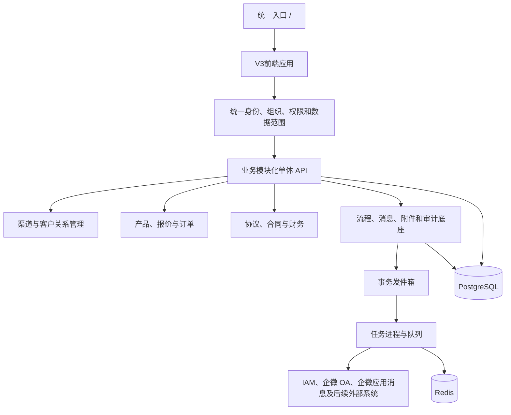
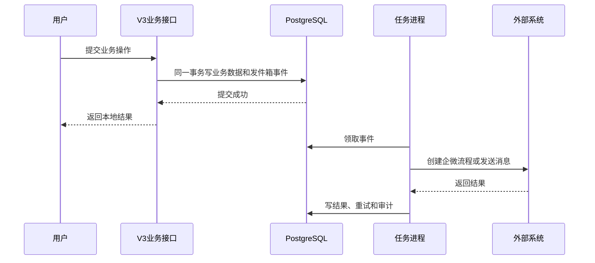
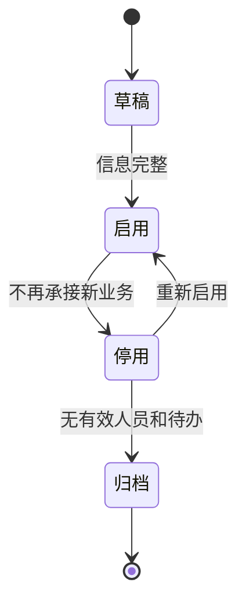
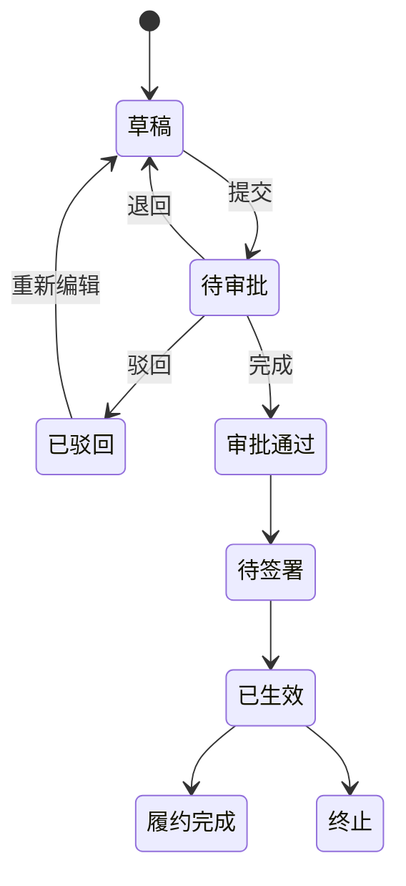
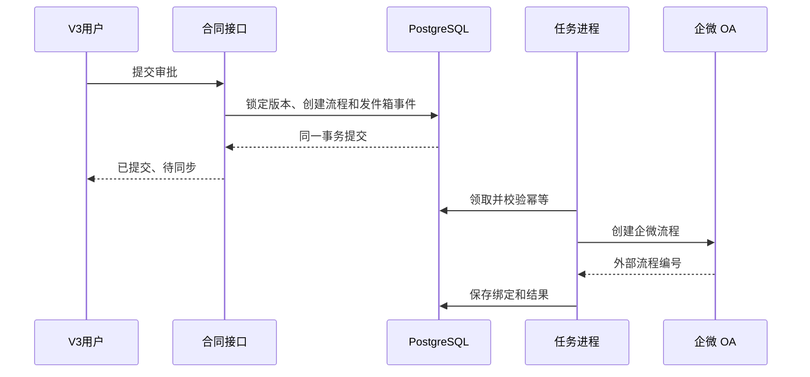
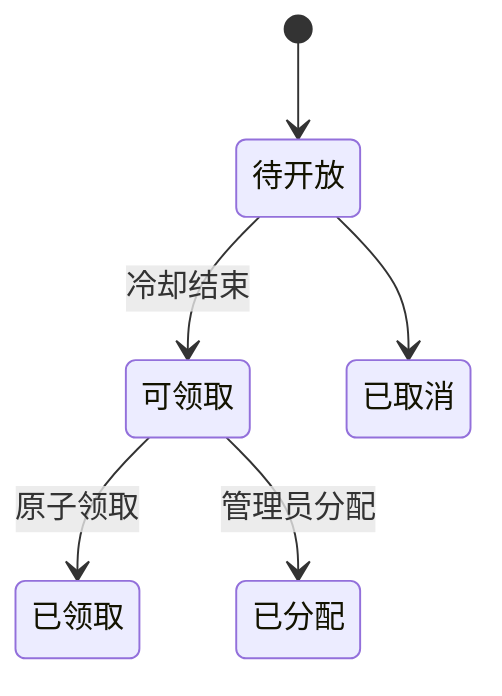
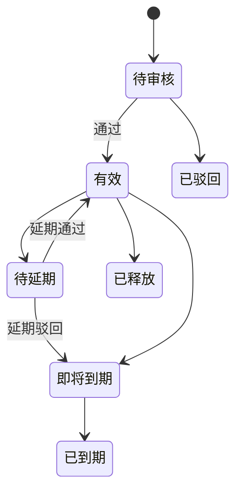

# V3业务平台底座与业务扩展实施交付方案

> 文档版本：1.1  
> 编制日期：2026-08-03  
> 最近更新：2026-08-04  
> 适用版本：联软渠道管理平台 V3  
> 适用工程：`apps/web`、`apps/api`、`apps/worker`、`packages/*`、`database/migrations`、`deploy/single-server`  
> 明确排除：V2 的 `frontend`、`backend` 及历史脚本不再承接任何新功能  
> 本次更新：沉淀统一入口和现场修复经验，补充 V3 唯一维护、主业务保护和交付脚本门禁

---

<a id="目录"></a>

## 目录

1. [文档目标与使用方法](#章节-1)
2. [总体结论与实施红线](#章节-2)
3. [V3现状盘点与成熟度判断](#章节-3)
4. [目标业务架构与系统边界](#章节-4)
5. [平台共性底座详细设计](#章节-5)
6. [已有功能的收口实施与交付方法](#章节-6)
7. [第11项：组织架构详细方案](#章节-7)
8. [第10项：合同审批与收款详细方案](#章节-8)
9. [第6项：同步创建企微OA流程详细方案](#章节-9)
10. [第7项：客户公海池与报备池详细方案](#章节-10)
11. [第5项：企微助手与应用提醒详细方案](#章节-11)
12. [其余业务模块的设计入口与依赖关系](#章节-12)
13. [平台管理中心的功能边界](#章节-13)
14. [角色、权限与数据范围设计](#章节-14)
15. [数据库、接口与代码组织规范](#章节-15)
16. [任务进程、事件与外部集成规范](#章节-16)
17. [测试、验收与完成定义](#章节-17)
18. [数据迁移、发布、回退与运维](#章节-18)
19. [实施阶段、人员配置与交付物](#章节-19)
20. [必须确认的业务决策与主要风险](#章节-20)
21. [附录A：建议状态码](#附录-a)
22. [附录B：建议权限代码](#附录-b)
23. [附录C：建议业务事件目录](#附录-c)
24. [附录D：需求与实施章节对应表](#附录-d)

---

<a id="章节-1"></a>

## 1. 文档目标与使用方法

### 1.1 文档目标

本文件不是概念性汇报材料，而是 V3 后续业务扩展的实施基线。产品、研发、测试、交付和运维人员应从本文得到以下明确答案：

1. 当前 V3 已有能力、半成品能力和完全缺失能力分别是什么。
2. 已有功能如何收口到可生产交付状态，哪些行为必须保持不变。
3. 新需求属于哪个业务域，依赖哪些底座，采用什么数据模型和状态机。
4. 前端、后端、数据库、任务进程和外部集成分别实现什么。
5. 每个阶段交付什么、如何测试、如何验收、如何升级和回退。

### 1.2 目标读者

| 角色               | 阅读重点                                |
| ------------------ | --------------------------------------- |
| 产品负责人         | 第2、3、7至13、19、20章                 |
| 架构与研发负责人   | 第4、5、14至18章                        |
| 前端研发           | 第6至13、15章的页面与路由部分           |
| 后端研发           | 第5至16章的领域、接口、状态机和任务部分 |
| 测试负责人         | 第6至12、17章                           |
| 实施与运维         | 第3、17至19章                           |
| 后续自动化编码工具 | 全文，尤其是第2、5、15、17章            |

### 1.3 实施使用顺序

实施任何模块前必须执行：

1. 先确认本次改动只落在 V3 主线目录和 V3 部署资产，不修改 V2 历史目录。
2. 在第3章确认成熟度，禁止把“已有表”误判为“功能已完成”。
3. 在第12章确认依赖，禁止跳过前置底座直接堆页面。
4. 在对应章节确认边界、状态机、数据模型、接口、页面和验收标准。
5. 完成第20章中与本阶段相关的业务决策确认。
6. 按第17章测试验收，按第18章制作 V3 升级和回退资产。

### 1.4 “已有功能先做”的定义

本方案将“已有功能先做”定义为：

- 保留现有 V3 页面、接口、正式数据和用户操作习惯。
- 先补齐服务端鉴权、数据范围、审计、状态机、幂等和回归测试。
- 不重写已经可用的报备、商机、报价、订单、产品和渠道主链路。
- 不以新增业务为理由继续向单个超长页面或数据服务堆逻辑。
- 不以修复入口、脚本或底座为理由替换四套正式业务页面。
- 已有功能通过阶段零门禁后，合同、收款、企微流程等高风险模块才进入生产开发。

[返回目录](#目录)

---

<a id="章节-2"></a>

## 2. 总体结论与实施红线

### 2.1 总体结论

V3 应建设为一个以渠道业务为核心的业务协同平台，继续采用：

- 一个 V3 应用。
- 一个统一入口 `/`。
- 一个管理端内的平台管理中心。
- 一个模块化单体 API。
- 一个 PostgreSQL 主数据库。
- 一个独立任务进程。
- 多个受控外部系统适配器。

当前阶段不建议拆分微服务。合同、订单、应收、收款存在较强事务关系，现有部署也是单机容器形态。通过代码模块、数据库逻辑域和接口契约已经可以建立清晰边界，过早拆分只会增加部署和数据一致性成本。

### 2.2 优先顺序

业务优先顺序：

1. 阶段零：现有 V3 收口。
2. 第11项：组织架构。
3. 第10项：合同审批、收款。
4. 第6项：同步创建企微 OA 流程。
5. 第7项：客户公海池、报备池。
6. 第5项：企微助手与应用提醒。

技术依赖不完全等于业务优先级：

- 消息事件底座必须在合同和企微流程前建设，但完整消息产品仍按第5项交付。
- 流程实例和审批任务底座必须随合同建设，但企微 OA 对接按第6项单独验收。
- 合作协议和框架协议的共用主档必须随合同域建模，完整运营功能可后续交付。

### 2.3 强制红线

1. 所有新增和修复只进入 V3。
2. 对外继续只发布根路径 `/`，不为新模块新增独立登录链接。
3. 超级管理员负责配置、授权、审计和监控，不代替业务角色经办。
4. 身份、角色、区域、渠道和操作者必须由服务端确认。
5. 功能权限和数据范围必须同时在服务端执行。
6. 合同、应收、收款和保证金金额必须使用数据库定点数。
7. 高风险状态变化必须通过状态机并保留事件和审计。
8. 外部调用必须异步、可重试、可对账，禁止直接双写。
9. 财务记录不允许物理删除，错误通过冲销、作废或更正处理。
10. 不建设无明确场景的通用低代码平台、万能表单或万能流程设计器。
11. 缺陷修复必须最小影响面落地，禁止以局部修复为由改写报备、商机、报价、订单、渠道、账号等主业务链路。
12. 四套正式业务页面是当前生产页面：`/admin.html`、`/admin-mobile.html`、`/partner.html`、`/partner-mobile.html`，不得把统一入口导向迁移中的旧路由或历史 V2 页面。
13. 升级脚本、验证脚本和冒烟脚本属于生产交付资产，必须兼容目标服务器的 Shell、`curl`、`awk`、`grep` 等基础工具差异。
14. 验证失败必须输出实际观测值，不能只输出笼统失败结论，避免现场误判和不必要回退。

### 2.4 近期统一入口修复经验

| 经验点               | 后续强制做法                                                                 |
| -------------------- | ---------------------------------------------------------------------------- |
| V2和V3边界容易混淆   | 所有入口、登录、部署、脚本修复先确认落点为 V3，不向 `frontend`、`backend` 写新逻辑 |
| 入口分流目标必须唯一 | 分流目标以 `apps/web/src/router/entry-target.ts` 为准，相关认证会话以 `apps/web/src/api/auth-client.ts` 为准 |
| 正式页面不能被替换   | 管理端和渠道端实际进入 `apps/web/public` 下四套正式页面，不能落到 `/admin`、`/partner` 或 `/mobile/*` 迁移页 |
| 登录态不是单一存储   | 登录成功必须同时建立 HttpOnly Cookie 会话和正式业务页面依赖的本地页面会话 |
| 跳转方式影响结果     | 登录成功后使用浏览器整页跳转进入 `.html` 页面，不能用单页应用内部路由替代 |
| 脚本误判会放大风险   | 检查 `Location` 等响应头时先规范化行尾回车，兼容相对地址和绝对地址，并输出实际跳转值 |
| 修复不能影响主业务   | 入口、脚本、认证修复完成后，必须回归客户报备、商机、报价、订单、渠道和账号主链路 |
| 交付物必须可追溯     | ZIP、内部 `SHA256SUMS`、外层 `.sha256`、文件清单和版本说明必须随改动同步更新 |

[返回目录](#目录)

---

<a id="章节-3"></a>

## 3. V3现状盘点与成熟度判断

### 3.1 成熟度定义

| 等级               | 定义                                     | 处理方式           |
| ------------------ | ---------------------------------------- | ------------------ |
| 一级：已交付       | 页面、接口、正式表、权限、测试和部署闭环 | 直接复用并回归     |
| 二级：可用但需收口 | 主流程可运行，权限、异常或测试不完整     | 收口后复用         |
| 三级：只有基础     | 只有表、入口、静态页面或历史数据         | 不得按完成功能宣传 |
| 四级：尚未建设     | 没有正式领域模型和业务闭环               | 按本文新建         |

### 3.2 当前工程资产

| 层次     | 当前资产                                                                 | 结论                     |
| -------- | ------------------------------------------------------------------------ | ------------------------ |
| 前端     | `apps/web`，Vue 3、Vue Router、Pinia、Element Plus                       | 唯一 V3 前端             |
| 后端     | `apps/api`，Express、PostgreSQL                                          | 继续模块化单体           |
| 任务进程 | `apps/worker`，BullMQ、Redis                                             | 框架存在，当前仅健康任务 |
| 数据库   | `iam`、`org`、`channel`、`catalog`、`crm`、`ops`、`integration`、`audit` | 在现有逻辑域增量扩展     |
| 契约     | `packages/contracts`、OpenAPI 资产                                       | 新接口唯一契约来源       |
| 部署     | `deploy/single-server`                                                   | 新模块纳入同一升级和回退 |

### 3.3 功能成熟度清单

| 功能                   | 当前成熟度 | 已有资产                         | 必须补齐                         |
| ---------------------- | ---------- | -------------------------------- | -------------------------------- |
| 统一入口               | 二级       | 根路径、角色设备分流、四套正式页面会话 | 构建部署、生产入口和脚本兼容验收 |
| 账号登录               | 二级       | 会话 Cookie、数据库用户登录      | 业务接口鉴权、会话撤销、授权版本 |
| IAM 单点登录           | 二级       | 配置和登录接口                   | 生产参数、失败审计、组织映射     |
| 管理端、渠道端、移动端 | 二级       | 路由、布局和历史页面             | 权限菜单、端到端持续回归         |
| 客户报备               | 二级       | 正式表、创建、审核、导入         | 范围过滤、状态机、保护期扩展     |
| 商机                   | 二级       | 正式表、创建、阶段历史           | 负责人变更、公海联动             |
| 产品与工作量           | 二级       | 产品、价格、工作量规则           | 发布版本、有效期、标品扩展       |
| 报价                   | 二级       | 试算、快照、转订单               | 版本锁定、审批、合同引用         |
| 订单                   | 二级       | 明细、确认、状态历史             | 合同、保证金、履约和财务关联     |
| 渠道与账号             | 二级       | 渠道层级、成员、导入             | 组织、协议、技术团队、证书       |
| 审核中心               | 二级       | 历史待审批和处理接口             | 流程实例、任务、节点、超时       |
| 通知                   | 三级       | 通知表、列表和已读入口           | 模板、多渠道投递和记录           |
| 平台管理中心           | 三级       | 路由和迁移状态                   | 组织、权限、流程、企微、规则     |
| 任务进程               | 三级       | Redis、BullMQ、健康任务          | 发件箱、企微、提醒、对账任务     |
| 组织架构               | 三级       | 组织、区域、员工画像表           | 岗位、任职、同步、授权、页面     |
| 合同与收款             | 四级       | 可复用订单、客户、附件和审批基础 | 完整新建                         |
| 企微 OA                | 四级       | 可复用外部身份和任务框架         | 完整新建                         |
| 公海池、报备池         | 四级       | 可复用客户、报备、负责人         | 完整新建                         |
| 企微提醒               | 四级       | 可复用通知和外部身份             | 完整新建                         |
| 协议、保证金、证书     | 四级       | 可复用渠道、合同、财务、产品底座 | 按依赖建设                       |

### 3.4 当前必须先解决的问题

#### 3.4.1 业务接口缺少统一可信身份

认证路由能够读取会话，但业务路由没有统一认证授权中间件；部分业务操作仍从请求头读取操作者。页面已登录并不等于 API 得到同等保护。

必须实现：

- 在 `/api/auth` 之外建立可复用会话解析服务。
- 所有 `/api` 业务路由默认要求登录，健康检查、登录和明确开放接口除外。
- 请求上下文注入用户、角色、组织、渠道、区域、权限和数据范围快照。
- 客户端自报操作者只可作为历史兼容信息，不参与授权和审计主体判定。

#### 3.4.2 权限尚未完全落成运行代码

数据库已有角色权限表，但很多页面仍依赖允许路径和前端菜单判断。合同和财务模块开始前，必须完成服务端权限与数据范围。

#### 3.4.3 审批和通知尚未成为共性服务

`ops.approvals` 不足以表达流程定义版本、实例、节点任务、转交、撤回、超时和外部绑定；`ops.notifications` 不足以表达模板、渠道、投递、重试、去重和偏好。

#### 3.4.4 任务进程尚未承担业务副作用

现有任务进程只处理健康任务。企微流程、消息、到期提醒、失败补偿和定时对账需要正式业务队列和处理器。

### 3.5 现状证据索引

| 内容             | 位置                                                       |
| ---------------- | ---------------------------------------------------------- |
| V3边界与统一入口 | `AGENTS.md`                                                |
| 前端路由         | `apps/web/src/router/index.ts`                             |
| 入口分流         | `apps/web/src/router/entry-target.ts`                      |
| 业务页面会话     | `apps/web/src/api/auth-client.ts`                          |
| 正式业务页面     | `apps/web/public/admin.html`、`apps/web/public/admin-mobile.html`、`apps/web/public/partner.html`、`apps/web/public/partner-mobile.html` |
| 当前业务工作台   | `apps/web/src/pages/BusinessWorkspacePage.vue`             |
| 当前认证         | `apps/api/src/auth-routes.ts`                              |
| 当前业务接口     | `apps/api/src/business-routes.ts`                          |
| 当前数据服务     | `apps/api/src/business-store.ts`                           |
| 当前任务进程     | `apps/worker/src/worker.ts`、`apps/worker/src/queue.ts`    |
| 账号组织渠道表   | `database/migrations/20260723_S2_002_账号组织渠道.sql`     |
| CRM主链路表      | `database/migrations/20260723_S2_004_业务主链路.sql`       |
| 通知审批任务表   | `database/migrations/20260723_S2_005_审计开放接口任务.sql` |

[返回目录](#目录)

---

<a id="章节-4"></a>

## 4. 目标业务架构与系统边界

### 4.1 总体架构



### 4.2 业务域

| 业务域     | 负责对象                                   | 不负责对象             |
| ---------- | ------------------------------------------ | ---------------------- |
| 身份权限域 | 用户、角色、权限、会话、外部身份、数据范围 | 合同和审批业务状态     |
| 组织域     | 内部组织、岗位、任职、负责人、区域         | 渠道商上下级           |
| 渠道域     | 渠道主档、层级、成员、画像、能力           | 总部内部部门           |
| 客户关系域 | 客户、报备、商机、跟进、归属、公海         | 合同收款               |
| 产品报价域 | 标品、价格、工作量、报价、快照             | 实际收款               |
| 订单域     | 订单、明细、确认、履约关联                 | 合同版本和财务核销     |
| 协议合同域 | 合作协议、框架协议、销售合同、版本、签约方 | 收款流水               |
| 财务应收域 | 应收、收款、分摊、冲销、保证金             | 银行支付，除非单独立项 |
| 流程域     | 定义、实例、任务、事件、外部绑定           | 具体业务字段           |
| 消息域     | 事件订阅、模板、站内消息、企微投递、提醒   | 业务状态真实性         |
| 集成域     | 外部配置、映射、调用、回调、对账           | 业务主数据最终决策     |
| 审计运维域 | 审计、任务监控、失败补偿、配置变更         | 日常业务办理           |

### 4.3 关键边界

- 内部部门使用 `org` 域；一级、二级渠道及渠道成员使用 `channel` 域。
- 两类组织可统一显示和授权引用，但不能用同一张组织表混合生命周期。
- V3 保存业务事实和本地流程；企微 OA 负责审批执行。
- 外部系统故障时，本地记录进入待同步或待对账，不能丢失。
- 平台管理中心管理规则和配置；合同、收款、客户领取由业务角色经办。

[返回目录](#目录)

---

<a id="章节-5"></a>

## 5. 平台共性底座详细设计

### 5.1 可信身份和会话

服务端请求上下文至少包含：

| 字段                     | 来源和用途              |
| ------------------------ | ----------------------- |
| 用户编号、用户名、显示名 | `iam.users`，展示和审计 |
| 登录来源                 | 本地账号、IAM、企微等   |
| 角色和权限集合           | 角色权限合并结果        |
| 内部组织、区域、渠道集合 | 数据范围计算            |
| 授权版本                 | 权限变化后使旧会话失效  |
| 会话编号                 | 撤销和审计              |

必须实现 `需要登录`、`需要权限`、`应用数据范围`、`需要业务状态` 四类服务端校验。退出、停用、改密和角色变化必须使旧会话失效。

### 5.2 权限与数据范围

```text
允许操作 = 会话有效
        且 账号有效
        且 具备功能权限
        且 目标位于数据范围
        且 业务状态允许
        且 请求字段通过允许清单
```

建议范围：总部全量、组织树、区域树、指定渠道、渠道树、本人、自定义集合。列表、详情、修改、审批、导出、下载和异步任务必须复用同一范围策略。

### 5.3 流程与审批底座

首期建设受控流程编排，不建设图形化低代码设计器。支持流程定义版本、实例、顺序审批、会签、条件分支、抄送、撤回、转交、超时、事件和外部企微绑定。

| 表                                     | 用途                   |
| -------------------------------------- | ---------------------- |
| `workflow.process_definitions`         | 流程定义主档           |
| `workflow.process_definition_versions` | 已发布版本，不允许覆盖 |
| `workflow.process_instances`           | 一次实际业务流程       |
| `workflow.process_tasks`               | 待办和已办任务         |
| `workflow.process_events`              | 动作和状态历史         |
| `workflow.external_process_bindings`   | 企微等外部流程绑定     |

业务状态、流程状态和外部同步状态必须分开。例如合同可处于“待审批”，同时企微同步处于“创建失败”。

### 5.4 事务发件箱与任务



必须具备事件唯一编号、消费者幂等键、退避重试、失败队列、人工重试、任务锁和敏感负载最小化。

### 5.5 消息底座

消息必须区分业务事件、消息模板、站内通知和渠道投递。建议新增：

| 表                            | 用途                         |
| ----------------------------- | ---------------------------- |
| `message.event_subscriptions` | 事件、模板和接收人规则       |
| `message.templates`           | 模板版本、变量和敏感级别     |
| `message.notifications`       | 站内通知，可由现有通知表演进 |
| `message.deliveries`          | 每个接收人和渠道的发送结果   |
| `message.user_preferences`    | 用户提醒偏好和免打扰         |
| `message.reminder_schedules`  | 到期和逾期提醒计划           |

### 5.6 外部集成适配

业务模块只调用内部集成接口，适配器统一负责凭据、超时、重试、限流、调用日志、错误分类、回调验签、外部编号映射和对账。测试与生产连接和凭据必须隔离。

### 5.7 附件

现有 `ops.files` 应扩展业务对象、用途、文件版本、保密等级、扫描状态和逻辑删除。文件下载必须重新校验业务数据范围，不能只凭存储地址访问。

### 5.8 审计和可观测

组织授权、合同、应收、收款、公海规则、企微配置、消息模板和保证金都属于高风险对象。审计必须保存服务端操作者、请求编号、权限、范围摘要、目标、动作、结果和前后值摘要；密码、令牌、密钥和完整敏感文件不得进入日志。

### 5.9 字典、编号和规则

统一管理合同类型、协议类型、收款方式、币种、税率、证书类型、产品能力等级、编号、公海规则、保护期、领取额度和提醒天数。已被历史单据引用的字典项不允许物理删除。

### 5.10 幂等、并发和状态机

| 场景         | 控制方式                        |
| ------------ | ------------------------------- |
| 重复点击提交 | 幂等键和 `ops.idempotency_keys` |
| 并发领取客户 | 行锁或条件更新                  |
| 并发审批     | 任务状态条件更新和行版本        |
| 重复企微回调 | 外部事件编号唯一约束            |
| 重复收款     | 外部流水号或业务幂等键          |
| 过期页面修改 | `row_version` 乐观锁            |
| 重复任务消费 | 消费幂等和业务唯一约束          |

### 5.11 接口契约

新增接口先进入 `packages/contracts` 的 OpenAPI 契约，再实现后端和前端。契约必须声明字段、精度、枚举、错误码、权限、数据范围、幂等要求、状态前置条件、审计级别和触发事件。

### 5.12 主业务保护与变更隔离

V3 后续会持续叠加组织、合同、收款、企微、公海和消息能力，因此任何底座或缺陷修复都必须先保护现有主业务。

每次改动前必须写清楚：

- 改动目录和文件是否全部属于 V3 主线。
- 是否触碰登录、入口、权限、数据范围、部署脚本或数据库迁移。
- 是否改变客户报备、商机、报价、订单、渠道、账号、产品价格等既有行为。
- 是否需要业务数据回填、功能开关、灰度开放或回退说明。
- 本次回归覆盖哪些电脑端、移动端、管理员和渠道账号场景。

控制规则：

- 新模块默认通过功能开关和权限菜单开放，不改变既有主链路默认入口。
- 修复共享底座时，必须补对应单元测试和主业务冒烟，不能只验证新路径。
- 不删除或重命名已被正式业务页面使用的本地会话键、接口路径、字段和页面文件，除非完成兼容迁移。
- 对外接口和页面参数需要兼容一个发布窗口，无法兼容时必须在升级说明中列明影响和处理步骤。
- 数据库迁移只做向前兼容扩展，主业务稳定前不做破坏性收缩。

[返回目录](#目录)

---

<a id="章节-6"></a>

## 6. 已有功能的收口实施与交付方法

### 6.1 阶段零目标

阶段零把已经迁入 V3 的功能从“页面和主链路可运行”提升到“可作为新增模块底座”。阶段零完成前，新模块只进行需求确认、数据建模和原型，不进入生产合并。

### 6.2 统一入口与登录

当前复用：根路径、登录页、角色设备分流、安全跳转、IAM 单点登录。

固定分流目标：

| 账号和终端     | 实际进入页面                         | 说明                           |
| -------------- | ------------------------------------ | ------------------------------ |
| 管理员电脑端   | `/admin.html`                        | V3 当前正式管理端页面          |
| 管理员移动端   | `/admin-mobile.html#/admin/home`     | V3 当前正式管理移动端首页      |
| 渠道账号电脑端 | `/partner.html`                      | V3 当前正式渠道端页面          |
| 渠道账号移动端 | `/partner-mobile.html#/partner/home` | V3 当前正式渠道移动端首页      |

上述目标是生产交付目标，不是临时路由。`/admin`、`/partner`、`/mobile/admin/home`、`/mobile/partner/home` 只能作为权限路径或历史兼容路径参与判断，不能作为登录后的最终页面。

收口任务：

1. 构建并部署统一入口改动。
2. 验证 Nginx 对根路径和工作区路径统一回退 V3 单页应用。
3. 建立业务 API 会话中间件。
4. 记录会话编号、登录来源和授权版本。
5. 实现退出、停用、改密和授权变化后的会话撤销。
6. 覆盖电脑、移动、管理员、渠道、密码和单点登录组合验收。
7. 登录成功时同时写入 HttpOnly Cookie 会话和四套正式业务页面需要的本地页面会话。
8. 安全 `redirect` 参数必须先校验账号允许路径，再转换为对应正式 `.html` 页面。
9. 入口、认证响应或移动端落点变化时，同步更新 `entry-target.ts`、`auth-client.ts` 和对应测试。

交付标准：对外只发布一个地址；未登录业务 API 返回 401；跨角色和外部跳转被拒绝；登录后进入四套正式业务页面；现场脚本能准确识别实际跳转目标。

### 6.3 管理端、渠道端和移动端

- 菜单由权限和终端生成，允许路径不作为最终接口授权。
- 页面按钮按查看、创建、编辑、审批、导出等动作权限控制。
- 所有详情、修改和下载由服务端校验范围。
- 桌面和移动端共用业务状态规则和接口契约。
- 建立现有页面持续端到端巡检。

### 6.4 客户报备

复用 `crm.customers`、`crm.registrations`、事件表和现有创建审核导入流程。

收口任务：

1. 创建人、负责人、渠道和区域由服务端确认。
2. 固化草稿、待审核、通过、驳回、取消、已转商机状态机。
3. 审核写流程事件和审计。
4. 同名客户及统一社会信用代码校验进入事务。
5. 导入任务保存范围快照，执行和下载再次校验。
6. 为保护期预留正式字段，不提前实现公海规则。

验收：渠道只能看到本渠道或本人范围；区域管理员只能审批绑定区域；报备不能重复审批和重复转商机。

### 6.5 商机

- 固化商机阶段和赢单、丢单、取消原因。
- 负责人变化写历史。
- 商机详情、跟进和报价统一执行范围。
- 报备转商机保持客户、渠道、负责人和区域一致。
- 为公海规则提供最后有效跟进和下一步计划时间。

### 6.6 产品、价格、工作量和报价

1. 产品和价格增加发布版本及有效期。
2. 报价计算只在服务端执行。
3. 保存产品、价格、折扣、工作量和规则快照。
4. 报价提交后锁定版本，修改需要新版本或退回。
5. 超折扣触发审批。
6. 缺失工作量映射进入明确补录清单。

验收：改价不影响历史报价；相同输入试算一致；无权限不能改价；报价只能转订单一次。

### 6.7 订单

- 订单来源于有效报价，手工订单是否允许需业务确认。
- 金额和明细从报价快照生成。
- 一级确认、驳回、取消和完成通过状态机。
- 为合同、保证金和履约建立正式关联，不长期堆入扩展字段。
- 默认支持一个订单关联多个合同并可设置主合同，最终由业务确认。

### 6.8 渠道与账号

- 渠道上下级变化保留生效和结束时间，禁止成环。
- 渠道员工禁用、移除和删除语义分开，历史用户不物理删除。
- 渠道管理员只能管理本渠道员工和允许角色。
- 内部账号与渠道账号使用不同任职关系。
- 协议、技术团队和证书使用正式关联表。

### 6.9 审核、通知、导入导出、审计和开放接口

| 功能     | 阶段零要求                                       |
| -------- | ------------------------------------------------ |
| 审核中心 | 接入可信操作者、权限、范围和事件，不做万能设计器 |
| 通知     | 只返回当前接收人消息，为消息域演进准备           |
| 导入导出 | 任务化、文件权限、范围快照、失败明细和审计       |
| 审计     | 记录服务端操作者、权限代码和范围摘要             |
| OpenAPI  | 管理接口限超管；业务资源执行绑定用户范围         |

### 6.10 阶段零交付清单

| 交付物 | 内容                                                   |
| ------ | ------------------------------------------------------ |
| 代码   | 统一身份、权限、数据范围、状态机、审计、幂等和任务基础 |
| 数据库 | 必要增量迁移，不破坏正式数据                           |
| 契约   | 核心接口补认证、错误码和权限声明                       |
| 测试   | 允许拒绝、主链路、移动端、并发和重复提交               |
| 部署   | V3镜像、升级、检查和回退脚本                           |
| 文档   | 权限矩阵、状态机、测试记录和生产清单                   |

### 6.11 阶段零主业务保护清单

阶段零每个修复包都必须确认以下主业务未被破坏：

| 保护对象 | 必查内容                                               |
| -------- | ------------------------------------------------------ |
| 登录入口 | 账号密码、IAM、退出、会话恢复和四套正式页面跳转        |
| 管理端   | 首页、渠道管理、客户报备审核、产品价格、报价和订单查看 |
| 渠道端   | 客户报备、商机跟进、报价、订单和渠道成员管理           |
| 移动端   | 管理移动首页、渠道移动首页和主要待办入口               |
| 数据范围 | 跨渠道、跨区域、跨角色访问被服务端拒绝                 |
| 部署脚本 | 升级、验证、冒烟和回退只作用于 V3 目录和 V3 容器       |
| 数据库   | 正式数据只增量迁移，不清空、不覆盖、不重建主业务表     |

[返回目录](#目录)

---

<a id="章节-7"></a>

## 7. 第11项：组织架构详细方案

### 7.1 建设目标

组织架构是合同审批、企微流程、客户分配、消息接收人和证书责任人的共同基础，必须先于其他新增业务完成。

本模块解决：

- 内部部门和人员归属。
- 岗位、任职、直属负责人和组织负责人。
- 区域、渠道和业务数据范围。
- IAM 或企微通讯录与 V3 用户的稳定映射。
- 入职、调岗、兼职、离职和业务交接。
- 组织维护、同步差异和失败补偿。

### 7.2 业务边界

| 对象                           | 归属                     | 说明                       |
| ------------------------------ | ------------------------ | -------------------------- |
| 总部、事业部、大区、区域、部门 | 组织域                   | 内部行政或业务组织         |
| 岗位、任职、直属负责人         | 组织域                   | 支持一人多岗，必须有主任职 |
| 一级、二级渠道商               | 渠道域                   | 不放入内部组织表           |
| 渠道员工                       | 渠道成员关系             | 可绑定外部身份             |
| 角色和权限                     | 身份权限域               | 岗位名称不能直接代表权限   |
| 数据范围                       | 身份权限域引用组织和渠道 | 可按角色或用户绑定         |

### 7.3 推荐权威来源

- 内部部门和员工：IAM 或企微通讯录为身份与组织上游，V3 保存镜像和业务授权。
- 渠道商、渠道层级和渠道员工：V3 为权威来源。
- 角色、权限和数据范围：V3 为权威来源，不从外部岗位自动推导高权限。
- 首期只做单向同步；确需反向同步时单独确认冲突策略。

### 7.4 数据模型

#### 7.4.1 复用

`iam.users`、`iam.external_identities`、`iam.roles`、`iam.permissions`、`iam.user_roles`、`org.regions`、`org.org_units`、`org.staff_profiles`、`channel.partners`、`channel.partner_members`。

#### 7.4.2 新增或扩展

| 表                                   | 核心字段                                     | 约束                   |
| ------------------------------------ | -------------------------------------------- | ---------------------- |
| `org.org_units` 扩展                 | 类型、路径、负责人、排序、生效失效时间、来源 | 禁止循环父子           |
| `org.positions`                      | 代码、名称、组织、类别、状态                 | 同组织代码唯一         |
| `org.staff_assignments`              | 用户、组织、岗位、主职、负责人、生效失效时间 | 一人只能有一个有效主职 |
| `org.manager_relations`              | 下属任职、负责人任职、关系类型、有效期       | 不得指向失效任职       |
| `iam.data_scope_bindings`            | 主体、资源、范围类型、范围编号               | 显式绑定               |
| `integration.directory_mappings`     | 外部系统、外部对象、V3对象                   | 外部系统加外部编号唯一 |
| `integration.directory_sync_runs`    | 批次、状态、统计、错误                       | 可追溯重试             |
| `integration.directory_sync_changes` | 对象、动作、前后摘要、处理状态               | 支持预览确认           |

### 7.5 组织生命周期



规则：

- 有有效子组织时不能归档父组织。
- 有有效任职时不能归档组织。
- 停用组织不用于新授权和新业务分配，历史仍可查询。
- 负责人变化必须保留生效时间和历史。

### 7.6 人员生命周期

| 场景     | 必须执行                                         |
| -------- | ------------------------------------------------ |
| 入职     | 创建或绑定用户、外部身份、主职、默认角色和范围   |
| 调岗     | 结束旧任职、创建新任职、更新负责人、重新计算范围 |
| 兼职     | 新增非主职，不自动扩大敏感权限                   |
| 离职     | 撤销会话、停用账号、结束任职、转移客户和待办     |
| 重新启用 | 新建任职，不恢复旧会话和过期授权                 |

离职交接至少覆盖客户、报备、商机、合同、待办任务和未完成审批。未完成交接时账号仍应停用，待办进入管理员处理队列，不能继续保留登录权。

### 7.7 接口

| 方法与路径                                      | 用途         | 权限                            |
| ----------------------------------------------- | ------------ | ------------------------------- |
| `GET /api/org/units/tree`                       | 读取组织树   | `org.unit.read`                 |
| `POST /api/org/units`                           | 新建组织     | `org.unit.create`               |
| `PUT /api/org/units/:id`                        | 修改组织     | `org.unit.update`               |
| `PUT /api/org/units/:id/status`                 | 启停归档     | `org.unit.status`               |
| `GET /api/org/staff`                            | 查询人员任职 | `org.staff.read`                |
| `POST /api/org/staff/:userId/assignments`       | 新增任职     | `org.assignment.create`         |
| `PUT /api/org/assignments/:id`                  | 调整任职     | `org.assignment.update`         |
| `POST /api/org/staff/:userId/offboard`          | 离职交接     | `org.staff.offboard`            |
| `GET /api/org/data-scopes/:type/:id`            | 查询范围     | `identity.scope.read`           |
| `PUT /api/org/data-scopes/:type/:id`            | 保存范围     | `identity.scope.update`         |
| `POST /api/integrations/directory-sync/preview` | 预览同步     | `integration.directory.preview` |
| `POST /api/integrations/directory-sync/run`     | 执行同步     | `integration.directory.execute` |
| `GET /api/integrations/directory-sync/runs`     | 同步批次     | `integration.directory.read`    |

### 7.8 页面

建议放在 `/admin/platform-admin/organization`：

| 页面       | 核心能力                           |
| ---------- | ---------------------------------- |
| 组织架构   | 组织树、详情、负责人、状态         |
| 人员与任职 | 人员、岗位、主兼职、负责人、有效期 |
| 岗位管理   | 岗位字典和组织岗位                 |
| 数据范围   | 按角色或用户查看最终范围           |
| 组织同步   | 差异预览、同步批次、失败重试       |
| 离职交接   | 客户、业务和待办转移               |

移动端首期只提供“我的组织、我的负责人、我的角色”只读信息，不提供组织编辑。

### 7.9 同步流程

1. 定时或人工拉取外部组织与人员。
2. 写同步暂存和差异，不直接覆盖正式数据。
3. 自动处理安全的新增和基本资料更新。
4. 组织移动、停用、负责人变化进入差异确认。
5. 应用变更后递增授权版本并撤销必要会话。
6. 发布组织变更事件，供交接、流程和消息消费。

### 7.10 验收

- 多级组织树不能形成循环。
- 用户可有多个任职，但只有一个有效主职。
- 调岗离职后历史经办人保留，新业务使用新范围。
- 区域管理员无法查看范围外人员。
- 角色变化后旧会话失效。
- 重复同步不产生重复组织和用户。
- 同步失败可定位到对象和原因并安全重试。
- 组织、任职、授权和离职均有审计。

[返回目录](#目录)

---

<a id="章节-8"></a>

## 8. 第10项：合同审批与收款详细方案

### 8.1 建设结论

合同审批和收款必须分属协议合同域与财务应收域，通过正式关联形成闭环，不能在订单表上增加几个金额字段完成。

```text
已确认订单
  -> 合同草稿
  -> 提交审批
  -> 审批通过
  -> 签署并生效
  -> 生成应收计划
  -> 登记收款
  -> 财务复核
  -> 分摊核销
  -> 回写合同与订单进度
```

### 8.2 首期范围

包含：

- 销售合同、合作协议、框架协议共用主档。
- 合同版本、签约方、金额、明细、附件、审批、签署和历史。
- 应收计划、收款登记、复核、分摊、冲销和余额。
- 合同、订单、报价、客户、渠道关联。
- 合同和应收提醒事件。

默认不包含：

- 电子签章平台对接。
- 银行直连、支付网关和自动扣款。
- 完整发票和总账会计。
- 多法人复杂合并报表。

以上如需建设，应通过适配器和后续阶段扩展，不能暗中混入首期。

### 8.3 合同类型

| 类型     | 用途                         | 是否产生应收     |
| -------- | ---------------------------- | ---------------- |
| 销售合同 | 基于订单确认产品、金额和交付 | 通常产生         |
| 合作协议 | 约定渠道合作政策、责任和期限 | 可选             |
| 框架协议 | 关联多个订单或子合同         | 通常由子合同产生 |
| 补充协议 | 修改既有协议或合同           | 取决于变更       |

第2、3项必须进入共同类型模型，避免后续再造重复协议系统。

### 8.4 数据模型

#### 8.4.1 协议合同域

| 表                                    | 核心字段                                               | 用途                   |
| ------------------------------------- | ------------------------------------------------------ | ---------------------- |
| `contract.contracts`                  | 编号、类型、客户、渠道、订单、金额、币种、状态、负责人 | 主档                   |
| `contract.contract_versions`          | 版本号、正文摘要、金额、条款快照、状态                 | 正式修改形成版本       |
| `contract.contract_parties`           | 主体类型、编号、名称、角色、签署信息                   | 甲乙方等               |
| `contract.contract_items`             | 订单明细、产品、数量、单价、金额                       | 从订单快照生成         |
| `contract.contract_relations`         | 当前合同、关联合同、关系类型                           | 框架、子合同、补充协议 |
| `contract.contract_files`             | 合同版本、文件、用途、签署状态                         | 草稿、盖章、签署件     |
| `contract.contract_status_history`    | 原状态、新状态、操作者、原因                           | 状态回放               |
| `contract.contract_approval_bindings` | 合同版本、流程实例、外部流程                           | 审批追踪               |

#### 8.4.2 财务应收域

| 表                                   | 核心字段                                 | 用途     |
| ------------------------------------ | ---------------------------------------- | -------- |
| `finance.receivable_plans`           | 合同、期次、应收日、金额、状态           | 分期应收 |
| `finance.receipts`                   | 付款方、金额、日期、方式、外部流水、状态 | 收款主档 |
| `finance.receipt_allocations`        | 收款、应收计划、分摊金额                 | 核销     |
| `finance.receipt_reversals`          | 原收款、冲销金额、原因、批准人           | 错账处理 |
| `finance.reconciliation_runs`        | 对账来源、批次、统计、状态               | 对账基础 |
| `finance.reconciliation_differences` | 差异类型、对象、处理状态                 | 差异闭环 |

### 8.5 合同状态机



约束：

- 待审批后不得直接修改提交版本。
- 审批通过后变更金额、主体、产品或关键条款必须新建版本并重审。
- 生效合同不得物理删除。
- 终止合同不自动删除应收和收款，由财务调整或冲销。

### 8.6 收款状态机和财务约束

| 状态     | 可执行动作               |
| -------- | ------------------------ |
| 草稿     | 修改、删除草稿、提交复核 |
| 待复核   | 通过、驳回               |
| 已确认   | 分摊、冲销申请           |
| 部分核销 | 继续分摊                 |
| 已核销   | 冲销申请                 |
| 已冲销   | 只读                     |

约束：

- 金额使用 `numeric(18,2)`，币种显式保存。
- 已确认收款累计分摊不得超过净收款。
- 应收累计核销不得超过应收；超收进入预收或待处理余额。
- 外部流水号在同一来源内唯一。
- 收款日期、确认日期和入账日期分开。

### 8.7 审批规则

| 条件                       | 推荐审批链                                 |
| -------------------------- | ------------------------------------------ |
| 标准合同且金额折扣在授权内 | 负责人上级 -> 商务或法务                   |
| 非标准条款                 | 负责人上级 -> 法务 -> 业务负责人           |
| 超折扣或高金额             | 负责人上级 -> 区域负责人 -> 财务 -> 授权人 |
| 补充协议涉及金额           | 原责任人 -> 法务 -> 财务 -> 授权人         |

金额阈值、折扣阈值和角色必须由业务签字确认。

### 8.8 接口

| 方法与路径                                 | 用途     | 关键要求                   |
| ------------------------------------------ | -------- | -------------------------- |
| `GET /api/contracts`                       | 合同列表 | 范围、分页、状态和到期筛选 |
| `POST /api/contracts`                      | 创建草稿 | 幂等、订单可用性           |
| `GET /api/contracts/:id`                   | 合同详情 | 版本、关联、审批、财务摘要 |
| `PUT /api/contracts/:id`                   | 修改草稿 | 行版本和字段白名单         |
| `POST /api/contracts/:id/versions`         | 新建版本 | 审批后变更                 |
| `POST /api/contracts/:id/submit`           | 提交审批 | 同事务创建流程和事件       |
| `POST /api/contracts/:id/withdraw`         | 撤回     | 受流程状态限制             |
| `POST /api/contracts/:id/activate`         | 确认生效 | 签署件和权限               |
| `POST /api/contracts/:id/terminate`        | 终止     | 原因、审批、财务检查       |
| `GET /api/receivables`                     | 应收列表 | 财务和业务范围             |
| `POST /api/contracts/:id/receivable-plans` | 应收计划 | 合计约束                   |
| `POST /api/receipts`                       | 登记收款 | 外部流水幂等               |
| `POST /api/receipts/:id/confirm`           | 财务确认 | 高风险审计                 |
| `POST /api/receipts/:id/allocate`          | 分摊核销 | 事务和锁                   |
| `POST /api/receipts/:id/reverse`           | 冲销     | 独立权限和审批             |

### 8.9 页面

管理端：

- `/admin/contracts`：合同列表和统计。
- `/admin/contracts/new`：从订单创建合同。
- `/admin/contracts/:id`：合同详情、版本、审批、附件、应收摘要。
- `/admin/contracts/:id/edit`：草稿或新版本编辑。
- `/admin/receivables`：应收计划和逾期。
- `/admin/receipts`：收款、待复核和核销。
- `/admin/receipts/new`：登记收款。
- `/admin/receipts/:id`：分摊和冲销历史。

渠道端提供本渠道合同、待补材料和应收进度；不提供财务确认和冲销。移动端首期提供摘要、审批状态、应收提醒和待办，不提供复杂编辑与分摊。

### 8.10 事件和审计

事件：合同创建、提交、通过、驳回、待签署、生效、到期、终止；应收生成、即将到期、逾期；收款登记、复核、确认、核销、冲销。

合同正文、金额、折扣和凭证按角色脱敏；下载附件重新执行范围检查。合同终止、收款确认、核销和冲销属于高风险审计。

### 8.11 验收

- 从有效订单创建合同，关联和金额正确。
- 提交后版本锁定，关键字段变化重新审批。
- 审批或企微同步失败不丢本地合同。
- 应收合计规则可校验。
- 一笔收款可分摊多期，多笔收款可核销一期。
- 并发核销不会超额。
- 已确认收款不能删除，冲销后余额正确。
- 权限、范围、附件和导出均有拒绝用例。
- 高风险动作可完整审计。

[返回目录](#目录)

---

<a id="章节-9"></a>

## 9. 第6项：同步创建企微OA流程详细方案

### 9.1 建设目标

用户在 V3 提交合同或协议审批后，系统可靠创建企微 OA 流程，并将企微进度和结果同步回 V3。目标是可追踪、可重试、可对账且不重复创建的闭环，不是简单调用一次接口。

### 9.2 联调前置

| 项目     | 必须确认                     |
| -------- | ---------------------------- |
| 企业主体 | 企业编号和使用环境           |
| 自建应用 | 应用编号、可见范围、接口权限 |
| 调用凭据 | 保管、轮换和失效处理         |
| 审批模板 | 测试生产模板编号、版本、字段 |
| 发起人   | V3与企微用户映射             |
| 审批人   | 企微模板决定或V3动态传入     |
| 回调     | 地址、验签、网络和重放策略   |
| 测试账号 | 发起、审批、抄送和异常账号   |

凭据不得出现在前端、普通配置文件、日志、审计正文或数据库明文中。

### 9.3 主从关系

| 信息               | 权威来源                 |
| ------------------ | ------------------------ |
| 合同、协议和版本   | V3                       |
| 本地流程和业务状态 | V3                       |
| 企微节点执行结果   | 企微 OA                  |
| 用户身份绑定       | V3外部身份映射           |
| 企微模板结构       | 企微，V3保存确认映射版本 |
| 消息投递结果       | V3消息投递记录           |

### 9.4 数据模型

| 表                                     | 用途                                 |
| -------------------------------------- | ------------------------------------ |
| `integration.connectors`               | 外部连接主档、环境、状态、超时、限流 |
| `integration.connector_credentials`    | 安全凭据引用、版本、有效期           |
| `integration.wecom_approval_templates` | 业务类型、组织范围、模板编号和版本   |
| `integration.wecom_field_mappings`     | V3字段、企微字段、转换和必填         |
| `integration.external_user_mappings`   | V3用户和企微用户绑定                 |
| `workflow.external_process_bindings`   | 本地实例、外部流程、同步状态         |
| `integration.outbound_calls`           | 请求、接口、结果、耗时、重试         |
| `integration.callback_inbox`           | 外部事件、验签、去重、处理状态       |
| `integration.reconciliation_runs`      | 对账批次和差异                       |

### 9.5 创建流程



要求：

- 页面不等待外部完整创建。
- 幂等键使用本地流程实例加模板版本。
- 已绑定外部流程时重复任务返回已有结果。
- 字段映射错误进入人工修复，不无限重试。
- 网络超时无法确认结果时先查询或对账，不盲目重复创建。

### 9.6 回调和状态

回调处理：

1. 验签、校验时间窗口和来源。
2. 按外部事件编号或稳定摘要写回调收件箱。
3. 重复事件直接返回成功。
4. 根据外部流程找到本地实例。
5. 映射为本地流程动作并执行状态机。
6. 同事务写流程事件、业务状态、审计和消息事件。
7. 无法映射的事件进入待处理，不覆盖业务。

| 企微含义       | 本地流程     | 合同           |
| -------------- | ------------ | -------------- |
| 已创建、处理中 | 进行中       | 待审批         |
| 已同意         | 已通过       | 审批通过       |
| 已驳回         | 已驳回       | 已驳回         |
| 已撤销         | 已撤回或取消 | 恢复草稿或取消 |
| 未知或缺失     | 待对账       | 不自动修改     |

同步状态另存待同步、同步中、已同步、同步失败、待对账、已关闭。

### 9.7 失败处理

| 失败           | 自动重试 | 处理               |
| -------------- | -------- | ------------------ |
| 网络和临时异常 | 是       | 退避并先查结果     |
| 限流           | 是       | 按等待时间重试     |
| 凭据失效       | 否       | 告警并暂停连接器   |
| 模板或字段变化 | 否       | 标记模板失效并重配 |
| 用户未映射     | 否       | 生成补齐待办       |
| 业务状态变化   | 否       | 进入对账           |
| 重复创建       | 不需要   | 返回现有绑定       |

### 9.8 接口和页面

接口：

- `GET/PUT /api/platform/integrations/wecom`
- `POST /api/platform/integrations/wecom/test`
- `GET/POST /api/platform/integrations/wecom/templates`
- `POST /api/platform/integrations/wecom/templates/:id/validate`
- `GET /api/workflows/:id/external-sync`
- `POST /api/workflows/:id/external-sync/retry`
- `POST /api/integrations/wecom/callback`
- `POST /api/platform/integrations/wecom/reconcile`

页面 `/admin/platform-admin/integrations/wecom` 包含连接状态、模板映射、用户映射、调用日志、回调收件箱、失败补偿和对账。完整凭据不得回显。

### 9.9 安全与验收

- 回调验签并限制时间窗口。
- 日志和审计不记录访问令牌。
- 凭据变更二次确认并写最高风险审计。
- 测试生产连接、模板和凭据隔离。
- 企微表单只传审批必要信息。
- 外部流程链接不能绕过 V3 权限。
- 重复提交不创建多个企微流程。
- 企微不可用时合同保持待同步。
- 同意、驳回、撤销和重复回调正确处理。
- 断网、超时、限流、凭据失效和重复回调有自动化测试。

[返回目录](#目录)

---

<a id="章节-10"></a>

## 10. 第7项：客户公海池与报备池详细方案

### 10.1 术语和边界

“报备池”存在业务歧义。本文采用推荐定义，编码前必须确认：

| 名称       | 推荐定义                                   |
| ---------- | ------------------------------------------ |
| 客户公海池 | 没有有效负责人、可领取或分配的客户集合     |
| 报备保护池 | 有效报备保护、冲突和释放关系集合           |
| 待分配报备 | 已录入但未确定责任人的工作视图             |
| 销售线索池 | 尚未达到客户主档标准的线索，首期不混入报备 |

如实际所指是销售线索池，应独立建线索域。

### 10.2 原则

- 客户主档只有一份，进入公海不复制。
- 公海是归属关系和池记录变化，不是客户删除新建。
- 报备保护是渠道、客户、产品或区域在一段时间内的权益关系。
- 领取、分配、回收、释放、延期和冲突都保留历史。
- 规则命中产生明确动作或待办，不静默覆盖人工决定。

### 10.3 数据模型

| 表                                  | 用途                           |
| ----------------------------------- | ------------------------------ |
| `crm.customer_ownerships`           | 客户归属历史                   |
| `crm.customer_pool_entries`         | 入池原因、时间、可领时间和状态 |
| `crm.customer_pool_rules`           | 条件、范围、优先级、版本       |
| `crm.customer_claims`               | 领取申请和审批                 |
| `crm.customer_assignment_events`    | 原负责人、新负责人和动作历史   |
| `crm.registration_protections`      | 报备保护主体、范围和有效期     |
| `crm.registration_conflicts`        | 新旧报备冲突和处理             |
| `crm.protection_extension_requests` | 保护延期申请                   |

### 10.4 入池和领取规则

入池触发：

- 新客户无负责人。
- 负责人离职且未完成交接。
- 超过规定天数无有效跟进。
- 商机丢单且冷却期结束。
- 负责人主动释放。
- 管理员强制回收。
- 报备保护到期后按客户归属规则判断。

领取条件：

- 每日、每周和当前持有客户上限。
- 组织、区域、渠道和产品能力。
- 新入池冷却期。
- 领取后首次跟进时限。
- 再次领取冷却期。
- 高等级客户需审批分配。

无跟进应使用有效跟进事件和计划时间，不能只看记录更新时间。

### 10.5 并发领取

领取在一个数据库事务中：

1. 锁定有效池记录。
2. 重校验资格、额度、范围和当前归属。
3. 条件更新为已领取。
4. 创建新归属和分配事件。
5. 写审计和业务事件。

同一客户并发领取只有一个成功，其他返回 409。

### 10.6 报备保护

保护记录包含保护主体、客户、产品或区域范围、开始到期时间、来源报备、延期次数和释放原因。

冲突优先使用统一社会信用代码；缺失时使用规范化名称、历史别名、区域和人工复核。范围外用户只知道存在冲突，不得看到对方敏感信息。

### 10.7 状态机





### 10.8 接口和页面

接口：

- `GET /api/customer-pools`
- `POST /api/customer-pools/:entryId/claim`
- `POST /api/customer-pools/:entryId/assign`
- `POST /api/customers/:id/release`
- `POST /api/customers/:id/reclaim`
- `GET /api/registration-pool`
- `GET /api/registration-conflicts`
- `POST /api/registration-conflicts/:id/resolve`
- `POST /api/registration-protections/:id/extend`
- `GET/PUT /api/platform/customer-pool-rules/:id`

页面：

- `/admin/customer-assets`
- `/admin/customer-pool`
- `/admin/registration-pool`
- `/admin/registration-conflicts`
- `/admin/platform-admin/customer-rules`
- 渠道端可领取公海、我的客户、保护和延期。
- 移动端提供客户摘要、领取、首次跟进倒计时和延期申请。

### 10.9 定时任务和事件

任务：计算即将入池、开放冷却结束记录、处理保护到期、检查领取后首次跟进、重算离职交接。

事件：客户即将回收、已入池、已领取、已分配；保护即将到期、已到期、延期结果、报备冲突。

### 10.10 验收

- 入池不生成重复客户。
- 并发领取只有一个成功。
- 资格、额度、区域、渠道和产品在服务端校验。
- 冲突不泄露范围外敏感信息。
- 到期、延期、释放和重报有完整历史。
- 规则版本不追溯改变已完成动作。
- 定时任务重复运行不重复入池、释放或提醒。
- 离职交接、强制回收和分配有审计。

[返回目录](#目录)

---

<a id="章节-11"></a>

## 11. 第5项：企微助手与应用提醒详细方案

### 11.1 建设结论

敏感业务提醒优先使用企微自建应用点对点发送；群机器人只用于不含客户、合同、金额、手机号等敏感信息的团队汇总。两者作为不同投递渠道管理。

消息不是业务事务成功的前置条件。业务成功后通过事件异步投递，消息失败可补偿，但不能回滚已经成功的合同、审批或收款。

### 11.2 首期事件

| 事件               | 默认接收人         | 站内 | 企微应用 | 群汇总   |
| ------------------ | ------------------ | ---- | -------- | -------- |
| 待审批产生         | 当前审批人         | 是   | 是       | 否       |
| 审批通过或驳回     | 申请人、负责人     | 是   | 是       | 否       |
| 企微流程同步失败   | 负责人、平台管理员 | 是   | 是       | 否       |
| 合同即将到期       | 负责人、负责人上级 | 是   | 是       | 可选脱敏 |
| 应收即将到期或逾期 | 负责人、财务责任人 | 是   | 是       | 可选脱敏 |
| 客户即将回收       | 当前负责人         | 是   | 是       | 否       |
| 公海客户已领取     | 领取人             | 是   | 可选     | 否       |
| 报备保护即将到期   | 负责人、渠道管理员 | 是   | 是       | 可选脱敏 |
| 证书即将到期       | 持有人、渠道管理员 | 是   | 是       | 可选脱敏 |
| 任务连续失败       | 平台管理员         | 是   | 是       | 否       |

### 11.3 数据和投递模型

复用第5.5节消息底座。每条消息必须保存：

| 内容       | 说明                                     |
| ---------- | ---------------------------------------- |
| 事件代码   | 稳定程序标识，不用中文标题判断           |
| 模板版本   | 已发送消息保留实际版本                   |
| 接收人规则 | 申请人、负责人、上级、角色、组织或指定人 |
| 敏感级别   | 决定是否群发和脱敏                       |
| 业务链接   | V3相对路径，统一入口后鉴权               |
| 去重键     | 事件、接收人、渠道和提醒窗口             |
| 投递状态   | 待发送、发送中、成功、失败、取消、忽略   |
| 失败类型   | 身份未映射、限流、凭据、模板、网络等     |

### 11.4 处理流程

1. 业务事务写事件。
2. 消息编排任务读取事件和订阅规则。
3. 服务端计算接收人并校验账号状态和组织关系。
4. 创建站内通知和渠道投递记录。
5. 渲染模板并执行脱敏和长度限制。
6. 企微投递任务发送并记录结果。
7. 可恢复失败自动重试，配置问题生成管理员待办。
8. 点击链接进入统一入口，重新执行登录、权限和设备分流。

### 11.5 模板规范

模板包含中文名称、稳定代码、事件、渠道、敏感级别、标题、正文、变量允许清单、业务链接、版本、状态和生效时间。

模板变量只能来自事件快照和受控业务查询，禁止任意表达式和直接拼接数据库字段。模板修改创建新版本，不改变历史投递。

### 11.6 用户偏好

- 审批待办、账号安全、财务逾期等强制消息不可完全关闭。
- 普通提醒可选择站内、企微或关闭。
- 免打扰期间延迟普通消息，紧急消息仍发送。
- 同类提醒可以合并，避免轰炸。
- 用户离职后停止新投递并转移未办事项。

### 11.7 接口

| 方法与路径                                           | 用途           |
| ---------------------------------------------------- | -------------- |
| `GET /api/notifications`                             | 当前用户通知   |
| `PUT /api/notifications/:id/read`                    | 单条已读       |
| `PUT /api/notifications/read-all`                    | 全部已读       |
| `GET/PUT /api/notification-preferences`              | 个人偏好       |
| `GET/POST /api/platform/message-templates`           | 模板列表和新建 |
| `PUT /api/platform/message-templates/:id`            | 新版本或停用   |
| `POST /api/platform/message-templates/:id/preview`   | 脱敏预览       |
| `POST /api/platform/message-templates/:id/test-send` | 测试发送       |
| `GET /api/platform/message-deliveries`               | 投递监控       |
| `POST /api/platform/message-deliveries/:id/retry`    | 人工重试       |

### 11.8 页面

- 顶栏通知中心：未读数、分类、已读和业务跳转。
- 移动消息页：待办、业务提醒、系统通知。
- 个人设置：渠道、类别、免打扰。
- 平台模板：变量、预览、版本、启停。
- 投递监控：成功率、失败类型、重试、身份缺失。

### 11.9 安全和验收

- 群机器人禁止发送敏感字段组合。
- 业务链接不携带长期令牌。
- 消息不作为审批或财务事实。
- 管理员测试发送限制接收人并审计。
- 模板预览使用脱敏样例。
- 同一事件在提醒窗口内不重复发送。
- 停用账号和失效身份不会收到错误消息。
- 消息点击仍需权限校验。
- 限流、网络和凭据失败可分类、重试、告警。
- 消息失败不改变业务结果。

[返回目录](#目录)

---

<a id="章节-12"></a>

## 12. 其余业务模块的设计入口与依赖关系

### 12.1 依赖总览

| 需求              | 建议启动时点                 | 主要依赖                           |
| ----------------- | ---------------------------- | ---------------------------------- |
| 1. 渠道商运营模块 | 高优先模块稳定后             | 组织、渠道、客户、消息、协议、证书 |
| 2. 合作协议体现   | 合同域首期建模，运营功能后续 | 合同、流程、附件、消息             |
| 3. 框架协议       | 合同域首期建模，完整功能后续 | 合同关系、版本、流程、订单         |
| 4. 下单保证金使用 | 合同和财务稳定后             | 订单、合同、财务台账、审批         |
| 8. 标品设计与报价 | 高优先模块后可并行           | 产品、价格版本、报价快照、审批     |
| 9. 技术团队和证书 | 组织和消息稳定后             | 渠道成员、产品、附件、提醒         |

### 12.2 第1项：渠道商运营模块

#### 定位

渠道运营是渠道全生命周期和经营动作的汇总工作台。它消费渠道、客户、订单、合同、回款、协议和证书等权威数据，不重复保存这些主数据。

#### 能力

- 渠道准入、分级、状态和责任人。
- 年度、季度目标和完成进度。
- 拜访、培训、会议、联合活动和行动项。
- 商机、报价、订单、合同和回款漏斗。
- 协议、保证金、技术能力和证书状态。
- 长期无业务、回款逾期、协议或证书到期风险。

#### 数据

| 表                          | 用途                     |
| --------------------------- | ------------------------ |
| `channel.operation_plans`   | 运营周期和计划           |
| `channel.operation_targets` | 指标、目标值、统计口径   |
| `channel.activities`        | 拜访、培训、会议和活动   |
| `channel.activity_actions`  | 行动项、责任人、截止时间 |
| `channel.partner_scores`    | 评分维度、快照、等级建议 |

#### 页面和验收

页面包含渠道运营总览、渠道 360 度、运营计划、目标、拜访活动和风险待办。统计指标必须追溯到来源；人工评分与系统统计分开；运营模块不得直接修改合同和收款事实。

### 12.3 第2项：合作协议体现

使用第8章统一合同主档，类型为合作协议。结构化管理合作范围、区域、产品、渠道等级、政策摘要、生效到期、续签、主体、联系人、附件和签署件。

实现要求：

- 不新建独立万能协议表。
- 参与报价或返利计算的政策条款必须结构化、版本化。
- 渠道 360 度展示当前有效协议和风险。
- 到期、续签和终止通过流程与消息处理。

### 12.4 第3项：框架协议

使用 `contract.contracts` 和 `contract.contract_relations` 表达框架、子合同和补充协议。框架保存额度、期限、产品、区域和结算规则。

验收：

- 到期框架不能新建关联子合同。
- 子合同汇总金额可比较框架额度。
- 框架变更不静默改变已签署子合同。
- 补充协议明确作用对象和生效版本。

### 12.5 第4项：下单保证金使用

保证金是财务受控资金台账，不能只在订单保存“已使用金额”。

| 表                                | 用途                                   |
| --------------------------------- | -------------------------------------- |
| `finance.deposit_accounts`        | 渠道或合作主体保证金账户               |
| `finance.deposit_transactions`    | 入账、占用、释放、扣减、退款、调整流水 |
| `finance.deposit_holds`           | 订单占用、状态和有效期                 |
| `finance.deposit_refund_requests` | 退款申请、审批和结果                   |

```text
可用余额 = 已确认入账 - 已扣减 - 有效占用 - 已退款 + 已释放调整
```

流程：财务确认入账；下单计算所需金额；事务中检查并占用；取消或满足条件后释放；扣减和退款形成正式流水。并发下单不得超额占用，所有余额可由流水重算。

### 12.6 第8项：标品设计与报价

在现有目录、价格、工作量和报价快照上升级：

- 产品版本、模块、功能、硬件、套餐和交付物。
- 必选、可选、互斥、依赖和数量规则。
- 价格簿、渠道等级价、区域价、阶梯价和折扣权限。
- 实施与交付工作量。
- 报价方案版本、比较、审批、导出和有效期。

建议新增 `catalog.product_versions`、`catalog.product_option_rules`、`catalog.price_books`、`catalog.price_book_items`、`catalog.discount_policies`、`crm.quote_versions`。

验收：历史报价可按快照重现；非法组合被阻止；超折扣必须审批；产品发布与价格发布独立版本化。

### 12.7 第9项：渠道商技术团队、证书、有效期和产品

| 表                               | 用途                                     |
| -------------------------------- | ---------------------------------------- |
| `channel.technical_members`      | 技术成员、角色、入离队时间               |
| `channel.technical_capabilities` | 人员或团队与产品能力等级                 |
| `channel.certificates`           | 编号、类型、持有人、颁发方、有效期、状态 |
| `channel.certificate_products`   | 证书覆盖产品                             |
| `channel.certificate_files`      | 证书附件和版本                           |
| `channel.certificate_events`     | 新增、审核、续期、到期、吊销历史         |

流程：渠道提交人员和证书；管理员审核；通过后形成能力；到期前多级提醒；续证创建新版本或记录；到期吊销后能力失效或待复核。

页面：技术团队、人员详情、产品能力、证书台账、即将到期、待审核、已失效和证书类型规则。

验收：渠道只能维护本渠道；附件受控；重复任务不重复失效提醒；历史项目可追溯当时有效证书。

[返回目录](#目录)

---

<a id="章节-13"></a>

## 13. 平台管理中心的功能边界

### 13.1 定位

平台管理中心是 V3 管理端内部的配置治理区域，继续使用 `/admin/platform-admin`，不新建独立应用和登录入口。

### 13.2 建议菜单

| 一级菜单   | 二级功能                         |
| ---------- | -------------------------------- |
| 组织与身份 | 组织、岗位、任职、外部身份、同步 |
| 角色与权限 | 角色、权限、数据范围、授权结果   |
| 流程管理   | 模板、版本、企微映射、审批人规则 |
| 消息管理   | 模板、订阅、提醒、投递监控       |
| 客户规则   | 公海、保护期、额度、冲突规则     |
| 合同规则   | 类型、编号、审批阈值、到期提醒   |
| 财务规则   | 收款方式、应收、保证金、编号     |
| 外部集成   | IAM、企微 OA、企微应用和后续系统 |
| 文件与任务 | 存储、导入导出、队列、失败补偿   |
| 审计与系统 | 审计、调用日志、健康、配置版本   |

### 13.3 超级管理员职责

可以：

- 管组织同步、角色权限和范围。
- 管流程和消息模板发布。
- 管企微连接、映射和补偿。
- 管业务规则、字典和编号。
- 查看审计、任务和系统状态。
- 在审计和二次确认下执行受控修复。

不可以：

- 代替法务审批合同。
- 代替财务确认、核销和冲销。
- 代替销售领取客户。
- 绕过状态机直接改业务状态。
- 无排障目的查看敏感附件和正文。

### 13.4 页面要求

- 使用工作型后台布局。
- 危险操作显示影响范围、要求二次确认和原因。
- 凭据只显示配置状态、版本和更新时间。
- 配置支持草稿、校验、发布和历史版本。
- 发布产生配置变更事件和审计。

[返回目录](#目录)

---

<a id="章节-14"></a>

## 14. 角色、权限与数据范围设计

### 14.1 设计原则

- 角色是权限集合，不直接作为业务状态判断。
- 岗位和角色分开；“财务经理”岗位不自动等于财务确认权限。
- 超级管理员也通过显式权限授权，不设置隐藏全局绕过。
- 同一用户可有多个业务角色，最终权限取并集，禁止权限拒绝规则互相覆盖。
- 数据范围按资源计算，合同范围不能自动借给收款范围。
- 高风险操作需要职责分离，申请人不能在同一流程中完成最终复核。

### 14.2 建议角色

保留现有基础角色并增加业务角色：

| 角色           | 主要职责                       | 默认范围             |
| -------------- | ------------------------------ | -------------------- |
| 超级管理员     | 平台配置、授权、审计和故障处理 | 显式总部范围         |
| 区域管理员     | 区域渠道、人员、审批和业务管理 | 绑定区域树           |
| 渠道管理员     | 本渠道成员和业务管理           | 本渠道或渠道树       |
| 渠道员工       | 报备、商机、报价和业务查询     | 本人及本渠道授权范围 |
| 销售负责人     | 客户、商机、合同和回款跟进     | 组织树或指定团队     |
| 合同经办人     | 合同起草、版本和材料           | 本人或组织范围       |
| 法务审批人     | 合同条款审核                   | 指定组织和合同类型   |
| 财务经办人     | 应收、收款登记和对账           | 指定法人或组织       |
| 财务复核人     | 收款确认、核销和冲销审批       | 指定法人或组织       |
| 客户运营管理员 | 公海规则执行、分配和冲突处理   | 组织或区域范围       |
| 证书审核人     | 技术人员和证书审核             | 指定渠道或区域       |

实际角色可以组合，但权限代码和职责分离规则不能省略。

### 14.3 高优先模块权限矩阵

| 动作           | 超级管理员 | 区域管理员 | 销售负责人 | 合同经办         | 法务     | 财务经办     | 财务复核 | 渠道管理员   | 渠道员工 |
| -------------- | ---------- | ---------- | ---------- | ---------------- | -------- | ------------ | -------- | ------------ | -------- |
| 查看组织       | 允许       | 范围允许   | 范围允许   | 范围允许         | 本人组织 | 本人组织     | 本人组织 | 本渠道       | 本人     |
| 修改组织       | 允许       | 受控允许   | 禁止       | 禁止             | 禁止     | 禁止         | 禁止     | 禁止         | 禁止     |
| 创建合同       | 显式允许   | 范围允许   | 范围允许   | 范围允许         | 禁止     | 禁止         | 禁止     | 受控允许     | 受控允许 |
| 修改合同草稿   | 显式允许   | 范围允许   | 范围允许   | 范围允许         | 禁止     | 禁止         | 禁止     | 本渠道草稿   | 本人草稿 |
| 审批合同       | 不默认代办 | 按流程     | 按流程     | 禁止审批本人提交 | 按流程   | 按流程       | 按流程   | 按流程       | 禁止     |
| 登记收款       | 不默认代办 | 禁止       | 受控录入   | 禁止             | 禁止     | 允许         | 允许     | 受控提交材料 | 禁止     |
| 确认收款       | 不默认代办 | 禁止       | 禁止       | 禁止             | 禁止     | 禁止本人登记 | 允许     | 禁止         | 禁止     |
| 核销收款       | 不默认代办 | 禁止       | 禁止       | 禁止             | 禁止     | 受控允许     | 允许     | 禁止         | 禁止     |
| 冲销收款       | 不默认代办 | 禁止       | 禁止       | 禁止             | 禁止     | 申请         | 审批执行 | 禁止         | 禁止     |
| 领取公海       | 不默认代办 | 受控       | 范围允许   | 按销售权限       | 禁止     | 禁止         | 禁止     | 本渠道允许   | 本人允许 |
| 强制回收分配   | 显式允许   | 范围允许   | 范围允许   | 禁止             | 禁止     | 禁止         | 禁止     | 本渠道受控   | 禁止     |
| 配置企微和模板 | 允许       | 禁止       | 禁止       | 禁止             | 禁止     | 禁止         | 禁止     | 禁止         | 禁止     |

“超级管理员不默认代办”表示其平台角色不会自动获得业务经办权限；如确有应急需要，必须额外授予有时效的业务权限并完整审计。

### 14.4 数据范围计算

数据范围来源：

- 用户主任职和兼职组织。
- 用户绑定区域。
- 渠道成员和渠道上下级。
- 角色或用户显式范围绑定。
- 业务对象的负责人、申请人、审批人关系。

查询策略：

| 资源       | 主要范围字段                               |
| ---------- | ------------------------------------------ |
| 客户       | 当前归属人、归属组织、归属渠道、区域       |
| 报备       | 负责人、渠道、区域、保护主体               |
| 商机       | 负责人、团队、渠道、区域                   |
| 合同       | 负责人、经办人、客户、渠道、签约组织       |
| 应收和收款 | 合同范围、法人或财务组织、财务角色         |
| 公海       | 池范围、领取人资格、组织、区域、渠道、产品 |
| 技术证书   | 渠道、持有人、审核组织、产品               |
| 审批任务   | 当前处理人、候选人、流程管理范围           |

### 14.5 字段级权限

| 字段类型         | 默认策略                           |
| ---------------- | ---------------------------------- |
| 客户联系人和手机 | 范围内按角色显示或脱敏             |
| 报价成本和底价   | 仅价格授权角色                     |
| 合同金额和折扣   | 合同相关角色可见，渠道侧按授权展示 |
| 合同正文和附件   | 按合同范围与附件用途控制           |
| 收款凭证和流水号 | 财务角色完整可见，业务角色摘要可见 |
| 企微凭据         | 任何页面不回显完整值               |
| 审计前后值       | 审计角色且按敏感字段脱敏           |

### 14.6 职责分离

- 收款登记人与最终确认人不能为同一人，除非受控小额规则明确允许。
- 合同申请人不能完成最终法务审批。
- 权限申请人不能审批自己的高权限授权。
- 企微凭据维护和审计复核建议由不同人员承担。
- 强制客户回收和重新分配需记录原因，高价值客户可要求复核。

### 14.7 拒绝行为

| 情况                 | 响应                             |
| -------------------- | -------------------------------- |
| 未登录               | 401                              |
| 已登录但无功能权限   | 403                              |
| 有权限但目标超出范围 | 403或保护性404，项目统一一种策略 |
| 业务状态不允许       | 409                              |
| 行版本冲突           | 409                              |
| 字段或业务规则不满足 | 422                              |
| 重复提交且已成功     | 返回原幂等结果                   |

[返回目录](#目录)

---

<a id="章节-15"></a>

## 15. 数据库、接口与代码组织规范

### 15.1 数据库逻辑域

继续使用现有 PostgreSQL，新增：

| 逻辑域     | 对象                                     |
| ---------- | ---------------------------------------- |
| `workflow` | 流程定义、实例、任务、事件、外部绑定     |
| `message`  | 模板、订阅、通知、投递、偏好、提醒       |
| `contract` | 合同、版本、主体、明细、关系、附件、历史 |
| `finance`  | 应收、收款、分摊、冲销、保证金、对账     |

客户、公海和报备保护继续位于 `crm`；渠道运营、技术团队和证书继续位于 `channel`；外部连接、调用、回调和映射继续位于 `integration`。

### 15.2 表结构规范

正式业务表默认具备：

- UUID 主键。
- 稳定业务编号且有唯一约束。
- `created_at`、`updated_at`。
- 创建人、更新人或对应历史事件。
- `status_code` 及数据库检查约束。
- `row_version` 用于并发修改。
- 金额使用 `numeric(18,2)`，比例使用定点数。
- 外部编号使用独立列或映射表。
- 必要唯一约束、外键和组合索引。

### 15.3 JSON字段边界

允许：

- 外部回调原始摘要。
- 报价和合同版本快照。
- 审计前后值摘要。
- 低频且尚待确认的扩展属性。

禁止用 JSON 替代：

- 用户、组织、渠道、客户、合同、收款主键。
- 金额、状态、时间和负责人。
- 流程任务、应收计划和分摊关系。
- 需要查询、约束、统计或权限判断的字段。

### 15.4 数据库迁移

- 文件命名使用日期、阶段或模块和顺序号，例如 `202608xx_S10_001_组织架构扩展.sql`。
- 每个迁移可重复检测执行状态，但不能通过吞掉错误伪装成功。
- 结构扩展、数据回填、代码切换和旧字段收缩分阶段执行。
- 生产迁移前使用真实数量级副本演练。
- 迁移脚本和校验脚本一同交付。
- 不修改已执行迁移文件，通过新迁移修正。

### 15.5 索引与约束重点

| 场景         | 必须约束                                     |
| ------------ | -------------------------------------------- |
| 用户主职     | 每用户仅一个有效主职的部分唯一索引或事务约束 |
| 外部身份     | 外部系统加外部主体唯一                       |
| 合同编号     | 唯一                                         |
| 合同版本     | 合同加版本号唯一                             |
| 收款外部流水 | 来源加流水号唯一                             |
| 收款分摊     | 防止重复分摊同一明细                         |
| 公海有效记录 | 同一客户同一池仅一个有效记录                 |
| 有效客户归属 | 同一客户按规则只有一个主归属                 |
| 企微回调     | 外部事件编号唯一                             |
| 外部流程     | 本地流程和外部流程均防重复绑定               |

### 15.6 后端目标目录

新增模块不得继续堆入单个 `business-store.ts` 和 `business-routes.ts`。建议渐进拆分：

```text
apps/api/src/
  middleware/
    认证中间件.ts
    权限中间件.ts
    数据范围中间件.ts
  modules/
    identity/
    organization/
    channel/
    crm/
    catalog/
    quote/
    order/
    workflow/
    contract/
    finance/
    message/
    audit/
  integrations/
    iam/
    wecom/
  infrastructure/
    database/
    outbox/
    files/
```

现有模块在触及需求时渐进迁移，不做一次性全仓重构。每个模块至少包含路由、应用服务、领域规则、数据访问、契约映射和测试。

### 15.7 前端目标目录

新功能不得继续全部写入 `BusinessWorkspacePage.vue`。建议：

```text
apps/web/src/
  modules/
    organization/
    workflow/
    contract/
    finance/
    customer-pool/
    notification/
    channel-operation/
  pages/
  layouts/
  router/
  stores/
  api/
```

每个模块包含页面、组件、接口客户端、状态和格式化函数。电脑和移动端复用业务接口与状态定义，只针对交互复杂度提供不同页面。

### 15.8 接口规范

- 路径使用稳定资源名，动作仅用于无法用资源状态表达的命令。
- 列表统一分页、筛选、排序和范围。
- 写接口使用字段允许清单，未知字段默认拒绝。
- 高风险写接口要求幂等键。
- 错误结构包含中文消息、稳定错误代码和请求编号。
- 列表不返回大附件正文和完整历史；详情按需加载。
- 接口返回服务端计算的可执行动作，前端据此显示按钮，但服务端仍再次校验。

### 15.9 事务边界

必须同事务：

- 合同状态变化、流程实例和发件箱事件。
- 收款确认、分摊、应收余额和审计。
- 公海领取、客户归属和分配事件。
- 组织调岗、任职变化和授权版本更新。

不得同事务直接调用：

- 企微 OA。
- 企微消息。
- 企业信息查询。
- 后续电子签章、财务或银行系统。

### 15.10 中文实现要求

- 新增代码中的业务类型、注释、错误消息和测试描述使用标准简体中文。
- 技术标准标识、数据库表名、接口路径和第三方产品名称可以保留其稳定标识。
- 禁止出现面向用户的中英文混杂自然描述。
- 错误消息说明用户下一步可做什么，不泄露堆栈、凭据和数据库细节。

[返回目录](#目录)

---

<a id="章节-16"></a>

## 16. 任务进程、事件与外部集成规范

### 16.1 任务进程职责

`apps/worker` 负责：

- 事务发件箱事件分发。
- 企微流程创建、状态查询和对账。
- 企微应用消息投递。
- 合同、应收、报备、客户和证书到期扫描。
- 导入导出和批量任务。
- 外部调用失败补偿。
- 数据一致性对账。

API 进程不执行长时间外部调用和批量扫描。

### 16.2 建议队列

| 队列         | 任务                             |
| ------------ | -------------------------------- |
| 事件分发队列 | 读取并分派发件箱                 |
| 企微流程队列 | 创建流程、查询状态、补偿         |
| 企微消息队列 | 点对点和受控汇总消息             |
| 提醒计划队列 | 到期、逾期和回收提醒             |
| 客户规则队列 | 入池、保护到期、领取超时         |
| 文件任务队列 | 导入、导出、校验和清理           |
| 对账队列     | 企微、收款、保证金和外部系统对账 |

### 16.3 任务载荷

任务载荷只保存：

- 任务编号。
- 事件或业务对象编号。
- 任务类型和版本。
- 发起时间、尝试次数和必要幂等键。

客户详情、合同正文、凭据和附件内容不进入队列负载，处理时按权限和系统身份从数据库读取。

### 16.4 重试策略

| 错误类型                 | 策略                       |
| ------------------------ | -------------------------- |
| 网络、超时、临时服务错误 | 指数退避，有限次数         |
| 限流                     | 尊重外部等待时间并本地限流 |
| 参数、模板、身份映射错误 | 不自动重试，进入人工处理   |
| 凭据失效                 | 暂停连接器并告警           |
| 业务状态冲突             | 进入对账，不覆盖新状态     |
| 重复任务                 | 幂等返回已有结果           |

达到重试上限后进入失败状态，平台管理中心可查看原因、影响对象和安全重试入口。

### 16.5 发件箱领取

- 使用状态加锁定时间或数据库跳过锁定机制领取。
- 任务进程异常退出后，超时事件可重新领取。
- 事件发送成功后保留归档状态，不立即删除。
- 事件负载结构版本化，消费者兼容发布窗口内的新旧版本。
- 同一业务聚合需要顺序处理的事件按聚合编号串行化。

### 16.6 定时任务幂等

到期扫描按“对象、规则版本、提醒窗口”生成去重键。重复运行不会重复改变状态或发送同一提醒。状态计算使用数据库当前时间，避免多容器本地时钟差异。

### 16.7 回调收件箱

外部回调先可靠入库再异步处理：

1. 验签。
2. 去重。
3. 保存必要原文摘要和请求编号。
4. 快速返回外部成功响应。
5. 异步映射业务对象并执行状态机。
6. 失败可重试和人工处理。

### 16.8 监控指标

- 各队列等待、执行、成功和失败数量。
- 最老待处理事件年龄。
- 企微调用成功率、耗时和限流次数。
- 回调验签失败和未匹配流程数量。
- 消息成功率和身份映射缺失数量。
- 到期任务扫描对象数和实际动作数。
- 导入导出任务耗时和失败行数。

### 16.9 告警

以下情况必须告警：

- 发件箱最老事件超过约定时间。
- 企微凭据失效或连接器暂停。
- 同类任务连续失败。
- 回调验签失败异常增长。
- 对账发现业务状态差异。
- 财务核销或保证金余额校验失败。
- 任务积压超过容量阈值。

[返回目录](#目录)

---

<a id="章节-17"></a>

## 17. 测试、验收与完成定义

### 17.1 测试层次

| 层次           | 覆盖内容                                         |
| -------------- | ------------------------------------------------ |
| 单元测试       | 状态机、金额计算、规则判断、字段映射、接收人计算 |
| 数据库集成测试 | 事务、约束、锁、并发、范围查询和迁移             |
| API测试        | 认证、权限、字段、错误码、幂等和契约             |
| 任务测试       | 重试、去重、失败队列、定时任务幂等               |
| 外部集成测试   | 企微测试环境、回调、超时、限流、对账             |
| 前端组件测试   | 表单校验、状态展示、权限按钮和错误处理           |
| 端到端测试     | 管理端、渠道端和移动端主链路                     |
| 发布验收       | 升级、数据校验、回退、备份恢复和监控             |

### 17.2 已有功能回归清单

每个新增阶段都必须回归：

1. 账号密码登录、IAM 单点登录、退出和会话恢复。
2. 统一入口的管理员、渠道、电脑和移动分流。
3. 客户报备创建、审核、驳回、导入和转商机。
4. 商机创建、跟进、阶段变化和报价。
5. 产品目录、报价试算、报价保存和转订单。
6. 订单一级确认、驳回和取消。
7. 渠道、渠道成员和账号管理。
8. 审核中心、通知、审计、OpenAPI 和工作量。
9. 未登录、跨角色、跨区域和跨渠道拒绝用例。
10. 四套正式业务页面能打开并保持当前业务版本，不出现历史 V2 页面或迁移中的替代页面。

### 17.3 组织模块测试

- 组织成环拒绝。
- 一个用户重复主职拒绝。
- 调岗前后范围变化。
- 离职撤销会话和交接。
- 外部同步新增、更新、移动、停用、重复和失败。
- 权限变更后旧会话失效。

### 17.4 合同和财务测试

- 从订单创建合同的金额和明细一致。
- 提交后版本锁定。
- 退回、驳回、重新提交和新版本。
- 应收计划合计、日期和状态。
- 收款重复流水拒绝。
- 多收款多应收分摊。
- 并发核销不超额。
- 冲销后余额可重算。
- 无财务权限不能确认、核销和冲销。

### 17.5 企微测试

- 正常创建、同意、驳回和撤销。
- 重复提交、重复回调和乱序回调。
- 网络超时但外部实际已成功。
- 限流、凭据失效、模板变化和用户未映射。
- 本地和企微状态不一致时对账。
- 测试生产配置隔离。

### 17.6 公海和消息测试

- 同一客户并发领取。
- 额度、区域、渠道和产品限制。
- 规则版本和生效时间。
- 定时任务重复执行。
- 保护延期和撞单隐私。
- 消息去重、免打扰、强制提醒、脱敏。
- 账号停用和企微身份失效。

### 17.7 性能和容量

正式指标应依据生产数据规模确认，最低要求：

- 列表查询必须分页并命中范围索引。
- 客户、合同和收款列表不得先读全量再内存过滤。
- 公海领取和财务核销在并发下保持正确性。
- 企微和消息任务积压可观测且能水平增加任务进程并发。
- 新增版本不得使既有主链路响应时间明显劣化。
- 批量导入导出不得阻塞 API 进程。

性能验收记录必须包含数据规模、并发、硬件、响应分位值、错误率和资源使用，不能只写“访问正常”。

### 17.8 工程门禁

每次阶段交付至少执行：

```bash
npm run check
npm run test
npm run build
npm run verify
```

涉及页面主链路时执行 V3 端到端测试；涉及数据库时使用 PostgreSQL 正式结构测试；涉及企微时保留测试环境联调记录。

工程门禁补充要求：

- 修改入口、登录、单点登录、Nginx 或部署脚本时，必须增加统一入口专项测试。
- 修改 Shell 脚本时，必须执行 `bash -n`，并在目标服务器同类环境验证核心命令兼容性。
- 检查 HTTP 响应头时必须处理行尾回车，兼容相对 `Location` 和绝对 `Location`。
- 验证脚本失败时必须打印实际响应码、实际跳转地址、容器状态和关键配置路径。
- 业务代码未变化但交付脚本变化时，也必须重新生成交付包清单和校验值。

### 17.9 完成定义

一项功能只有同时满足以下条件才算完成：

- 业务规则和待决策项已签字。
- OpenAPI 契约完成并通过检查。
- 数据库迁移和校验脚本完成。
- 服务端权限、范围、状态机和审计完成。
- 前端电脑端和约定移动端完成。
- 单元、集成、API 和端到端测试通过。
- 异常、并发、重复提交和外部失败场景通过。
- 运维监控、日志、告警和补偿入口完成。
- 升级包、检查脚本、回退脚本和说明完成。
- 用户手册、验收记录和已知边界完成。

仅有页面、仅有表、仅有接口或仅能演示正常路径，都不能标记为完成。

### 17.10 统一入口专项验收

统一入口、登录、认证响应、Nginx 或发布脚本发生变化时，必须额外验收：

| 场景         | 验收口径                                             |
| ------------ | ---------------------------------------------------- |
| 未登录访问 `/` | 进入 `/login`，不暴露业务页面                         |
| 管理员电脑端 | 登录后整页跳转到 `/admin.html`                       |
| 管理员移动端 | 登录后整页跳转到 `/admin-mobile.html#/admin/home`    |
| 渠道电脑端   | 登录后整页跳转到 `/partner.html`                     |
| 渠道移动端   | 登录后整页跳转到 `/partner-mobile.html#/partner/home` |
| 安全跳转     | 允许范围内转换为正式 `.html` 页面，越权和外部地址拒绝 |
| 本地会话     | 正式业务页面能读取对应账号信息和令牌                  |
| 旧路由兼容   | `/admin`、`/partner`、`/mobile/*` 不作为最终落点       |
| 脚本检查     | 相对和绝对 `Location` 都能被正确识别                  |
| 主业务回归   | 报备、商机、报价、订单、渠道和账号主链路正常          |

[返回目录](#目录)

---

<a id="章节-18"></a>

## 18. 数据迁移、发布、回退与运维

### 18.1 迁移策略

采用“扩展、回填、切换、收缩”：

1. 扩展：先增加新表、新列、新索引，不破坏旧代码。
2. 回填：将现有数据转换到新模型并输出差异。
3. 切换：代码通过功能开关读取或写入新模型。
4. 验证：数量、金额、关联、权限和状态校验。
5. 收缩：稳定多个版本后再停止旧字段写入；不急于删除。

### 18.2 现有数据处理

| 对象     | 处理                                                |
| -------- | --------------------------------------------------- |
| 用户     | 从现有 `iam.users` 生成初始任职和外部映射待确认清单 |
| 内部组织 | 保留总部和区域，补部门岗位；不覆盖历史区域          |
| 渠道     | 保留现有渠道和成员关系                              |
| 报备商机 | 保留主键和历史，为归属、保护关系回填来源            |
| 报价订单 | 保留快照和金额，为合同创建提供来源                  |
| 历史审批 | 保留 `ops.approvals`，必要时映射为只读历史流程      |
| 历史通知 | 保留为站内历史，不强行补发企微                      |

### 18.3 发布顺序

1. 备份数据库、配置和附件。
2. 执行部署前检查。
3. 执行向前兼容数据库迁移。
4. 部署 API 和任务进程。
5. 部署前端。
6. 检查健康、迁移版本、队列和外部连接。
7. 按组织或角色逐步开启功能。
8. 执行业务冒烟和数据校验。
9. 观察错误率、任务积压和外部调用。
10. 完成上线确认。

入口、登录或脚本修复包还必须执行：

- 上传后先校验外层 `.sha256`。
- 解压后校验包内 `SHA256SUMS`。
- 确认第一层目录正确，不能出现多余父目录导致脚本路径错位。
- 先运行验证脚本；若当前容器已是目标镜像且仅脚本误判，验证通过后不重复升级。
- 验证实际 Nginx 跳转、四套正式页面、本地页面会话和主业务冒烟。
- 发布说明写明镜像是否变化；镜像未变化时不得伪造新镜像版本。

### 18.4 功能开关

建议按模块设置 V3 功能开关：

- 组织编辑。
- 合同管理。
- 收款管理。
- 企微 OA 创建。
- 公海池。
- 报备保护。
- 企微应用消息。

功能开关只控制是否开放功能，不绕过数据库迁移、权限和状态机。关闭企微开关时，本地合同仍可保存，并明确显示外部同步未启用。

### 18.5 回退

- 前端和 API 镜像可回退到上一 V3 版本。
- 数据库迁移优先设计为向前兼容，避免依赖破坏性逆向迁移。
- 外部已创建的企微流程不能因应用回退自动删除，必须保留绑定并进入对账。
- 已确认收款和保证金流水不得因代码回退丢失或重算错误。
- 回退后任务进程必须兼容发布窗口内事件版本，或先安全暂停相关消费者。

### 18.6 备份恢复

备份覆盖：

- PostgreSQL 全量和按策略增量备份。
- 附件存储。
- 部署配置和非明文凭据引用。
- 当前镜像和升级包。
- 数据库迁移版本。

至少演练：

- 数据库恢复。
- 附件元数据与文件一致性。
- 单机整机故障后的重建。
- 恢复后企微流程和消息任务去重。

### 18.7 运维检查

上线后每日关注：

- API 错误和慢请求。
- 数据库连接、锁等待和容量。
- Redis 和队列积压。
- 发件箱最老事件。
- 企微连接、限流和失败。
- 回调待处理和对账差异。
- 应收、收款和保证金校验异常。
- 文件存储容量和失败上传。

### 18.8 V2边界

发布、回退和数据迁移只针对 V3。不得为了兼容 V2 旧页面继续复制新字段、接口或业务状态到 V2；如旧资料与 V3 冲突，以 V3 规则和本文为准。

禁止行为：

- 把新页面、新接口或新迁移写入 `frontend`、`backend` 等 V2 历史目录。
- 为了让旧链接继续工作而改变 V3 正式登录、权限或会话规则。
- 将 V3 数据同步回 V2 历史表作为新功能交付条件。
- 用 V2 页面验证 V3 修复是否成功。
- 回退 V3 时顺手恢复或覆盖 V2 历史脚本。

[返回目录](#目录)

---

<a id="章节-19"></a>

## 19. 实施阶段、人员配置与交付物

### 19.1 建议团队

| 角色             |   建议投入 | 责任                           |
| ---------------- | ---------: | ------------------------------ |
| 产品或业务分析   |        1人 | 规则确认、原型、验收口径       |
| 架构或技术负责人 |   0.5至1人 | 边界、关键设计、评审和风险     |
| 后端研发         |        2人 | 领域、接口、数据库、任务和集成 |
| 前端研发         |        2人 | 管理端、渠道端、移动端         |
| 测试             |        1人 | 自动化、业务验收、回归和发布   |
| 实施运维         |      0.5人 | 环境、企微、升级、监控和回退   |
| 法务财务业务代表 | 按阶段投入 | 合同、审批、收款规则签字       |

单人串行开发不适合同时承担合同、财务、企微和公海；若实际人员不足，应缩小每阶段范围，不应压缩测试和权限工作。

### 19.2 阶段计划

| 阶段                 | 建议周期 | 核心交付                                     |
| -------------------- | -------: | -------------------------------------------- |
| 阶段零：已有功能收口 |   3至4周 | 鉴权、权限、范围、审计、幂等、任务底座、回归 |
| 阶段一：组织架构     |   4至5周 | 组织、岗位、任职、同步、交接、授权           |
| 阶段二：合同与收款   |   7至9周 | 合同版本、内部流程、应收、收款、核销、页面   |
| 阶段三：企微 OA      |   4至5周 | 模板映射、创建、回调、重试、对账             |
| 阶段四：公海与报备池 |   5至6周 | 归属、规则、领取、保护、冲突、任务           |
| 阶段五：消息完整交付 |   3至4周 | 模板、偏好、企微投递、提醒、监控             |

部分底座工作可重叠。在人员和外部条件满足时，整体建议按 22 至 28 个日历周评估，不应在关键业务规则未确认前承诺固定上线日。

### 19.3 阶段进入条件

| 阶段       | 进入条件                                 |
| ---------- | ---------------------------------------- |
| 阶段零     | 现有 V3 测试环境和账号可用               |
| 组织架构   | 确认组织权威来源和同步方向               |
| 合同收款   | 合同类型、流程、金额、应收和收款规则签字 |
| 企微 OA    | 凭据、模板、网络、回调和测试账号就绪     |
| 公海报备池 | 池定义、入池、领取、保护和撞单规则签字   |
| 消息       | 强制消息、可选消息、接收人和敏感规则签字 |

### 19.4 阶段退出条件

每阶段必须：

- 完成对应章节验收。
- 现有功能全量回归。
- 无未处理的最高风险缺陷。
- 数据迁移和回退演练通过。
- 监控告警可用。
- 用户手册和运维说明更新。
- 业务负责人签署验收结论和已知边界。

### 19.5 每阶段交付包

| 类别   | 内容                                     |
| ------ | ---------------------------------------- |
| 源码   | V3前端、API、任务、共享契约和测试        |
| 数据库 | 增量迁移、回填、校验和回退说明           |
| 构建   | V3镜像、版本和校验摘要                   |
| 部署   | 升级、检查、健康、诊断和回退脚本         |
| 测试   | 自动化结果、业务场景、页面截图、性能记录 |
| 业务   | 状态机、权限矩阵、规则确认、用户手册     |
| 运维   | 配置项、监控、告警、任务补偿和故障处理   |

### 19.6 责任划分

| 事项               | 最终负责               |
| ------------------ | ---------------------- |
| 业务范围和优先级   | 产品负责人             |
| 合同和协议规则     | 业务负责人、法务       |
| 收款和保证金规则   | 财务负责人             |
| 组织和权限         | 业务负责人、系统负责人 |
| 企微权限和模板     | 企微管理员、业务负责人 |
| 技术设计和代码质量 | 技术负责人             |
| 测试和发布门禁     | 测试负责人、技术负责人 |
| 生产部署和恢复     | 运维负责人             |

[返回目录](#目录)

---

<a id="章节-20"></a>

## 20. 必须确认的业务决策与主要风险

### 20.1 决策清单

| 编号   | 决策                 | 推荐默认值                     | 不确认的影响       |
| ------ | -------------------- | ------------------------------ | ------------------ |
| 决策01 | 内部组织权威来源     | IAM或企微单向进入V3            | 人员组织冲突       |
| 决策02 | 是否允许一人多岗     | 允许，一个主职                 | 审批人和范围不清   |
| 决策03 | 角色和岗位关系       | 分开管理                       | 权限失控           |
| 决策04 | 订单与合同关系       | 支持一对多和主合同             | 后续补充合同返工   |
| 决策05 | 合同及协议类型       | 销售、合作、框架、补充         | 主档重复           |
| 决策06 | 合同审批阈值         | 按金额、折扣、非标条款         | 流程无法落地       |
| 决策07 | 合同生效条件         | 审批通过且签署件完整           | 应收生成时点不明   |
| 决策08 | 应收计划来源         | 合同条款生成，财务受控调整     | 应收口径不一       |
| 决策09 | 收款来源             | 首期人工登记加财务复核         | 接口范围不明       |
| 决策10 | 超收处理             | 进入预收或待处理余额           | 分摊金额失真       |
| 决策11 | 收款冲销审批         | 财务复核角色批准               | 错账不可控         |
| 决策12 | 企微审批人           | 优先由模板和组织规则决定       | 动态人员映射复杂   |
| 决策13 | 企微模板变更责任     | 企微管理员变更前通知V3管理员   | 流程创建中断       |
| 决策14 | 公海池定义           | 客户归属池                     | 可能误做成线索池   |
| 决策15 | 报备池定义           | 保护、冲突和待分配视图         | 数据模型不同       |
| 决策16 | 无跟进入池天数       | 按客户等级和组织配置           | 任务规则无法实现   |
| 决策17 | 报备保护维度         | 客户加渠道，可扩产品区域       | 撞单判断不一致     |
| 决策18 | 强制消息范围         | 审批、安全、逾期不可关闭       | 提醒责任不清       |
| 决策19 | 敏感消息群发         | 默认禁止                       | 数据泄露风险       |
| 决策20 | 文件存储和保留       | 受控本地存储，按类型保留       | 合同证书附件不可管 |
| 决策21 | 审计保留期           | 普通不少于3年，高风险不少于5年 | 合规和容量不明     |
| 决策22 | 首期是否对接签章财务 | 默认不包含                     | 范围和周期失控     |

### 20.2 主要风险

| 风险               | 表现                   | 应对                            |
| ------------------ | ---------------------- | ------------------------------- |
| 把入口或表当成功能 | 页面存在但不能办理闭环 | 使用第3章成熟度和第17章完成定义 |
| 跳过阶段零         | 新模块继续信任前端身份 | 阶段零作为强制门禁              |
| 组织来源冲突       | IAM、企微和V3互相覆盖  | 明确单向权威和差异确认          |
| 企微模板被外部改动 | 流程突然创建失败       | 模板版本校验和发布前检查        |
| 合同与协议重复建模 | 多套主档和状态         | 第8章共用合同域                 |
| 收款直接改余额     | 无法追溯和对账         | 流水、分摊、冲销模型            |
| 公海规则过于激进   | 客户被错误回收         | 预警、冷却、版本和人工复核      |
| 消息过多           | 用户关闭或忽略提醒     | 分级、合并、偏好和强制边界      |
| 单文件持续膨胀     | 改动冲突和测试困难     | 第15章模块化目录                |
| 外部失败拖垮主流程 | 页面等待或重复创建     | 发件箱、任务、幂等和对账        |
| 发布无法回退       | 数据结构破坏旧版本     | 扩展回填切换策略                |
| 范围不断扩大       | 周期不可控             | 进入条件、退出条件和变更评审    |
| V2误改             | 修复没有进入当前生产应用 | AGENTS和本文作为编码前强制阅读  |
| 入口落到旧页面     | 登录后页面版本倒退     | 固定四套正式页面和专项验收      |
| 脚本兼容误判       | 现场升级失败或误回退   | 使用可移植解析并打印实际观测值  |
| 局部修复影响主业务 | 登录可用但报备订单异常 | 主业务保护清单和端到端回归      |

### 20.3 编码前确认方式

每个阶段建立一份业务决策记录，包含：

- 决策编号和问题。
- 推荐方案和备选方案。
- 业务影响、数据影响和历史数据处理。
- 决策人、确认日期和生效版本。
- 后续变更是否需要迁移、重审或重新发布配置。

未确认事项不得用临时默认值写死在代码中；可以先完成无争议的底座和契约，但相关业务状态不得开放生产。

[返回目录](#目录)

---

<a id="附录-a"></a>

## 附录A：建议状态码

### A.1 组织和账号

| 对象     | 状态                                                     |
| -------- | -------------------------------------------------------- |
| 组织     | `draft`、`active`、`disabled`、`archived`                |
| 任职     | `planned`、`active`、`ended`、`cancelled`                |
| 用户     | `active`、`disabled`、`locked`                           |
| 同步批次 | `previewed`、`running`、`succeeded`、`partial`、`failed` |

### A.2 合同和财务

| 对象       | 状态                                                                                                          |
| ---------- | ------------------------------------------------------------------------------------------------------------- |
| 合同       | `draft`、`pending_approval`、`rejected`、`approved`、`pending_signature`、`active`、`completed`、`terminated` |
| 应收       | `planned`、`due`、`partial`、`paid`、`overdue`、`cancelled`                                                   |
| 收款       | `draft`、`pending_review`、`confirmed`、`partially_allocated`、`allocated`、`reversed`                        |
| 保证金流水 | `pending`、`confirmed`、`cancelled`、`reversed`                                                               |
| 保证金占用 | `active`、`released`、`deducted`、`expired`                                                                   |

### A.3 流程、集成和消息

| 对象     | 状态                                                                      |
| -------- | ------------------------------------------------------------------------- |
| 流程实例 | `pending`、`running`、`approved`、`rejected`、`withdrawn`、`cancelled`    |
| 流程任务 | `pending`、`completed`、`rejected`、`transferred`、`cancelled`、`expired` |
| 外部同步 | `pending`、`processing`、`succeeded`、`failed`、`reconciling`、`closed`   |
| 消息投递 | `pending`、`sending`、`succeeded`、`failed`、`cancelled`、`ignored`       |

### A.4 客户池和保护

| 对象     | 状态                                                               |
| -------- | ------------------------------------------------------------------ |
| 公海记录 | `cooling`、`available`、`claimed`、`assigned`、`cancelled`         |
| 领取申请 | `pending`、`approved`、`rejected`、`cancelled`                     |
| 报备保护 | `pending`、`active`、`expiring`、`expired`、`released`、`rejected` |
| 冲突处理 | `pending`、`reviewing`、`resolved`、`cancelled`                    |

[返回目录](#目录)

---

<a id="附录-b"></a>

## 附录B：建议权限代码

### B.1 组织与身份

- `org.unit.read`
- `org.unit.create`
- `org.unit.update`
- `org.unit.status`
- `org.staff.read`
- `org.assignment.create`
- `org.assignment.update`
- `org.staff.offboard`
- `identity.role.read`
- `identity.role.update`
- `identity.permission.bind`
- `identity.scope.read`
- `identity.scope.update`

### B.2 合同与财务

- `contract.contract.read`
- `contract.contract.create`
- `contract.contract.update`
- `contract.contract.submit`
- `contract.contract.approve`
- `contract.contract.activate`
- `contract.contract.terminate`
- `contract.contract.export`
- `finance.receivable.read`
- `finance.receivable.update`
- `finance.receipt.create`
- `finance.receipt.review`
- `finance.receipt.allocate`
- `finance.receipt.reverse`
- `finance.receipt.export`
- `finance.deposit.read`
- `finance.deposit.confirm`
- `finance.deposit.hold`
- `finance.deposit.release`
- `finance.deposit.refund`

### B.3 客户池、企微和消息

- `crm.pool.read`
- `crm.pool.claim`
- `crm.pool.assign`
- `crm.pool.release`
- `crm.pool.reclaim`
- `crm.pool.rule.read`
- `crm.pool.rule.update`
- `crm.protection.read`
- `crm.protection.extend`
- `crm.conflict.read`
- `crm.conflict.resolve`
- `integration.wecom.read`
- `integration.wecom.update`
- `integration.wecom.test`
- `workflow.template.read`
- `workflow.template.update`
- `workflow.sync.retry`
- `workflow.sync.reconcile`
- `message.template.read`
- `message.template.update`
- `message.delivery.read`
- `message.delivery.retry`

[返回目录](#目录)

---

<a id="附录-c"></a>

## 附录C：建议业务事件目录

| 事件代码                           | 触发时机     | 主要消费者       |
| ---------------------------------- | ------------ | ---------------- |
| `organization.changed`             | 组织变更发布 | 权限、流程、消息 |
| `staff.assignment.changed`         | 任职变化     | 权限、审批人计算 |
| `staff.offboarded`                 | 离职完成     | 交接、公海、消息 |
| `contract.created`                 | 合同创建     | 审计、统计       |
| `contract.submitted`               | 提交审批     | 流程、企微、消息 |
| `contract.approved`                | 审批通过     | 合同、消息       |
| `contract.rejected`                | 审批驳回     | 消息             |
| `contract.activated`               | 合同生效     | 应收、消息、统计 |
| `contract.expiring`                | 即将到期     | 消息             |
| `receivable.generated`             | 应收生成     | 财务、消息       |
| `receivable.overdue`               | 应收逾期     | 消息、运营       |
| `receipt.registered`               | 收款登记     | 财务待办         |
| `receipt.confirmed`                | 收款确认     | 分摊、消息、统计 |
| `receipt.allocated`                | 核销完成     | 合同、订单、统计 |
| `customer.pool.warning`            | 即将入池     | 消息             |
| `customer.pooled`                  | 已入公海     | 消息、运营       |
| `customer.claimed`                 | 领取成功     | 消息、统计       |
| `registration.protection.expiring` | 保护即将到期 | 消息             |
| `registration.protection.expired`  | 保护到期     | 公海、消息       |
| `registration.conflict.detected`   | 撞单发现     | 审核、消息       |
| `certificate.expiring`             | 证书即将到期 | 消息、渠道运营   |
| `integration.wecom.failed`         | 企微同步失败 | 告警、补偿       |

事件名称、版本和负载必须进入契约管理；消费者不能依赖未声明的临时字段。

[返回目录](#目录)

---

<a id="附录-d"></a>

## 附录D：需求与实施章节对应表

| 需求                  | 当前状态 | 主要设计章节 | 前置阶段            | 主要交付结果                       |
| --------------------- | -------- | ------------ | ------------------- | ---------------------------------- |
| 1. 渠道商运营模块     | 未建设   | 12.2         | 高优先模块后        | 渠道360度、计划、活动、指标、风险  |
| 2. 合作协议体现       | 未建设   | 8.3、12.3    | 合同域              | 合作协议主档、版本、附件、到期     |
| 3. 框架协议           | 未建设   | 8.3、12.4    | 合同域              | 框架与子合同关系、额度和期限       |
| 4. 下单保证金使用     | 未建设   | 12.5         | 合同财务            | 保证金账户、流水、占用、释放、退款 |
| 5. 企微助手与应用提醒 | 未建设   | 第11章       | 消息和企微底座      | 站内通知、企微应用、提醒、监控     |
| 6. 同步创建企微OA流程 | 未建设   | 第9章        | 组织、流程、合同    | 创建、回调、重试、对账             |
| 7. 客户公海池、报备池 | 未建设   | 第10章       | 组织、CRM、消息底座 | 归属、领取、保护、冲突、规则       |
| 8. 标品设计与报价     | 部分基础 | 6.6、12.6    | 产品和报价收口      | 产品价格版本、组合规则、报价版本   |
| 9. 技术团队和证书     | 未建设   | 12.7         | 组织、渠道、消息    | 技术团队、产品能力、证书和到期     |
| 10. 合同审批、收款    | 未建设   | 第8章        | 阶段零、组织、流程  | 合同、审批、应收、收款和核销       |
| 11. 组织架构          | 仅基础表 | 第7章        | 阶段零              | 组织、岗位、任职、同步、权限和交接 |

---

## 文档维护要求

1. 本文是 V3 业务扩展实施基线，需求、架构或优先级发生实质变化时必须同步更新。
2. 每个阶段实施方案可以引用本文，但不得通过局部方案绕开本文红线。
3. 状态码、权限代码、事件代码和接口路径落地后，以 OpenAPI 和数据库迁移为准，并回写本文。
4. 未确认的业务决策必须保留在第20章，不得在代码中静默假设。
5. V2 不再维护，任何新增模块不得写入 V2 目录。
6. 登录、统一入口、移动端落点、认证响应、发布脚本或验证脚本发生变化时，必须同步检查 `AGENTS.md`、本文第2章、第6章、第17章和第18章。
7. 修复类交付必须记录经验教训；若问题暴露出新的红线或门禁缺口，应先补本文再进入下一轮开发。

[返回目录](#目录)
