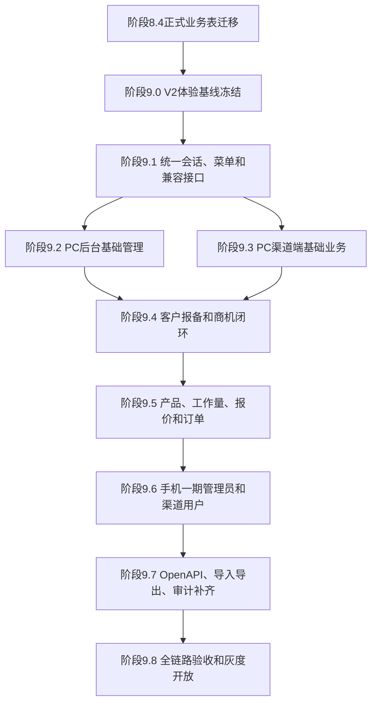

# 阶段9：V2业务体验完整迁入V3

生成日期：2026-07-27  
适用范围：联软总部及其渠道体系  
阶段定位：V3业务可用迁移阶段  
体验原则：V2用户体验基线不大改，V3承载架构全面升级

## 1. 已确认口径

| 编号 | 事项 | 确认结果 |
| --- | --- | --- |
| C9-01 | 功能范围 | 只迁移V2已有功能，新功能放到后续阶段 |
| C9-02 | 手机端基线 | 以V2一期 `mobile.html` 为准 |
| C9-03 | PC端体验 | 菜单、字段、流程保持一致，视觉允许轻微现代化 |
| C9-04 | 后台现有能力 | OpenAPI、工作量配置、导入导出等现有功能纳入阶段9首批范围，可按后台页面分批交付 |
| C9-05 | 密码策略 | V2密码不恢复，统一初始化默认密码，并进入强制改密或启用状态 |
| C9-06 | 第一验收闭环 | 客户报备、商机、报价、订单全链路优先 |

当前没有业务口径阻断项。阶段9可以开始做实施拆解和开发排期，但正式业务页面开发前必须先完成阶段8.4正式业务表落表。

## 2. 阶段9目标

阶段9不是重新设计一套新系统，而是把V2现有业务能力迁入V3，让用户在V3里继续按原习惯完成业务。

目标包括：

1. 保留V2主要菜单、页面名称、字段名称、按钮文案、弹窗流程和业务状态中文表达。
2. V3后端接管业务接口，使用PostgreSQL正式业务表、Redis、审计、权限和任务能力。
3. PC后台、PC渠道端、手机一期管理员、手机一期渠道用户都能完成既有业务。
4. 第一优先级完成“报备客户 -> 商机 -> 报价 -> 订单”闭环。
5. OpenAPI、工作量配置、导入导出、审计日志纳入阶段9首批大范围，但按风险分批上线。
6. 支持页面级、模块级、批次级回退开关。

## 3. 总体实施路线



## 4. 阶段8.4依赖

阶段9业务页面必须读取V3正式业务表，不能直接读 `migration.*` 暂存层。

阶段8.4必须先完成：

1. 账号、角色、组织、渠道商落入正式表。
2. 客户报备、商机、报价、订单落入正式表。
3. 产品目录、模块、功能、硬件、套餐、工作量规则落入正式表。
4. 审计日志或历史审计查询表落入正式表或归档查询表。
5. 导入导出任务记录和OpenAPI客户端记录完成初始化或重新签发策略。
6. 迁移结果满足数量守恒、关联完整、状态合法、金额一致。

阶段9开发可以先用测试数据和接口契约并行推进，但不能以测试数据替代阶段8.4迁移验收。

## 5. V2页面基线清单

### 5.1 PC后台管理端

来源：`frontend/admin-app.js`  
入口：`admin.html`

| 序号 | V2路由 | 页面名称 | 阶段9目标模块 | 首批要求 |
| --- | --- | --- | --- | --- |
| 1 | `/login` | 后台登录 | 认证 | 必须 |
| 2 | `/login/singlesignonlogin/login.do` | 后台SSO回调 | 认证 | 必须保留入口，实际可先走初始化账号 |
| 3 | `/dashboard` | 总览仪表盘 | 工作台 | 必须 |
| 4 | `/opportunity` | 商机管理 | 商机 | 第一闭环必做 |
| 5 | `/opportunity/new` | 新建商机 | 商机 | 第一闭环必做 |
| 6 | `/opportunity/import` | 商机导入 | 导入导出 | 首批后台能力 |
| 7 | `/registration` | 客户报备 | 报备 | 第一闭环必做 |
| 8 | `/registration/new` | 新建报备 | 报备 | 第一闭环必做 |
| 9 | `/registration/import` | 报备导入 | 导入导出 | 首批后台能力 |
| 10 | `/quote` | 报价管理 | 报价 | 第一闭环必做 |
| 11 | `/quote/new` | 新建报价 | 报价 | 第一闭环必做 |
| 12 | `/quote/edit/:id` | 编辑报价 | 报价 | 第一闭环必做 |
| 13 | `/order` | 订单管理 | 订单 | 第一闭环必做 |
| 14 | `/products` | 产品目录 | 产品 | 报价前置必做 |
| 15 | `/partner-report` | 经营报表 | 报表 | 首批可只读 |
| 16 | `/partners` | 渠道商管理 | 渠道 | 必须 |
| 17 | `/partners/import` | 渠道商导入 | 导入导出 | 首批后台能力 |
| 18 | `/partner-admin` | 企业管理员 | 账号与渠道 | 必须 |
| 19 | `/admin-review` | 审核中心 | 审批 | 第一闭环必做 |
| 20 | `/account-manage` | 账号管理 | 账号 | 必须 |
| 21 | `/account-manage/staff-import` | 员工导入 | 导入导出 | 首批后台能力 |
| 22 | `/audit-logs` | 操作日志 | 审计 | 首批后台能力 |
| 23 | `/openapi-integration` | OpenAPI对接 | 开放接口 | 首批后台能力 |
| 24 | `/workload-config` | 工作量配置 | 产品与报价 | 报价前置必做 |

PC后台阶段9按24个页面入口管理。

### 5.2 PC渠道端

来源：`frontend/partner-app.js`  
入口：`partner.html`

| 序号 | V2路由 | 页面名称 | 阶段9目标模块 | 首批要求 |
| --- | --- | --- | --- | --- |
| 1 | `/login` | 渠道登录 | 认证 | 必须 |
| 2 | `/login/singlesignonlogin/login.do` | 渠道SSO回调 | 认证 | 必须保留入口，实际可先走初始化账号 |
| 3 | `/dashboard` | 渠道仪表盘 | 工作台 | 必须 |
| 4 | `/opportunity` | 商机管理 | 商机 | 第一闭环必做 |
| 5 | `/opportunity/new` | 新建商机 | 商机 | 第一闭环必做 |
| 6 | `/registration` | 客户报备 | 报备 | 第一闭环必做 |
| 7 | `/registration/new` | 新建报备 | 报备 | 第一闭环必做 |
| 8 | `/quote` | 报价管理 | 报价 | 第一闭环必做 |
| 9 | `/quote/new` | 新建报价 | 报价 | 第一闭环必做 |
| 10 | `/quote/edit/:id` | 编辑报价 | 报价 | 第一闭环必做 |
| 11 | `/order` | 订单管理 | 订单 | 第一闭环必做 |
| 12 | `/products` | 产品目录 | 产品 | 报价前置必做 |

PC渠道端阶段9按12个页面入口管理。

### 5.3 手机一期渠道用户

来源：`frontend/mobile-app.js`  
入口：`mobile.html?scope=partner`

| 序号 | 路由状态 | 页面名称 | 首批要求 |
| --- | --- | --- | --- |
| 1 | `/partner/home` | 工作台 | 必须 |
| 2 | `/partner/opportunities` | 商机 | 第一闭环必做 |
| 3 | `/partner/opportunities/new` | 新建商机 | 第一闭环必做 |
| 4 | `/partner/opportunities/:id` | 商机详情 | 第一闭环必做 |
| 5 | `/partner/registrations` | 客户报备 | 第一闭环必做 |
| 6 | `/partner/registrations/new` | 新建报备 | 第一闭环必做 |
| 7 | `/partner/registrations/:id` | 报备详情 | 第一闭环必做 |
| 8 | `/partner/quotes` | 报价单 | 第一闭环必做 |
| 9 | `/partner/quotes/:id` | 报价详情 | 第一闭环必做 |
| 10 | `/partner/orders` | 订单 | 第一闭环必做 |
| 11 | `/partner/orders/:id` | 订单详情 | 第一闭环必做 |
| 12 | `/me` | 我的 | 必须 |

### 5.4 手机一期管理员

来源：`frontend/mobile-app.js`  
入口：`mobile.html?scope=admin`

| 序号 | 路由状态 | 页面名称 | 首批要求 |
| --- | --- | --- | --- |
| 1 | `/admin/home` | 工作台 | 必须 |
| 2 | `/admin/reviews` | 审核中心 | 第一闭环必做 |
| 3 | `/admin/business` | 业务查询 | 第一闭环必做 |
| 4 | `/admin/business/:id` | 业务详情 | 第一闭环必做 |
| 5 | `/admin/partners` | 渠道商 | 必须 |
| 6 | `/admin/partners/:id` | 渠道商详情 | 必须 |
| 7 | `/me` | 我的 | 必须 |

手机端阶段9以一期为准。`mobile-v2.html` 不作为阶段9首要体验基线，除非后续单独确认。

## 6. 用户体验不变原则

### 6.1 必须保持

1. 菜单分组和菜单名称保持V2。
2. 页面名称、字段中文名、状态中文名保持V2。
3. 核心按钮文案保持V2，例如新建、编辑、删除、审核通过、驳回、转订单、调整价格。
4. 列表筛选项、分页、详情弹窗、确认弹窗的业务流程保持V2。
5. 报备、商机、报价、订单之间的跳转关系保持V2。
6. PC后台和PC渠道端分入口保留。
7. 手机管理员和手机渠道用户按一期入口保留。

### 6.2 允许轻微现代化

1. 视觉间距、字号、颜色层级可优化，但不得改变业务入口位置。
2. 表格可升级为服务端分页表格，但字段顺序不应随意调整。
3. 表单校验可更清晰，但不能减少原有字段。
4. 错误提示可统一中文结构，并展示请求编号。
5. 加载态、空状态、无权限状态可按V3规范增强。

### 6.3 禁止事项

1. 不把V2多页业务压缩成一个“新工作台”。
2. 不把旧菜单重命名为新概念。
3. 不在阶段9加入公海池、线索池等新功能。
4. 不用前端假数据冒充迁移完成。
5. 不让前端传角色、区域、渠道商来决定权限。
6. 不直接复制V2单文件大脚本作为V3长期代码形态。

## 7. 前端设计

### 7.1 目录结构

```text
apps/web/src/
├── legacy-v2/
│   ├── baseline/
│   ├── styles/
│   └── route-map.ts
├── modules/
│   ├── auth/
│   ├── dashboard/
│   ├── registration/
│   ├── opportunity/
│   ├── quotation/
│   ├── order/
│   ├── catalog/
│   ├── partner/
│   ├── account/
│   ├── approval/
│   ├── audit/
│   ├── openapi/
│   ├── import-export/
│   └── workload/
├── layouts/
│   ├── admin-v2/
│   ├── partner-v2/
│   └── mobile-v1/
└── api/
    └── v2-compatible/
```

说明：

1. `legacy-v2`只放基线、路由映射和视觉变量，不放长期业务逻辑。
2. 每个业务模块按列表、详情、表单、操作弹窗拆分。
3. PC后台和PC渠道端共用业务组件，通过工作空间决定权限和动作。
4. 手机一期单独做轻量页面，不直接复用PC表格。

### 7.2 路由设计

V3内部可使用标准路径，但必须保留V2体验入口：

| V2入口 | V3承载路径 | 策略 |
| --- | --- | --- |
| `admin.html#/dashboard` | `/admin/dashboard` | 保留兼容跳转 |
| `partner.html#/dashboard` | `/partner/dashboard` | 保留兼容跳转 |
| `mobile.html?scope=partner#/partner/home` | `/mobile/partner/home` | 保留兼容跳转 |
| `mobile.html?scope=admin#/admin/home` | `/mobile/admin/home` | 保留兼容跳转 |

阶段9不强制用户立即记新地址，优先保证旧入口书签可跳转到对应V3页面。

### 7.3 页面开关

每个页面必须有开关：

```text
V3_PAGE_ADMIN_REGISTRATION=true
V3_PAGE_ADMIN_OPPORTUNITY=true
V3_PAGE_PARTNER_QUOTE=true
V3_PAGE_MOBILE_V1=true
```

如果某页面出现阻断问题，只关闭该页面，不回退整个V3。

## 8. 后端设计

### 8.1 兼容接口原则

V2旧接口路径保留，V3后端兼容层接管。

示例：

| 旧接口 | V3服务 |
| --- | --- |
| `GET /api/registrations` | 报备服务分页查询 |
| `POST /api/registrations` | 报备服务创建 |
| `PUT /api/registrations/:id/status` | 报备审核服务 |
| `GET /api/opportunities` | 商机服务分页查询 |
| `POST /api/opportunities` | 商机服务创建 |
| `POST /api/quotes` | 报价服务创建 |
| `GET /api/orders` | 订单服务分页查询 |
| `PUT /api/orders/:id/primary-confirm` | 订单一级确认服务 |

接口返回字段尽量兼容V2前端命名，内部领域模型可使用V3规范。

### 8.2 服务分层

```text
控制器层：接收V2兼容路径和V3标准路径
应用服务层：鉴权、幂等、事务、审计、事件
领域服务层：报备、商机、报价、订单状态机和金额计算
仓储层：PostgreSQL分页、索引、事务、锁
任务层：导入导出、通知、审计归档、重算任务
```

### 8.3 必须改掉的V2风险

1. 内存全量扫描改为PostgreSQL服务端分页。
2. 前端身份字段改为服务端会话身份。
3. 金额计算必须以服务端为准。
4. 状态变更必须走状态机和审计。
5. 写操作必须支持幂等键。
6. 导入导出必须任务化，不能阻塞API进程。

## 9. 数据设计

### 9.1 正式表模块

阶段9需要以下正式表域：

| 域 | 主要对象 |
| --- | --- |
| `iam` | 用户、角色、权限、会话、密码初始化状态 |
| `channel` | 渠道商、渠道员工、上下级关系、等级、区域 |
| `crm` | 客户报备、商机、跟进、审批、业务事件 |
| `quote` | 报价单、报价明细、报价快照、折扣审核 |
| `order` | 订单、订单明细、一级确认、调价、履约 |
| `catalog` | 分类、模块、功能、硬件、套餐、产品、工作量规则 |
| `audit` | 操作日志、登录日志、接口调用日志 |
| `integration` | OpenAPI客户端、权限、调用日志、密钥状态 |
| `job` | 导入导出任务、文件、执行结果 |

### 9.2 密码初始化

由于V2密码不可恢复，阶段9使用初始化密码策略：

1. 所有迁移用户生成初始化密码。
2. 首次登录标记为必须改密或必须激活。
3. 管理员可重置密码。
4. 密码散列只存V3安全散列，不保存明文。
5. 初始化密码交付方式必须线下或由管理员生成，不写入页面。

建议默认初始化密码由部署配置生成，不在代码中固定。

## 10. 分批实施计划

### 9.0 V2体验基线冻结

目标：把V2页面作为验收对照。

任务：

1. 启动V2本地只读环境。
2. 逐页截图PC后台24个入口。
3. 逐页截图PC渠道端12个入口。
4. 逐页截图手机一期管理员7个入口。
5. 逐页截图手机一期渠道用户12个入口。
6. 记录每页菜单、字段、按钮、筛选、弹窗、状态。
7. 生成页面到接口依赖矩阵。

交付物：

```text
docs/stage-records/阶段9.0-V2体验基线冻结记录.md
docs/stage-records/阶段9页面清单与接口矩阵.xlsx
output/stage9-baseline/
```

验收：

1. 页面数量无遗漏。
2. 第一闭环页面全部有截图。
3. 产品负责人确认“体感基线”。

### 9.1 会话、菜单和兼容接口底座

目标：真实账号登录后按V2菜单进入V3页面。

任务：

1. 统一后台、渠道、手机一期登录。
2. 初始化密码和首次改密策略。
3. 服务端返回用户工作空间、角色、菜单和按钮动作。
4. 保留V2旧路径兼容跳转。
5. 建立旧接口兼容层。
6. 接入审计请求编号。

验收：

1. 超级管理员、区域管理员、渠道管理员、渠道员工均可登录。
2. 各角色菜单与V2一致。
3. 无权限页面返回403且不展示数据。

### 9.2 PC后台基础管理

页面：

1. 总览仪表盘。
2. 账号管理。
3. 企业管理员。
4. 审核中心。
5. 操作日志。

任务：

1. 账号列表、启停、重置密码。
2. 企业管理员审核和状态维护。
3. 审核中心统一处理报备、渠道商、员工待办。
4. 操作日志筛选、详情和请求编号追踪。

验收：

1. 管理员能创建、停用、启用、重置账号。
2. 审核通过和驳回均产生审计。
3. 区域管理员看不到越权数据。

### 9.3 渠道体系管理

页面：

1. 渠道商管理。
2. 渠道商导入。
3. 渠道商详情。
4. 渠道员工。
5. 经营报表只读版。

任务：

1. 渠道商列表服务端分页。
2. 渠道商新增、编辑、删除、启停。
3. 渠道等级、区域、上下级关系。
4. 员工列表、新增、启停、重置密码。
5. 渠道导入模板、预览、执行。

验收：

1. 一级、二级渠道关系正确。
2. 渠道用户只能看本渠道及授权范围。
3. 导入失败有错误行和中文原因。

### 9.4 客户报备与商机

第一优先级闭环之一。

页面：

1. 客户报备列表。
2. 新建报备。
3. 报备导入。
4. 报备审核。
5. 商机列表。
6. 新建商机。
7. 商机导入。
8. 商机跟进和阶段推进。

任务：

1. 报备列表分页、搜索、状态筛选。
2. 企业查询、查重、提交。
3. 报备审核通过、驳回。
4. 商机从报备创建。
5. 商机跟进、预计签约时间、阶段推进。
6. 到期提醒和通知。

验收：

1. 新建客户报备成功。
2. 重复客户按V2规则提示或阻断。
3. 报备审核后可创建商机。
4. 商机跟进记录可追溯。

### 9.5 产品、工作量、报价和订单

第一优先级闭环核心。

页面：

1. 产品目录。
2. 工作量配置。
3. 报价列表。
4. 新建报价。
5. 编辑报价。
6. 订单列表。
7. 订单一级确认。
8. 订单调价。
9. 订单履约。

任务：

1. 产品分类、模块、功能、硬件、套餐。
2. 区域价、渠道价、阶梯价和工作量规则。
3. 报价服务端试算。
4. 报价确认、修改、删除。
5. 报价转订单。
6. 订单一级确认、驳回、调价、履约。

验收：

1. 报价金额服务端重算和V2固定样本一致。
2. 报价转订单成功。
3. 订单状态流转符合V2状态机。
4. 金额、折扣、产品明细无丢失。

### 9.6 PC渠道端完整迁移

页面：

1. 渠道仪表盘。
2. 客户报备列表和新建。
3. 商机列表和新建。
4. 报价列表、新建、编辑。
5. 订单列表。
6. 产品目录。

任务：

1. 保持V2渠道端菜单和页面体感。
2. 复用后台业务组件，但动作由服务端控制。
3. 渠道端不可见后台管理能力。
4. 二级渠道、一级渠道、渠道员工数据范围分离。

验收：

1. 渠道管理员可完成报备到订单闭环。
2. 渠道员工只看本人或授权数据。
3. 不出现其他渠道数据。

### 9.7 手机一期迁移

页面：

1. 手机渠道工作台。
2. 手机渠道客户、商机、报价、订单、我的。
3. 手机管理员工作台。
4. 手机管理员审核、业务查询、渠道、我的。

任务：

1. 以V2一期手机体验为准。
2. 保留底部导航和详情返回习惯。
3. 手机写操作先覆盖第一闭环必要动作。
4. 移动端接口走V3服务端权限。

验收：

1. 360×800、390×844视口无遮挡。
2. 手机渠道用户可查业务、建报备、跟进商机。
3. 手机管理员可审核报备。

### 9.8 OpenAPI、导入导出、审计补齐

页面：

1. OpenAPI对接。
2. 导入模板下载。
3. 导入预览。
4. 导入执行。
5. 导出。
6. 操作日志。

任务：

1. OpenAPI客户端列表、创建、停用、重签密钥。
2. 旧密钥不恢复，统一重新签发。
3. 导入导出任务化。
4. 审计日志全链路追踪。

验收：

1. 密钥只展示一次。
2. 导入任务失败可下载错误行。
3. OpenAPI调用日志脱敏。

### 9.9 全链路验收和灰度开放

验收顺序：

1. 超级管理员后台验证。
2. 区域管理员后台验证。
3. 渠道管理员PC端验证。
4. 渠道员工PC端验证。
5. 手机管理员验证。
6. 手机渠道用户验证。

核心闭环：

```text
新建客户报备
-> 报备审核通过
-> 新建商机
-> 商机跟进
-> 新建报价
-> 报价确认
-> 报价转订单
-> 一级确认
-> 履约
-> 审计追踪
```

## 11. 验收标准

### 11.1 页面体验验收

| 项目 | 标准 |
| --- | --- |
| 菜单 | 与V2页面基线一致 |
| 字段 | 与V2字段名称和必要字段一致 |
| 按钮 | 与V2主要按钮文案和流程一致 |
| 弹窗 | 确认、驳回、调价、转单弹窗流程一致 |
| 状态 | 中文状态名称一致 |
| 响应式 | PC和手机指定尺寸无遮挡 |

### 11.2 数据验收

| 项目 | 标准 |
| --- | --- |
| 数量 | 源记录数 = 成功落表数 + 批准隔离数 |
| 关联 | 报备、商机、报价、订单可互相追溯 |
| 金额 | 报价和订单固定样本逐分一致 |
| 权限 | 越权查询和越权操作均被服务端拒绝 |
| 审计 | 关键写操作都有审计记录 |

### 11.3 性能验收

| 场景 | 标准 |
| --- | --- |
| 列表分页 | 不拉全量数据 |
| 搜索筛选 | 使用PostgreSQL索引和分页 |
| 导入导出 | 后台任务执行，不阻塞API |
| 大数据量 | 支持几十万到百万客户规模扩展 |

## 12. 回退方案

| 层级 | 回退动作 | 触发条件 |
| --- | --- | --- |
| 页面级 | 关闭单页面开关 | 单页面阻断缺陷 |
| 模块级 | 关闭报备、商机、报价、订单等模块开关 | 模块内权限、金额或状态错误 |
| 工作空间级 | 关闭后台、渠道端或手机端入口 | 入口级系统性缺陷 |
| 发布级 | 回退上一镜像 | 大面积登录、路由、接口异常 |

回退不修改已迁移数据。涉及金额、权限、订单状态错误时优先冻结写入并保全审计。

## 13. 风险与控制

| 风险 | 控制措施 |
| --- | --- |
| 旧UI被重做导致用户不适应 | 以V2截图和页面清单作为验收标准 |
| 阶段8.4未完成导致页面空 | 阶段9页面只能读正式表，不读暂存表 |
| V2接口内存扫描无法承载大数据 | V3兼容接口底层必须服务端分页 |
| 密码不可恢复 | 初始化默认密码，首次登录强制改密 |
| OpenAPI密钥不可恢复 | 重新签发并记录通知 |
| 报价金额不一致 | 固定样本服务端重算，逐分校验 |
| 手机端范围扩大 | 阶段9只做一期，二期后续单独确认 |

## 14. 开工条件

阶段9正式开发前必须完成：

1. 阶段8.4正式业务表迁移方案和脚本包。
2. V2页面截图基线。
3. 第一闭环固定验收样本。
4. 初始化密码策略配置。
5. 页面开关和回退策略。
6. 旧接口兼容层任务拆分。

满足以上条件后，可以从阶段9.0开始执行。
