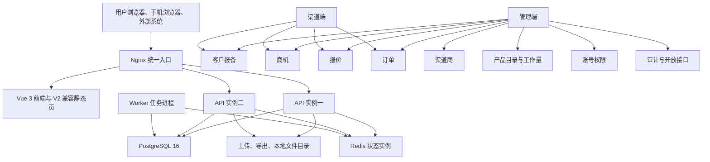
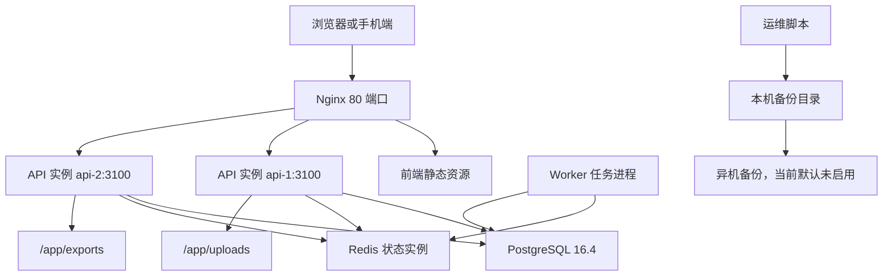

# 联软 CRM V3 项目接管说明

编写日期：2026-07-31  
适用仓库：`lianruan-crm-deploy-v3`  
编写方式：基于当前仓库源码、部署脚本、数据库迁移、阶段交付记录和你提供的交接图片提纲整理。  
重要说明：本次仅做仓库级接管梳理，没有登录生产服务器或 HexHub 在线环境做实时复核；涉及服务器账号、证书、域名、真实联系人、正式数据库现状的内容必须上线前再次确认。

## 目录

1. 第一章：项目整体概况
2. 第二章：业务详细说明书
3. 第三章：系统技术架构说明书
4. 第四章：源代码与项目工程说明
5. 第五章：部署与上线运维手册
6. 第六章：数据库专项文档
7. 第七章：接口与第三方集成专项
8. 第八章：测试验收与质量门禁
9. 第九章：安全权限与合规边界
10. 第十章：数据迁移、备份、灾备方案
11. 第十一章：配套交付资产清单
12. 第十二章：待办工作与交接事项确认表
13. 附录：V2 遗留内容清单

## 接管结论

V3 是在 V2 业务体验基础上做工程化、数据库化、部署化改造的 CRM 系统。当前仓库真实形态是“V3 工程化工作区 + V2 迁移兼容层”的主线状态，旧版 V2 静态前端、旧后端、旧升级包和旧启动脚本已从主线清理。

已落地能力包括：登录与交付账号、统一入口、管理端、渠道端、手机端一期、客户报备、报备审批、商机、报价、订单、渠道商、产品目录、账号、通知、审批、审计、OpenAPI、工作量配置、V2 数据迁移、PostgreSQL 正式业务表、Redis 队列底座、单机 Docker Compose 离线部署包。

需要接手时重点注意三件事：

1. 根目录 `README.md` 已改为 V3 主线说明，V2 旧部署说明不再作为接管依据。
2. 根 `package.json` 当前版本是 `3.0.0-stage9.20260727`，但交付记录和离线包已出现 `3.0.0-stage9.20.20260729`、`3.0.0-stage9.21.20260729`、`3.0.0-stage9.22.20260730`，源码默认版本、部署默认版本和离线包版本存在不一致，需要正式发布前统一。
3. `apps/web/public/` 中的正式业务页面仍是 V3 当前入口资产；`database/mapping`、`scripts/migration`、`apps/api/src/v2-compat-routes.ts` 等迁移兼容资产必须保留。

## 第一章：项目整体概况

### 1.1 项目建设背景与立项初衷

项目目标是把 V2 的渠道 CRM 从“单文件后端 + 静态前端 + SQLite/旧数据形态”升级为可维护、可测试、可部署、可迁移、可恢复的 V3 系统。

从现有文档和代码看，V2 的主要痛点包括：

| V2 痛点 | V3 处理方向 | 当前落地情况 |
| --- | --- | --- |
| 后端 `backend/server.js` 单文件过长，业务耦合高 | 在 `apps/api` 建立 TypeScript 接口工程 | 已落地，但业务服务仍集中在 `business-store.ts`，还未按领域彻底拆分 |
| 前端为静态页面和超长脚本 | 在 `apps/web` 建立 Vue 3、Vite、路由、状态管理 | 已落地，同时 `public` 下仍保留 V2 静态资产 |
| SQLite 与内存对象不适合多实例和大数据 | PostgreSQL 16 作为唯一业务事实来源 | 数据库迁移和正式表已落地 |
| 本地会话、明文密码、旧密钥风险 | 交付登录、密码散列、OpenAPI 密钥重签 | 已部分落地，正式账号和强制改密仍需确认 |
| 发布、回退、备份缺乏生产化约束 | 单机离线 Docker Compose 部署包 | 已落地，异机备份和 HTTPS 未完成 |

V3 的定位不是新业务重做，而是“V2 已有业务体验迁入 V3”。公海池、复杂工作流、多租户、微服务、实时双写等内容均不在当前阶段范围内。

### 1.2 项目业务范围与使用部门

已覆盖的使用人群和入口：

| 使用人群 | 入口 | 说明 |
| --- | --- | --- |
| 超级管理员、产品交付验收账号 | `/login`、`/unified`、`/admin` | 统一入口、管理端、平台管理中心 |
| 区域管理员、总部管理人员 | `/admin` | 客户报备、商机、报价、订单、渠道、账号、审核、审计 |
| 渠道管理员、渠道员工 | `/partner` | 渠道报备、商机、报价、订单、产品目录 |
| 手机端渠道用户和管理用户 | `/mobile` | 手机一期工作台、报备、商机、报价、订单、审核 |
| 外部系统调用方 | `/api/open/v1` | OpenAPI 资源访问，正式对接前需重新签发密钥 |

内部使用部门在代码仓库中没有真实组织名称和负责人联系方式。现有资料只写了“联软总部及渠道体系”，实际使用部门、业务代表和验收签字人需要补齐。

### 1.3 项目整体功能模块总图



核心业务模块：

| 模块 | 当前状态 | 主要源码 |
| --- | --- | --- |
| 登录与会话 | 已落地交付登录、数据库用户登录兜底 | `apps/api/src/auth-routes.ts`、`apps/web/src/stores/session.ts` |
| 统一入口 | 已落地统计、待办、最近业务、迁移状态 | `apps/web/src/pages/BusinessWorkspacePage.vue` |
| 客户报备 | 已落地列表、详情、创建、状态更新 | `apps/api/src/business-routes.ts`、`business-store.ts` |
| 商机 | 已落地列表、创建、更新、跟进入口 | 同上 |
| 报价 | 已落地报价试算、创建、状态更新、转单链路 | 同上、`ipg-pricing.ts` |
| 订单 | 已落地创建、状态更新、一级确认、驳回 | 同上 |
| 渠道商 | 已落地列表、详情、V2 兼容资料接口 | `v2-compat-routes.ts` |
| 产品目录 | 已落地功能、硬件、套餐、产品树口径 | `business-store.ts` |
| 工作量配置 | 已落地映射和交付规则维护接口 | `business-store.ts`、阶段9迁移 SQL |
| OpenAPI | 已落地客户端、密钥、令牌、日志、资源查询 | `business-routes.ts`、`business-store.ts` |
| 导入导出 | 有 V2 兼容导入模板和任务查询 | `v2-compat-routes.ts`、`ops.import_export_tasks` |
| Worker | 已落地健康任务队列底座 | `apps/worker/src/*` |

### 1.4 项目当前状态

| 项目 | 当前判断 |
| --- | --- |
| 仓库分支 | `main` |
| 根包版本 | `3.0.0-stage9.20260727` |
| 最新交付记录 | 阶段9.20 等价最终交付、阶段9.21 热修复记录、阶段9.22 离线包和发布脚本存在 |
| 测试环境记录 | HexHub「渠道CRM（新架构）」，`http://10.20.3.10/login` |
| 试运行状态 | 文档显示可进入用户人工验收和试运行确认 |
| 稳定性 | 既有验收通过，但本次未实时访问服务器复核 |
| 已知高频问题 | V2 遗留页面、版本号不统一、正式域名证书缺失、异机备份未启用 |

当前工作区已有未提交改动：

| 文件 | 说明 |
| --- | --- |
| `deploy/single-server/compose/docker-compose.yml` | 已被修改，本次未覆盖 |
| `deploy/single-server/config/deploy.env.example` | 已被修改，本次未覆盖 |
| `deploy/single-server/scripts/install.sh` | 已被修改，本次未覆盖 |

### 1.5 项目联系人清单

仓库内只有职责占位，没有真实姓名、电话、邮箱、签字记录。

| 角色 | 当前资料状态 | 需要补充 |
| --- | --- | --- |
| 甲方业务负责人 | 未找到真实联系人 | 姓名、电话、邮箱、验收权限 |
| 使用方对接人 | 未找到真实联系人 | 管理端、渠道端、手机端各自对接人 |
| 第三方厂商 | OpenAPI 和统一身份相关资料存在，但调用方未确认 | 调用方名称、应用编号、IP 白名单、密钥重签联系人 |
| 服务器服务商 | 未找到真实联系人 | 主机厂商、账号托管人、续费时间 |
| 原开发团队 | 多份文档写“Codex临时承担” | 实际开发负责人和交接确认 |
| 运维负责人 | 文档显示待任命 | 运维联系人、值班电话、应急群 |

## 第二章：业务详细说明书

### 2.1 总体业务主链路


已自动化验收的主链路为：

1. 管理员登录。
2. 创建客户报备。
3. 审核客户报备通过。
4. 创建商机。
5. 报价工作量试算。
6. 创建报价。
7. 审核报价。
8. 报价转订单。
9. 订单一级确认。

阶段9.20 远端验收记录中，业务闭环已通过，留存路径为 `output/hexhub-stage9-20/业务闭环验收-2026-07-29T091629163Z.json`。

### 2.2 一级模块业务流程

#### 客户报备

| 环节 | 说明 | 当前代码状态 |
| --- | --- | --- |
| 新建报备 | 提交客户名称、统一社会信用代码、联系人、渠道、负责人等 | 已落地 |
| 查重和客户归一化 | 数据库侧有 `crm.customers.normalized_name`，代码会创建或复用客户 | 已落地基础逻辑 |
| 报备审核 | 支持状态更新，并同步审批待办 | 已落地 |
| 转商机 | 商机创建时可关联通过的报备 | 已落地 |
| 事件留痕 | `crm.registration_events`、`ops.approvals`、`audit.audit_logs` | 数据表已落地，代码部分写入 |

#### 商机

| 环节 | 说明 | 当前代码状态 |
| --- | --- | --- |
| 新建商机 | 可从报备创建，保存客户、渠道、负责人、金额、阶段等 | 已落地 |
| 阶段管理 | 文档要求保留 V2 状态中文表达 | 已落地基础映射 |
| 跟进记录 | `crm.opportunity_followups` 存储跟进内容 | 已有写入入口 |
| 关联报价 | 报价创建可选择商机 | 已落地 |

#### 报价

| 环节 | 说明 | 当前代码状态 |
| --- | --- | --- |
| 报价试算 | 根据端点数、软件功能、硬件、套餐计算金额和工作量 | 已落地 |
| IPG 报价预览 | `/api/ipg/quote-preview` 和 V2 兼容入口存在 | 已落地 |
| 新建报价 | 写入 `crm.quotes`、`crm.quote_items` | 已落地 |
| 状态更新 | 支持报价状态更新、确认、转单相关接口 | 已落地 |
| 工作量快照 | 报价保存工作量试算结果 | 已落地 |

#### 订单

| 环节 | 说明 | 当前代码状态 |
| --- | --- | --- |
| 报价转订单 | 通过报价生成订单和订单明细 | 已落地 |
| 一级确认 | `/orders/:id/primary-confirm` 和移动端转单入口存在 | 已落地 |
| 驳回和状态更新 | 支持订单状态更新和驳回 | 已落地 |
| 历史留痕 | `crm.order_status_history` | 表已落地，代码需继续复核完整性 |

#### 渠道与账号

| 环节 | 说明 | 当前代码状态 |
| --- | --- | --- |
| 渠道商主档 | 渠道名称、区域、城市、级别、联系人 | 已迁移到 `channel.partners` |
| 渠道层级 | 一级、二级、无层级等 V2 规则 | V2 遗留和 V3 迁移资料均存在 |
| 渠道简介 | 阶段9.21 修复过简介加载和地市校验 | 已有热修复记录 |
| 用户账号 | `iam.users`、密码散列、角色关系 | 已落地 |
| 统一初始化密码 | 迁移用户默认 `LrCRM@2026!` | 交付环境使用，正式需强制改密 |

#### 产品与工作量

| 环节 | 说明 | 当前代码状态 |
| --- | --- | --- |
| 产品功能 | `catalog.product_features` | 已落地 |
| 硬件产品 | `catalog.hardware_products` | 已落地 |
| 产品套餐 | `catalog.product_packages`、`catalog.package_items` | 已落地 |
| 价格规则 | `catalog.price_rules` | 表已落地 |
| 工作量映射 | `catalog.workload_mappings` | 已落地维护接口 |
| 交付工作量规则 | `catalog.delivery_workload_rules` | 已落地维护接口 |

### 2.3 字段业务含义

关键字段从代码和数据库文档可确认如下：

| 领域 | 关键字段 | 说明 |
| --- | --- | --- |
| 通用记录 | `id`、`编号`、`类型`、`标题`、`状态`、`状态名称`、`创建时间`、`更新时间` | 前端统一列表使用的标准展示字段 |
| 客户 | `customer_name`、`normalized_name`、`credit_code` | 客户主档与查重归一化 |
| 报备 | `registration_no`、`customer_id`、`partner_id`、`owner_user_id`、`region_id`、`status_code` | 报备主链路字段 |
| 商机 | `opportunity_no`、`stage_code`、`expected_amount`、`registration_id` | 商机阶段和金额字段 |
| 报价 | `quote_no`、`opportunity_id`、`total_amount`、`workload_snapshot` | 报价金额和工作量快照 |
| 订单 | `order_no`、`quote_id`、`total_amount`、`status_code` | 转单与履约状态 |
| 渠道 | `partner_name`、`partner_level_code`、`region_id`、`city_name` | 渠道主档和层级 |
| 用户 | `username`、`display_name`、`status_code`、`role_code` | 登录、展示、权限判断 |
| 开放接口 | `app_key`、`secret_hash`、`allowed_resources`、`ip_whitelist` | OpenAPI 客户端认证和授权 |

字段缺口：

1. 页面字段与数据库字段的一一对应表有部分资料，但未在一份最终交接表中收口。
2. 禁止手动修改字段清单未单独成文；目前只能从代码校验、数据库约束和业务文档推断。
3. 财务金额、折扣、维保、工作量规则需要业务负责人最终确认样本。

### 2.4 审批流配置规则

已知审批规则：

| 审批类型 | 当前依据 | 状态 |
| --- | --- | --- |
| 客户报备审核 | `ops.approvals`、`crm.registration_events`、业务状态更新接口 | 已落地 |
| 渠道、员工审批 | V2 兼容层和旧前端资料中存在 | 部分落地，需按 V3 页面复核 |
| 报价、订单审批 | V2 资料和 V3 主链路中有处理 | 需补完整状态机说明 |
| 抄送规则 | 未找到独立配置 | 待补齐 |
| 超时自动处理 | 未找到可运行任务 | 待补齐 |
| 驳回重提规则 | 旧功能资料存在，V3 需按接口逐项验收 | 待补齐 |

### 2.5 业务特殊规则、硬性约束、合规要求

| 规则 | 当前状态 |
| --- | --- |
| V3 只迁移 V2 已有功能，不新增公海池 | 已明确 |
| V2 密码不恢复，迁移后初始化新密码 | 已明确 |
| OpenAPI 旧密钥不恢复，正式对接前重新签发 | 已明确 |
| 金额使用数据库 `numeric`，不使用浮点数作为业务事实 | 数据库已按规则设计 |
| PostgreSQL 是唯一业务事实来源，Redis 不保存不可重建业务数据 | 架构文档明确 |
| 数据库变更前必须备份，回退不自动回滚业务数据 | 部署文档明确 |
| 单机部署不能承诺整机高可用 | 文档明确 |
| HTTPS 和正式域名上线前必须补齐 | 文档明确 |

### 2.6 常见业务操作步骤

管理员日常操作：

1. 访问 `/login` 或部署环境中的 `/login.html`。
2. 登录后进入 `/unified`。
3. 从管理端进入客户报备、商机、报价、订单、渠道商、账号、审核中心、审计日志等页面。
4. 报备主链路按“新建报备、审核通过、创建商机、报价试算、创建报价、报价转订单、订单确认”执行。
5. OpenAPI 客户端在平台管理或开放接口页面创建，密钥只在创建或重置时展示一次。
6. 工作量配置在管理端工作量配置页面维护产品映射和交付规则。

运维常见操作：

1. 部署前执行离线包校验。
2. 安装后执行数据库迁移。
3. 执行健康检查。
4. 上线前手动备份。
5. 发布失败时执行应用配置和镜像回退，不自动回滚数据库。

## 第三章：系统技术架构说明书

### 3.1 整体架构拓扑图



### 3.2 技术栈明细

| 层级 | 当前实际技术 | 说明 |
| --- | --- | --- |
| 运行时 | Node.js 22、npm 10 | 根包要求 `node >=22 <23`、`npm >=10 <11` |
| 后端 | TypeScript、Express 5、`pg`、`ioredis`、`multer`、`xlsx` | API 工程在 `apps/api` |
| 前端 | Vue 3、Vite、Element Plus、Pinia、Vue Router | 前端工程在 `apps/web` |
| 任务 | BullMQ、Redis、Zod | 当前只有健康任务底座 |
| 数据库 | PostgreSQL 16.4 | 业务正式表、迁移暂存、审计和开放接口 |
| 缓存与队列 | Redis 7.2.5 | 生产编排拆为 `redis-state` 和 `redis-cache` |
| 部署 | Docker、Docker Compose、Nginx | 单机离线包 |
| 测试 | Vitest、Supertest、Playwright | 单元、接口、浏览器巡检 |
| 契约 | OpenAPI 3.1 资产 | `packages/contracts` |

规划但当前源码未实际接入或未完整落地的组件：

| 规划项 | 文档位置 | 当前实际情况 |
| --- | --- | --- |
| Kysely | 架构文档写为目标数据访问层 | `package.json` 未依赖，源码直接使用 `pg` 和 SQL |
| Pino | 架构文档写为日志方案 | 当前是自定义 JSON 日志器 |
| Prometheus、Grafana、Alertmanager | 架构文档写为监控告警目标 | 当前部署包未包含 |
| Loki、Promtail | 架构文档写为日志汇总目标 | 当前部署包未包含 |
| pgBackRest | 架构文档写为数据库备份目标 | 当前备份脚本使用 `pg_dump` |
| HTTPS 自动配置 | 架构和上线要求中提到 | 当前 Nginx 只监听 HTTP 80 |

### 3.3 环境划分与用途

| 环境 | 当前资料状态 |
| --- | --- |
| 本地开发环境 | `deploy/local-dev/docker-compose.yml` 提供 PostgreSQL 和 Redis |
| 测试验证环境 | HexHub `10.20.3.10`，文档显示已多轮部署验收 |
| 预发布环境 | 仓库未找到独立预发布环境配置 |
| 正式生产环境 | 只有生产部署文档和单机离线部署包，真实服务器信息待确认 |

本地开发默认端口：

| 服务 | 地址 |
| --- | --- |
| 前端开发服务 | `http://127.0.0.1:5173` |
| API 服务 | `http://127.0.0.1:3100` |
| PostgreSQL | `127.0.0.1:5432` |
| Redis | `127.0.0.1:6379` |

### 3.4 网络架构

生产编排使用三个网络：

| 网络 | 作用 |
| --- | --- |
| `app_net` | Nginx 与 API 实例通信 |
| `data_net` | API、Worker、PostgreSQL、Redis 内部通信 |
| `maintenance_net` | PostgreSQL 维护访问 |

当前 `deploy.env.example` 中 `POSTGRES_BIND_HOST=0.0.0.0`，会把 PostgreSQL 发布到宿主机所有网卡的 `15432` 端口。正式上线前必须结合防火墙、来源 IP 白名单或改为 `127.0.0.1`、内网地址进行确认。

## 第四章：源代码与项目工程说明

### 4.1 代码仓库与分支

| 项目 | 当前值 |
| --- | --- |
| 当前分支 | `main` |
| 最近提交 | `d08adea 更新 V3 内容并补充 GitHub 操作说明` |
| 根包名 | `lianruan-crm-v3` |
| 根包版本 | `3.0.0-stage9.20260727` |
| 包管理 | npm 工作区 |

分支管理规范在文档中有阶段分支记录，但当前仓库未看到仍在使用的完整 Git Flow 规则。建议后续按“生产分支、开发分支、热修复分支”重新确认。

### 4.2 项目目录结构拆解

| 路径 | 作用 | 接管建议 |
| --- | --- | --- |
| `apps/api` | V3 后端接口服务 | 主维护入口 |
| `apps/web` | V3 前端工程 | 主维护入口 |
| `apps/worker` | V3 任务进程 | 当前任务能力较轻，后续需扩展 |
| `packages/config` | 环境变量读取与校验 | 主维护入口 |
| `packages/shared` | 标准响应、错误、健康状态 | 主维护入口 |
| `packages/contracts` | OpenAPI 契约与生成类型 | 主维护入口 |
| `database/migrations` | PostgreSQL 迁移 SQL | 上线关键资产 |
| `database/mapping` | V2 到 V3 映射和数据质量规则 | 迁移关键资产 |
| `deploy/local-dev` | 本地 PostgreSQL、Redis | 开发验证 |
| `deploy/single-server` | 单机离线部署包资产 | 生产部署关键资产 |
| `scripts` | 验证、迁移、部署、历史修复脚本 | 需要区分 V3 与 V2 脚本 |
| `tests` | 阶段验收和遗留契约测试 | 质量门禁 |
| `docs` | 阶段文档、用户手册、部署文档 | 交接资料 |
| `backend` | V2 后端遗留 | 只读参考，不作为 V3 主开发入口 |
| `frontend` | V2 前端遗留 | 只读参考，不作为 V3 主开发入口 |
| `apps/web/public` | V2 静态页面和兼容资产 | 需逐步清理或明确保留期限 |
| `tmp`、`output` | 构建包、迁移包、验收截图和日志 | 大多为过程资产，发布前需清点归档 |

### 4.3 环境配置文件说明

| 文件 | 作用 | 注意事项 |
| --- | --- | --- |
| `.env.example` | 本地开发默认变量 | 默认健康检查为模拟模式 |
| `deploy/single-server/config/v3.env.template` | 生产应用环境模板 | 含交付账号配置、数据库、Redis、会话密钥占位 |
| `deploy/single-server/config/deploy.env.example` | 部署变量模板 | 当前存在数据库端口开放配置，需确认 |
| `deploy/single-server/config/nginx/default.conf` | Nginx 入口和反向代理 | 当前 `/login` 会跳到 `/login.html` |

禁止提交到仓库的内容：

1. 正式 `v3.env`。
2. 数据库密码、Redis 密码、会话密钥。
3. OpenAPI 正式密钥。
4. 生产数据库、日志、备份包。
5. 真实客户敏感导出文件。

### 4.4 本地启动步骤

本地完整开发建议：

```bash
npm ci
docker compose -f deploy/local-dev/docker-compose.yml up -d
npm run dev
```

常用命令：

```bash
npm run check
npm test
npm run test:e2e
npm run build
npm run verify
```

说明：

1. `npm run verify` 会准备 PostgreSQL 测试库、执行格式检查、静态检查、测试、浏览器测试、生产构建和产物扫描。
2. `scripts/prepare-postgresql-test.mjs` 依赖 `tmp/stage8/v2-postgres-staging-official` 暂存包目录。
3. 没有 Docker 或本地 PostgreSQL、Redis 时，完整验证会失败。

### 4.5 打包发布命令

构建离线包流程参考：

```bash
npm ci
npm run verify
deploy/single-server/scripts/download-runtime.sh
V3_IMAGE_TAG=目标版本 deploy/single-server/scripts/build-images.sh
V3_IMAGE_TAG=目标版本 V3_SKIP_PULL=1 deploy/single-server/scripts/save-images.sh
V3_IMAGE_TAG=目标版本 V3_PACKAGE_FORMAT=zip deploy/single-server/scripts/package-offline.sh
```

当前已存在多个离线包，最新可见包为：

```text
tmp/phase7-package/lianruan-crm-v3-offline-3.0.0-stage9.22.20260730.zip
```

但根源码默认版本仍是 `3.0.0-stage9.20260727`，发布前必须统一源码版本、镜像标签、部署模板、交付说明和校验值。

### 4.6 第三方依赖总版本

关键依赖：

| 依赖 | 版本范围 |
| --- | --- |
| Node.js | `>=22 <23` |
| npm | `>=10 <11` |
| TypeScript | `^5.8.3` |
| Express | `^5.1.0` |
| Vue | `^3.5.18` |
| Vite | `^6.3.5` |
| Element Plus | `^2.10.5` |
| PostgreSQL 镜像 | `16.4-alpine` |
| Redis 镜像 | `7.2.5-alpine` |
| BullMQ | `^5.56.0` |
| Playwright | `^1.54.2` |

私有依赖仓库地址未在仓库中发现。当前 `.npmrc` 未看到明显私服配置，生产离线包主要依赖已打入镜像和离线资产。

## 第五章：部署与上线运维手册

### 5.1 各环境服务器资源清单

| 环境 | 服务器信息 | 当前资料状态 |
| --- | --- | --- |
| HexHub 测试验证 | `10.20.3.10` | 文档多次记录，未实时验证 |
| 正式生产 | openEuler x86_64 单机，建议 12 核、32GB 或更高 | 真实 IP、账号、磁盘、到期时间未确认 |
| 备用服务器 | 文档要求预留 | 当前没有已启用备用服务器 |

截图提纲要求的服务器资源清单需要补齐：

| 项目 | 当前情况 |
| --- | --- |
| 服务器 IP | 测试环境有，生产环境缺失 |
| 系统版本 | 目标为 openEuler x86_64，真实生产版本缺失 |
| CPU、内存、磁盘 | 建议值有，真实值缺失 |
| 登录方式 | 未找到 SSH 密钥、堡垒机、密码托管信息 |
| 服务器用途 | 单机承载 Nginx、API、Worker、PostgreSQL、Redis |

### 5.2 完整部署步骤

生产服务器部署：

```bash
sha256sum -c lianruan-crm-v3-offline-目标版本.zip.sha256
unzip -q lianruan-crm-v3-offline-目标版本.zip
cd lianruan-crm-v3-offline-目标版本
sudo SERVER_HOST=服务器IP ./scripts/install-all.sh
sudo /opt/lianruan-crm-v3/scripts/migrate-db.sh
sudo /opt/lianruan-crm-v3/scripts/health-check.sh
```

部署脚本会完成：

1. 安装前检测。
2. 安装或复用 Docker。
3. 安装 Docker Compose。
4. 创建 `/opt/lianruan-crm-v3` 目录结构。
5. 生成 PostgreSQL、Redis、会话密钥。
6. 加载离线镜像。
7. 写入生产配置。
8. 启动 Nginx、双 API、Worker、PostgreSQL、Redis。
9. 执行健康检查。
10. 记录安装日志。

### 5.3 日常发布流程

建议流程：

1. 明确发布版本和变更清单。
2. 在本地或构建机执行 `npm run verify`。
3. 生成离线包和校验文件。
4. 上传到目标服务器并校验 SHA256。
5. 发布前执行手工备份。
6. 加载新镜像。
7. 更新配置和镜像标签。
8. 启动服务。
9. 执行数据库迁移。
10. 执行健康检查。
11. 执行业务冒烟。
12. 留存发布日志和验收记录。

### 5.4 紧急回滚方案

当前回退脚本：

```bash
sudo /opt/lianruan-crm-v3/scripts/rollback.sh --dry-run
sudo /opt/lianruan-crm-v3/scripts/rollback.sh --to 版本号
```

边界：

1. 脚本只回退应用镜像和配置。
2. 脚本不自动回滚 PostgreSQL 数据。
3. 发生数据库结构或业务数据问题时，应优先从备份恢复到隔离环境复核，再决定前进修复或重大故障回退。
4. V3 已产生新增业务数据后，不能简单切回 V2，否则会造成新数据丢失。

### 5.5 定时任务清单

| 任务 | 当前状态 | 说明 |
| --- | --- | --- |
| Worker 健康任务 | 已有队列底座 | `v3-health` 队列，只做无副作用健康任务 |
| 导入任务 | 表和兼容接口存在 | 未看到完整 BullMQ 业务任务接入 |
| 导出任务 | 表和兼容接口存在 | 未看到完整 BullMQ 业务任务接入 |
| 过期清理 | 数据表有设计 | 未看到生产定时脚本 |
| 数据同步 | V2 到 V3 迁移脚本存在 | 不是常规实时同步 |
| 自动备份 | 旧 V2 脚本有 crontab，V3 单机脚本主要是手工备份 | V3 正式自动备份策略待补 |

### 5.6 日志管理

生产建议日志位置：

| 类型 | 路径 |
| --- | --- |
| 安装日志 | `/opt/lianruan-crm-v3/logs/install/` |
| Nginx 日志 | `/opt/lianruan-crm-v3/logs/nginx/` |
| API 实例一日志 | `/opt/lianruan-crm-v3/logs/api-1/` |
| API 实例二日志 | `/opt/lianruan-crm-v3/logs/api-2/` |
| Worker 日志 | `/opt/lianruan-crm-v3/logs/worker/` |
| PostgreSQL 日志 | `/opt/lianruan-crm-v3/logs/postgres/` |
| 发布和验收留存 | `output/`、`tmp/phase7-package/` |

当前缺口：

1. 日志保留天数、切割策略、压缩策略未统一落地。
2. 日志集中检索未落地。
3. 告警关键字和告警渠道未确认。

## 第六章：数据库专项文档

### 6.1 数据库连接信息

生产编排默认：

| 项目 | 值 |
| --- | --- |
| 数据库 | PostgreSQL |
| 镜像 | `postgres:16.4-alpine` |
| 库名 | `lianruan_crm_v3` |
| 用户 | `lianruan_app` |
| 容器内端口 | `5432` |
| 宿主机发布端口 | 默认 `15432` |
| 密码 | 由安装脚本生成，存放在 `/opt/lianruan-crm-v3/secrets/postgres_password` |
| 字符集 | PostgreSQL 默认编码，文档未单独指定 |
| 排序规则 | 仓库未找到生产排序规则说明 |

本地开发默认：

| 项目 | 值 |
| --- | --- |
| 地址 | `127.0.0.1:5432` |
| 库名 | `lianruan_crm_v3` |
| 用户 | `lianruan` |
| 密码 | `lianruan_dev_password` |

### 6.2 数据库账号权限划分

当前生产编排只看到一个应用用户 `lianruan_app`。架构文档要求应用、迁移、备份、监控分别授权，但当前 Compose 和脚本中未看到独立账号落地。

建议上线前补齐：

1. 应用账号。
2. 迁移账号。
3. 备份账号。
4. 只读查询账号。
5. 监控账号。
6. DBA 管理账号托管规则。

### 6.3 核心数据表结构说明

已设计和落地的 schema：

| schema | 业务域 |
| --- | --- |
| `migration` | 迁移版本、批次、暂存、映射、错误、校验 |
| `iam` | 用户、密码、身份、角色、权限 |
| `org` | 区域、组织、员工画像 |
| `channel` | 渠道商、渠道关系、成员、画像 |
| `catalog` | 产品、硬件、套餐、价格、工作量 |
| `crm` | 客户、报备、商机、报价、订单 |
| `ops` | 通知、审批、文件、导入导出、幂等、发件箱 |
| `integration` | OpenAPI 客户端、密钥、权限、访问日志 |
| `audit` | 审计日志 |

关键业务表：

| 模块 | 表 |
| --- | --- |
| 用户 | `iam.users`、`iam.password_credentials`、`iam.roles`、`iam.user_roles` |
| 渠道 | `channel.partners`、`channel.partner_relations`、`channel.partner_members` |
| 产品 | `catalog.product_features`、`catalog.hardware_products`、`catalog.product_packages`、`catalog.price_rules` |
| 工作量 | `catalog.workload_classifications`、`catalog.workload_mappings`、`catalog.workload_rules`、`catalog.delivery_workload_rules` |
| CRM | `crm.customers`、`crm.registrations`、`crm.opportunities`、`crm.quotes`、`crm.orders` |
| 运营 | `ops.notifications`、`ops.approvals`、`ops.import_export_tasks` |
| 集成 | `integration.open_api_clients`、`integration.open_api_client_secrets`、`integration.open_api_permissions` |
| 审计 | `audit.audit_logs` |

### 6.4 初始化脚本和历史增量脚本

迁移文件：

| 文件 | 作用 |
| --- | --- |
| `20260723_S2_001_基础扩展与迁移框架.sql` | schema 和迁移框架 |
| `20260723_S2_002_账号组织渠道.sql` | 用户、组织、渠道 |
| `20260723_S2_003_产品价格工作量.sql` | 产品、价格、工作量 |
| `20260723_S2_004_业务主链路.sql` | 客户、报备、商机、报价、订单 |
| `20260723_S2_005_审计开放接口任务.sql` | 审计、OpenAPI、通知、审批、任务 |
| `20260723_S2_006_迁移暂存与校验.sql` | V2 暂存和校验 |
| `20260727_S8_001_迁移暂存装载增强.sql` | 阶段8暂存增强 |
| `20260727_S8_004_正式业务表落表.sql` | V2 暂存到正式业务表 |
| `20260728_S9_013_工作量映射维护.sql` | 工作量映射维护补齐 |
| `20260729_S9_014_V2等价兼容补齐.sql` | V2 等价兼容补齐 |

### 6.5 数据备份策略

当前 V3 单机备份脚本：

```bash
sudo /opt/lianruan-crm-v3/scripts/backup.sh --type manual
sudo /opt/lianruan-crm-v3/scripts/backup.sh --dry-run
```

备份内容：

1. PostgreSQL 逻辑备份 `postgres.sql`。
2. 上传文件 `uploads.zip`。
3. 导出文件 `exports.zip`。
4. 配置摘要 `config-summary.txt`。
5. 校验文件 `sha256sum.txt`。

当前缺口：

1. 异机备份默认未启用。
2. 持续归档和恢复点目标未落地。
3. 自动恢复演练未作为 V3 脚本闭环。
4. 备份保留周期未在 V3 单机脚本中固化。

### 6.6 禁止执行的高危 SQL

上线前应纳入审批和备份的操作：

1. 删除表、删除列、截断表。
2. 无条件更新核心业务表。
3. 无备份修改金额、状态、角色、区域、渠道关系。
4. 手工修改 `migration.schema_migrations`。
5. 直接修改密码散列和 OpenAPI 密钥散列。
6. 跳过应用服务直接写入订单、报价、审批状态。
7. 生产库上长时间锁表建索引。

### 6.7 数据同步规则

当前策略是 V2 停写后做全量迁移，不做 V2 与 V3 实时双写。

迁移方向：

```text
V2 SQLite 一致性快照 -> 只读导出 -> PostgreSQL 暂存表 -> 正式业务表 -> 校验 -> V3 开放
```

第三方数据同步逻辑当前主要体现在 OpenAPI 查询和兼容接口中，未看到正式第三方定时同步任务。

## 第七章：接口与第三方集成专项

原截图未提供第七章标题。本章按接管需要补充接口与外部系统说明。

### 7.1 内部 API

| 路径 | 说明 |
| --- | --- |
| `/api/auth/login` | 登录 |
| `/api/auth/me` | 当前用户 |
| `/api/auth/logout` | 退出 |
| `/api/dashboard/stats` | 概览 |
| `/api/stage9/overview` | 阶段9概览 |
| `/api/stage9/:module` | 统一模块列表 |
| `/api/registrations` | 报备 |
| `/api/opportunities` | 商机 |
| `/api/quotes` | 报价 |
| `/api/orders` | 订单 |
| `/api/partners` | 渠道商 |
| `/api/products` | 产品 |
| `/api/workload/*` | 工作量配置 |
| `/api/open-api/*` | OpenAPI 管理 |
| `/api/mobile/*` | 手机端业务接口 |

### 7.2 V2 兼容接口

`apps/api/src/v2-compat-routes.ts` 保留大量 V2 路径，覆盖：

1. 旧登录和用户资料。
2. V2 业务资源列表和详情。
3. 渠道商简介、地市元数据、导入模板。
4. 客户报备、商机、报价、订单、渠道、账号等旧路径。
5. V2 导入导出兼容。

接手时不要轻易删除 V2 兼容路由。需要先确认：

1. 前端是否仍访问旧路径。
2. 外部系统是否仍调用旧路径。
3. 是否已有替代 V3 路径。
4. 是否有下线公告和回归用例。

### 7.3 开放接口

已落地开放接口资源包括：

| 资源 | 说明 |
| --- | --- |
| `users` | 用户 |
| `partners` | 渠道商 |
| `registrations` | 客户报备 |
| `opportunities` | 商机 |
| `quotes` | 报价 |
| `orders` | 订单 |
| `products`、`features`、`hardware`、`packages` | 产品相关 |
| `workload-mappings`、`workload-delivery-rules` | 工作量 |
| `audit-logs` | 审计日志 |

正式对接前必须补齐：

1. 调用方清单。
2. IP 白名单。
3. 权限范围。
4. 密钥重新签发。
5. 调用频率限制。
6. 联调验收记录。

### 7.4 第三方依赖

| 类型 | 当前资料 |
| --- | --- |
| 统一身份认证 | 旧静态页面和 V2 资料中有单点入口 |
| 企业信息查询 | V2 文档提到阿里云市场企业工商查询，V3 是否继续启用待确认 |
| 短信 | 未找到正式接入 |
| 对象存储 | 架构预留本地文件或对象存储，当前为本地目录 |
| 支付 | 未找到接入 |
| 地图服务 | 未找到接入 |

## 第八章：测试验收与质量门禁

原截图未提供第八章标题。本章按接管需要补充测试验收说明。

### 8.1 自动化测试

| 类型 | 路径 |
| --- | --- |
| API 单元和接口测试 | `apps/api/tests` |
| Worker 测试 | `apps/worker/tests` |
| 前端单元测试 | `apps/web/tests` |
| 前端浏览器测试 | `apps/web/e2e` |
| 遗留接口基线 | `tests/legacy-contract` |
| 遗留浏览器入口检查 | `tests/legacy-browser` |
| 阶段验收测试 | `tests/phase*` |
| 性能模板 | `tests/performance` |

### 8.2 完整门禁

```bash
npm run verify
```

该命令包括：

1. Node 版本检查。
2. PostgreSQL 测试库准备。
3. 格式检查。
4. 静态检查。
5. 单元与接口测试。
6. 浏览器入口测试。
7. 生产构建。
8. 构建产物敏感信息扫描。

已知提示：

1. 既有复杂度或函数长度警告，不阻断阶段交付。
2. Vite 主包体积超过提示阈值，不阻断阶段交付。

## 第九章：安全权限与合规边界

原截图未提供第九章标题。本章按接管需要补充安全权限说明。

### 9.1 登录与会话

当前登录通过服务端签发 Cookie。生产配置中：

| 配置 | 当前模板值 |
| --- | --- |
| Cookie 名称 | `lianruan_crm_v3_session` |
| 会话时长 | `43200` 秒 |
| HTTPS Cookie | 当前模板为 `false` |
| 交付账号 | `admin` |

正式上线前必须：

1. 启用 HTTPS。
2. 重新生成会话密钥。
3. 禁用或限制交付账号。
4. 迁移用户首次登录强制改密。
5. 明确会话闲置时间、最长登录时间、并发设备策略。

### 9.2 权限和数据范围

数据库已有角色、权限、用户角色、区域、渠道关系结构。代码中实际权限控制仍需要继续复核，尤其是：

1. 普通渠道账号是否只能看本人和所属渠道数据。
2. 区域管理员是否只能看负责区域。
3. 导出接口是否复用服务端数据范围。
4. V2 兼容接口是否存在绕过新权限的路径。
5. 手机端接口是否与 PC 端权限一致。

### 9.3 敏感信息

已做的措施：

1. 生产配置模板使用占位符。
2. 启动日志会对数据库、Redis、会话密钥做掩码。
3. 密码和 OpenAPI 密钥使用散列。
4. 构建产物有敏感信息扫描脚本。

仍需注意：

1. 旧 V2 代码里有 `123456` 等默认密码文案和旧登录逻辑。
2. `tmp`、`output`、旧备份包中可能包含历史环境信息。
3. 部署包和镜像留存较多，发布前需要清点归档。

## 第十章：数据迁移、备份、灾备方案

### 10.1 全量数据迁移步骤

已形成的迁移流程：

1. 停止 V2 写入。
2. 生成 V2 SQLite 一致性快照。
3. 只读导出 V2 实体和审计日志。
4. 生成 PostgreSQL 暂存装载包。
5. 装载 `migration.v2_raw_records`。
6. 执行正式业务表落表迁移。
7. 写入 `migration.schema_migrations`。
8. 执行数量守恒、失败记录、业务主链路校验。
9. 初始化迁移用户密码。
10. 登录和页面验收。

关键脚本：

| 脚本 | 作用 |
| --- | --- |
| `scripts/migration/生成V2快照实体数量记录.js` | 统计 V2 源库实体数量 |
| `scripts/migration/导出V2只读迁移批次.js` | 只读导出 V2 数据 |
| `scripts/migration/生成PostgreSQL暂存装载包.js` | 生成暂存装载包 |
| `deploy/single-server/scripts/migrate-db.sh` | 生产执行迁移 |
| `deploy/single-server/scripts/生产迁移演练-导入核对.sh` | 演练导入、核对、落表、登录检查 |
| `deploy/single-server/scripts/init-migrated-user-passwords.sh` | 初始化迁移用户密码 |

### 10.2 数据丢失、误删恢复步骤

仓库可确认的恢复手段：

1. 使用 `backup.sh` 生成的 `postgres.sql` 逻辑备份。
2. 使用备份目录中的 `uploads.zip` 和 `exports.zip` 恢复业务文件。
3. 使用发布前保留的 V2 最终快照做迁移重演。
4. 使用离线包和镜像重新拉起应用。

未完全落地的内容：

1. 自动异机恢复。
2. 持续归档恢复到任意时间点。
3. 30 分钟整机接管。
4. 恢复演练定期报告。

### 10.3 灾备机制

当前灾备状态：

| 项目 | 状态 |
| --- | --- |
| 应用双实例 | 已有 `api-1`、`api-2` |
| Worker | 单实例 |
| PostgreSQL | 单容器 |
| Redis | 状态和缓存分离，但单机 |
| Nginx | 单容器 |
| 本机备份 | 有 |
| 异机备份 | 配置位保留，默认关闭 |
| 备用服务器 | 文档预留，未启用 |
| HTTPS | 未落地 |

结论：当前方案能抵抗单个 API 进程故障，不能抵抗整机故障。若要对外承诺 99.9% 可用性或 30 分钟恢复，必须补异机备份、备用服务器、恢复演练、外部监控和告警。

## 第十一章：配套交付资产清单

### 11.1 图纸类

| 资产 | 路径 | 状态 |
| --- | --- | --- |
| V3 逻辑数据模型 | `docs/database/V3逻辑数据模型.md` | 已有 |
| V3 物理表结构 | `docs/database/V3物理表结构.md`、`docs/database/V3物理表结构.xlsx` | 已有 |
| V3 实体关系图 | `docs/database/V3实体关系图.md` | 已有 |
| V2 实体关系图 | `docs/baseline/V2实体关系图.md` | 已有 |
| 架构拓扑图 | 多份架构文档中为文本图 | 建议整理成最终版图片 |
| 网络拓扑图 | 单机 Compose 网络可推导 | 未看到独立图纸 |

### 11.2 文档类

| 资产 | 路径 | 状态 |
| --- | --- | --- |
| 总体改造方案 | `docs/V3总体改造与实施方案/` | 已有 |
| 最终产品交付说明 | `docs/stage-records/V3最终产品交付说明书.md` | 已有 |
| V3 阶段9.20 交付说明 | `docs/stage-records/HexHub阶段9.20-V2等价最终交付说明书.md` | 已有 |
| 阶段9.21 热修复记录 | `docs/stage-records/HexHub阶段9.21-渠道商简介与地市校验热修复交付记录.md` | 已有 |
| 生产部署文档 | `docs/deployment/V3版本生产部署文档.md` | 已有 |
| 用户手册 | `docs/user-manuals/` | 已有多版 |
| OpenAPI 文档 | `docs/openapi-aiagent-api-contract.md`、`packages/contracts/openapi.json` | 已有 |
| 迁移文档 | `docs/migration/` | 已有 |
| 测试记录 | `docs/stage-records/`、`output/playwright/` | 已有 |

注意：`docs` 下存在部分文件名乱码，应确认是否由编码或旧系统导出造成，必要时重命名并保留映射。

### 11.3 文件类

| 资产 | 路径 | 状态 |
| --- | --- | --- |
| Docker Compose | `deploy/single-server/compose/docker-compose.yml` | 已有 |
| Dockerfile | `deploy/single-server/docker/` | 已有 |
| 环境模板 | `deploy/single-server/config/` | 已有 |
| SQL 脚本 | `database/migrations/` | 已有 |
| 离线镜像 | `deploy/single-server/images/` | 已有多版本 |
| 离线安装包 | `tmp/phase7-package/` | 已有多版本 |
| 证书文件 | 未找到 | 待补 |
| 静态资源 | `apps/web/public/` | 已有，含 V2 遗留 |
| 补丁包 | `upgrade-package/`、`company-search-upgrade/`、`deliverables/` | 多数为历史资产 |

### 11.4 工具类

| 工具 | 路径 | 状态 |
| --- | --- | --- |
| 本地验证 | `scripts/verify.mjs` | 已有 |
| 本地数据库准备 | `scripts/prepare-postgresql-test.mjs` | 已有 |
| 阶段迁移工具 | `scripts/migration/` | 已有 |
| 部署工具 | `deploy/single-server/scripts/` | 已有 |
| 备份工具 | `deploy/single-server/scripts/backup.sh` | 已有 |
| 回退工具 | `deploy/single-server/scripts/rollback.sh` | 已有 |
| 诊断采集 | `deploy/single-server/scripts/collect-diagnostics.sh` | 已有 |
| Postman 集合 | 未找到明确最终集合 | 待补 |
| 数据库管理工具配置 | 未找到 | 待补 |

### 11.5 会议纪要与需求变更

仓库中有大量阶段记录和修复报告，但没有看到统一会议纪要目录。建议新建交接资料夹，按日期收口：

1. 需求冻结记录。
2. 业务决策记录。
3. 变更审批记录。
4. 生产发布审批记录。
5. 交接签字记录。

## 第十二章：待办工作与交接事项确认表

### 12.1 未完成开发需求清单

| 待办 | 优先级 | 说明 |
| --- | --- | --- |
| 统一版本号 | 高 | 根包、部署模板、离线包、交付说明存在版本不一致 |
| 根 README 改为 V3 | 高 | 当前仍是 V2.2.0，会误导运维 |
| 梳理 V2 遗留资产保留期限 | 高 | `backend`、`frontend`、`public`、旧脚本、旧包很多 |
| 补正式联系人清单 | 高 | 当前职责均待任命 |
| 补生产服务器清单 | 高 | 真实 IP、系统版本、硬件、账号、到期时间缺失 |
| 补 HTTPS 域名证书 | 高 | 当前生产模板为 HTTP |
| 收口异机备份和恢复演练 | 高 | 只有本机备份和配置预留 |
| 确认 PostgreSQL 端口开放策略 | 高 | 当前模板可开放 `0.0.0.0:15432` |
| Worker 接入真实导入导出任务 | 中 | 当前主要是健康任务底座 |
| 完整字段字典和禁止手改字段 | 中 | 分散在数据库和代码中 |
| 审批流、抄送、超时规则说明 | 中 | 未形成最终业务说明 |
| OpenAPI 调用方重签和联调 | 中 | 旧密钥不迁移，需正式重签 |
| 日志切割和集中检索 | 中 | 当前没有完整日志平台 |
| 监控告警 | 中 | 架构规划有，部署包未落地 |
| 清理乱码文档名 | 低 | 影响交接可读性 |

### 12.2 即将到期资源

仓库未找到以下资源到期信息：

1. SSL 证书。
2. 域名。
3. 服务器租赁。
4. 第三方企业信息查询服务。
5. OpenAPI 调用方授权。
6. 短信或其他服务授权。

需要运维负责人补充资产台账。

### 12.3 需要对接处理的甲方需求和工单

仓库中未找到正式工单系统导出。建议交接时补齐：

1. 未关闭缺陷清单。
2. 用户验收反馈。
3. 试运行问题。
4. 外部系统联调需求。
5. 生产发布审批事项。

### 12.4 软硬件维护厂商联系方式

仓库未找到厂商联系方式。建议补充：

| 类别 | 需补信息 |
| --- | --- |
| 服务器 | 厂商、合同、联系人、续费时间 |
| 网络和防火墙 | 管理人、变更流程、放行范围 |
| 域名证书 | 购买平台、账号托管、续期责任人 |
| 第三方接口 | 服务商、应用编号、密钥保管人 |
| 数据库运维 | DBA 或外包联系人 |

### 12.5 纸质签字交接确认页

建议交接确认项：

| 项目 | 交出人 | 接手人 | 监交人 | 日期 | 状态 |
| --- | --- | --- | --- | --- | --- |
| 源码仓库和分支 | 待填 | 待填 | 待填 | 待填 | 待确认 |
| 生产部署包和校验值 | 待填 | 待填 | 待填 | 待填 | 待确认 |
| 数据库备份和恢复方式 | 待填 | 待填 | 待填 | 待填 | 待确认 |
| 服务器账号和密钥托管 | 待填 | 待填 | 待填 | 待填 | 待确认 |
| 域名和证书 | 待填 | 待填 | 待填 | 待填 | 待确认 |
| OpenAPI 调用方 | 待填 | 待填 | 待填 | 待填 | 待确认 |
| 未完成需求和风险 | 待填 | 待填 | 待填 | 待填 | 待确认 |

## 附录：V2 遗留内容清单

### A. 根目录说明文档已收口到 V3

历史 `README.md` 曾包含 V2.2.0 部署说明，例如：

1. 后端端口 `3000`。
2. 前端端口 `8080`。
3. 数据保存在 `backend/data.json`。
4. 默认密码 `123456`。
5. 旧部署包名 `lianruan-crm-deploy-v2.2.0.tar.gz`。

这与 V3 当前 Node 22、PostgreSQL、Redis、Docker Compose 部署形态不一致，已从根目录说明中清理。

### B. `backend/` 是 V2 后端

特征：

1. `backend/package.json` 版本为 `2.3.0`。
2. 依赖 Express 4、better-sqlite3、multer、xlsx。
3. `backend/server.js` 注释写“内存缓存 + SQLite 持久化”。
4. 存在 `crm.db`、`audit.db`、WAL 文件、日志文件。
5. 内置或旧页面中大量默认密码 `123456`。

接管建议：旧后端源码已从主线清理；如需核对迁移规则，以 `database/mapping`、`docs/migration`、`docs/stage-records` 和 V3 兼容测试为准。

### C. `frontend/` 是 V2 静态前端

特征：

1. 存在 `admin.html`、`partner.html`、`mobile.html`、`login.html`。
2. 使用 CDN 风格 Vue、Vue Router、Element Plus。
3. `admin-app.js`、`partner-app.js` 是超长脚本。
4. 使用 `localStorage` 保存旧登录状态。

接管建议：只读保留作为体验基线，不作为 V3 工程化开发入口。

### D. `apps/web/public/` 仍保留 V2 静态页面

这些文件会被 Vite 打包复制到前端产物中，并且 Nginx 当前把 `/login`、`/admin`、`/partner` 重定向到 `.html` 旧入口：

1. `login.html`
2. `admin.html`
3. `partner.html`
4. `mobile.html`
5. `mobile-v2.html`
6. `admin-app.js`
7. `partner-app.js`
8. `mobile-app.js`
9. `mobile-v2-app.js`

这可能是阶段9“V2体感还原”的交付策略，但从长期维护看，必须明确：

1. 哪些旧静态页继续对外开放。
2. 哪些页面只作为迁移参考。
3. 新 Vue 路由和旧 `.html` 入口的最终取舍。
4. V2 兼容接口下线时间。

### E. 历史升级包和备份脚本较多

仓库中存在：

1. `upgrade-package/`
2. `company-search-upgrade/`
3. `backup_*`
4. `scripts/backup_euler.sh`
5. `scripts/restore_euler.sh`
6. `lianruan-crm-v2.3.0-import-upgrade.zip`
7. `batch-import-upgrade.zip`

这些多为 V2 或阶段性资产。正式接管后应清点归档，避免误用到 V3 生产。

### F. 版本资产不一致

当前可见版本线：

| 位置 | 版本 |
| --- | --- |
| 根 `package.json` | `3.0.0-stage9.20260727` |
| 生产部署文档 | `3.0.0-stage9.20260727` |
| 阶段9.20交付记录 | `3.0.0-stage9.20.20260729` |
| 阶段9.21热修复记录 | `3.0.0-stage9.21.20260729` |
| 最新离线包 | `3.0.0-stage9.22.20260730` |
| Compose 默认镜像标签 | `3.0.0-stage9.20260727` |

正式发布前必须明确“当前生产应部署哪个版本”，并把源码版本、镜像标签、离线包、文档、校验值和测试记录统一。
