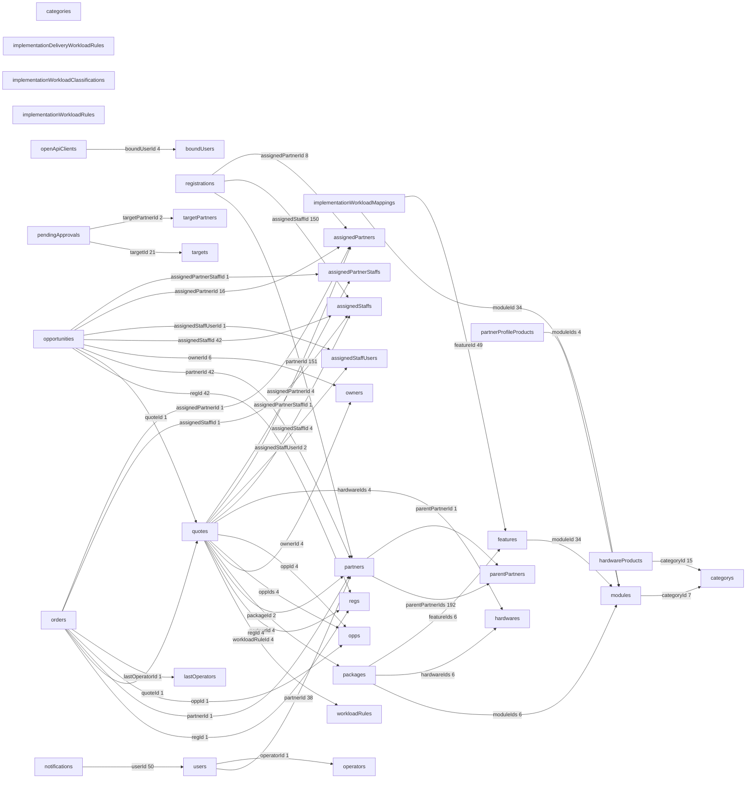

# V2实体关系图

生成时间：2026-07-23T10:42:56.536Z

```mermaid
flowchart LR
  categories[categories]
  features[features]
  hardwareProducts[hardwareProducts]
  implementationDeliveryWorkloadRules[implementationDeliveryWorkloadRules]
  implementationWorkloadClassifications[implementationWorkloadClassifications]
  implementationWorkloadMappings[implementationWorkloadMappings]
  implementationWorkloadRules[implementationWorkloadRules]
  modules[modules]
  notifications[notifications]
  openApiClients[openApiClients]
  opportunities[opportunities]
  orders[orders]
  packages[packages]
  partnerProfileProducts[partnerProfileProducts]
  partners[partners]
  pendingApprovals[pendingApprovals]
  quotes[quotes]
  registrations[registrations]
  users[users]
  features -->|moduleId 34| modules
  hardwareProducts -->|categoryId 15| categorys
  implementationWorkloadMappings -->|featureId 49| features
  implementationWorkloadMappings -->|moduleId 34| modules
  modules -->|categoryId 7| categorys
  notifications -->|userId 50| users
  openApiClients -->|boundUserId 4| boundUsers
  opportunities -->|assignedPartnerStaffId 1| assignedPartnerStaffs
  opportunities -->|assignedPartnerId 16| assignedPartners
  opportunities -->|assignedStaffUserId 1| assignedStaffUsers
  opportunities -->|assignedStaffId 42| assignedStaffs
  opportunities -->|ownerId 6| owners
  opportunities -->|partnerId 42| partners
  opportunities -->|quoteId 1| quotes
  opportunities -->|regId 42| regs
  orders -->|assignedPartnerId 1| assignedPartners
  orders -->|assignedStaffId 1| assignedStaffs
  orders -->|lastOperatorId 1| lastOperators
  orders -->|oppId 1| opps
  orders -->|partnerId 1| partners
  orders -->|quoteId 1| quotes
  orders -->|regId 1| regs
  packages -->|featureIds 6| features
  packages -->|hardwareIds 6| hardwares
  packages -->|moduleIds 6| modules
  partnerProfileProducts -->|moduleIds 4| modules
  partners -->|parentPartnerId 1| parentPartners
  partners -->|parentPartnerIds 192| parentPartners
  pendingApprovals -->|targetPartnerId 2| targetPartners
  pendingApprovals -->|targetId 21| targets
  quotes -->|assignedPartnerStaffId 1| assignedPartnerStaffs
  quotes -->|assignedPartnerId 4| assignedPartners
  quotes -->|assignedStaffUserId 2| assignedStaffUsers
  quotes -->|assignedStaffId 4| assignedStaffs
  quotes -->|hardwareIds 4| hardwares
  quotes -->|oppId 4| opps
  quotes -->|oppIds 4| opps
  quotes -->|ownerId 4| owners
  quotes -->|packageId 2| packages
  quotes -->|partnerId 4| partners
  quotes -->|regId 4| regs
  quotes -->|workloadRuleId 4| workloadRules
  registrations -->|assignedPartnerId 8| assignedPartners
  registrations -->|assignedStaffId 150| assignedStaffs
  registrations -->|partnerId 151| partners
  users -->|operatorId 1| operators
  users -->|partnerId 38| partners
```

说明：本图基于字段名自动推断，只作为阶段0关系发现线索，正式关系以阶段2 PostgreSQL模型为准。
