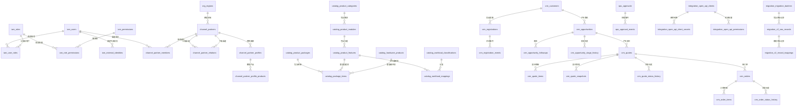

# V3实体关系图

生成日期：2026-07-23

```mermaid
erDiagram
  iam_users ||--o{ iam_user_roles : 拥有角色
  iam_roles ||--o{ iam_user_roles : 分配给用户
  iam_roles ||--o{ iam_role_permissions : 绑定权限
  iam_permissions ||--o{ iam_role_permissions : 被授权
  iam_users ||--o{ iam_external_identities : 绑定外部身份
  org_regions ||--o{ channel_partners : 覆盖区域
  iam_users ||--o{ channel_partner_members : 渠道成员
  channel_partners ||--o{ channel_partner_members : 拥有成员
  channel_partners ||--o{ channel_partner_relations : 上级渠道
  channel_partners ||--o{ channel_partner_relations : 下级渠道
  channel_partners ||--o{ channel_partner_profiles : 拥有画像
  channel_partner_profiles ||--o{ channel_partner_profile_products : 覆盖产品

  catalog_product_categories ||--o{ catalog_product_modules : 包含模块
  catalog_product_modules ||--o{ catalog_product_features : 包含功能
  catalog_product_packages ||--o{ catalog_package_items : 包含明细
  catalog_product_features ||--o{ catalog_package_items : 套餐功能项
  catalog_hardware_products ||--o{ catalog_package_items : 套餐硬件项
  catalog_product_features ||--o{ catalog_workload_mappings : 工作量映射
  catalog_workload_classifications ||--o{ catalog_workload_mappings : 分类

  crm_customers ||--o{ crm_registrations : 发起报备
  crm_registrations ||--o{ crm_registration_events : 状态事件
  crm_customers ||--o{ crm_opportunities : 产生商机
  crm_opportunities ||--o{ crm_opportunity_followups : 跟进
  crm_opportunities ||--o{ crm_opportunity_stage_history : 阶段历史
  crm_opportunities ||--o{ crm_quotes : 产生报价
  crm_quotes ||--o{ crm_quote_items : 报价明细
  crm_quotes ||--o{ crm_quote_snapshots : 报价快照
  crm_quotes ||--o{ crm_quote_status_history : 状态历史
  crm_quotes ||--o{ crm_orders : 转订单
  crm_orders ||--o{ crm_order_items : 订单明细
  crm_orders ||--o{ crm_order_status_history : 状态历史

  ops_approvals ||--o{ ops_approval_events : 处理事件
  integration_open_api_clients ||--o{ integration_open_api_client_secrets : 密钥轮换
  integration_open_api_clients ||--o{ integration_open_api_permissions : 资源权限
  migration_migration_batches ||--o{ migration_v2_raw_records : 包含原始记录
  migration_v2_raw_records ||--o{ migration_v2_record_mappings : 映射目标记录
```

说明：图中使用下划线展示PostgreSQL schema和表名，便于Mermaid渲染。正式SQL使用 `schema.table`。
