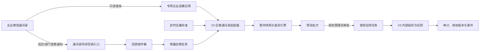

# 企业微信组织架构同步实施方案（KB-20260814-WECOM-ORG-001）

> 文档状态：设计完成，待企微管理员提供测试配置后进入开发。  
> 核验日期：2026-08-14。  
> 适用工程：V3 `apps/web`、`apps/api`、`apps/worker`、`packages/*`。  
> 决策基线：D-07、D-19、DEC-0017。  
> 本文只定义实施方案，不代表代码、数据库、生产配置或企微后台已经变更。

## 1. 结论

企业微信组织架构同步纳入组织架构子项 11.7，首期采用以下方案：

1. 只允许 **企业微信单向同步到 V3**，不由 V3 反向修改企业微信通讯录。
2. 使用 **专用企业自建应用读取详情 + 通讯录同步回调触发增量 + 定期全量校准** 的混合接入方式。
3. 只同步企业微信可见范围内的内部部门和人员基础信息，不同步渠道组织、渠道成员、权限、数据范围、业务角色、证书和业务归属。
4. 首次上线及首期运行期间，所有差异都必须先生成预览批次，由授权管理员审批后才能应用。后续若开放低风险自动应用，必须另行完成决策和灰度验收。
5. 企业微信成员删除、退出、禁用或因应用可见范围变化而消失，只生成高风险人工任务；不得直接停用 V3 账号、结束任职、删除数据或触发离职交接。
6. 同步功能默认关闭并与现有登录、单点登录、权限、会话、客户、报备、商机、报价、订单和四套正式页面隔离。关闭开关后，当前业务行为必须与接入前完全一致。

## 2. 官方限制与设计结论

| 官方事实 | 设计结论 |
| --- | --- |
| 企业自建应用只能读取应用可见范围内的通讯录，不能编辑通讯录 | 使用专用自建应用做只读详情源，并把可见范围明确配置为允许同步的内部组织边界 |
| 2022-08-15 后新配置或修改的通讯录同步回调，成员属性可能只返回 `UserID`、`Department`、`NewUserID`，部门属性可能只返回 `Id`、`ParentId` | 回调只作为“可能发生变化”的触发信号；最终事实必须重新调用查询接口获取，禁止按回调载荷直接覆盖正式数据 |
| 成员更新回调可能只在部门相关变化或成员编号变化时触发；部门更新回调可能只在父部门变化时触发 | 改名、排序、职务、状态等变化不能只靠回调发现，必须定期全量校准 |
| 官方说明回调不能保证百分之百成功 | 回调之外必须有全量对账、游标检查点、漏送检测和人工补偿 |
| 回调需要 URL、Token、43 位 EncodingAESKey；验证请求需在 1 秒内返回解密明文，业务回调 5 秒未响应会断开并重试 | 接口只负责验签、解密、去重落库和快速应答；实际拉取、比对和应用均由后台任务异步处理 |
| `access_token` 通常有效 7200 秒，但可能提前失效 | 按企业和应用隔离缓存；单飞刷新；遇到凭证失效时只刷新一次后重试；密钥不得返回前端 |
| 新建自建应用读取手机号、邮箱、性别、头像、地址等敏感字段通常需要成员授权 | 首期默认不采集这些字段，也不以手机号或邮箱做自动匹配 |
| 获取子部门编号列表可返回可见范围内部门及其父子、排序信息；部门详情接口返回名称和负责人等详情 | 先取得部门拓扑，再逐部门读取详情，父节点先于子节点处理 |
| 获取部门成员详情不会自动递归子部门 | 根据可见部门列表逐部门读取成员详情，再按成员编号合并多部门归属 |
| `userid` 可以发生一次变更，更新回调可能返回 `NewUserID` | 外部编号变更必须保留别名历史和审计，不得创建第二个 V3 人员；无法唯一确认时转人工处理 |
| 企业微信频率阈值可能按运营情况调整 | 客户端统一限流、带抖动退避、读取官方错误码并可暂停；不得把当前官方阈值当作永久容量承诺 |

## 3. 范围与权威边界

### 3.1 企业微信负责的上游事实

- 内部部门编号、名称、父子关系和排序。
- 成员编号、姓名、所属部门、部门内排序、主部门、职务和成员状态。
- 企业微信中的部门负责人标记，只作为 V3 负责人关系的候选输入。

### 3.2 V3 继续负责的事实

- 渠道商、渠道组织、渠道成员和上下级关系。
- 登录账号、密码、会话、账号启停和离职流程。
- 岗位字典、岗位映射、主职和兼职的业务确认结果。
- 业务角色、权限角色、数据范围和授权版本。
- 证书模板、不同类型证书、个人证书、有效期、附件和告警。
- 客户、报备、商机、报价、订单、合同、审批、待办等业务对象及其负责人。

### 3.3 明确不做

- 不反向写企业微信通讯录。
- 不把企业微信职务文本直接创建成 V3 权限角色或业务角色。
- 不因同步新增成员就自动开通 V3 登录权限。
- 不根据姓名、手机号、邮箱自动合并 V3 账号。
- 不同步渠道域组织或把企业微信部门挂到渠道组织下。
- 不同步或自动颁发证书。
- 不把企业微信中的删除、退出、禁用直接解释为 V3 离职。

## 4. 接入拓扑



接入必须使用独立应用身份和独立密钥引用，不能复用企微 OA、消息发送或企微机器人的密钥。一个连接器只绑定一个企业编号和一个自建应用，避免凭据、可见范围和调用额度相互污染。

## 5. 企微后台准备清单

| 配置 | 要求 | 验收证据 |
| --- | --- | --- |
| 企业编号 | 由企微管理员提供并双人核对 | 脱敏配置截图和测试连接记录 |
| 专用企业自建应用 | 仅用于组织架构读取，不承载 OA 和消息 | 应用编号、用途和负责人登记 |
| 应用可见范围 | 只包含允许进入 V3 的内部组织；根范围和排除范围书面确认 | 部门数量、人员数量基线 |
| 应用密钥 | 写入现有密钥管理或部署环境的密钥引用，不入库明文、不进日志 | 密钥引用可解析，页面只显示尾号或已配置状态 |
| 通讯录同步回调 | 配置 HTTPS URL、Token、EncodingAESKey | GET 验证成功、POST 验签解密用例通过 |
| 网络 | V3 出站可访问企业微信接口；入站回调经反向代理到专用路径 | 连通性和超时记录 |
| 回调地址白名单 | 采用官方建议的自动更新机制，每日刷新并保留最近一次成功版本 | 更新时间、条目数和失败告警 |
| 测试组织 | 至少包含二级部门、多部门成员、负责人、改名、移动、退出等场景 | 测试账号和预期结果清单 |

任一配置缺失时只允许保存草稿，不允许启用连接器或执行正式应用。

## 6. 数据标识和字段映射

### 6.1 外部唯一标识

外部对象唯一键统一为：

```text
提供方 + 企业编号 + 对象类型 + 外部编号
```

建议取值：

- 提供方：`wecom`。
- 对象类型：`department`、`user`。
- 部门外部编号：企业微信部门 `id`。
- 人员外部编号：企业微信 `userid`。

`userid` 发生变更时，原编号写入映射别名历史，新编号成为当前键。只有旧编号已经唯一映射且回调验签有效时才允许自动迁移映射；否则生成“外部编号变更待确认”差异。

### 6.2 部门字段映射

| 企业微信字段 | V3 目标 | 规则 |
| --- | --- | --- |
| `id` | `directory_mappings.external_id` | 只作外部唯一编号，不当作 V3 主键 |
| `name` | `org.org_units.name` | 首期纳入同步；改名生成差异 |
| `parentid` | 父组织映射 | 根部门编号 1 映射到已确认的 V3 内部根；禁止跨域、跨渠道挂接 |
| `order` | `org.org_units.sort_order` | 数值越大越靠前；落库前转换为 V3 统一排序语义 |
| `department_leader` | 负责人候选 | 必须先映射到有效内部任职，再由管理员确认；不直接覆盖现有负责人 |
| 可见范围 | 连接器同步范围 | 超出范围的对象不得读取和应用；范围缩小时只生成“不可见待核实”差异 |

部门编码、组织类型、区域归属和业务属性若企业微信无权威字段，继续由 V3 管理，同步不得清空或覆盖。

### 6.3 成员字段映射

| 企业微信字段 | V3 目标 | 首期规则 |
| --- | --- | --- |
| `userid` | 外部身份和映射 | 必须唯一；禁止按姓名兜底合并 |
| `name` | 人员展示名候选 | 允许生成更新差异，不覆盖登录名 |
| `department` | 内部任职组织候选 | 支持多部门；必须先存在部门映射 |
| `main_department` | 主任职候选 | 与多部门关系一起预览；不得静默切换 V3 主职 |
| `order` | 部门内排序 | 按部门关系保存，不混用为组织排序 |
| `position` | 岗位映射候选 | 只做文本候选；未建立 V3 岗位映射时进入待补录 |
| `is_leader_in_dept` | 负责人候选 | 始终人工确认，不自动授予管理权限 |
| `status` | 外部状态快照 | 1 已激活、2 已禁用、4 未激活、5 已退出；仅用于提示和风险判断 |
| 手机、邮箱、性别、头像、地址等 | 不采集 | 首期不请求、不持久化、不打印日志 |

### 6.4 匹配优先级

1. 已存在的同连接器、同企业、同对象类型、同外部编号映射。
2. 已确认的外部编号别名历史。
3. 管理员手工选择现有 V3 对象并建立映射。
4. 无映射时生成新增候选。

任何情况下都禁止以姓名、手机号、邮箱或模糊相似度自动合并账号。

## 7. 同步流程

### 7.1 连接测试

1. 校验连接器配置完整性和密钥引用可读性。
2. 获取并缓存 `access_token`，不向页面返回令牌。
3. 获取可见部门编号列表、一个部门详情和一个最小成员样本。
4. 返回企业编号一致性、可见部门数、样本成员数、耗时和缺少的字段授权。
5. 连接测试只读，不创建映射、不生成任职、不改变正式数据。

### 7.2 首次全量预览

1. 创建全量同步批次并记录请求人、连接器版本、可见范围摘要和配置版本。
2. 拉取可见范围部门拓扑，验证根、孤儿节点、重复编号和环。
3. 逐部门读取详情，再逐部门读取成员详情；同一成员的多部门结果按 `userid` 合并。
4. 将规范化结果写入批次快照，不直接更新组织主表。
5. 与映射和当前 V3 数据比对，生成新增、更新、移动、失效、冲突和忽略差异。
6. 输出汇总、风险分级、受影响对象和不可应用原因。
7. 管理员逐项或按安全分组审批后，才能提交受控应用任务。

首次全量必须保持“仅预览”，不得一键跳过审批。

### 7.3 回调增量

1. GET 验证请求：校验签名、解密 `echostr`，在 1 秒内返回解密明文。
2. POST 业务请求：校验签名、解密，提取企业编号、事件类型、变更类型、外部编号和创建时间。
3. 使用 `企业编号 + 消息签名 + 时间戳 + 随机数 + 密文哈希` 生成幂等键；重复回调只增加接收计数，不重复建任务。
4. 在 5 秒内完成收件箱落库并成功应答，不在回调线程中调用通讯录查询接口。
5. 后台任务合并同一对象的短时间重复事件，重新读取该对象或相关部门的最终状态。
6. 生成增量预览批次，仍按首期审批规则处理。

支持的变更类型至少包括：

- 成员：`create_user`、`update_user`、`delete_user`。
- 部门：`create_party`、`update_party`、`delete_party`。

事件时间只用于审计和乱序判断，不能作为正式数据覆盖顺序的唯一依据；最终状态以重新查询结果为准。

### 7.4 定期全量校准

- 建议默认每天北京时间 02:30 执行一次，可配置但不得关闭超过 24 小时而无例外审批。
- 对比外部当前全集、最近成功全量快照、映射表和 V3 当前值。
- 发现回调未覆盖的改名、排序、职务、状态或缺失对象时生成校准差异。
- 对象首次缺失只标记“待再次确认”；至少连续两次成功全量均缺失后，才升级为高风险失效候选，仍需人工处理。
- 全量失败不得用不完整结果判定删除或不可见；保留上一成功快照并告警。

### 7.5 应用顺序

批准后的单批次按以下顺序执行，每步都有独立幂等键和检查点：

1. 父部门映射与新增。
2. 子部门映射与新增、低风险资料更新。
3. 外部人员身份和映射。
4. 内部部门成员关系和任职候选。
5. 岗位映射候选。
6. 负责人关系候选。
7. 授权版本递增、组织变更事件和审计。

部门删除、成员退出、账号状态变化、主职变化和负责人变化不进入自动应用步骤，只生成管理员任务。

## 8. 差异分级与审批

| 级别 | 典型差异 | 首期动作 | 后续可否自动化 |
| --- | --- | --- | --- |
| 低风险 | 新部门、新成员候选、名称或排序变化 | 预览后管理员批量批准 | 另行决策和灰度后，可开放新增、改名、排序 |
| 中风险 | 多部门关系变化、职务变化、未映射岗位、外部编号变化 | 逐项确认，必要时补映射 | 默认不自动 |
| 高风险 | 部门移动、部门缺失、成员退出或禁用、主职变化、负责人变化、与 V3 手工数据冲突 | 禁止直接应用，生成高风险任务 | 始终人工处理 |
| 阻断 | 环、孤儿部门、跨域挂接、重复映射、批次快照不完整、外部企业编号不一致 | 整批或相关对象阻断 | 不允许自动 |

审批必须记录批次版本、差异版本、批准人、批准时间、批准范围和原因。应用前再次校验 `row_version`；V3 数据自预览后已被人工修改时返回冲突并重新预览，不得覆盖新值。

## 9. 运行状态

连接器状态：

- 未配置。
- 已配置但关闭。
- 只读连接。
- 预览中。
- 待审批。
- 应用中。
- 已暂停。
- 降级。
- 失败。

同步批次状态：

- `queued`：已排队。
- `fetching`：正在拉取。
- `comparing`：正在比对。
- `previewed`：预览完成。
- `pending_approval`：待审批。
- `applying`：正在应用。
- `succeeded`：全部成功。
- `partial`：部分成功且有明确失败项。
- `failed`：失败。
- `cancelled`：应用前取消。

已开始应用的批次不得简单改成取消；只能暂停后按检查点继续或执行补偿。

## 10. 数据模型

在既有 `integration.directory_mappings`、`integration.directory_sync_runs`、`integration.directory_sync_changes` 基础上补齐以下对象。正式字段以评审通过的迁移和接口契约为准。

| 表 | 核心字段 | 关键约束 |
| --- | --- | --- |
| `integration.directory_connectors` | 提供方、企业编号、应用编号、密钥引用、可见范围摘要、模式、状态、配置版本、最后成功时间 | 同提供方、企业编号、应用编号唯一；只存密钥引用，不存明文 |
| `integration.directory_mappings` | 连接器、对象类型、外部编号、V3 对象、外部编号别名、确认状态、最后可见时间 | 连接器、对象类型、外部编号唯一；V3 对象不可被同连接器重复映射 |
| `integration.directory_sync_runs` | 批次类型、触发来源、状态、配置版本、快照摘要、统计、检查点、错误摘要 | 每次运行可追溯；错误摘要不得含令牌和敏感字段 |
| `integration.directory_sync_changes` | 批次、对象、动作、风险级别、前后摘要、差异版本、审批和应用状态 | 同批次、同对象、同差异版本唯一；应用需幂等 |
| `integration.directory_callback_events` | 企业编号、事件类型、变更类型、对象编号、密文哈希、幂等键、接收次数、处理状态 | 幂等键唯一；不长期保存解密后的完整原文 |
| `integration.directory_sync_checkpoints` | 连接器、任务类型、游标、最后事件时间、最后成功全量编号 | 同连接器、任务类型唯一；事务更新 |
| `integration.directory_external_id_aliases` | 映射、旧编号、新编号、生效时间、来源事件、确认人 | 防止 `userid` 变更后重复建人 |

回调原文只保存处理所需摘要和密文哈希。若因排障必须短期保存密文，需单独加密、设置短保留期并限制到集成运维角色。

## 11. 接口契约

### 11.1 管理接口

| 方法与路径 | 用途 | 权限 |
| --- | --- | --- |
| `GET /api/integrations/directory-sync/status` | 查询连接器、最近运行和降级状态 | `integration.directory.read` |
| `POST /api/integrations/directory-sync/test-connection` | 只读连接测试 | `integration.directory.configure` |
| `POST /api/integrations/directory-sync/preview` | 创建手工预览批次 | `integration.directory.preview` |
| `POST /api/integrations/directory-sync/runs` | 创建全量或校准运行 | `integration.directory.execute` |
| `GET /api/integrations/directory-sync/runs` | 分页查询批次 | `integration.directory.read` |
| `GET /api/integrations/directory-sync/runs/:id` | 查询批次统计、检查点和错误 | `integration.directory.read` |
| `GET /api/integrations/directory-sync/changes` | 查询和筛选差异 | `integration.directory.read` |
| `POST /api/integrations/directory-sync/runs/:id/apply` | 提交已审批差异的应用任务 | `integration.directory.approve` |
| `POST /api/integrations/directory-sync/runs/:id/pause` | 暂停尚未领取的新应用项 | `integration.directory.execute` |

写接口必须声明 `Idempotency-Key`、强认证要求、`row_version`、可重试错误和审计事件。`apply` 请求必须显式携带差异编号及其版本，不接受“应用当前所有差异”这类不稳定语义。

### 11.2 企业微信回调

| 方法与路径 | 用途 | 认证 |
| --- | --- | --- |
| `GET /api/integrations/wecom/contact-callback` | 回调地址验证 | 企业微信签名、Token、EncodingAESKey |
| `POST /api/integrations/wecom/contact-callback` | 接收成员和部门变更通知 | 企业微信签名、Token、EncodingAESKey |

回调路径不使用浏览器会话，但必须校验企业微信签名和加密消息。签名失败、企业编号不匹配、重放超窗、解密失败均拒绝并记录脱敏安全事件。

### 11.3 统一响应要求

- 管理接口使用现有 V3 中文错误结构、请求编号和审计约定。
- 不直接透传企业微信 `errmsg` 给前端，后端按 `errcode` 分类并提供中文处理建议。
- 列表统一使用游标或稳定分页，差异列表默认按高风险优先、创建时间倒序。
- 任何响应不得包含 `access_token`、应用密钥、Token 或 EncodingAESKey。

## 12. 页面与易用性

页面沿用 `/workspace/admin/platform-admin/organization/directory-sync`，名称改为“企微组织同步”。历史原型文件名 `06-同步占位.html` 暂时保留，以免破坏既有文档链接；页面内容不再展示占位状态。

页面分为五个区：

1. 连接状态：显示配置状态、模式、可见范围摘要、最近成功全量、回调健康度和当前开关。
2. 安全边界：固定显示“单向读取、审批后应用、不改权限、不自动离职、不碰渠道组织”。
3. 操作区：测试连接、生成预览、查看差异、暂停；“应用已审批差异”必须二次确认且默认禁用，只有批次审批完整时才可用。
4. 差异汇总：新增、更新、中高风险、阻断、已忽略和待人工处理数量。
5. 批次与事件：展示触发来源、状态、耗时、检查点、失败原因和重试入口。

高风险差异必须展示 V3 当前值、企微候选值、影响说明、建议动作和审计记录。页面不得提供“全量覆盖 V3”“自动停用成员”“同步权限或证书”等入口。

## 13. 凭据、安全与隐私

1. 企业编号、应用编号可以保存；应用密钥、回调 Token 和 EncodingAESKey 只保存密钥引用。
2. 凭据按连接器隔离，读取权限仅给集成服务和受控运维进程；页面只展示“已配置/未配置”和脱敏尾号。
3. 日志统一过滤查询串中的 `access_token`、请求头、密文、手机号、邮箱和地址。
4. `access_token` 只在服务端缓存，提前安全刷新；同一连接器只有一个刷新任务，避免并发击穿。
5. 回调执行验签、解密、时间窗和重放校验；安全失败不得进入业务队列。
6. 出站请求固定 HTTPS、连接和读取超时、响应体上限；不跟随到非官方域名的重定向。
7. 权限至少拆分为查看、配置、预览、执行、审批；配置人与审批人建议职责分离。
8. 敏感字段默认不采集。未来扩展必须先完成最小必要性、授权、保留期、脱敏、导出和删除评审。

## 14. 幂等、重试、限流与降级

### 14.1 幂等

- 回调：按回调幂等键去重。
- 拉取任务：按连接器、对象类型、对象编号和目标快照版本去重。
- 差异：按批次、对象、动作和差异版本去重。
- 应用：按批次、差异编号和差异版本去重；已成功项重试时直接返回既有结果。
- 事件：组织变化发件箱与业务写入同事务，消费者按事件编号幂等。

### 14.2 重试

- 网络超时、系统繁忙和明确可重试错误使用指数退避加随机抖动，默认最多 3 次。
- 凭证失效只允许刷新一次后重试，仍失败则暂停该连接器并告警。
- 参数、权限、可见范围、企业编号不一致等错误不自动重试，直接进入人工处理。
- 应用单项失败不得重放已成功项，也不得回滚无关对象。

### 14.3 限流与熔断

- 按企业、应用、接口三层令牌桶限流，默认速率应显著低于官方当前基础上限，并支持运行时调整。
- 遇到频率限制错误时尊重官方返回，延迟执行并降低并发；禁止紧密循环重试。
- 连续凭据失败、权限失败或全量不完整时打开熔断，只保留回调收件和人工连接测试，不执行正式应用。
- 令牌桶、并发和批量大小通过配置中心管理，不能写死为官方当前阈值。

## 15. 不影响现有业务的强制门禁

1. `wecom_directory_sync_enabled` 和 `wecom_directory_apply_enabled` 分离，代码和生产配置均默认关闭。
2. 第一阶段仅部署表结构、连接测试、回调收件和预览；不把新表接入现有权限和业务查询主路径。
3. 开启预览不改变 `iam.users`、`org.org_units`、任职、负责人、权限、证书或业务数据。
4. 开启应用前必须完成全量预览、差异签字、备份恢复点、回退演练和现有主链路回归。
5. 同步只修改明确批准且字段归属为企微权威的字段；V3 专有字段保持原值。
6. 任一对象存在业务归属、有效任职、权限、负责人或离职影响时，失效类差异只生成人工任务。
7. 应用过程不得调用账号停用、离职交接、权限授予、证书颁发或业务转移接口。
8. 新增成员默认不具备登录能力；是否绑定或创建登录账号由现有账号管理流程决定。
9. 回调和同步任务使用独立队列、并发上限和超时，不占用关键事件、登录或业务请求资源池。
10. 功能关闭或熔断时，四套正式页面及既有接口的路径、字段、默认权限和结果完全不变。

每次灰度必须回归：账号密码登录、IAM 登录、退出和会话恢复；管理员和渠道端首页；客户报备、商机、报价、订单、渠道成员；管理和渠道移动端；V2 兼容路由；消息与任务进程健康。

## 16. 灰度、回退与补偿

### 16.1 灰度顺序

1. 测试环境连接测试与官方调试工具验证。
2. 测试组织全量预览，不应用。
3. 生产只读连接，运行至少 7 天回调收件和全量校准，核对漏送率与差异稳定性。
4. 选择一个无业务归属的测试部门，审批后应用低风险新增。
5. 扩大到一个内部部门；继续禁止失效、移动、主职和负责人自动处理。
6. 完成两轮成功全量对账和主链路回归后，才评审扩大范围。

### 16.2 回退

- 先关闭 `wecom_directory_apply_enabled`，阻止新应用项领取；已领取项在对象边界完成后暂停。
- 保留回调收件和只读校准，便于判断外部变化；必要时再关闭总开关。
- 每项应用前保存 V3 前值和 `row_version`。自动补偿只允许恢复本批次实际修改且此后未被再次修改的字段。
- 发生后续人工修改、业务引用或版本冲突时禁止自动回写，生成补偿任务由管理员处理。
- 数据库迁移遵守“已执行迁移不改写”的规则；回退优先关闭读取和应用路径，不删除审计、映射和批次记录。

## 17. 监控与告警

至少提供以下指标：

- 连接器状态、令牌刷新成功率和剩余有效期。
- 回调验签失败、解密失败、重复、积压、处理延迟和连续无回调时长。
- 全量和增量批次数、成功率、耗时、拉取对象数和快照完整性。
- 新增、更新、高风险、阻断、连续缺失和待审批差异数。
- 应用成功、部分成功、冲突、重试和人工任务积压。
- 企业微信各接口错误码、限流、超时和熔断状态。
- 可见部门、成员总数相对最近成功基线的突降比例。

以下情况立即告警并自动暂停应用：企业编号不一致、可见对象总量异常突降、连续凭据失败、全量快照不完整、重复映射、组织环、跨域挂接、审计写入失败。

## 18. 测试与验收

### 18.1 单元与契约测试

- 令牌缓存、单飞刷新、提前失效和凭据隔离。
- 部门递归、多部门成员合并、负责人数组对应和排序转换。
- `userid` 变更、映射别名、重复编号和禁止姓名合并。
- 回调 GET 验证、POST 验签解密、重放、重复、乱序和快速应答。
- 差异分级、审批版本、应用幂等、并发冲突和单项补偿。
- 企业微信错误码分类、退避、限流、熔断和恢复。

### 18.2 集成测试

- 新增、改名、移动、删除部门。
- 新增、改名、跨部门、多部门、主部门变化、负责人变化、禁用和退出成员。
- 回调漏送后全量校准能发现差异。
- 应用可见范围缩小不会把大量成员误判为离职。
- 全量中途失败不会根据残缺快照生成删除类差异。
- V3 同步字段与人工字段冲突时保留人工修改并提示重新预览。

### 18.3 业务验收

- 管理员能看懂连接状态、影响范围、差异原因和下一步动作。
- 所有变更先预览，未经审批不能应用。
- 新企微成员不会自动获得 V3 登录、角色、权限、范围或证书。
- 企微成员退出不会自动停用账号或触发离职。
- 渠道组织和渠道成员完全不受同步影响。
- 重复同步不产生重复部门、人员、任职和事件。
- 关闭开关后现有业务回归全部通过。

### 18.4 性能与恢复验收

- 按目标企业实际部门和成员规模的两倍构造数据，验证全量时长、内存、接口并发和数据库写入。
- 回调峰值积压可观测且不会阻塞登录和业务请求。
- 工作进程重启后从检查点继续，不重复应用成功项。
- 令牌服务、企业微信接口或数据库短暂不可用后可以安全恢复。
- 完成“关闭应用开关—暂停—校准—重新预览—恢复”的演练。

## 19. 开发阶段与工作量

11.7 拆成 11.7A“只读连接与预览”和 11.7B“审批与受控应用”，建议总工时 112 小时，正式接口契约冻结后允许上下浮动 20%。

| 阶段 | 主要交付 | 建议工时 | 退出条件 |
| --- | --- | ---: | --- |
| 11.7-0 接入准备 | 官方限制复核、测试应用、可见范围、密钥引用、OpenAPI 和威胁检查 | 8h | 配置清单签字，契约评审通过 |
| 11.7A-1 连接与回调 | 连接器、令牌缓存、只读接口适配器、回调验签解密和收件箱 | 24h | 连接测试、回调时限、重复和重放用例通过 |
| 11.7A-2 全量与差异 | 全量拉取、快照、映射、差异引擎、只读控制台 | 32h | 首次全量只读预览和漏送校准通过 |
| 11.7B-1 审批与应用 | 差异审批、幂等应用、冲突检查、事件、审计和人工任务 | 28h | 未审批不可应用，高风险不自动处理 |
| 11.7B-2 灰度与运维 | 限流、熔断、监控、告警、性能、主链路回归和回退演练 | 20h | 连续两轮全量一致，现有业务回归通过 |
| **合计** |  | **112h** |  |

纳入 11.1～11.7 全部工作后，组织架构阶段由原 7～8 个日历周调整为约 9～11 个日历周，前提仍是两名熟悉 V3 的研发、测试和评审资源及时到位。同步不应与 11.1～11.6 的数据约束并行抢跑：先完成阶段零、OpenAPI、审计、角色级数据范围和组织主体，再进入 11.7A；11.7B 在 11.2 任职与负责人稳定后实施。

## 20. 上线前确认项

- [ ] 企业编号、自建应用编号、密钥引用和责任人已确认。
- [ ] 同步可见范围和排除范围已由业务负责人签字。
- [ ] 企微根部门如何映射到 V3 内部根已确认。
- [ ] 部门类型、职务到岗位的映射策略已确认。
- [ ] 预览审批人、应用审批人和高风险任务处理人已确认。
- [ ] 回调公网地址、证书、Token、EncodingAESKey 和白名单更新机制已验证。
- [ ] 首次全量部门数、成员数和多部门成员数已与企微管理员对账。
- [ ] 现有 V3 同名人员只生成候选，没有发生自动合并。
- [ ] 应用开关默认关闭，回退和补偿演练通过。
- [ ] 登录、渠道、客户报备、商机、报价、订单和移动端回归通过。

未完成上述确认时，只允许开发和测试“连接、回调、拉取、快照、预览”能力，不允许生产应用差异。

## 21. 官方资料

以下均为企业微信开发者中心官方资料，已于 2026-08-14 通过浏览器逐页核验：

| 资料 | 页面最后更新 | 链接 |
| --- | --- | --- |
| 获取 `access_token` | 2024-03-26 | <https://developer.work.weixin.qq.com/document/path/91039> |
| 通讯录管理概述 | 2022-10-13 | <https://developer.work.weixin.qq.com/document/path/90193> |
| 通讯录同步接口调整 | 2022-08-20 | <https://developer.work.weixin.qq.com/document/path/96079> |
| 接收消息与事件回调配置 | 2024-12-13 | <https://developer.work.weixin.qq.com/document/path/90930> |
| 通讯录回调通知概述 | 2022-06-20 | <https://developer.work.weixin.qq.com/document/path/90967> |
| 成员变更通知 | 2026-02-26 | <https://developer.work.weixin.qq.com/document/path/90970> |
| 部门变更通知 | 2022-08-04 | <https://developer.work.weixin.qq.com/document/path/90971> |
| 获取子部门编号列表 | 2023-09-06 | <https://developer.work.weixin.qq.com/document/path/95350> |
| 获取单个部门详情 | 2023-09-06 | <https://developer.work.weixin.qq.com/document/path/95351> |
| 获取部门成员详情 | 2024-07-24 | <https://developer.work.weixin.qq.com/document/path/90201> |
| 获取成员编号列表 | 2024-07-23 | <https://developer.work.weixin.qq.com/document/path/96067> |
| 访问频率限制 | 2023-08-28 | <https://developer.work.weixin.qq.com/document/path/90312> |
| 全局错误码 | 2026-08-13 | <https://developer.work.weixin.qq.com/document/path/90313> |

企业微信可能继续调整字段权限、回调内容、频率阈值和错误码。每次开发开工、联调和生产发布前都必须重新核验上述页面，并把核验日期和差异写入测试报告，不能只依赖本文快照。

## 22. 与现有文档的关系

- 总体边界、状态机和阶段门禁：`docs/V3业务平台底座与业务扩展实施交付方案.md` 第 7、19、20、21 章及附录 E。
- 具体开发任务：`docs/operations/组织架构首期落地开发方案.md` 第 9 章。
- 任务状态和工时：`docs/operations/组织架构开发落地跟踪.md` 第 3.7、4、5、7 章。
- 页面和交互：`docs/operations/组织架构前端UI设计.md` 第 9、14.6 章。
- 正式原型：`docs/operations/组织架构UI原型/06-同步占位.html`。

