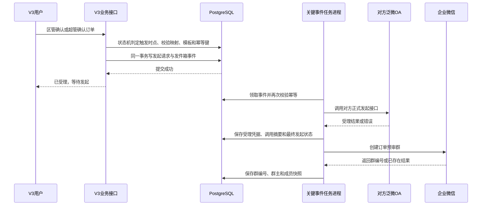

# 企微 OA 发起流程接入调整方案（KB-20260825-WECOM-OA-001）

> 文档状态：已完成“渠道产品订单预审”生产 OA 单次人工联调验证，并完成 V3 自动发起、报价单双附件、只读回查和企微自动建群的独立任务实现；任务默认关闭，尚未以 V3 任务进程调用真实外部系统。区管泛微 OA 身份维护能力已交付，并已随生产发布迁移交付 1052 条账号参考数据；既有 V3 账号未回填正式映射，其他业务模板仍须逐一完成字段校验后才能启用。
> 制定日期：2026-08-25。
> 适用工程：V3 `apps/web`、`apps/api`、`apps/worker`、`packages/*`、`database/migrations`、`deploy/single-server`。
> 关联基线：[V3业务平台底座与业务扩展实施交付方案](../V3业务平台底座与业务扩展实施交付方案.md) 第 9 章。

## 1. 已确认的业务决定

第 6 项“同步创建企微 OA 流程”调整为高优先级的“OA 发起流程”。实际技术接入目标确定为对方的泛微 OA／eteams，采用 `fanwei-oa-python-starter` 中的“创建流程实例 + 提交流程”骨架。V3 的首期职责仅是向对方 OA 发起一条流程，并可靠记录本次发起是否被对方受理。

首期不建设以下能力：

- 合同审批、收款、应收、核销及其数据模型。
- 企微审批结果、节点、撤销、驳回的回调接收和同步。
- 用企微审批结果自动改变 V3 任何业务状态。
- 周期性审批状态对账。
- 以企微应用消息、群机器人消息代替真实 OA 流程发起。

已发起成功的外部流程由对方 OA 负责后续流转。V3 仅保留外部受理编号或受理凭据（如对方接口实际返回），不把它解释为 V3 本地审批已完成。

“渠道产品订单预审”是首个且唯一允许自动发起的业务类型，规则如下：

- 不提供人工发起入口。普通订单在区管确认、状态从 `primary_confirmed` 进入 `pending_superadmin_confirm` 后自动投递；调价订单在区管调价进入 `pending_superadmin_confirm` 时绝不投递，只有超管确认后进入 `confirmed` 才自动投递。
- 泛微实际发起人固定为订单所属区域的区管；调价订单在超管确认后仍使用完成该次调价的区管身份发起。
- 采购内容由服务端按订单关联报价明细生成，只列软件产品和服务项，并包含授权端点数/数量与小计金额；正式报价单 PDF 先由服务端生成，页面下载与 Worker 上传 OA 使用同一份 PDF 产物，再分别上传至两个必填附件字段。
- “报价单／收益表上传处”当前仍为必填。首期将同一份报价单 PDF 分别上传到两个附件字段；待对方调整为非必填并完成验证后，再移除第二次上传。
- 同一订单只允许一个发起记录。存在记录时不允许自动重发，固定提示“此订单需要人工操作发起或修改‘OA渠道订单预审’”。
- 泛微返回流程实例编号并经只读回查确认有效后，立即新建一个订单预审企微群；不等待 OA 审批结论。建群复用提醒平台已配置的企业微信自建应用，不另建、复制或重复维护企业微信凭据。

## 2. 优先级与范围边界

实施顺序调整为：阶段零收口 → 组织架构可用与问题修复 → 企微 OA 发起流程 → 合同审批与收款。

组织架构在本项中的最小产物是：可用账号、当前操作者、组织范围校验，以及 V3 用户与企微发起人身份的明确映射。候选核验、人工确认、停用与审计的维护能力已在组织架构账号抽屉交付；候选与正式映射分表保存。`20260901_S10_015` 另行冻结 1052 条只读核验后的参考数据：仅未来新增或更新的启用账号在登录名和显示姓名完全匹配时可自动新增正式映射，既有映射不回填或覆盖，三条同名记录仍只允许人工确认。企微组织同步尚未完全开放不阻塞本项；但候选、未映射、已停用或映射冲突的用户不得发起流程。

本项的业务来源不预设为合同、协议、报备或其他对象。每一种可发起的业务类型必须在配置中单独登记来源对象、模板、字段映射、可发起角色和幂等规则；没有完成登记和测试的业务类型固定拒绝发起。

## 3. 提供插件与现有工程能力梳理

| 来源                       | 能力                                                   | 本项处理结论                                                                                                                                                     |
| -------------------------- | ------------------------------------------------------ | ---------------------------------------------------------------------------------------------------------------------------------------------------------------- |
| `wecom-doc-skill-cn`       | 企业微信文档导航、接口资料定位                         | 可用于联调资料核验；不提供 OA 流程发起实现。                                                                                                                     |
| `wecom-send`               | 企微自建应用消息、群机器人消息、消息模板骨架           | 不能替代 OA 流程；已确认仅复用提醒平台的企微自建应用配置用于 OA 受理后的自动建群，不用于泛微流程发起。                                                           |
| `fanwei-oa-python-starter` | 泛微 OA／eteams 的流程和表单接口指引与 Python 骨架     | 包含“创建流程实例”和“提交流程”的调用骨架；仅当“对方”实际为泛微 OA／eteams 时可作为本项的实现起点。流程地址、模板、字段、凭据和人员编号必须由对方资料确认后配置。 |
| V3 现有工程                | 事务发件箱、任务进程、企微应用消息鉴权和组织同步连接器 | 泛微 OA 使用独立连接器、独立凭据和独立任务队列；订单预审群复用提醒平台的企微自建应用密文配置与受控读取能力。                                                     |

结论：当前目录中有可作为泛微 OA／eteams 发起流程起点的 Python 骨架，但没有企业微信原生审批的等价实现。`main.py` 的 `workflow/v2/createFlow`／`submitFlow` 为通用旧式示例，未覆盖附件控件，不作为本流程的实现契约；已验证的当前接口见第 10 节。实现不能根据消息接口、泛微示例或页面操作猜测接口路径和字段。

## 4. 联调前置条件

| 类别     | 必须具备                                                                                                         | 未具备时的处理                                             |
| -------- | ---------------------------------------------------------------------------------------------------------------- | ---------------------------------------------------------- |
| 对方能力 | 开放泛微 OA／eteams 测试环境，并确认可通过接口创建和提交流程。                                                   | 停留在方案与联调准备，禁止编码外部调用。                   |
| 接口契约 | 认证方式、四个实际接口地址、请求字段、必填项、流程和表单标识、成功返回、错误码、幂等或查询能力。                 | 不写死路径、字段或重试策略。                               |
| 身份     | V3 发起人与对方 OA 发起人映射，以及映射有效期和冲突处理规则                                                      | 映射缺失或不唯一时拒绝发起并生成补齐任务。                 |
| 模板     | 每个业务类型对应的测试／生产模板、版本、字段定义及可见范围                                                       | 模板未验证时禁止上线和自动任务领取。                       |
| 安全     | 泛微连接器独立密钥引用；建群复用提醒平台企微自建应用的密文配置；两者均须最小权限、测试和生产隔离、明确轮换责任人 | 不把密钥放入前端、普通环境文件、日志、审计正文或文档示例。 |
| 运行     | 关键事件池、发件箱、调用日志、告警和人工重试入口可用                                                             | 禁止由浏览器直接调用对方 OA。                              |

## 5. 最小实现设计

### 5.1 发起链路

浏览器只提交 V3 的订单确认或调价动作，不持有外部凭据，也不等待对方 OA 的完整处理结果。任务进程的系统身份不绕过业务发起人的权限：入队前必须完成权限、数据范围、来源对象状态和身份映射校验。创建群的前提是泛微已返回流程实例编号且只读回查确认有效；这不是等待 OA 审批通过。

### 5.2 建议持久化事实

正式迁移需在接口契约冻结后设计；首期至少应保存下列事实：

| 事实         | 用途                                                                               |
| ------------ | ---------------------------------------------------------------------------------- |
| 发起请求     | 业务类型、来源对象、版本、发起人、模板版本、状态和创建时间。                       |
| 幂等键       | 同一来源对象、业务动作和模板版本只能生成一次外部发起。                             |
| 外部受理凭据 | 对方返回的流程编号、请求编号或等价凭据；没有返回时明确记录“未提供可查询凭据”。     |
| 调用记录     | 连接器、时间、耗时、脱敏请求摘要、响应摘要、错误类别和尝试次数。                   |
| 审计事件     | 谁在何时请求发起、使用何种业务类型和模板版本、最终是否被受理。                     |
| 企微群记录   | 订单编号、泛微流程实例编号、群编号、群主、成员快照、创建状态、失败摘要和创建时间。 |

不建立本地审批任务、节点、结果映射或回调收件箱；这些均超出本期范围。企微群仅用于发起后的协同沟通，不影响 OA 审批路径和 V3 订单状态。

### 5.3 状态与重试

本期维护 OA 发起状态：`待发起`、`发起中`、`已受理`、`发起失败`、`待人工确认`、`已停止`；并独立维护建群状态：`待创建`、`创建中`、`已创建`、`创建失败`、`待人工确认`。

| 情况                               | 处理                                                                                             |
| ---------------------------------- | ------------------------------------------------------------------------------------------------ |
| 对方明确返回成功                   | 保存受理凭据，标记“已受理”，不再重试。                                                           |
| 对方明确返回参数、模板或发起人错误 | 标记“发起失败”，不自动重试。                                                                     |
| 限流或明确的短暂故障               | 按对方规则有限退避重试。                                                                         |
| 超时、断网或响应无法确认           | 标记“待人工确认”；仅当对方提供幂等写入或查询接口时才允许自动确认或重试。                         |
| 重复请求                           | 返回已有发起记录，不创建第二条外部流程；固定提示“此订单需要人工操作发起或修改‘OA渠道订单预审’”。 |
| 停用连接器                         | 不再领取新任务，已有未确认任务保留记录并告警。                                                   |

建群仅在 OA 状态为“已受理”后执行。群创建出现明确失败可按企微规则有限重试；超时或结果无法确认时进入“待人工确认”，不得盲目创建第二个群。群编号已存在或企微返回相同群编号时视为幂等成功。

### 5.4 订单预审企微群规则

每条已受理的“渠道产品订单预审”流程只对应一个企微群，群名称为 `订单预审-<订单编号>`。群主固定为 V3 登录名 `liangguangyao` 对应的企业微信成员；成员固定为：订单所属区域区管，以及 V3 登录名 `liangwanqi`、`liangguangyao`、`shoulong`、`liulonghai` 对应的企业微信成员。

所有成员和群主均必须通过 `iam.external_identities` 中 `provider_code='wecom'` 的唯一映射取得企业微信 UserId。缺少、停用或重复映射时，群任务失败并转人工处理，不能按姓名猜测或匹配。企微自建应用还必须具备创建群、设置群主和管理上述成员的权限，且群主与成员均在应用可见范围内。

已确认订单预审群复用提醒平台的企业微信自建应用。建群任务必须通过提醒平台现有的密文配置读取机制取得企业微信企业编号和应用密钥，不复制到订单预审环境变量、模板、日志或数据库业务记录中；泛微 OA 的应用凭据仍完全独立。

群内仅发送“订单预审流程已发起，请在 OA 审批”的简短通知；不得发送客户信息、报价明细、金额、附件或文件链接。

### 5.4 模板与字段变更兼容

对方流程和字段允许变更，但 V3 不按页面名称或猜测规则自动改写映射。每个业务类型按“环境 + 组织范围 + 流程标识 + 表单标识 + 模板版本”保存独立且版本化的字段映射；每次发起请求都固化当时的映射版本，历史调用记录不因后续配置变化而被改写。

| 对方变更                                                     | 首期处理                                                                 |
| ------------------------------------------------------------ | ------------------------------------------------------------------------ |
| 未映射的非必填字段新增、字段显示名称修改                     | 不影响发起；字段标识、类型和必填规则仍须通过例行校验。                   |
| V3 已映射字段的显示名称修改                                  | 只要字段标识、类型、选项真实值和必填规则未变，不影响发起。               |
| 新增必填字段                                                 | 自动将该模板标记为“待更新”，停止该模板的新发起并告警。                   |
| 已映射字段的标识、类型、选项真实值、是否必填或明细表结构变化 | 自动将该模板标记为“失效”，停止该模板的新发起并告警。                     |
| 新模板或新版本替换旧模板                                     | 新建映射版本并在测试环境验证；未验证前不得切换，旧映射保留用于历史追溯。 |
| 对方接口返回字段或模板错误                                   | 本次记录为明确失败，停止该模板后续自动任务，等待管理员修复映射。         |

校验方式：管理员保存映射、测试连接或准备切换模板时，先调用对方的流程／表单字段元数据接口比对；运行中按固定频率执行只读校验，并在首次出现模板或字段错误时立即熔断该模板。只有通过字段标识、类型、必填、选项与明细表结构校验后，管理员才能启用新映射版本。

## 6. 接口与页面边界

V3 正式接口路径、字段和错误码在 OpenAPI 评审后才可冻结。首期至少需要以下能力，而非现在即写死这些路径：

- 业务侧：提交一次受控的“发起 OA 流程”请求。
- 平台侧：维护连接状态、模板与字段映射、用户映射、测试发起、调用日志、失败记录和受控重试。
- 审计侧：查询单次发起的业务来源、操作者、模板版本、受理凭据和失败原因。

平台页面仅向超级管理员展示连接与映射配置、映射版本、字段校验结果和失效原因；普通业务页面只展示当前对象是否已请求发起及是否被对方受理，不展示外部密钥、完整请求载荷或无权限的外部流程链接。

## 7. 验收与回退

验收必须在测试环境以对方提供的真实模板完成：

1. 普通订单在区管确认后自动创建一条流程；调价订单在区管调价后不创建流程，只有超管确认后自动创建一条流程。两条路径均获得可核验的对方受理结果。
2. 同一幂等键重复提交不产生第二条外部流程。
3. 未映射用户、无权限用户、模板失效和字段缺失均在 V3 被拒绝或记录为可处理失败。
4. 限流、明确临时故障和无法确认的超时按第 5.3 节分别处理，不盲目重发。
5. 密钥不出现在前端、日志、审计正文、任务载荷或交付包中。
6. 关闭开关后停止新发起，既有 V3 登录、组织、合同、订单、消息和四套正式页面不受影响。
7. 对方新增必填字段、修改已映射字段类型或替换模板时，V3 能自动阻断受影响模板；修复映射并通过测试后才恢复发起。
8. OA 已受理后，恰好创建一个群：群主为 `liangguangyao`，成员为所属区管及四个指定登录名对应的企业微信成员；群创建失败不影响已受理 OA 流程，也不会重复创建群。

回退只停止新的 V3 发起任务并保留审计与调用记录。已经被对方受理的流程不能由 V3 自动删除、撤回或判定结束；如需撤回，必须由对方 OA 的既有人工规则处理。

## 8. 上线联调前仍需确认的事项

1. 当前实际表单中“报价单／收益表上传处”仍显示红色必填星号。首期已改为先生成正式报价单 PDF，再将同一份 PDF 上传至两个附件字段；后续如需不传第二附件，对方须使调整在目标模板生效，并以实际页面或字段元数据和一次不传该字段的测试发起共同确认。
2. 已验证的 `doCreateRequest` 在 `isnextflow=1` 时会创建并直接流转，不需要再调用独立提交接口；其他接口或其他模板不得据此直接推断，仍须单独验证。
3. 对方是否返回可持久化的流程或请求编号，是否支持幂等键或按业务单号查询发起结果。
4. 每位区管的 V3 账号与泛微 `userid` 映射，以及 `liangwanqi`、`liangguangyao`、`shoulong`、`liulonghai` 和每位区管的企业微信 UserId 映射。泛微映射维护入口已交付，但当前尚无录入数据；泛微目录不返回 V3 登录名，必须人工核验后在候选区录入、确认生成正式映射，不得按姓名自动匹配。具体步骤见《渠道产品订单预审泛微 OA 字段与接口说明》第 11 节。
5. 企微自建应用是否已有创建群、设置群主、成员管理权限，群主和成员是否均在应用可见范围内。
6. 认证凭据由谁申请、通过何种安全渠道交付、轮换责任人是谁，以及 V3 任务进程的网络访问地址如何放行。

在上述事项确认前，代码、迁移和部署入口可以随 V3 测试环境发布并保持关闭；不授权配置真实密钥、开启任务 Profile 或调用对方接口。

## 9. 双方实施分工

### 9.1 V3 负责

1. 在 V3 配置独立的泛微连接器、密钥引用、启停开关和调用限流；不复用企微消息或组织同步凭据。
2. 建立 V3 用户与泛微 `userid` 的受控映射；映射缺失、失效或冲突时拒绝发起。
3. 以来源对象、业务动作和模板版本生成幂等键；同一请求不得重复创建外部流程。
4. 通过事务发件箱和关键事件任务进程调用对方接口，记录脱敏请求摘要、受理凭据、错误类别和审计。
5. 按对方给出的字段定义完成主表、明细表、人员字段和选项字段映射；字段映射先在测试环境验证。
6. 提供测试发起、失败查看和受控重试能力。对无法确认结果的超时不盲目重发。
7. 保存映射版本、执行只读字段校验；对不兼容变更熔断受影响模板、告警并提供校验结果。
8. 完成权限、幂等、限流、超时、凭据失效、模板失效、字段变更和未映射用户的自动化测试，以及开关关闭后的 V3 主链路回归。

### 9.2 对方泛微 OA／eteams 负责

1. 提供可访问的测试环境地址、生产环境地址、网络白名单要求和有效的 HTTPS 证书。
2. 创建或授权开放平台应用，并通过安全渠道提供认证所需信息、测试账号和凭据申请／轮换流程。
3. 提供以下接口的正式文档、实际地址、请求方法、请求体、响应示例和错误码：查询流程字段、保存表单（如需要）、创建流程实例、提交流程。
4. 提供目标流程的 `workflowId`、`formId`、主表字段标识、明细表标识、人员字段与选项真实值、必填规则、模板版本和流程发起权限。
5. 配置并验证 V3 映射用户可以作为该流程的发起人；审批人、节点和流转规则完全在对方 OA 中配置。
6. 明确“创建流程实例”是否已开始流转；若否，提供“提交流程”所需的请求编号、调用时限和结果判定规则。
7. 明确幂等或查询方案：网络超时后如何按业务单号、外部请求号或流程编号确认是否已创建，避免重复发起。
8. 模板或字段调整前通知 V3 管理员，并提供新版本的字段元数据、选项真实值、样例请求和测试窗口。
9. 与 V3 一起完成成功发起、权限不足、字段错误、模板变更、限流和超时的测试验收。

### 9.3 交接资料最小包

对方应一次性提供：接口文档或可访问入口、测试环境地址、测试账号、流程和表单标识、字段定义及样例、审批模板截图或配置说明、错误码与限流规则、网络放行要求、凭据申请与轮换联系人。V3 收到后先完成字段元数据读取和样例校验，再开发发起调用；不得跳过元数据直接按页面文案猜测字段。

### 9.4 当前代码与部署状态

渠道产品订单预审已由独立 Worker 消费发件箱事件，单机部署 Profile 名称为 `order-preapproval`。默认 `ORDER_PREAPPROVAL_WORKER_ENABLED=false`，未开启时不创建数据库连接、不发送泛微请求、不读取企微应用凭据，也不影响既有 `worker`、消息或组织交接任务。

任务在泛微返回流程实例编号后只执行只读回查；创建请求超时、断网或服务端无法确认时直接转人工确认，禁止自动重发。群创建仅在 OA 回查成功后执行；群失败、缺少成员映射或企微权限不足仅记录群处理结果，不撤销、不改写已受理的 OA，也不改变订单状态。

部署启动、停止、健康检查和诊断脚本均已识别该 Profile。测试环境联调前仍须按第 4 节和第 8 节完成参数、映射、权限和网络放行；不要把任何外部应用密钥写入仓库模板、日志、工单或聊天记录。

## 10. 已验证的渠道产品订单预审接口契约（2026-08-27）

本节仅适用于泛微 OA／eteams 的“渠道产品订单预审”流程；不表示其他流程可复用相同字段标识或审批规则。

| 项目             | 已验证值                                                                                                           |
| ---------------- | ------------------------------------------------------------------------------------------------------------------ |
| 工作流与表单标识 | `7412314682719324051`                                                                                              |
| 联调发起人       | 刘龙海，`userid=2143392393502329170`；正式业务必须按订单所属区管的映射取值。                                       |
| 创建并流转接口   | `POST /api/workflow/core/paService/v2/doCreateRequest?access_token=...`                                            |
| 请求体           | 纯 JSON；令牌只能放在查询参数，不能与 JSON 请求体混传。                                                            |
| 直接流转         | `isnextflow: 1` 与 `isVerifyFormRequired: true`；成功后流程直接进入对方 OA 审批节点。                              |
| 附件上传接口     | `POST /api/file/v2/common/upload`，使用 `multipart/form-data`，其中 `module=workflow`、`userid` 和文件为必要信息。 |
| 附件绑定         | 上传返回 `fileid` 后，将其写入主表附件字段的 `dataOptions[0].optionId`；不得传 `dataIndex`。                       |

### 10.1 字段映射

| V3 业务字段          | 泛微字段标识          | 已验证传值                                                                               |
| -------------------- | --------------------- | ---------------------------------------------------------------------------------------- |
| 所属区域             | `1475873629259637057` | 字符串真实选项值，例如 `南区-湖南MBU`。                                                  |
| 订单编号             | `4742314689772812364` | 字符串。                                                                                 |
| 合同对方             | `4742314689772812365` | 字符串。                                                                                 |
| 最终用户             | `4742314689772812366` | 字符串。                                                                                 |
| 产品类型             | `1297557904233988097` | 字符串 `EPP渠道产品`。                                                                   |
| 采购内容             | `4742314689772812367` | 服务端按订单报价明细生成“软件产品”“服务项”两组内容，包含授权端点数/数量与小计金额。      |
| 采购订单上传处       | `4742314795739512449` | 主表附件，使用上传返回的 `fileid`。                                                      |
| 报价单／收益表上传处 | `1150265436892569601` | 主表必填附件；首期上传与“采购订单上传处”内容相同、但单独上传取得 `fileid` 的报价单 PDF。 |

### 10.2 联调结果与实现约束

经一条明确标识为 OA 接口联调测试的生产流程验证，接口返回成功，流程进入“梁婉琦审批”；只读回查确认所属区域、订单编号、产品类型、采购内容和两份附件均已落库。该测试流程由对方 OA 继续管理，V3 不自动撤回、删除或改变其状态。

附件字段初次以明细行 `dataIndex` 传递时，被 OA 必填校验判定为空；移除该参数后绑定成功。因此，V3 实现必须将这两个字段作为主表附件处理，并将该规则固化为自动化测试用例。上传成功但尚未绑定流程的文件不构成流程已受理，调用记录必须将“上传成功”和“流程已受理”分开记录。
