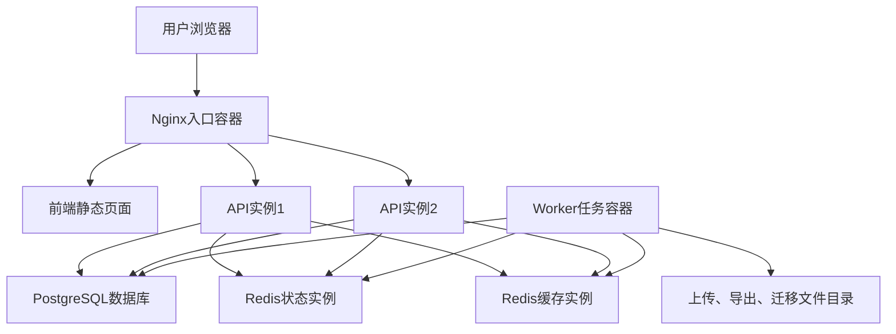

# 联软CRM V3版本使用手册

文档版本：1.0  
适用系统版本：V3 `3.0.0-alpha.1`  
适用交付阶段：阶段7单机离线部署生产候选版  
生成日期：2026-07-24  
适用范围：联软总部及其渠道体系

## 1. 手册说明

本手册用于说明联软CRM V3当前版本的访问方式、页面入口、健康检查、日常运维、备份、诊断和故障处理方法。

当前版本是V3工程化底座和单机离线部署生产候选版，已经具备容器化部署、双API实例、PostgreSQL、Redis、Nginx入口、健康检查、备份脚本、回退脚本和诊断脚本。

当前版本尚未完成旧版V2完整业务功能迁移，不包含正式客户管理、公海池、渠道商业务流转、报价、订单等完整业务页面。业务人员使用前，必须确认当前环境是否已经进入后续业务迁移阶段。

## 2. 当前系统架构

V3当前采用单机Docker Compose架构，推荐生产目录为 `/opt/lianruan-crm-v3`。



核心容器如下：

| 容器 | 用途 |
| --- | --- |
| `lianruan-crm-v3-nginx` | 对外访问入口，默认监听80端口 |
| `lianruan-crm-v3-api-1` | API实例1 |
| `lianruan-crm-v3-api-2` | API实例2 |
| `lianruan-crm-v3-worker` | 后台任务进程 |
| `lianruan-crm-v3-postgres` | PostgreSQL数据库 |
| `lianruan-crm-v3-redis-state` | 状态型Redis |
| `lianruan-crm-v3-redis-cache` | 缓存型Redis |

重要目录如下：

| 目录 | 用途 |
| --- | --- |
| `/opt/lianruan-crm-v3/compose` | 容器编排文件 |
| `/opt/lianruan-crm-v3/config` | 应用配置和Nginx配置 |
| `/opt/lianruan-crm-v3/secrets` | 数据库、Redis、会话密钥 |
| `/opt/lianruan-crm-v3/data/postgres` | PostgreSQL数据 |
| `/opt/lianruan-crm-v3/data/redis-state` | 状态Redis数据 |
| `/opt/lianruan-crm-v3/data/redis-cache` | 缓存Redis数据 |
| `/opt/lianruan-crm-v3/data/uploads` | 上传文件 |
| `/opt/lianruan-crm-v3/data/exports` | 导出文件 |
| `/opt/lianruan-crm-v3/data/migration` | 迁移文件 |
| `/opt/lianruan-crm-v3/logs` | 服务日志 |
| `/opt/lianruan-crm-v3/backups` | 备份文件 |
| `/opt/lianruan-crm-v3/scripts` | 运维脚本 |

## 3. 用户角色

当前版本只完成访问入口和工程底座，角色权限尚未接入正式登录系统。后续认证权限模块正式落地后，角色会按总部、区域、渠道商和运维职责继续细分。

当前手册按以下人员类型说明：

| 人员类型 | 当前可做事项 |
| --- | --- |
| 普通验证人员 | 访问统一入口、管理端、渠道端、移动端和状态页 |
| 实施人员 | 安装离线包、启动服务、执行健康检查 |
| 运维人员 | 查看容器状态、日志、备份、诊断和回退演练 |
| 项目负责人 | 确认当前版本边界，安排后续业务迁移和正式验收 |

## 4. 访问方式

生产服务器安装完成后，使用浏览器访问：

```text
http://服务器IP
```

示例：

```text
http://192.168.1.100
```

当前暂无域名和证书，因此先使用HTTP加服务器IP访问。正式上线前必须补充域名、HTTPS证书、证书续期和安全访问策略。

## 5. 页面入口说明

### 5.1 统一入口

访问地址：

```text
http://服务器IP/
http://服务器IP/unified
```

说明：

- `/` 会自动跳转到 `/unified`。
- 统一入口显示当前V3版本、健康检查项目数量和接口地址。
- 顶部可进入管理端、渠道端和移动端。

### 5.2 管理端

访问地址：

```text
http://服务器IP/admin
```

说明：

- 当前展示管理端布局骨架。
- 用于验证总部和区域管理入口、侧边导航和页面承载结构。
- 当前尚未迁移V2历史管理业务页面。

### 5.3 渠道端

访问地址：

```text
http://服务器IP/partner
```

说明：

- 当前展示渠道端布局骨架。
- 用于验证渠道伙伴入口、顶部导航和页面承载结构。
- 当前尚未迁移渠道商业务流程。

### 5.4 移动端

访问地址：

```text
http://服务器IP/mobile
```

说明：

- 当前展示移动端布局骨架。
- 用于验证移动视口下的页面结构。
- 当前尚未迁移移动端真实业务流程。

### 5.5 状态页面

| 地址 | 用途 |
| --- | --- |
| `/403` | 无权限页面 |
| `/session-expired` | 会话失效页面 |
| `/maintenance` | 系统维护页面 |
| 任意不存在地址 | 404页面 |

这些页面当前主要用于验证异常页面规范，后续会和登录、权限、维护开关联动。

## 6. 健康检查

当前API提供三个健康检查接口：

| 接口 | 用途 | 正常结果 |
| --- | --- | --- |
| `/health/live` | 存活检查 | API进程存活返回200 |
| `/health/ready` | 就绪检查 | 关键依赖正常返回200，异常返回503 |
| `/health/dependencies` | 依赖详情 | 返回配置、数据库、Redis、迁移、Worker状态 |

在服务器上执行：

```bash
curl -i http://127.0.0.1/health/live
curl -i http://127.0.0.1/health/ready
curl -i http://127.0.0.1/health/dependencies
```

也可以执行封装脚本：

```bash
/opt/lianruan-crm-v3/scripts/health-check.sh
```

健康检查通过时，脚本会输出：

```text
阶段7健康检查通过。
```

## 7. 首次安装

当前已生成离线安装包：

```text
lianruan-crm-v3-offline-3.0.0-alpha.1.tar.gz
```

当前安装包SHA256：

```text
8abf3e77adf87481bf0fc5fec71d2a2e99572cd004f2c3482dd9cd5c9d36c682
```

生产服务器要求：

| 项目 | 要求 |
| --- | --- |
| 操作系统 | 欧拉Linux |
| 处理器架构 | x86_64 |
| 安装目录 | `/opt/lianruan-crm-v3` |
| 容器运行时 | Docker |
| 编排工具 | Docker Compose插件 |
| 密钥生成 | openssl |
| 访问方式 | 先使用服务器IP |

在生产服务器上执行：

```bash
cd /root
sha256sum -c lianruan-crm-v3-offline-3.0.0-alpha.1.tar.gz.sha256
tar -xzf lianruan-crm-v3-offline-3.0.0-alpha.1.tar.gz
cd lianruan-crm-v3-offline-3.0.0-alpha.1
sudo SERVER_HOST=服务器IP ./scripts/install.sh
sudo /opt/lianruan-crm-v3/scripts/start.sh
/opt/lianruan-crm-v3/scripts/health-check.sh
```

安装脚本会完成以下工作：

- 创建 `/opt/lianruan-crm-v3` 目录结构。
- 写入Compose编排文件。
- 写入Nginx配置。
- 生成PostgreSQL、Redis和会话密钥。
- 写入 `v3.env` 环境配置。
- 加载离线镜像。
- 安装运维脚本。

## 8. 日常启动和停止

启动服务：

```bash
sudo /opt/lianruan-crm-v3/scripts/start.sh
```

停止服务：

```bash
sudo /opt/lianruan-crm-v3/scripts/stop.sh
```

查看容器状态：

```bash
cd /opt/lianruan-crm-v3/compose
docker compose ps
```

查看日志：

```bash
cd /opt/lianruan-crm-v3/compose
docker compose logs --tail=200 nginx
docker compose logs --tail=200 api-1
docker compose logs --tail=200 api-2
docker compose logs --tail=200 worker
docker compose logs --tail=200 postgres
docker compose logs --tail=200 redis-state
docker compose logs --tail=200 redis-cache
```

重启单个服务示例：

```bash
cd /opt/lianruan-crm-v3/compose
sudo docker compose restart api-1
sudo docker compose restart api-2
```

## 9. 备份操作

备份脚本位置：

```text
/opt/lianruan-crm-v3/scripts/backup.sh
```

备份演练：

```bash
sudo /opt/lianruan-crm-v3/scripts/backup.sh --dry-run
```

手动备份：

```bash
sudo /opt/lianruan-crm-v3/scripts/backup.sh --type manual
```

备份内容包括：

- PostgreSQL逻辑备份 `postgres.sql`。
- 上传文件压缩包 `uploads.tar.gz`。
- 导出文件压缩包 `exports.tar.gz`。
- 配置摘要 `config-summary.txt`，敏感字段会隐藏。
- 备份校验文件 `sha256sum.txt`。

备份目录格式：

```text
/opt/lianruan-crm-v3/backups/local/时间-类型/
```

示例：

```text
/opt/lianruan-crm-v3/backups/local/20260724-103000-manual/
```

当前暂未启用异机备份，仅完成本机备份。后续接入异机备份时，需要配置：

```text
BACKUP_REMOTE_ENABLED=true
BACKUP_REMOTE_TARGET=异机备份目标
```

## 10. 诊断操作

当系统访问异常、启动失败或健康检查不通过时，先生成诊断包：

```bash
sudo /opt/lianruan-crm-v3/scripts/collect-diagnostics.sh
```

诊断包位置：

```text
/opt/lianruan-crm-v3/logs/diagnostics/时间.tar.gz
```

诊断包包含：

- 操作系统信息。
- Docker版本。
- Docker Compose版本。
- 安装目录磁盘信息。
- 容器状态。
- 主要容器最近500行日志。
- 脱敏后的环境配置摘要。

## 11. 回退操作

回退脚本位置：

```text
/opt/lianruan-crm-v3/scripts/rollback.sh
```

查看回退目录约定：

```bash
sudo /opt/lianruan-crm-v3/scripts/rollback.sh --dry-run
```

回退到指定版本：

```bash
sudo /opt/lianruan-crm-v3/scripts/rollback.sh --to 版本号
/opt/lianruan-crm-v3/scripts/health-check.sh
```

注意：

- 当前回退脚本只回退应用镜像和配置。
- 当前不会自动回滚数据库。
- 数据库回滚必须结合备份文件和迁移方案单独执行。
- 正式切换前必须先完成回退演练。

## 12. 配置文件说明

### 12.1 应用环境配置

文件：

```text
/opt/lianruan-crm-v3/config/v3.env
```

用途：

- 应用环境。
- 数据库连接串。
- Redis连接串。
- 会话密钥。
- 构建版本信息。
- 服务访问地址。

注意：

- 该文件包含敏感信息，权限必须保持 `600`。
- 不允许提交到代码仓库。
- 修改后需要重启API和Worker。

### 12.2 部署配置

文件：

```text
/opt/lianruan-crm-v3/config/deploy.env
```

用途：

- 安装目录。
- 镜像版本。
- HTTP端口。
- 备份留口配置。

修改HTTP端口后，需要同步防火墙和访问地址。

### 12.3 密钥目录

目录：

```text
/opt/lianruan-crm-v3/secrets
```

用途：

- PostgreSQL密码。
- Redis密码。
- 会话密钥。

要求：

- 目录权限必须保持 `700`。
- 文件权限必须保持 `600`。
- 不得通过聊天、邮件或文档明文传播真实密钥。

## 13. 常见问题处理

### 13.1 浏览器打不开系统

检查服务是否启动：

```bash
cd /opt/lianruan-crm-v3/compose
docker compose ps
```

检查本机访问：

```bash
curl -i http://127.0.0.1/health/live
```

检查防火墙：

```bash
sudo firewall-cmd --list-ports
```

如未开放80端口：

```bash
sudo firewall-cmd --permanent --add-port=80/tcp
sudo firewall-cmd --reload
```

### 13.2 健康检查返回503

执行：

```bash
/opt/lianruan-crm-v3/scripts/health-check.sh
```

查看依赖详情：

```bash
curl -i http://127.0.0.1/health/dependencies
```

重点检查：

- PostgreSQL是否健康。
- Redis状态实例是否健康。
- 配置文件是否正确。
- 磁盘是否写满。
- 容器是否不断重启。

### 13.3 数据库异常

查看PostgreSQL状态：

```bash
cd /opt/lianruan-crm-v3/compose
docker compose exec -T postgres pg_isready -U lianruan_app -d lianruan_crm_v3
docker compose logs --tail=300 postgres
```

检查磁盘：

```bash
df -h /opt/lianruan-crm-v3
```

### 13.4 Redis异常

查看Redis状态实例：

```bash
cd /opt/lianruan-crm-v3/compose
docker compose logs --tail=300 redis-state
```

查看Redis缓存实例：

```bash
cd /opt/lianruan-crm-v3/compose
docker compose logs --tail=300 redis-cache
```

### 13.5 前端页面正常但业务页面没有

这是当前版本的正常边界。V3当前阶段只交付工程化骨架、页面入口、部署底座和健康检查。真实CRM业务功能需要在后续业务迁移阶段继续交付。

### 13.6 显示无权限或会话失效

当前无权限页和会话失效页主要用于验证异常页面规范。正式登录和权限系统接入后，这些页面才会和真实账号状态联动。

## 14. 当前版本限制

当前版本存在以下限制：

| 限制 | 说明 |
| --- | --- |
| 未完成业务迁移 | V2客户、渠道、报价、订单等完整业务尚未迁入V3 |
| 未启用正式登录 | 当前没有正式账号登录流程 |
| 无HTTPS | 只能先用HTTP加服务器IP验证 |
| 无异机备份 | 当前只有本机备份和异机备份配置留口 |
| 数据迁移未执行 | 尚未执行V2生产数据迁移 |
| 未生产切换 | 当前不是正式业务上线状态 |

## 15. 验收清单

生产服务器安装完成后，至少完成以下验收：

| 验收项 | 命令或方法 | 结果 |
| --- | --- | --- |
| 离线包校验 | `sha256sum -c 安装包.sha256` | 必须通过 |
| 镜像加载 | 安装脚本自动执行 | 必须无失败 |
| 容器启动 | `docker compose ps` | 主要容器必须运行 |
| 存活检查 | `curl -i http://127.0.0.1/health/live` | 返回200 |
| 就绪检查 | `curl -i http://127.0.0.1/health/ready` | 返回200 |
| 页面访问 | `http://服务器IP/unified` | 页面可打开 |
| 管理端访问 | `http://服务器IP/admin` | 页面可打开 |
| 渠道端访问 | `http://服务器IP/partner` | 页面可打开 |
| 移动端访问 | `http://服务器IP/mobile` | 页面可打开 |
| 备份演练 | `backup.sh --dry-run` | 必须通过 |
| 手动备份 | `backup.sh --type manual` | 必须生成备份 |
| 诊断采集 | `collect-diagnostics.sh` | 必须生成诊断包 |

## 16. 后续更新规则

每次完成新的业务模块迁移后，必须同步更新本手册，包括：

- 新增菜单入口。
- 新增角色权限。
- 新增业务操作流程。
- 新增异常处理说明。
- 新增数据迁移和回滚说明。
- 新增生产验收用例。

未经实际开发和验收的功能，不允许写入本手册作为已可用功能。
